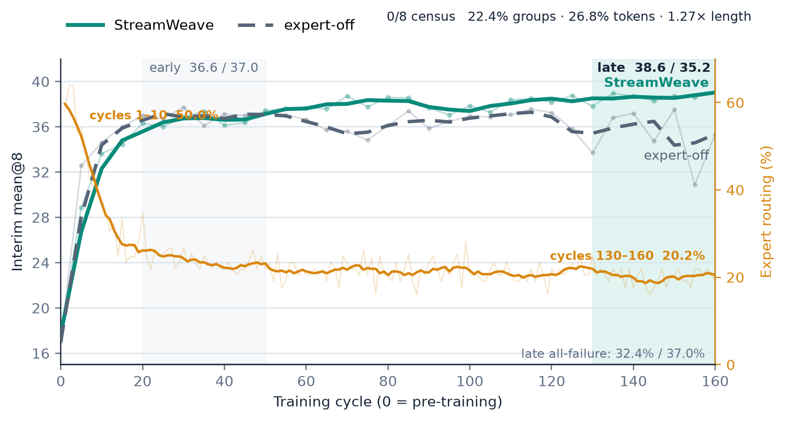
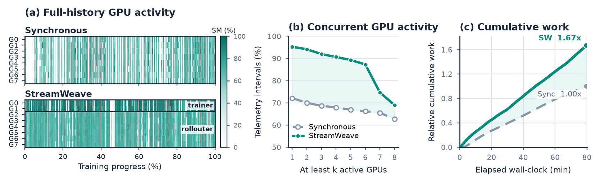
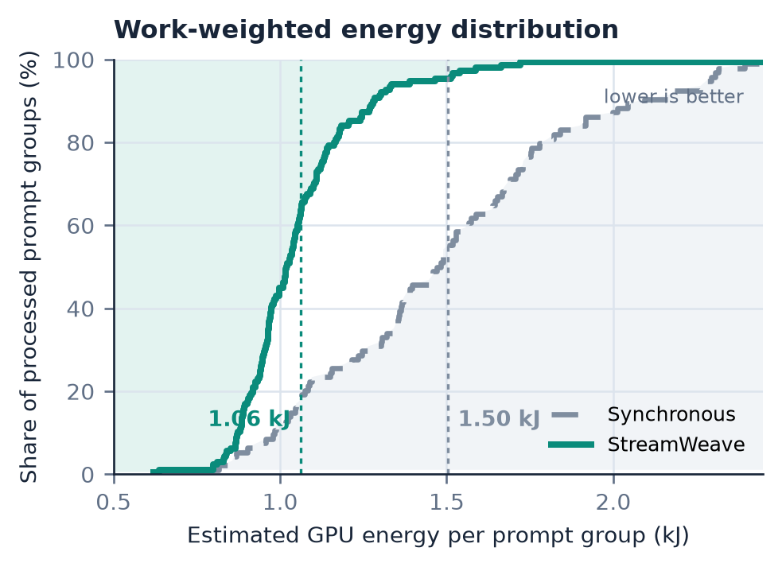

# StreamWeave 전체 논문 초안 (한국어)

> **Working title:** *StreamWeave: Reconciling Off-Policy Expert Supervision with
> Fully-Asynchronous Policy Learning*

## Abstract

Reinforcement learning with verifiable rewards (RLVR)는 policy가 풀기 어려운 문제에서 긴 rollout에 많은 계산을 쓰고도, 생성한 응답이 모두 실패하면 group 내 보상이 같아져 relative learning signal을 얻지 못한다. 기존 연구는 이 이중 병목을 서로 다른 방향에서 완화해 왔다. Fully-asynchronous RL은 rollout generation과 model training을 중첩해 실행 비용을 줄이고, expert trajectory를 활용하는 방법은 policy가 풀지 못한 문제에 외부의 성공 경로를 제공한다. 특히 expert trajectory를 all-failure group에 선택적으로 투입하면 supervision을 가장 필요한 문제에 집중할 수 있다. 그러나 이를 trajectory-level fully-asynchronous execution으로 확장하면 새로운 composition 문제가 생긴다. Complete group은 어떤 source를 사용할지와 policy-side relative signal을 결정하는 학습 경계인 반면, fully-asynchronous runtime은 같은 group의 trajectory를 독립적으로 실행한다. 또한 선택된 policy rollout과 expert trajectory는 shared learner가 구성해야 할 signal, reference, correction 조건이 다르다. 단순한 결합은 이 차이를 group-wide execution barrier나 source별 learner path로 확장한다. **StreamWeave**는 complete-group context를 source decision에서, source identity를 learner-input construction에서 각각 소비하여 필요한 학습 의존성을 국소화한다. 이후 source-conditioned inputs는 하나의 primary update로 들어가며, trajectory generation과 model training은 계속 중첩된다. 수학 추론 실험에서 StreamWeave는 같은 group-success selector를 사용하는 동기식 reference와 대등한 품질 범위에 있으며(38.5 대 37.7), 동일한 절차로 평가한 expert-trajectory 활용 방법들 가운데 가장 높은 평균 성능을 기록한다. 또한 128개 prompt group의 처리 시간을 46초에서 28초로 줄여 end-to-end throughput을 1.64$\times$ 높인다. 이는 group-conditioned heterogeneous learning에 필요한 경계를 보존하면서도 그 의존성을 pipeline 전체의 실행 제약으로 확장할 필요가 없음을 보여준다.

### English Draft

Reinforcement learning with verifiable rewards (RLVR) can expend substantial compute on long rollouts for difficult problems, yet obtain no relative learning signal when every response in a group fails. Prior work addresses these bottlenecks separately: fully asynchronous RL overlaps rollout generation with model training, while expert trajectories provide successful solution paths when the policy fails. Selectively using expert trajectories for all-failure groups concentrates supervision where it is most needed. Combining this rule with trajectory-level full asynchrony, however, creates a composition problem. A complete group determines both the training source and the policy-side relative signal, whereas the runtime executes trajectories independently; policy and expert data also require different signal, reference, and correction conditions before entering a shared learner update. **StreamWeave** localizes these dependencies: complete-group context is consumed at source selection, source identity is consumed when learner inputs are constructed, and the resulting samples enter one primary update while generation and training remain overlapped. In mathematical reasoning experiments, StreamWeave achieves quality comparable to a synchronous reference using the same group-success selector (38.5 versus 37.7) and the highest average score among expert-trajectory methods evaluated under the same protocol. It reduces the time to process 128 prompt groups from 46 to 28 seconds, improving end-to-end throughput by 1.64$\times$. StreamWeave shows that group-conditioned heterogeneous learning need not propagate its dependencies into the fully asynchronous execution pipeline.

### TL;DR

StreamWeave enables selective expert supervision in fully asynchronous RLVR by preserving complete groups as learning-decision boundaries rather than execution barriers, matching synchronous quality while improving throughput by 1.64$\times$.

## 1. Introduction

Reinforcement learning with verifiable rewards (RLVR)는 자동으로 검증 가능한 성공을 강화하여
LLM의 reasoning 능력을 향상시키지만, policy가 아직 해결하지 못한 어려운 문제에서는 rollout generation에
상대적으로 많은 계산을 쓰면서도 유효한 learning signal은 가장 적게 얻는 역설에 직면한다. 널리 사용되는
group-based RLVR에서는 policy가 정답을 탐색하기 위해 다수의 긴 autoregressive rollout을
생성하므로, rollout collection이 강화학습 wall-clock의 지배적인 병목이 된다. 그러나 그렇게
비싸게 수집한 group이 전부 실패하면 group 내 보상 차이도 사라져
relative learning signal을 얻지 못한다. 이를 해결하기 위해 서로 다른 두 연구 방향이 발전해 왔다.
먼저 실행 효율의 관점에서 fully-asynchronous RL은 generation과 learning을 분리하고 중첩하여
synchronization idle을 줄인다. 이 계열은 policy-generated rollout이 생성 시점보다 늦게 소비되는
temporal mismatch를 다루지만, 학습 신호의 source 자체는 policy experience로 유지된다. 반면 학습
신호 보강의 관점에서는 expert-provided trajectories가 policy가 아직 성공하지 못한 문제에 유효한
해결 경로를 제공한다. 두 병목은 독립적이지 않다. 동일한 어려운 문제가 긴 rollout과 all-failure group을 함께
유발하기 때문이다. 따라서 scalable RLVR에는 asynchronous
execution과 heterogeneous supervision이 동시에 필요하다. 그럼에도 기존 방법들은 두 역량을 서로
다른 training regime에서 다루어 왔으며, heterogeneous supervision의 learning semantics를
fully-asynchronous policy learning 안에서 어떻게 보존할지는 여전히 열린 문제다.

두 방향의 결합이 단순하지 않다는 사실은 외부 expert trajectory의 사용 여부를 policy-generated
outcomes에 따라 결정할 때 선명해진다. Group-based RLVR에서 이 결정은 완성된 prompt group을
요구한다. 충분한 성공 신호가 있는 group은 policy-generated rollouts로 학습하고, 그렇지 않은 group은
expert trajectory를 사용한다. 같은 group은 policy branch에서 rollout 간 reward 차이로 relative
advantage를 구성하는 단위이기도 하다. 따라서 complete group은 training source와 policy-side learning
contribution을 함께 결정한다. 동기식 실행에서는 source decision 전에 group이 완성되지만,
fully-asynchronous execution은 개별 trajectory를 독립적으로 전진시켜 효율을 얻는다. Group을 실행
단위로 유지하면 가장 느린 trajectory가 다시 장벽이 되고, group이 완성되기 전에 판단하면 source와
relative signal이 달라진다. 또한 group을 복원하는 것만으로 결합이 끝나지는 않는다. Source decision은
사용할 data뿐 아니라 shared learner가 각 sample을 해석하는 조건을 정한다. Policy rollout은
group-relative signal과 이를 생성한 policy의 맥락을 필요로 하지만, expert trajectory는 외부에서 주어진
supervised target이므로 동일한 behavior-policy correction이 정의되지 않는다. 따라서 필요한 것은
source별 learner path가 아니라, source가 정한 signal, reference, correction 조건을 learner input에
보존한 뒤 update를 공유하는 구성이다. 이러한 충돌에서 이 논문의 질문이 나온다.
**Trajectory-level execution의 효율을 유지하면서, 완성된 group이 결정하는 training source와 각
source의 고유한 학습 역할을 하나의 fully-asynchronous stream에서 보존할 수 있는가?** 이는 scheduler나
loss 하나를 고르는 문제가 아니라, execution granularity와 learning boundary를 함께 설계하는
algorithm-system co-design 문제다.

우리는 이 충돌을 **StreamWeave**로 해결한다. StreamWeave의 핵심은 학습 판단에 필요한 group
boundary와 runtime이 작업을 진행시키는 execution unit을 분리하는 것이다. Complete group은 어떤
source를 사용할지와 learner가 필요한 입력 조건을 확정하는 경계로 유지하되, 각 trajectory는
독립적으로 실행된다. Runtime은 다른 작업을 막지 않으면서 group을 복원하고 source를 확정하며, learner는
그 source에 맞는 input을 구성한 뒤 모든 sample을 하나의 primary update로 학습한다. 따라서
StreamWeave는 complete-group decision과 source별 learning role을 보존하면서도, 그 경계를 전체
pipeline의 synchronization barrier나 별도의 learner path로 확장하지 않는다.

그러나 pipeline을 계속 전진시키는 것만으로 이 결합이 올바른 것은 아니다. 신호가 생성된 맥락이
learner까지 보존되지 않으면, 비동기 runtime의 완료 순서와 batching이 어떤 source를 training
stream에 받아들일지, 어떤 update를 적용할지, 그리고 두 source가 얼마나 기여할지를 다시 쓸 수 있다.
이 공동설계를 관통하는 기준은 간결하다. 비동기는 신호가 **도착하는 시점과 순서**를 바꿀 수 있지만,
그 신호가 **의미하는 것**을 바꾸어서는 안 된다. StreamWeave는 이를 위해 각 신호의 provenance, 즉
어느 group과 source에서 왔으며 rollout이라면 어떤 policy가 생성했는지를 learner까지 유지한다. 우리는
이를 세 조건의 learner contract로 명시한다. **Complete-group decision**은 source를 group이 완성된
뒤에만 정하고, **source-conditioned input construction**은 각 source가 요구하는 signal, reference,
correction을 learner 경계에서 구성하며, **shared primary update**는 그렇게 구성된 모든 sample을 하나의
objective와 공통 reduction으로 학습한다.
이 contract는 특정한 동기식 control flow가 아니라 execution optimization이 보존해야 할 boundary를
규정한다. §3.1은 실제 mixed objective가 이 세 조건으로 환원됨을 구성적으로 보이고, §3.2는 같은
조건을 global synchronization barrier 없이 실현하는 architecture를 제시한다.

이러한 의미 보존은 비동기 효율과의 타협을 요구하지 않는다. Math-reasoning 실험에서 StreamWeave는
비교한 방법 중 가장 높은 평균 성능 38.5를 기록하고, 같은 group-success selector를 사용하는
synchronous reference(37.7)와 대등한 품질 범위에 있다. 실행 비교에서는 128개 prompt
group의 처리 시간을 46초에서 28초로 줄여 throughput을 1.64$\times$ 높인다. 이로써
StreamWeave는 같은 learning composition을 유지한 채 complete-group decision이 pipeline 전체의
실행 장벽으로 되돌아오는 것을 막는다.

이 논문의 기여는 다음과 같다.

1. **Group-conditioned learning composition.** Complete group이 training source와 policy-side relative
   signal을 함께 결정하는 환경에서, source별 signal, reference, correction을 learner input에 표현하고
   이후 하나의 primary objective와 공통 reduction으로 학습하는 구성을 제시한다.
2. **Dependency-localized fully-asynchronous architecture.** StreamWeave는 complete-group context를 source
   decision에서, source identity를 learner-input construction에서 소비한다. 그 밖의 trajectory execution,
   transport, optimization은 공유하여 group dependency가 전역 barrier나 source별 pipeline으로 번지는
   것을 막고, complete-group waiting에 묶이던 rollout-side capacity를 회수한다.
3. **학습 효과와 실행 효율의 공동 실측.** Fixed-checkpoint benchmark, expert-off learning dynamics,
   resource-matched execution 비교를 통해 practical learning utility와 prompt-group throughput,
   critical-path payoff를 함께 보인다.

## 2. Related Work

관련 선행연구는 fully-asynchronous policy learning과 expert trajectory를 활용하는 policy learning의
두 계보로 나뉜다. 전자는 실행 효율을 높였고, 후자는 policy-generated experience만으로 학습 신호가
부족할 때 이를 보완했다. 아래에서는 각 계보의 성과와 두 접근을 함께 사용할 때 남는 문제를 정리한다.

**Fully-asynchronous policy learning.** 시스템 계층에서 HybridFlow (EuroSys 2025)는 RLHF의
computation과 data dependency를 분리하여 다양한 알고리즘과 resource mapping을 유연하게 구성할 수
있는 실행 기반을 제공했다. Asynchronous RLHF (ICLR 2025)는 generation과 learning을 직접 분리하고,
이전 policy가 생성한 sample로 학습할 때 발생하는 policy lag와 실행 효율 사이의 trade-off를 분석했다.
AReaL (NeurIPS 2025)은 rollout worker와 training worker를 완전히 분리하고 workload balancing과
staleness-aware optimization을 결합하여 fully-asynchronous LLM RL을 end-to-end로 실증했으며, TBA
(NeurIPS 2025)는 asynchronous actor가 수집한 replay experience를 off-policy objective로 학습한다.
이 연구들은 policy rollout의 생성과 소비를 비동기화하고 그에 따른 policy lag를 관리한다. 그러나
learning stream은 current 또는 past policy가 생성한 rollout을 중심으로 하며, all-failure group을
expert trajectory로 보완하는 문제는 연구 대상이 아니었다.

**Learning from policy rollouts and expert trajectories.** 다른 연구 방향은 demonstration, offline
data, expert trajectory를 활용하여 학습을 policy가 스스로 생성한 experience에만 의존하지 않도록
확장해 왔다. 일반 RL에서는 DQfD (AAAI 2018)가 demonstration을 temporal-difference update와 supervised
loss에 사용했고, RLPD (ICML 2023)는 offline data를 online RL에 지속적으로 결합했다. LLM
post-training에서는 InstructGPT (NeurIPS 2022)가 demonstration-based supervised learning과 RLHF를
단계적으로 연결했고, SimpleMix (ICML 2025)는 preference learning에서 on-policy와 off-policy data를
직접 혼합했다. Reasoning post-training의 LUFFY (NeurIPS 2025)는 off-policy reasoning trace와 policy
rollout을 mixed-policy learning으로 결합하고, CHORD (ICLR 2026)는 SFT를 on-policy exploration과 함께
최적화되는 dynamically weighted auxiliary objective로 재구성한다. 이 연구들은 외부 data를 어떤
objective와 weighting으로 학습에 기여시킬지를 다루지만, policy outcome에 따른 expert source
decision을 trajectory-level fully-asynchronous execution에서 유지하는 문제는 연구 대상이 아니었다.

**Composing asynchronous execution with heterogeneous supervision.** 두 계보를 결합할 때 남는 문제는
새로운 selector나 objective가 없다는 것이 아니라, 서로 다른 중간 조건을 하나의 asynchronous learning
stream으로 옮기는 경계가 정의되지 않았다는 점이다. Fully-asynchronous policy learning은
policy-generated trajectory가 generation context와 함께 독립적으로 운반되고 소비되는 것을 전제로
한다. 반면 group-conditioned expert learning에서는 complete group의 결과가 어떤 data를 사용할지와
shared learner가 이를 어떻게 해석할지를 먼저 결정한다. Yao et al. (ICLR 2026)이 group-relative
REINFORCE의 off-policy 해석을 제공하더라도, objective가 off-policy data를 학습할 수 있다는 사실만으로
이 두 중간 조건이 연결되지는 않는다. StreamWeave는 이 composition boundary를 명시하고,
complete-group context는 source decision에서, source identity는 learner-input construction에서 끝내어
group-dependent learning을 shared update와 fully-asynchronous execution 안에서 함께 실현한다.

## 3. StreamWeave

그림 2는 StreamWeave가 완성된 rollout group의 결정을 하나의 learner update로 바꾸고, 이를
fully-asynchronous pipeline에서 실행하는 전체 과정을 보여준다. 먼저 complete group의 결과에 따라
policy rollout group이나 이에 대응하는 expert trajectory를 선택한다. 이 선택은 각 sample의 learning
signal, reference, asynchronous correction을 정하며, 구성된 sample은 하나의 primary objective에서
학습된다. Execution architecture에서는 각 trajectory attempt를 독립적으로 생성하고, source를 선택하기
직전에 complete group을 복원한다. 선택된 data는 source와 필요한 generation context를 유지한 채
trainer로 전달된다. Source를 선택하는 단계만 해당 group이 완성되기를 기다리고, 다른 trajectory의
generation과 learner update는 계속 진행된다. §3.1은 complete-group decision을 shared learner update로
바꾸는 방법을 정의하고, §3.2는 같은 update를 global synchronization barrier 없이 구성하는 방법을
설명한다.

### 3.1 Learning Composition

StreamWeave는 source의 차이를 learner가 사용할 입력 조건으로 표현하여 complete prompt group의
결정을 하나의 update로 닫는다. Complete group은 사용할 data를 선택하고, 그 선택은 learner가 필요로
하는 learning signal, reference, asynchronous correction을 정한다. 이 입력 구성이 끝난 뒤에는 모든
sample이 하나의 primary objective와 공통 reduction을 통과한다. 이로써 source의 차이는 sample을
올바르게 해석하는 데 보존되지만, 별도의 learner나 optimizer path로 확장되지 않는다.

**Source selection from a completed group.** Prompt $x$에 대해 policy가 생성한 $n$개의 rollout을
$G_x=\{\tau_{x,1},\ldots,\tau_{x,n}\}$이라 하자. 각 rollout은 verifier score
$R(\tau_{x,i})$를 가지며, complete group의 success rate는 다음과 같다.

$$
P_x=\frac{1}{n}\sum_{i=1}^{n}
\mathbf{1}\!\left[R(\tau_{x,i})>\delta\right],
\qquad
z_x=S_\gamma(G_x)=
\begin{cases}
\mathrm{expert}, & P_x\le\gamma,\\
\mathrm{policy}, & P_x>\gamma.
\end{cases}
$$

$z_x=\mathrm{policy}$이면 생성된 group $G_x$를 학습에 사용하고,
$z_x=\mathrm{expert}$이면 같은 prompt에 대응하는 expert trajectory $\tau_x^\star$를 사용한다.
이 결정은 개별 trajectory가 아니라 $G_x$ 전체의 관측 결과에 정의되므로, StreamWeave는 $n$개의
score가 모두 모인 뒤에만 source를 확정한다. 이 논문의 실험에서는 HPT가 제안한 success-rate
threshold rule을 $S_\gamma$로 사용한다. 구체적인 $n$, $\gamma$, 그리고 expert trajectory의 가용
범위는 Experimental Setting에서 명시한다.

**Constructing the learner input from the selected source.** Source decision은 사용할 sequence만 정하지
않는다. Policy rollout은 같은 prompt에서 생성된 다른 rollout과의 보상 차이로 learning signal을
얻으며, rollout을 생성한 policy와 learner가 update를 시작할 때의 policy 사이에는 비동기 실행으로
인한 차이가 존재할 수 있다. 반면 expert trajectory는 policy가 생성한 rollout이 아니라 정답
sequence로 주어진 supervised target이다. 따라서 group-relative signal도, rollout을 생성한 policy를
기준으로 하는 correction도 expert trajectory에는 정의되지 않는다.

이를 명시하기 위해 선택된 sample $r$에 대해 세 입력을 구성한다. $A_r$는 update의 방향과 강도를
정하는 learning signal이고, $\widetilde{\ell}_r$는 현재 policy와 비교할 effective reference
log-probability이며, $w_r$는 policy-generated rollout에 필요한 asynchronous correction이다. Source가
정하는 input-construction mapping $\mathcal{E}_{z_r}$와 batch $B$의 primary objective를 다음과 같이
쓴다.

$$
\mathcal{E}_{z_r}\!\left(r;G_{x(r)}\right)
=\left(A_r,\widetilde{\ell}_r,w_r\right),
\qquad
\mathcal{L}(B)
=\operatorname{Reduce}_{r\in B}
\Phi\!\left(\ell_\theta(r);A_r,\widetilde{\ell}_r,w_r\right).
$$

$\ell_\theta(r)$는 learner의 현재 token log-probabilities이고, $\Phi$는 모든 sample이 공유하는 token-level
policy objective이며, $\operatorname{Reduce}$는 source를 보지 않는 공통 aggregation이다. Policy
sample에서는 $A_r$가 $G_{x(r)}$의 group-relative signal을 담고, $\widetilde{\ell}_r$와 $w_r$가
learner update의 proximal reference와 rollout-to-learner mismatch를 각각 다룬다. Expert sample에서는
$A_r$가 명시적인 강도 $\beta_r$를 가진 supervised signal을 담고, rollout behavior policy가 존재하지
않으므로 $w_r=1$이다. 즉 source label은 별도의 objective를 선택하는 대신, 공유된 objective가 해당
sample을 올바르게 해석하는 입력을 정한다.

**A shared primary update.** Input construction 이후에는 policy와 expert sample을 구별하는 별도의
primary-loss path나 source별 reduction을 두지 않는다. 두 source는 같은 $\Phi$와
$\operatorname{Reduce}$를 통과하며, expert supervision의 강도는 별도 batch denominator가 아니라
$A_r$의 $\beta_r$로 명시된다. 따라서 effective mixture는 source-routing 빈도, 각 source가 만드는
sample과 token의 수, $\beta_r$, 그리고 공통 reduction에 의해 결정된다. Runtime의 도착 순서가 batch
membership에는 영향을 줄 수 있지만, admitted batch 안에서 source별 추가 normalization이나 별도
weight를 만들지는 않는다.

**Recovering the two learning roles.** 이 shared objective가 두 source를 같은 data로 취급하는 것은
아니다. Complete group과 learner parameter를 고정하고 policy input을 $\Phi$에 대입하면
group-relative advantage와 rollout correction을 사용하는 policy update가 복원된다. Expert input에는
current-policy log-probability의 stop-gradient copy를 effective reference로 사용한다. 이때 forward
ratio와 correction은 1이지만 numerator의 gradient는 남으므로, 같은 objective의 expert endpoint는
$\beta_r$로 가중된 supervised negative-log-likelihood update로 환원된다. 현행 realization에서는
$\Phi$로 vanilla clipped PPO를 사용하며, policy endpoint에는 learner-entry reference와 token-level
rollout correction을 적용한다. Exact singleton construction, self-detached reference의 미분, mask와
tensor 명세는 Appendix에서 제시한다.

이 구성을 세 가지 요구사항으로 압축한다. **Complete-group decision**은 complete group이 갖추어진
뒤에만 source를 정한다. **Source-conditioned learner input**은 선택된 source에 정의되는 learning
signal, reference, correction을 구성한다. **Shared primary update**는 그렇게 구성된 모든 sample을
하나의 primary objective와 공통 reduction으로 학습한다. 이 learner contract는 fully-asynchronous
execution이 보존해야 할 learning composition을 정의하지만 동기식 control flow를 요구하지 않는다.
다음 절은 trajectory가 독립적으로 완성되는 동안에도 같은 update를 global synchronization barrier
없이 구성하는 방법을 설명한다.

### 3.2 Fully-Asynchronous Execution

§3.1의 learning composition은 두 종류의 맥락을 요구한다. 먼저 같은 prompt의 complete group은 어떤
data source를 사용할지와 policy-side relative signal을 결정한다. 이어서 확정된 source는 learner가
각 sample에 어떤 signal, reference, correction을 구성해야 하는지를 정한다. StreamWeave의 실행 설계는
이 맥락들을 없애는 대신, 각각을 실제로 소비하는 경계 밖으로 전파하지 않는다. Complete group을
그대로 실행 단위로 만들면 가장 늦은 trajectory가 pipeline 전체를 다시 멈추고, source 차이를 runtime
끝까지 별도 control flow로 유지하면 비동기 stream과 learner가 source별 경로로 갈라진다. 핵심은
학습에 필요한 결합은 보존하되, 그 결합이 전역 실행 제약으로 커지지 않게 하는 것이다. 기존
fully-asynchronous runtime은 policy rollout이 독립적으로 운반되고 소비될 수 있을 때 효율을 얻지만,
여기서는 complete group의 결과가 어떤 data를 운반할지와 learner가 이를 어떻게 해석할지를 먼저
결정한다. StreamWeave는 이 서로 다른 중간 조건을 새로운 execution barrier 없이 연결한다.

**Separate the decision boundary from the execution unit.** 하나의 prompt group을 이루는 trajectory
attempt들은 서로의 완료를 기다리지 않고 독립적으로 생성된다. 각 attempt는 자신이 속한 group과 그
안에서의 위치만 유지하며, 먼저 끝난 작업은 즉시 실행 자원을 비운다. Complete group은 모든 attempt가
도착한 뒤 source를 판단해야 하는 시점에만 국소적으로 복원된다. 이 기다림은 해당 prompt에만 묶이며,
그동안 다른 group의 generation과 이미 준비된 data의 model training은 계속된다. 즉 complete group은
학습 판단에 필요한 경계이지만, trajectory를 함께 실행하도록 강제하는 단위는 아니다.

**Resolve the source before entering the asynchronous stream.** Group이 완성되면 §3.1의 selection rule을
적용하여 policy rollout group과 대응하는 expert trajectory 중 사용할 data를 확정한다. 이 결정은
trainer가 언제 record를 꺼내는지와 무관하게, 비동기 stream에 들어가기 전에 끝난다. 따라서 stream이
운반하는 것은 source가 정해지지 않은 개별 trajectory나 곧바로 optimizer가 소비할 row가 아니라,
source decision이 완료된 prompt-group record다. Record는 group identity와 확정된 source를 보존하고,
policy data인 경우에는 이후 학습에 필요한 generation context도 함께 유지한다. Runtime은 record의
도착과 소비 시점을 바꿀 수 있지만, 이미 완성된 group이 내린 결정을 다시 쓰지는 못한다.

**Complete the interpretation at the learner boundary.** Source는 stream에 들어가기 전에 정하지만,
§3.1의 최종 learner input은 trainer가 record를 소비할 때 구성한다. Policy로 route된 group은
group-relative signal과 asynchronous correction에 필요한 맥락을 가진 sample로, expert로 route된
record는 supervised contribution을 나타내는 sample로 변환된다. Source의 차이는 이 입력 구성에서 모두
표현되고, 이후 sample들은 §3.1의 shared primary objective와 공통 reduction으로 들어간다. 이 비대칭적
경계는 group-dependent source logic을 inference engine 안으로 밀어 넣지 않으면서도, source마다 별도의
trainer나 optimizer path를 만들 필요를 없앤다.

**Retain the shared asynchronous flow.** Generator와 trainer는 동일한 iteration boundary를 기다리지
않으며, 준비된 group은 기존 fully-asynchronous runtime의 queue, backpressure, parameter-refresh 흐름을
따른다. StreamWeave는 이 실행 기반을 새로 발명했다고 주장하지 않는다. 그 역할은 heterogeneous
supervision이 추가한 complete-group dependency를 별도의 동기식 우회로로 만들지 않고 기존 stream 안에
닫는 데 있다. Batch assembly 역시 admitted group의 membership이나 §3.1이 정한 입력 구성과 공통
reduction을 다시 정의하지 않는다. Framework별 정렬과 flow-control 명세는 Appendix에서 설명한다.

이 설계에서 **group completion을 기다려야 하는 실행 의존성은 source가 확정되는 순간 끝나고**, source
identity는 learner input이 구성되는 지점까지만 유지된다. 그 이후의 execution과 optimization은 다시
공유된다. 따라서 동일한 completed group, admitted batch, learner-entry parameter가 주어지면 trajectory
attempt의 완료 순서가 달라져도 source decision과 최종 learner input은 달라지지 않는다. 비동기 실행은
정보가 도착하고 소비되는 시점을 바꾸지만, source가 그 정보에 부여한 learning role을 바꾸지는 않는다.

## 4. Experiments

실험은 StreamWeave가 heterogeneous supervision의 학습 가치를 유지하면서 complete-group dependency를
실행 병목으로 만들지 않는지를 세 질문으로 평가한다. 첫째, complete-group outcome에 따라 policy 또는
expert source를 선택해 하나의 shared update에 반영할 때 경쟁력 있는 reasoning quality를 달성하는가.
둘째, expert source가 선택되는 all-failure 영역에 성공 신호의 부족과 높은 generation burden이 함께
집중되며, 이러한 수요가 학습이 진행되어도 지속되는가. 셋째, complete-group decision에 필요한 기다림을
source decision에 국소화한 실행 설계가 concurrent GPU activity와 end-to-end throughput으로 이어지는가.

### 4.1 Experimental Setup

**Training setting.** StreamWeave와 자체 control은 Qwen2.5-Math-1.5B를 기반으로 하며, OpenR1-Math의
prompt와 verified trajectory를 two-source setting에 맞게 구성한 training set을 사용한다. 각
prompt에서 $n=8$개의 policy rollout을 생성하고, HPT의 group-success selector를 $\gamma=0$으로
설정해 여덟 rollout이 모두 실패한 group에만 대응하는 expert trajectory를 사용한다. Policy source는
group-relative signal을, expert source는 supervised signal을 제공한다. 선택된 sample은 §3.1의
source-conditioned learner input으로 변환된 뒤 하나의 primary objective와 공통 reduction에서
결합된다. Expert-signal scale, asynchronous correction의 범위와 optimization 설정은 Appendix에서
제시한다.

**Quality evaluation.** 최종 checkpoint는 AIME24, AIME25, AMC(83), MATH500, Minerva(272),
Olympiad(674)의 여섯 수학 추론 benchmark에서 평가한다. AIME24, AIME25, AMC에는 32개 stochastic
generation의 평균 pass@1인 mean@32를, 나머지 benchmark에는 mean@8을 사용한다. Avg.는 반올림 전
여섯 점수의 동일 가중 macro-average다. 비교군은 base와 instruct model, RL 및 expert-trajectory 활용
방법, asynchronous RL을 포함한다. HPT(sync)는 같은 group-success selector를 사용하는 동기식
reference다. 원 논문에서 인용한 행은 $\dagger$로 구별하여 자체 평가 결과와 분리한다.

**Learning analysis.** Expert channel이 필요한 영역과 학습 과정에서의 역할은 두 분석으로 살펴본다.
Generator-side census는 complete generated group을 all-failure와 any-success로 나누어 response-token
volume과 group 내 generation-time spread를 비교한다. 이어서 같은 fully-asynchronous stack에서 expert
channel만 비활성화한 control과 StreamWeave의 routing history, 중간 checkpoint quality와 held-out
prompt의 all-failure rate를 함께 비교한다. 이 분석은 final-score comparison과 별도로 expert 수요의
계산 부담과 시간적 지속성을 평가한다.

**Efficiency evaluation.** 실행 효율은 동일한 GPU 예산에서 동기식 reference와 StreamWeave를 비교한다.
공통 작업 단위는 routing 이전의 prompt group으로 둔다. Policy로 선택된 group은 여덟 learner sample을,
expert로 선택된 group은 하나의 sample을 만들기 때문에 row나 optimizer step을 세면 source mixture가
throughput을 다시 정의하기 때문이다. 따라서 전체 training history에서 소비한 고유 prompt group 수를
validation과 checkpoint를 제외한 training-loop wall-clock으로 나누어 end-to-end throughput을 계산한다.
GPU activity telemetry와 동일 wall-clock에서 누적된 prompt-group work를 통해 실행 구조가 GPU
활동과 실제 작업량에 어떻게 나타나는지 확인한다. 정확한 hardware 배치, run identifier, telemetry와
timing scope는 Appendix에서 제시한다.

### 4.2 Learning Effectiveness

**Overall quality.** StreamWeave는 heterogeneous supervision의 학습 이점을 fully-asynchronous
execution 아래에서 경쟁력 있는 reasoning quality로 실현한다. Table 1에서 StreamWeave는 여섯
benchmark 평균 38.5를 기록해, 동일한 절차로 평가한 RL 및 expert-trajectory 활용 비교 방법들 가운데
가장 높은 평균 성능을 달성한다. 같은 group-success selector를 사용하는 HPT(sync)는 37.7을 기록했다.
이 결과는 complete-group learning을 fully-asynchronous execution으로 확장하면서 heterogeneous
supervision의 학습 효과를 반납하지 않았음을 보여준다.

| Model | AIME24 | AIME25 | AMC (83) | MATH500 | Minerva | Olympiad | **Avg.** |
|---|---:|---:|---:|---:|---:|---:|---:|
| Base | 6.6 | 3.5 | 31.2 | 43.3 | 10.9 | 24.9 | **20.1** |
| Instruct | 10.6 | 9.4 | 47.0 | 75.5 | 29.5 | 40.4 | **35.4** |
| SFT$^{\dagger}$ | 11.7 | 13.2 | 37.8 | 70.6 | 26.8 | 31.3 | **31.9** |
| RL-only$^{\dagger}$ | 11.8 | 7.7 | 40.2 | 61.8 | 26.8 | 32.0 | **30.1** |
| Async RL (SFT + RL) | 12.9 | 7.9 | 44.9 | 75.8 | 28.8 | 39.5 | **35.0** |
| HPT (sync) | 15.4 | 12.6 | 45.8 | 78.0 | 31.3 | 43.2 | **37.7** |
| SRFT | 12.3 | 10.4 | 43.0 | 71.6 | 26.1 | 38.4 | **33.7** |
| ReLIFT | 12.6 | 8.1 | 40.3 | 74.6 | 28.6 | 39.4 | **34.0** |
| Oat-Zero | 17.2 | 12.6 | 49.6 | 73.7 | 30.1 | 38.1 | **36.9** |
| LUFFY | 15.1 | 14.0 | 46.0 | 77.5 | 30.0 | 43.5 | **37.7** |
| **StreamWeave** | 16.1 | 13.0 | 47.0 | 78.5 | 33.0 | 43.2 | **38.5** |

*Table 1: Fixed-checkpoint mathematical reasoning results. Scores are rounded to one decimal place. Avg. is the
unweighted macro-average computed from unrounded benchmark scores. $^{\dagger}$ Results reported by the original
source.*

**A costly and persistent hard region.** 그림 X는 StreamWeave가 expert source를 선택하는
all-failure 영역에 성공 신호의 부족과 높은 generation burden이 함께 집중됨을 보여준다. 모든
rollout이 실패한 group은 group-relative reward contrast를 만들지 못하면서도, 성공을 포함한
group보다 더 긴 generation을 요구한다. Generator-side trace에서도 같은 group 안의 가장 빠른
rollout과 가장 느린 rollout 사이의 생성 시간 차이가 all-failure group에서 약 40% 더 컸다. 따라서
expert source를 결정해야 하는 영역에는 높은 generation work와 completion-tail pressure가 함께
집중된다.



*그림 X: 학습 동역학과 지속적인 expert 수요. 청록색과 회색 곡선은 각각 StreamWeave와 expert-off
control의 여섯 benchmark 중간 평가 성능을, 주황색 곡선은 expert source로 선택된 prompt group의
비율을 나타낸다. 옅은 선은 개별 관측값을, 굵은 선은 평활한 추세를 표시한다.*

이 영역은 policy가 빠르게 개선되는 초기 구간에 크게 줄어든 뒤에도 남는다. Expert routing은 초기에
급격히 감소한 뒤 안정적인 tail을 형성한다. Policy의 능력이 향상되면서 외부 supervision이 필요한
범위는 좁아지지만, policy-generated experience만으로 학습하기 어려운 residual region은 학습 전반에
걸쳐 지속된다. 이 변화하는 expert 사용은 별도의 학습 단계로 분리되지 않고, policy rollout과 함께
동일한 fully-asynchronous training stream에 지속적으로 반영된다.

같은 fully-asynchronous stack에서 expert channel만 비활성화한 control은 이 신호의 학습상 역할을
보여준다. 두 run은 모두 초기부터 빠르게 개선되며, 초기 적응 구간에서 서로 다른 궤적을 형성하기
시작한다. 이후 StreamWeave는 개선을 이어가는 반면 expert-off control은 정체와 큰 변동을 보이고,
held-out prompt의 all-failure behavior에서도 같은 방향의 차이가 나타난다. Quality와 failure
behavior가 함께 분리되는 패턴은 selective expert supervision이 policy-generated signal이 부족한
영역에 지속적으로 학습 기회를 제공한다는 해석과 일치한다.

Expert supervision은 one-time warm start에 머무르지 않고, self-generated RL signal이 남지 않는
영역에 학습 후반까지 신호를 공급하는 online channel로 작동한다. 따라서 실행 설계의 과제는 이
channel이 요구하는 반복적인 complete-group decision을 유지하면서도 그 기다림을 pipeline 전체로
전파하지 않는 것이다. §4.3은 이를 동일한 GPU 예산에서 평가한다.

### 4.3 Execution Efficiency

StreamWeave는 complete group을 source decision의 경계로 유지하면서, group completion dependency를
pipeline-wide critical path에서 분리한다. 이 절에서는 동일한 prompt-group work unit과 8-GPU 예산에서
이 설계가 실제 실행과 end-to-end throughput에 어떤 이점을 만드는지 평가한다.

Synchronous execution에서 개별 generation request는 평균 7.6초에 끝나지만, 가장 느린 request는
23.7초까지 이어지고 후처리를 포함한 generation phase는 25.1초에 끝난다. 먼저 끝난 request가 실행
자원을 비워도 다음 attempt를 시작할 수 없으므로, 하나의 느린 trajectory가 generation phase 전체와
뒤이은 training의 시작 시점을 결정한다.

StreamWeave는 준비된 group을 학습하는 동안 다른 trajectory를 계속 생성하고, attempt가 끝날 때마다
빈 실행 슬롯에 다음 작업을 공급한다. 따라서 complete-group waiting은 source decision을 내리는
해당 group에만 남고, 다른 group의 generation과 이미 준비된 data의 training은 계속된다. 이로써
generation과 training을 같은 시간에 진행하고, group tail 동안 비워 두던 rollout capacity를 후속
작업에 사용한다.

Policy refresh를 가로지른 long-running trajectory도 생성 상태와 rollout provenance를 보존한 채
이어지고, 완성된 group은 같은 source decision 경로로 전달된다. 기존 asynchronous continuation이
heterogeneous training stream 안에서도 그대로 유지된다.



*그림 X: 동일한 8-GPU 예산에서의 end-to-end execution efficiency. (a)--(b)는 각 run의 전체
non-validation training history를 독립적으로 0--100\%로 정규화하여 GPU별 SM activity와 20\%를
초과하는 SM activity를 보인 GPU 수를 나타낸다. (c)는 synchronous run의 전체 79.7분과 StreamWeave의
동일 길이 prefix를 비교하며, 누적 작업량은 synchronous endpoint를 1.0으로 두어 정규화한다.*

이 실행 구조는 하드웨어 수준에서도 일관된 양상을 만든다. 그림 X에서 synchronous execution은 여러
GPU의 activity가 함께 낮아지는 구간을 반복하는 반면, StreamWeave는 더 넓은 GPU coverage를 유지한다.
같은 wall-clock에서 이 coverage 차이는 지속적으로 누적되는 작업량의 격차로 이어진다. 세 패널은
decision-localized execution이 hardware concurrency와 end-to-end work 양쪽에 남긴 일관된 결과를
보여준다.

| Execution | Time / 128 prompt groups $\downarrow$ | Throughput (groups/s) $\uparrow$ | Relative throughput |
|---|---:|---:|---:|
| Synchronous | 46.0 s | 2.78 | 1.00$\times$ |
| **StreamWeave** | **28.0 s** | **4.58** | **1.64$\times$** |

*표 2: 동일한 8-GPU 예산에서 측정한 full-history execution efficiency. 작업량은 source에 따른
learner-row 확장 전에 소비된 고유 prompt group 수로 계산한다.*

이 실행 양상은 동일한 예산에서 **1.64$\times$의 full-history throughput**으로 이어진다(Table 2).
StreamWeave는 complete group을 학습 판단의 경계로 보존하고, 그에 필요한 기다림을 source decision에
국한해 fully-asynchronous execution의 속도 이점을 유지한다.

## 5. Conclusion

StreamWeave는 scalable RLVR에서 함께 충족하기 어려웠던 두 요구를 다룬다. Group-conditioned expert
learning은 무엇을 학습할지 정하기 위해 complete group과 source identity를 필요로 하지만,
fully-asynchronous execution은 이러한 의존성이 계산의 진행 시점까지 제약하지 않을 때 효율을 얻는다.
StreamWeave는 학습 의존성을 제거하는 대신 실제로 소비되는 경계에 국소화한다. Complete-group context는
source decision에서 끝나고, source identity는 learner input이 구성될 때까지 유지되며, 이후
source-conditioned samples는 하나의 primary update로 학습된다. 이 decomposition은 학습 판단을
pipeline-wide barrier로 만들지 않고 trajectory-level execution, rollout-side utilization,
generation--training overlap을 함께 유지한다. 실험에서 StreamWeave는 경쟁력 있는 수학 추론 품질을
달성했고, expert-off control과의 학습 동역학은 policy-generated signal만으로 진전이 둔화되는 후반에
expert channel이 보완적으로 기여함을
보였다. 동시에 동일한 실행 예산에서 prompt-group throughput을 1.64$\times$ 높였다. 본 연구의 실증
범위는 group-conditioned two-source RLVR이지만, 여기서 얻는 더 넓은 판단은 분명하다. 확장 가능한 학습
시스템은 비동기화를 위해 구조적인 학습 의존성을 없앨 필요가 없으며, 그 의존성이 필요한 위치를 정확히
제한하면 된다.

## Appendix A. Exact Learning Realization

이 Appendix는 §3.1의 learning composition을 현행 main configuration이 어떻게 실현하는지 명세한다.
여기서 설명하는 singleton construction, self-detached reference, token-level correction은 StreamWeave의
별도 novelty가 아니라, source-conditioned inputs가 하나의 primary update에서 의도한 두 endpoint로
환원됨을 보이는 realization이다.

### A.1 Routing domain and failure handling

Training prompt $x$마다 policy는 $n=8$개의 rollout을 생성한다. Main selector는 HPT의 success-rate
rule을 $\gamma=0$으로 사용하므로, verifier가 여덟 rollout을 모두 실패로 판정한 경우에만 matched expert
trajectory를 선택한다. 이 결정은 모든 attempt의 score가 도착한 complete group에만 정의된다. Main
realization은 전처리된 training data에서 prompt에 대응하는 verified trajectory를 조회한다. Selector가
expert source를 요구했는데 matched trajectory가 없으면 해당 prompt를 다른 source로 조용히 바꾸지 않고
fail-closed 처리한다.
Generation attempt가 실패한 경우에도 불완전한 group으로 결정을 만들지 않고 group 전체를 닫는다.

각 routed record는 적어도 `prompt_uid`, `group_uid`, source decision, group success statistics를 가진다.
Policy record는 여기에 rollout을 생성한 policy context를 유지한다. 이 metadata는 queue가 학습 의미를
해석하게 만들기 위한 것이 아니라, trainer가 §3.1의 입력 조건을 완성하기 위한 정보다.

### A.2 Source-conditioned inputs on one policy loss

Policy로 route된 group은 여덟 rollout row를 유지하고, `group_uid`를 기준으로 GRPO relative advantage를
계산한다. Main은 learner가 batch를 받아 update를 시작할 때의 policy를 proximal reference로 사용하며,
rollout policy에서 이 entry policy까지의 mismatch는 token-level truncated importance weight
$w_{r,t}$로 분리해 보정한다. Truncation cap은 $C_w=2.0$이며 rejection sampling과 learner-side stale drop은
사용하지 않는다. Base objective는 lower 0.2, upper 0.28의 vanilla clipped PPO다.

Expert로 route된 record는 하나의 supervised row로 materialize된다. Response mask $m_{r,t}$가 학습할
token을 정하고, terminal reward channel에 상수 $\beta=0.3$을 넣는다. GRPO implementation은 singleton
group의 baseline을 0, scale을 1로 두므로 expert advantage는 supervised response 위의

$$
A^{\mathrm{exp}}_{r,t}=\beta m_{r,t}
$$

로 환원된다. Expert row에는 rollout behavior policy가 없으므로 asynchronous correction은
$w_{r,t}=1$로 둔다. Effective old log-probability는 current log-probability의 stop-gradient copy다.

$$
\widetilde{\ell}^{\mathrm{old}}_{r,t}
=\operatorname{stopgrad}\!\left(\ell_{\theta,r,t}\right),
\qquad
\rho_{r,t}
=\exp\!\left(\ell_{\theta,r,t}-\widetilde{\ell}^{\mathrm{old}}_{r,t}\right)=1.
$$

Forward ratio는 1이므로 PPO clipping은 expert token에서 활성화되지 않지만, numerator의 gradient는
남는다. 따라서 shared policy loss의 expert endpoint는 다음 supervised contribution을 복원한다.

$$
\nabla_\theta \mathcal{L}_{\mathrm{exp}}
=-\operatorname{Reduce}_{r,t}
\left[\beta m_{r,t}\nabla_\theta\log\pi_\theta(a_{r,t}\mid h_{r,t})\right].
$$

두 source는 별도 optimizer step이나 primary-loss branch로 갈라지지 않는다. `hpt_is_sft`는 shared
`ppo_loss` 안에서 old log-probability와 rollout correction의 유효 조건을 구성하는 데만 사용되며,
policy와 expert sample은 이후 같은 vanilla PPO function과 `seq-mean-token-sum-norm` reduction을
통과한다. 고정 divisor는 8192다. Source별 sequence weight나 별도 loss denominator는 받지 않도록
구현되어 있다. 그러므로 effective policy--expert mixture는 $\beta$ 하나가 아니라 routing 빈도, source별
row cardinality, supervised token volume, $\beta$, 공통 reducer가 함께 정한다.

### A.3 Auxiliary and correction domains

Rollout policy provenance가 있는 policy row에만 rollout-to-entry importance correction을 적용한다.
Expert row는 correction과 version-staleness의 기준이 되는 generation policy가 없으므로 correction을
identity로 통과한다. Entropy regularization도 expert token에서는 제외한다. Main 전체에서 KL loss는
비활성이다. 이 구분은 expert data가 policy rollout보다 더 fresh하다는 뜻이 아니라, 두 source에서
정의되는 reference가 다르다는 뜻이다. Expert trajectory는 current policy 밖에서 왔지만 특정 rollout
version에 묶이지 않은 supervised target이다.

## Appendix B. Asynchronous Realization

### B.1 Three physical units

§3.2의 두 dependency boundary는 runtime에서 세 물리적 단위로 구현된다.

| Unit | Runtime responsibility | Consumed dependency |
|---|---|---|
| Trajectory attempt | 독립적인 generation과 자원 반환 | Group dependency를 아직 소비하지 않음 |
| Source-resolved prompt group | Complete-group reconstruction, source decision, transport | Complete-group context를 source decision에서 소비 |
| Learner sample | Tokenization, masks, reference와 correction 구성, shared update | Source identity를 learner-input construction에서 소비 |

Rollouter는 각 attempt에 `group_uid`와 group 안의 index를 부여해 독립적으로 실행한다. Accumulator는
중복 index와 mixed prompt identity를 거부하며, $n$개 attempt가 모두 도착한 group만 원래 순서로
복원한다. Gate는 이 복원 뒤에만 실행된다. Source가 확정된 prompt-group record가 queue에 들어가고,
trainer-side assembler가 이를 최종 learner sample로 materialize한다. 따라서 inference engine은 expert
tokenization이나 training tensor construction을 알 필요가 없고, trainer는 미확정 source에 대해 학습
결정을 다시 내리지 않는다.

### B.2 Shared asynchronous substrate

Independent scheduling, bounded queue, backpressure, partial rollout reuse, parameter refresh는 기존
fully-asynchronous substrate의 기능이다. StreamWeave는 이를 우회하는 별도 synchronous expert path를
만들지 않는다. Complete group을 기다리는 상태는 accumulator 안의 해당 group에 국한되며, 다른 attempt의
generation과 ready group의 training은 계속된다. Source-resolved records는 동일한 message queue와
freshness control을 사용하고, updated policy는 기존 parameter-refresh loop를 통해 generator로 돌아간다.

Attempt generation이나 infrastructure가 실패하면 그 group을 gate와 queue 이전에 닫아 partial decision을
막는다. Queue와 scheduler의 모든 drop은 별도 metric으로 회계한다. 이 정책은 universal zero-waste를
보장하기 위한 것이 아니라, transport failure가 조용히 다른 training source나 learner input을 만들지
않게 하기 위한 것이다.

### B.3 Variable-cardinality batch assembly

Policy-routed group은 8 rows, expert-routed group은 1 row를 만들기 때문에 source-resolved stream의 row
cardinality는 가변적이다. 현행 distributed learner는 고정된 training grain을 요구하므로, trainer는
group을 row 단위로 쪼개거나 exact alignment를 위해 queue를 무한히 읽지 않는다. 먼저 bounded window
안에서 적어도 하나의 trainable multiple을 구성하고, 남는 residue를 만드는 whole groups의 일부를 다음
step으로 한 번 이월한다. Fresh group을 우선 이월하며, 이미 이월된 group을 다시 미뤄야 하는 예외는
staleness를 제한하기 위해 명시적으로 discard하고 계측한다.

이 trim-and-carryover 절차는 StreamWeave의 일반 원리가 아니라 현행 verl learner grain에 대한
realization이다. Main run에서는 carryover path의 discarded group이 관찰되지 않았지만, 이를 모든
framework와 workload에 대한 zero-waste 보장으로 확대하지 않는다.

## Appendix C. Experimental and Evaluation Details

### C.1 Main training configuration

| Item | Main configuration |
|---|---|
| Base model | Qwen2.5-Math-1.5B |
| Training data | `Elliott/Openr1-Math-46k-8192`를 prompt/verified-trajectory contract로 전처리한 `openr1_hpt_main_v2` |
| Rollouts per prompt | 8 |
| Source selector | HPT success-rate rule, $\gamma=0$; only 0/8 groups route to expert |
| Expert strength | Constant $\beta=0.3$ |
| Policy objective | Vanilla clipped PPO with GRPO advantage; clip range $[1-0.2,1+0.28]$ |
| Async policy handling | Learner-entry proximal reference and token IS, $C_w=2.0$ |
| Disabled mechanisms | Rollout rejection, learner stale-drop, KL loss; CISPO is not part of main |
| Sequence limits | Prompt 1536 tokens, response 8192 tokens |

### C.2 Fixed-checkpoint evaluation

AIME24, AIME25, AMC(83)은 각 problem에 32 stochastic generations를 사용한 mean@32를 보고한다.
MATH500, Minerva(272), Olympiad(674)는 mean@8을 사용한다. 여기서 mean@$k$는 $k$개 generation의
평균 pass@1이며 pass@$k$가 아니다. 자체 평가 score는 원시 binary correctness에서 계산한 뒤 소수점 한
자리로 한 번만 반올림한다. Avg.는 표시된 점수를 다시 평균하지 않고, 반올림 전 여섯 benchmark score의
동일 가중 macro-average를 계산한 뒤 반올림한다. 원 논문 수치를 인용한 SFT와 RL-only 행은 자체 평가
행과 구별하고 출처의 수치를 같은 표시 정밀도로만 맞춘다. 최종 제출본에는 각 자체 평가 행의 checkpoint, grader와 decoding configuration,
evaluation-seed manifest, raw result artifact identifier를 하나의 provenance manifest로 연결한다.

### C.3 Learning-dynamics analysis

Expert channel의 역할은 같은 fully-asynchronous stack에서 expert routing만 비활성화한 control과
비교한다. Figure의 metric은 final fixed-checkpoint Table 1과 별개인 interim
`lenient6_naive_mean_at_8` validation이다. Step 20--50 평균은 StreamWeave 36.6, expert-off 37.0이고,
step 130--160 평균은 각각 38.6과 35.2다. 서로 다른 step에서 얻은 peak는 비교하지 않는다. 이 분석은
expert channel의 후반 보완 역할을 해석하기 위한 것이며, final mean@32 ranking이나 보편적인 long-run
convergence 주장을 대신하지 않는다.

### C.4 Resource-matched efficiency protocol

동기식 reference와 StreamWeave는 동일한 8$\times$B200 예산을 사용한다. 전자는 colocated synchronous
execution, 후자는 2-GPU trainer와 6-GPU rollouter partition을 사용한다. Run identifier는 각각
`v96fvd0p`와 `oki4kv8u`다. 공통 work unit은 routing 이전 prompt group이며, throughput은 cycle별 비율의
평균이 아니라 다음 full-history aggregate로 계산한다.

$$
\operatorname{Throughput}=\frac{\sum_i G_i}{\sum_i T_i},
$$

여기서 $G_i$는 소비된 고유 prompt group 수, $T_i$는 evaluation을 제외한 training-loop time이다.
Synchronous run은 13,312 groups를 4,780.2초에, StreamWeave는 86,174 groups를 18,828.4초에 처리한다.
이는 2.78 대 4.58 groups/s, 또는 128 groups당 46.0 대 28.0초다. 첫 13,312 groups로 작업량을 맞춘
StreamWeave window도 4.66 groups/s를 기록하므로 더 긴 async history가 headline을 만든 것은 아니다.

동기식 pipeline은 128 groups의 generation에 25.1초, 전체 generation과 training에 46.0초가 든다.
StreamWeave는 두 작업을 포함한 전체 pipeline을 28.0초에 처리한다. Async learner의 acquisition/assembly
share와 sync generation share는 서로 다른 timer이므로 하나의 stall 감소율로 합치지 않는다. 이 비교는
end-to-end prompt-group throughput이며 token-normalized architecture-isolated speedup이나 time-to-quality가
아니다.

이 차이는 generation과 training의 overlap만으로는 산술적으로 모두 설명되지 않는다. Synchronous
implementation은 8개 GPU를 generation에 사용하므로 128 groups당 유효 generation rate는

$$
r_{\mathrm{sync}}
=
\frac{128}{25.13\times 8}
=
0.637
\quad\text{groups/(GPU$\cdot$s)}
$$

이다. StreamWeave는 6-GPU rollouter가 전체 pipeline throughput을 유지해야 하므로, generation과
training을 모두 포함한 28.0초를 보수적인 분모로 사용해도 필요한 공급률은

$$
r_{\mathrm{StreamWeave}}
\ge
\frac{128}{27.97\times 6}
=
0.763
\quad\text{groups/(GPU$\cdot$s)}
$$

로, 약 1.20$\times$ 높다. 동일한 GPU당 group generation rate였다면 6개 GPU의 generation만
약 33.5초가 필요했을 것이다. Queue가 최대 384 groups로 유계이고 전체 관측량이 86,174 groups이므로,
이 잔차는 초기 backlog의 소모만으로 설명되지 않는다. 이는 attempt-level scheduling이 phase overlap뿐
아니라 complete-group tail을 기다리며 잃던 유효 rollout capacity도 회수한다는 해석을 지지한다.
Training interval의 전체 GPU busy가 65.5\%에서 84.6\%로 높아진 사실도 이 해석과 방향성 있게
일치하지만, 이는 순수 rollouter utilization만을 측정한 지표는 아니다.
다만 prompt group당 생성 token 수, batching, colocated execution의 contention이 완전히 통제된
성분 분해는 아니므로, 약 20\%를 barrier 제거 하나의 독립적인 인과 효과로 부르지 않는다. Partial-rollout
recovery 역시 불필요한 prefix 재생성을 줄이는 보조 요인이지만, 그 기여율은 별도로 분리하지 않는다.

## Appendix D. Secondary Diagnostics and Scope

Main은 vanilla clipped PPO를 사용한다. 같은 StreamWeave stack에서 CISPO를 사용한 secondary arm의
macro-average는 36.8로, main의 38.5보다 낮았다. 이 결과는 StreamWeave의 새로운 algorithmic component를
주장하기 위한 ablation이 아니라, shared architecture의 base policy objective로 vanilla PPO를 선택한
근거다. Learner-entry reference와 rollout correction을 분리한 decoupling도 main realization에 포함되지만,
관찰된 regime에서는 correction weight가 1 근처에 집중되고 truncation이 거의 활성화되지 않아 핵심
novelty나 성능 원인으로 해석하지 않는다.



*그림 Y: 완전 관측된 non-validation cycle에서 prompt-group work로 정규화한 estimated GPU
energy의 누적 분포. 세로 점선은 cycle-weighted aggregate이며, energy는 15초 device-power
telemetry를 여덟 GPU에 합산한 sample-based estimate다.*

보조적인 energy accounting에서도 StreamWeave는 평균 total GPU power가 더 높지만 prompt group당
추정 GPU energy는 1.504에서 1.066 kJ/group으로 낮다. Pooled power, cycle-edge trimming, 첫 cycle
제외와 validation coverage를 바꾸어도 감소 폭은 약 24--29\%로 유지된다. 이 결과는 추가 hardware
activity가 더 많은 prompt-group work로 이어진다는 본문의 해석과 일치하지만, node 전체 에너지나
독립 전력계 측정, 또는 architecture만의 독립적인 에너지 절감 효과로 해석하지 않는다.

§3.1의 endpoint 유도는 fixed complete group, admitted batch, learner-entry parameters, objective와
reduction 아래에서 source-conditioned inputs가 의도한 policy 및 supervised contribution을 복원한다는
주장이다. 전체 optimizer trajectory의 동등성, 임의 routing policy, 무제한 source mixture, 보편적
convergence를 뜻하지 않는다. §3.2의 실행 결과 역시 한 backbone과 group-conditioned two-source RLVR
instantiation에서의 end-to-end demonstration이다. 이 범위를 넘어서는 일반화보다, 필요한 dependency가
어디에서 소비되고 어디에서 끝나는지를 명시한 decomposition이 본 연구의 주된 결과다.

---

## 내부 편집 메모 (본문 아님)

### 0. Cold-start onboarding contract

이 대화의 맥락 없이 이 파일을 처음 읽는 에이전트는 다음 순서를 따른다.

1. 먼저 위의 공개 원고(Abstract--Appendix D)를 읽어 현재 논증과 실제 문안을 파악한다.
2. 이어서 이 메모의 §0·§1·§4·§6·§7을 읽어 claim boundary, design ledger, evidence status,
   Method 규율을 확인한다.
3. `PAPER_PLAN.md`의 §0·§8·§9·§11에서 남은 작업과 금지된 회귀를 확인한다.
4. 코드나 수치의 exact provenance가 필요할 때만 `Overview_RL.md`, `Codemap_RL.md`, launcher,
   `Efficiency.tex`, `Ablation_RL.md`, DR 문서로 내려간다. 하위 문서의 과거 용어나 수치가 이 파일의
   공개 claim을 덮어쓰지 않는다.

현재 상태를 다음 capsule로 고정한다.

| 항목 | Cold-start 기준 |
|---|---|
| **원고 상태** | 한국어 원고의 전체 구조와 §1--§3은 안정화됐고, §4.2와 §4.3의 핵심 논증 및 선택된 figure composition도 정리됐다. 현재 active revision은 완료된 두 결과 절이 실제로 사용하는 질문·비교·측정 단위에 맞춰 §4 도입부와 §4.1을 잠그는 작업이다. 이후의 정확한 실행 순서는 `PAPER_PLAN.md`의 P0만 소유하며, 변화 로그는 결정의 역사로만 사용한다. |
| **Canonical thesis** | Source decision에 필요한 complete-group waiting을 해당 group에 국소화하고, 확정된 source와 필요한 group context를 learner-input construction까지 보존하면, group-conditioned heterogeneous learning을 pipeline-wide execution barrier나 source별 learner path 없이 fully asynchronous하게 실현할 수 있다. |
| **소유하는 novelty** | Complete-group outcome이 정한 source를 source-conditioned learner input과 shared primary update로 닫는 learning composition, 그리고 source-decision waiting만 국소화하면서 source-resolved group을 기존 asynchronous stream과 learner에 연결하는 architecture. |
| **독립 novelty가 아닌 것** | Fully-asynchronous RL, expert trajectory, HPT selector, PPO·GRPO·IS·decoupling, unified estimator, accumulator·queue·self-detach·trim-and-carryover 각각. |
| **Canonical main** | `M5abl_nocispo`, W&B `oki4kv8u`: vanilla clipped PPO, learner-entry reference, token IS, 0/8 expert routing, constant $\beta=0.3$. CISPO는 Appendix의 rejected ablation이다. |
| **잠긴 evidence** | Fixed-checkpoint 평균 38.5와 same-selector sync reference 37.7, expert-off learning dynamics, 동일 8$\times$B200의 2.78→4.58 groups/s 및 1.64$\times$ end-to-end throughput. |
| **진행 중 보조 평가** | ARC-Challenge, GPQA-Diamond, MMLU-Pro의 cross-domain reasoning 평가가 진행 중이다. 2026-07-24 snapshot에서 8개 비교 행은 완료됐고 Base의 MMLU-Pro가 남아 있다. 공개 원고에는 아직 반영하지 않으며 §6과 §8.6의 evidence gate를 따른다. |
| **통합 evidence 서사** | A는 all-failure 영역에 generation burden과 signal scarcity가 함께 집중됨을, C는 expert channel이 그 residual hard region에 후반까지 필요함을, E는 그 channel을 full asynchrony 안에 유지하면서 phase serialization과 completion-tail exposure를 회수함을 보인다. 셋은 별도 novelty가 아니라 하나의 architecture thesis를 닫는 증거다. |
| **주장하지 않는 것** | LUFFY +0.8 headline, quality-versus-wall-clock, architecture-isolated speedup, `54.7%→3.25%` stall 감소, universal correctness·convergence·optimizer-trajectory equivalence. |
| **현재 next** | §4 도입부와 §4.1의 공개 문안을 검토해 잠근다. 이후 작업은 `PAPER_PLAN.md` P0를 따르며, 새로운 RL training은 필수 gate가 아니다. |

작업 중 충돌이 생기면 권한은 `공개 원고와 이 내부 메모 → PAPER_PLAN.md → evidence ledger →
historical documents` 순서다. 코드가 문서와 다르면 구현 사실을 먼저 확인하되, 그 사실을 어떤 공개
주장으로 올릴지는 이 파일의 논문 헌법과 evidence gate에 따라 다시 결정한다. `Async-HPT`를 공개
방법명으로, `branch-blind integration`을 novelty framing으로, CISPO를 main objective로 복원하지 않는다.

이 메모의 권한은 절별로 나눈다. §1은 thesis와 claim boundary, §2는 공통 작문 원칙, §3은
Introduction과 contribution의 회수, §4는 design ledger, §5는 positioning과 공개 정보의 층위,
§6은 evidence ledger, §7은 Method 작성 계획을 소유한다. 뒤 절은 앞 절의 결정을 다시 정의하지 않고,
자기 역할에 필요한 적용 방식과 세부 명세만 덧붙인다.

### 1. 논문 헌법

이 헌법은 Related Work만의 포지셔닝 메모가 아니라, 논문 전체의 논증 순서와 증거 위계를 정하는
최상위 기준이다. 모든 주요 문단, 그림, 기여, 실험은 아래 어느 층위를 전진시키는지 설명할 수 있어야
한다. 어느 층위에도 대응하지 않는 구현 세부는 Appendix로 내리고, 여러 층위를 반복하는 문단은
압축한다.

| 논증 층위 | 논문 전체의 핵심 판단 |
|---|---|
| **필드의 궤적** | RLVR은 실행 확장성을 위해 generation과 learning의 시간적 결합을 풀어 왔고, 신호 부족을 극복하기 위해 학습 source를 policy rollout 바깥으로 넓혀 왔다. 어려운 reasoning regime은 두 방향을 동시에 요구한다. |
| **숨은 충돌** | Fully-asynchronous execution은 작업을 연속적인 stream으로 해체하지만, 우리가 다루는 group-conditioned policy/expert learning은 complete group을 바탕으로 어떤 data를 사용할지와 shared learner가 그 data를 어떻게 해석할지를 함께 결정한다. |
| **연구 문제** | 실행 시점의 자유와 학습 source의 자유를, 서로의 의미를 바꾸지 않고 함께 실현할 수 있는가? |
| **핵심 통찰** | 비동기화는 학습 경계를 지우는 일이 아니다. 필요한 학습 의존성이 그것을 실제로 소비하는 연산을 넘어 pipeline 전체의 실행 제약으로 번지지 않게 하는 일이다. |
| **우리의 방법** | StreamWeave는 source decision을 위해 필요한 cross-attempt waiting을 complete group이 복원되는 지점에서 끝내고, 확정된 source와 policy-side group context를 source-resolved record로 learner까지 보존한다. Source 차이는 learner-input construction에서 닫히며 이후 primary objective와 reduction은 공유된다. |
| **구성적 근거** | §3.1은 source-conditioned inputs가 하나의 primary objective에서 의도한 policy·expert contribution으로 환원됨을 보이고, §3.2는 같은 학습 명세를 global group barrier 없이 구성하는 asynchronous realization을 제시한다. |
| **실증과 범위** | Group-conditioned policy/expert learning을 사용하는 RLVR에서 선언한 learning composition, model quality, resource-matched execution efficiency를 함께 보인다. |

**Canonical thesis, 핵심 철학과 novelty kernel:** 이 논문의 모든 positioning과 Method 판단은 다음
명제를 출발점으로 삼는다.

> **학습의 의미와 비동기 실행의 자유는 양자택일이 아니다. StreamWeave는 학습에 필요한 결합만
> 보존하고, 그 결합이 전체 pipeline의 실행 장벽이나 별도의 learner path로 번지지 않게 한다.**

이를 StreamWeave에 적용하면 두 개의 평이한 판단이 도출된다.

> **Complete group은 무엇을 배울지 정하는 데 필요하지만 rollout을 함께 실행할 이유는 없다. Source의
> 차이는 learner를 나누는 이유가 아니라, 하나의 update가 sample을 해석하는 조건이다.**

Fully-asynchronous RL은 실행의 시간적 제약을 완화하고, expert-guided learning은 supervision의 source를
policy experience 밖으로 넓힌다. 기존 비동기 RL도 complete group을 복원해 group-relative statistics나
filtering decision을 계산할 수 있다. 이 논문의 추가 문제는 group을 사용할 수 있느냐가 아니라,
**group outcome이 policy lineage 밖의 source를 호출하고 shared learner가 data를 해석하는 조건까지
바꾸는 경우를 어떻게 asynchronous stream으로 닫느냐**다. 이 setting에서 group completion은 단순한
data-availability condition을 넘어 control dependency가 되지만, 그 dependency가 groupwise execution이나
별도 source-specific learner를 요구하는 것은 아니다.

이 결합이 어려운 근본 이유는 두 계보가 서로 다른 **중간 계약**을 전제하기 때문이다. 대표적인
fully-asynchronous policy-learning stack은 policy가 생성한 rollout과 그 generation context가 stream을
따라온다고 보고 trajectory 단위로 실행·운반한다. 반면 우리가 다루는 group-conditioned expert use는
complete group의 결과가 policy rollout과 expert trajectory 중 무엇을 학습할지 정하며, 이 선택은
learner가 사용할 advantage·reference·correction 조건까지 바꾼다. 따라서 한쪽의 출력은 다른 쪽이
기대하는 입력으로 자연스럽게 환원되지 않는다. 필요한 것은 두 component를 함께 호출하는 일이 아니라,
**group-level mixed-source program을 trajectory-level asynchronous stream과 하나의 learner update로
옮기는 변환 규칙**이다.

이 변환이 다루는 의존성은 두 개뿐이다. 각 의존성의 **blocking scope**는 실제로 필요한 경계에서
끝내고, 이후 연산에 필요한 information만 명시적으로 보존해야 한다.

| 의존성 | 무엇에 필요한가 | 어디에서 끝내는가 | 범위를 잘못 잡았을 때의 결과 |
|---|---|---|---|
| **Complete-group context** | Group 결과에 따른 source decision과 policy-side relative signal | Source decision을 위한 cross-attempt waiting은 source를 확정하는 순간 끝낸다. Policy route에서는 complete group과 reward context를 하나의 source-resolved record로 learner까지 보존해 record 내부에서 relative signal을 계산한다 | Waiting을 실행까지 거슬러 올리면 group barrier가 되고, group payload를 너무 일찍 지우면 source decision이나 policy-side relative signal을 구성할 수 없음 |
| **Data origin** | Policy rollout과 expert trajectory에 맞는 learner-input 조건 | Shared objective에 들어갈 input을 구성하는 순간 | 너무 일찍 지우면 부적절한 reference·correction이 적용되고, 이후까지 control flow로 전파하면 source별 pipeline으로 갈라짐 |

StreamWeave의 소유점은 이 두 의존성을 새로 발명했다는 데 있지 않다. **각 의존성이 필요한 범위를
정의하고, 그 범위 밖의 coupling을 제거한 decomposition을 처음부터 끝까지 닫았다**는 데 있다. 따라서
`AReaL + HPT`는 사용한 능력의 출처를 요약할 수는 있어도, 이 논문의 연구 객체를 요약하지는 못한다.

논증의 위계는 아래 순서로 고정한다. 사실과 mechanism은 상위 판단을 대체하지 않고 이를 구성적으로
지지한다.

| 위계 | 논문이 담당하는 역할 |
|---|---|
| **필드에 남길 판단** | 비동기성은 learning structure의 부재가 아니라, 국소적인 학습 의존성이 전역 실행 의존성으로 증식하지 않는 상태다. |
| **StreamWeave thesis** | Source decision을 위한 cross-attempt dependency는 complete-group reconstruction에서 끝내고, source dependency는 learner-input construction에서 끝낼 수 있다. Policy-side group context는 source-resolved record 내부에 보존되므로 learner가 다른 record를 기다리지 않고 relative signal을 계산한다. |
| **구성적 실현** | Independent attempts, local group reconstruction, source-before-transport, complete-group record, learner-side materialization과 shared primary update가 blocking과 source-specific control flow의 범위를 실제 architecture에서 제한한다. |
| **실증** | A는 결합된 compute--signal pressure를, C는 persistent expert channel의 학습 가치를, E는 국소화가 회수한 실행 payoff를 보이며, endpoint 유도와 fixed-checkpoint quality가 construction의 학습 측면을 닫는다. |

| 피해야 할 잘못된 등치 | StreamWeave의 설계 판단 | 도출되는 architecture |
|---|---|---|
| **Complete context = blocking execution** | Complete group은 source decision과 policy-side relative signal에 필요하지만, 다른 group을 막는 실행 단위일 필요는 없다 | Attempt는 독립 실행하고 decision 직전에 group을 국소적으로 복원하며, policy route는 complete group을 한 record로 운반 |
| **Heterogeneous source = separate learner** | Source 차이는 sample의 advantage·reference·correction 조건이다 | Source-conditioned inputs를 하나의 policy objective와 공통 reduction으로 소비 |
| **Asynchronous arrival = arrival-defined semantics** | Runtime의 도착 순서는 학습 결정을 다시 쓸 수 없다 | Source를 transport 전에 확정하고 final learner input은 trainer 경계에서 구성 |

따라서 StreamWeave의 novelty는 개별 mechanism의 새로움이 아니라, **group-conditioned heterogeneous
learning이 요구하는 의존성의 정당한 범위를 정의하고, 그 범위를 넘는 coupling을 제거한
algorithm-system decomposition**에 있다. 이를 `minimal`, `optimal`, 유일한 decomposition이라고
주장하지 않는다. 세 물리적 단위나 shared objective 자체도 novelty가 아니다. 이들은 complete-group
dependency와 source dependency가 실제로 필요한 연산에서 끝난다는 상위 판단의 constructive witness다.

이 위치에서 StreamWeave는 기존 async method와 expert-guided method의 단순한 교집합이 아니다. 두
연구 방향이 만날 때 새로 생기는 learning–execution boundary를 정의하고 end-to-end로 닫는
algorithm-system architecture다. Composition problem의 정식화, boundary와 barrier를 분리하는 설계
판단, engine-preserving realization, 공동 실증은 서로 경쟁하는 별도 novelty가 아니라 이 하나의
contribution을 완성하는 네 단계다.

**향후 서술의 즉시 판정 규칙:** 새로운 문장, mechanism, figure element를 본문에 올리기 전에 아래 세
질문에 답한다.

1. 이 요소는 **무엇이 반드시 함께 있어야 하는지**를 밝히는가?
2. 이 요소는 **무엇을 분리해도 되는지**를 보여주는가?
3. 이 요소는 필요한 coupling을 **어느 경계에 국소화하여 어떤 실행 자유를 보존하는가?**

세 질문 중 어느 것도 전진시키지 않는다면 core novelty가 아니다. Core design을 구현하는 witness면
Method 또는 Appendix에 두고, 특정 framework의 shape·alignment·예외 처리만 해결한다면 Appendix에 둔다.
반대로 여러 component를 나열하지 않고도 이 세 질문에 하나의 인과로 답한다면, 그 문단은 철학과
판단을 전달하는 본문급 서술이다.

| 지위 | 해당 내용 |
|---|---|
| **소유하는 주장** | Group-conditioned heterogeneous learning과 trajectory-level asynchrony 사이의 composition problem, source decision을 위한 waiting과 data origin을 각각 complete-group reconstruction과 learner-input construction에서 닫는 learning composition, learning decision boundary와 execution barrier의 분리, 이를 end-to-end로 실현하는 StreamWeave |
| **주장을 지지하는 명세와 증거** | Learner contract, shared objective의 policy·expert endpoint에 대한 구성적 유도, fixed-checkpoint quality, resource-matched throughput과 critical-path breakdown |
| **독립 novelty로 주장하지 않음** | Fully-asynchronous RL 자체, success-conditioned selector, expert trajectory 사용, unified policy-gradient formulation, PPO/GRPO/IS, accumulator·queue·backpressure, self-detach·trim-and-carryover |

Learner contract는 보존할 composition을 압축하는 specification이고, group-conditioned two-source RLVR은
보편성의 증명이 아니라 핵심 주장을 실물로 보이는 empirical witness다. 공개 브랜드는 StreamWeave
하나만 유지하며 별도의 named principle이나 audit를 novelty와 동급으로 세우지 않는다.

**기존 방어 자산의 현행 지위:** 과거 메모의 강한 논거는 폐기하지 않되, 서로 경쟁하는 이름으로
세우지 않고 아래처럼 하나의 decomposition thesis를 지지하는 역할로 재배치한다.

| 기존 자산 | 현행 역할 | 공개 서술 규율 |
|---|---|---|
| `homogeneous-stream assumption` | 기존 async stack과 mixed-source program의 중간 계약이 왜 자동으로 맞물리지 않는지 설명하는 원인 | 이름 붙은 적수로 전면화하지 않고, policy-rollout stream이 기대하는 입력과 expert source가 추가하는 조건의 차이로 평이하게 설명 |
| `provenance principle` | Data origin이 learner-input construction까지 유지되어야 한다는 두 번째 의존성 | 별도 principle로 브랜드화하지 않고, source가 advantage·reference·correction 조건을 정한다는 Method 인과로 흡수 |
| Learner contract | Complete-group decision, source-conditioned learner input, shared primary update를 압축하는 명세 | Mechanism과 endpoint 유도 뒤 §3.1 결론에서만 한 번 제시하며 독립 contribution으로 세우지 않음 |
| Necessity·sufficiency·selectivity와 `counterfactual audit` | 왜 이 경계가 필요한지 판단하게 한 내부 evidence 조직법 | 공개 taxonomy로 사용하지 않음. 구성적 유도, quality, efficiency, Appendix의 제한된 failure analysis가 각 역할을 자연스럽게 수행 |
| 구현 중 발견한 bug·QA | 경계를 지우면 실패가 조용히 발생할 수 있음을 보여준 개발 근거 | 논문의 중심 증거로 승격하지 않고, 재현 가능한 분석이 있을 때만 Appendix의 구현·failure evidence로 사용 |

### 2. 최상위 작문 원칙

- **Interpretation first, mechanism backed.** 논문의 1차 산출물은 사실 목록이 아니라 연구가 제시하는
  철학과 판단이다. 다만 판단은 첫 독자가 이해할 수 있는 관찰에서 출발해야 한다. 대상과 원인이 생략된
  평가를 먼저 선언하지 않고, 무엇이 어떤 조건에서 왜 문제인지 보인 뒤 그 구조를 해석한다. 사실과
  mechanism은 이 판단을 정당화하고 반증 가능하게 만드는 근거로 사용한다.
- **Direct affirmative claims.** 각 문장은 저자가 소유할 판단을 주어와 서술어로 곧바로 제시한다.
  `A가 아니라 B`, `단순한 X가 아니다`처럼 부정할 대상을 먼저 세우는 대조형 문장은 실제 오해를
  교정해야 할 때만 제한적으로 사용한다. 기본 서술은 `StreamWeave는 B를 한다`처럼 긍정형으로 쓰고,
  차이는 구조와 관측 결과로 직접 보여준다.
- **Claim before component list.** StreamWeave를 소개할 때 scheduler, accumulator, queue를 순서대로
  열거하지 않는다. 먼저 complete-group decision을 shared learner의 학습 조건으로 변환하고 그 경계를
  global barrier로 만들지 않는다는 판단을 밝힌다. 이어서 이를 가능하게 하는 architecture의 핵심
  동작을 설명한다. Abstract에는 §5의 전용 논증 법칙을 적용하고, Method의 논증 순서는 `§3.1
  definition → §3.2 realization`으로 유지한다.
- **Define and scope before abstracting.** `adaptive heterogeneous learning`, `source-selection rule`
  같은 포괄어를 정의 없이 사용하지 않는다. 먼저 policy-generated rollout, expert-provided trajectory,
  완성된 group의 결과가 학습 data를 정하는 **group-conditioned setting**을 설명한다. 이 조건을 모든
  expert-guided learning의 보편적 성질로 확대하지 않으며, HPT는 이 setting에서 사용하는 구체적인
  selector로만 attribution한다. 자체 용어와 slogan은 설명을 대신하지 않고 이미 설명한 내용을
  압축하는 표지로만 사용한다. Source는 독자가 이미 아는 기술적 지위를 추정하게 하는 이름이 아니라,
  **무엇이 그것을 생성했는지**를 직접 드러내는 평이한 명칭으로 구별한다. 실행 시점에 따라 참·거짓이
  달라지는 `on-policy` 같은 표지는 Abstract의 source 이름으로 사용하지 않는다.
- **One primary home per claim.** Introduction은 문제와 design judgment를, Related Work는 attribution과
  scope boundary를, Method는 정확한 mechanism을 소유한다. 다른 섹션에서 같은 주장을 회수할 때는
  다시 전개하지 않고 해당 섹션의 역할에 필요한 한 문장만 남긴다.
- **Evidence shown, implication written.** 표와 그림은 exact value, comparison과 시간적 pattern을
  소유한다. 본문은 panel이나 row를 순서대로 다시 읽어 주지 않고, 관측이 어떤 설계 판단을 지지하며
  그 판단이 어떻게 학습 또는 실행 이점으로 이어지는지를 해석한다. 결론을 세우는 headline 수치만
  필요한 위치에서 제한적으로 반복한다.
- **Strength through structure.** 주장의 힘은 `fundamental`, `critical`, `inevitable` 같은 수식어가
  아니라 구조적 긴장과 그 결과에서 만든다. 강한 문장은 hook, research question, design principle처럼
  방향을 바꾸는 지점에만 두고, 나머지는 차분하고 정확하게 기전을 뒷받침한다. 서로 다른 충돌을 한
  문장에 압축하지 않는다. 특히 `complete group을 요구하는 source decision ↔ 독립 trajectory 실행`의
  control dependency와 `source에 따라 advantage·reference·correction 조건이 달라짐 ↔ 하나의 shared
  objective에서 소비됨`의 학습 구성을 분리하고, 일반적인 group-relative RL의 특징을 결합 문제
  자체처럼 제시하지 않는다.
- **Explicit recovery.** 이름 붙인 문제·원리·기여는 장식으로 남기지 않고, Method의 설계와
  Experiment의 evidence에서 명시적으로 회수한다. 결론은 부정형 가능성 주장보다 StreamWeave가
  group-conditioned expert use를 새로운 global barrier 없이 full asynchrony에 통합했다는 달성
  사실로 닫는다.

**Public-draft conformance checklist:** 공개 원고를 갱신할 때 아래 항목을 먼저 확인한다.

| 점검 항목 | 현행 규율 |
|---|---|
| **Orphan evidence** | `counterfactual audit`처럼 Method나 Experiments에서 회수되지 않는 별도 evidence를 약속하지 않으며, 정합 근거는 §3.1의 구성적 유도와 §3.2의 architecture로 회수한다. |
| **Placeholders** | Abstract와 Introduction에는 `[ΔQ]`, `[T×]`, `[I_sync%]`를 남기지 않고 §6 evidence ledger의 현재 승인값만 사용한다. |
| **Claim hierarchy** | Primary headline은 학습 의미와 비동기 실행의 자유가 양립한다는 판단이다. Endpoint derivation은 보존한 학습 역할을, quality는 실용성을, resource-matched efficiency는 실행 payoff를 각각 맡으며 어느 하나가 다른 둘의 증거를 대체하지 않는다. |
| **Canonical vocabulary** | 공개 본문은 먼저 `complete group은 학습 결정에 필요하지만 실행 단위일 필요는 없다`, `source는 별도 update path가 아니라 shared objective의 입력을 정한다`고 평이하게 설명한다. `source-conditioned inputs`, `shared primary objective`, `source-independent reduction`은 Method에서만 축약 표지로 사용한다. |
| **Method identity** | RL과 expert gradient를 별도 learner path에서 계산한 뒤 사후 결합한다고 서술하지 않는다. Source 차이는 shared objective에 들어갈 advantage·reference·correction 조건으로 먼저 인코딩되고, 이후 StreamWeave 내부에서 공유되는 primary objective와 공통 reduction을 통과한다. 이를 synchronous reference와 목적함수가 같다는 뜻으로 확대하지 않는다. |
| **Contribution recovery** | 세 공개 기여는 각각 Method의 한 위치와 Experiments의 한 evidence에서 명시적으로 회수한다. Method에만 있고 실험에서 닫히지 않거나, 결과는 있으나 어느 기여를 지지하는지 불분명한 항목을 남기지 않는다. |
| **Submission-facing copy** | Abstract는 한 문단으로 유지하고 OpenReview 입력란에는 Markdown·LaTeX 표기를 넣지 않는다. TL;DR은 §5의 네 요소를 모두 회수하며 공백과 문장부호를 포함한 raw-character 제한을 지킨다. |

#### 2.1 공개 본문 개정 잠금

현행 공개 원고는 §3 재작성과 로그 분석을 마쳤고, §4.2의 A+C learning 서사와 §4.3의 E 서사 및
선택된 figure composition까지 정리했다. Problem framing, Related Work와 Method 구조, §4.2의 중심
논증을 다시 열지 않는다. 현재 작업은 두 결과 절이 실제로 사용하는 질문·비교·측정 단위만 남도록
§4 도입부와 §4.1을 잠그는 데 집중한다. 이후의 구체적인 실행 순서와 진행 상태는 `PAPER_PLAN.md`의
P0만 소유한다.

| 분류 | 잠긴 결정 |
|---|---|
| **구조 동결** | Related Work의 두 계보와 §3의 `Learning Composition → Fully-Asynchronous Execution` 구조, complete-group selector와 shared-update 유도, learning-decision boundary와 execution barrier의 분리 |
| **완료된 본문 통합** | §4.2에서 A의 compute--signal concentration과 C의 persistent expert channel을 하나의 learning finding으로 연결하고 learning-dynamics figure와 함께 동결 |
| **현재 active revision** | §4 도입부와 §4.1에서 §4.2·§4.3이 실제로 답하는 세 질문, learning-analysis control, 공통 efficiency work unit만 정의하고 결과나 재현 세부를 선행 반복하지 않음 |
| **Method 동결** | §3.1의 off-policy reference 구분과 §3.2의 `source-decision waiting 종료 / policy-group payload 보존`을 포함한 subsection 순서·수식·핵심 decomposition을 다시 쓰지 않음 |
| **후속 정렬** | §4 도입부·§4.1이 잠긴 뒤 §3의 표현을 국소 점검하고 Introduction·Conclusion의 상위 서사를 정렬한다. 정확한 순서는 `PAPER_PLAN.md`의 P0를 따른다. |
| **Related Work 국소 정렬** | 구조와 positioning은 유지하며 accepted-conference baseline의 citation closure와 최종 표현 정합만 닫음 |

개정의 성공 기준은 문장 수가 아니라 reviewer classification이다. 첫 독자가 StreamWeave를 새로운
selector, 별도 RL/SFT learner의 병치, 또는 AReaL 위에 HPT를 얹은 integration으로 요약할 수 있으면
개정이 끝난 것이 아니다. 올바른 요약은 **complete group이 정한 source를 learner-input 조건으로
변환해 하나의 shared update에서 소비하고, 그 decision boundary를 serialized execution barrier로
만들지 않는 algorithm-system architecture**여야 한다.

### 3. Introduction 서사와 기여 회수

아래 표는 논문 헌법을 세 개의 공개 contribution으로 투영한다. Learning composition은 무엇을
보존해야 하는지를, execution architecture는 그 조건을 full asynchrony 아래에서 어떻게 실현하는지를,
공동 실측은 두 목표가 실제로 함께 달성되었는지를 담당한다.

| 기여 축 | 핵심 주장 | 본문 회수 | 주된 evidence |
|---|---|---|---|
| **1. Complete-group decision을 shared update로 닫는 학습 구성** | Complete group이 정한 source를 advantage·reference·correction 조건으로 변환하고, policy와 expert sample을 하나의 primary objective와 source-independent reduction으로 학습한다 | §3.1의 complete-group decision, source-conditioned inputs, shared primary update | Shared objective의 policy·expert endpoint 환원과 공통 reduction |
| **2. 필요한 의존성만 국소화하는 asynchronous architecture** | Group은 학습 결정 경계로 유지하되 source decision에 필요한 cross-attempt waiting만 국소화한다. Source-before-transport와 learner-side materialization으로 source-resolved group을 기존 async stream과 shared learner에 연결해, complete-group generation이 serialized critical-path barrier가 되지 않게 한다 | §3.2의 nonblocking reconstruction, asymmetric stream boundary, engine-preserving handoff | Resource-matched throughput과 critical-path analysis |
| **3. 학습 효과와 실행 효율의 공동 실측** | A는 신호가 사라지는 영역에 generation burden도 집중됨을, C는 expert channel이 그 영역에 후반까지 작동함을, E는 이를 pipeline-wide barrier 없이 실행한 payoff를 보인다. Fixed-checkpoint quality는 전체 construction의 실용성을 닫는다 | Learning Effectiveness와 Execution Efficiency | Compute--signal concentration, persistent expert-channel dynamics, competitive quality, end-to-end throughput과 completion-tail analysis |

Learner contract는 독립 기여나 정리가 아니라 기여 1의 learning composition을 압축하는 명세다.
§3.1은 source-conditioned inputs가 같은 objective와 reduction에서 의도한 두 endpoint로 환원됨을
보이고, §3.2는 그 구성을 serialized group barrier 없이 실현한다. Unit·contract test는 implementation
QA로만 남긴다. 공개 핵심 약속은 `preserve the intended learning composition without turning its
boundaries into execution barriers`로 고정하고, 최적성을 요구하는 `maximize` 대신 `retain`, `realize`,
`without giving back`을 사용한다.
Headline은 quality SOTA나 matched-objective transformation이 아니라, 필요한 학습 결합을 보존하면서
그 결합이 pipeline 전체의 실행 제약으로 번지는 것을 막았다는 architecture thesis다. Learning fidelity는
§3.1의 endpoint derivation이 맡고, fixed-checkpoint quality는 construction의 실용성을, resource-matched
comparison은 end-to-end payoff를 맡는다. Synchronous HPT는 같은 group-success selector를 사용하는
reference로 보고하되, 현행 dual-loss recipe와 StreamWeave main을 `동일 objective`라고 부르거나 quality
차이를 asynchronization의 causal effect로 해석하지 않는다. 결과는 **어려운 영역에서 compute와 signal
pressure가 왜 함께 생기는가(A) → expert channel이 왜 online stream 안에 후반까지 필요한가(C) →
그 필요를 global barrier 없이 어떻게 실행했는가(E)**의 순서로 읽히게 한다. 이 셋은 새 contribution
세 개가 아니라 Method의 decomposition을 필요성, 학습 가치, 실행 payoff로 닫는 하나의 evidence
chain이다. Abstract에는 quality와 throughput의 대표 결과만 남기고 A·C의 세부 수치와 별도 정의가
필요한 mechanism metric은 Experiments로 내린다.
서로 다른 low-level operation에서 얻은 비율을 하나의 이름으로 압축하지 않으며, 작은 benchmark
margin은 headline이 아니라 전반적 경쟁력을 보조하는 증거로만 사용한다.

| 문단 | 서사적 역할 | 독자가 가져갈 판단 |
|---|---|---|
| **1문단** | Compute–signal double bottleneck | 어려운 RLVR일수록 비싼 rollout과 부족한 성공 신호가 같은 영역에 함께 집중되므로 두 연구 방향을 함께 다뤄야 한다. A의 exact 수치는 §4.2가 소유한다. |
| **2문단** | 단일 composition gap과 research question | 기존 async RL도 group-relative statistics를 다룰 수 있지만, 이 setting에서는 complete-group outcome이 학습 source와 shared learner의 input 조건까지 바꾼다. 이 추가 의존성을 execution barrier로 만들지 않아야 한다. |
| **3문단** | StreamWeave의 두 설계 판단 | Source decision을 위한 waiting은 complete-group reconstruction에만 남기고, policy group payload와 확정된 source는 learner input 구성까지 보존한다. 이후 objective와 reduction을 공유해 나머지 pipeline은 full asynchrony를 유지한다. |
| **4문단** | Learning-composition boundary | Contract는 runtime이 다시 쓰면 안 되는 complete-group decision, source-conditioned input construction, shared primary update를 압축한다. 정확한 구성과 endpoint 유도는 Method가 소유한다. |
| **5문단** | Empirical payoff | Expert channel이 후반까지 남는다는 정성 판단과 competitive quality를 학습 가치로, resource-matched 작업 시간·throughput을 실행 payoff로 회수한다. C·E의 정확한 수치와 breakdown은 Experiments가 소유한다. |

### 4. 비합성성 지도와 실현 원장

**역할:** 아래 표는 기여 1·2, learner contract, §3.1·§3.2, runtime figure가 공유하는 **단일
authoritative design ledger**다. 여기서 비합성성은 어느 부모 방법이 잘못되었다는 뜻이 아니라, 한쪽이
내보내는 중간 표현과 다른 쪽이 기대하는 입력 계약이 그대로 맞지 않는다는 뜻이다. Policy-rollout
stream을 전제로 한 async substrate에 complete-group source decision을 그대로 붙이면, source decision의
맥락과 source에 따른 학습 조건을 어느 경계에서 소비할지가 정의되지 않는다. 아래 세 경계는 이 누락된
변환을 decision, learner input, update의 순서로 닫는다. 이후 절은 이 세 경계를 다시 정의하지 않고, 해당 절에서 필요한
realization과 공개 표현만 덧붙인다. 공개 Introduction은 세 경계를 열거하지 않고, **의미적 경계를
그대로 실행 장벽으로 두면 효율을 잃고, 경계를 지우면 runtime이 learning composition을 다시 쓴다**는
하나의 composition gap으로 추상화한다.

| Canonical boundary | 보존할 요구 | 나이브 결합의 실패 | StreamWeave design | Implementation witness | 소유 범위와 공개 위치 |
|---|---|---|---|---|---|
| **Complete-group decision** | Complete group이 source와 policy-side relative signal을 결정하되, trajectory attempt는 서로를 막지 않고 실행 | Groupwise control flow는 synchronization idle을 복원한다. 반대로 local closure 없이 attempt stream만 직접 소비하면 complete-group outcome이 정하는 source-resolved record를 구성할 경계가 사라진다 | Attempt-level execution을 유지하고 source decision 직전에만 group을 nonblocking reconstruction한 뒤 route-before-admission. Policy route는 complete group을 하나의 record로 운반해 learner 내부에서 relative signal을 계산 | `group_uid`·attempt 순서, `HptPromptGroupAccumulator`, `HptRolloutGate`; 실패 group의 fail-closed 처리는 Appendix | StreamWeave의 핵심 bridge이며 §3.2에서 회수. Reconstruction만을 독립 novelty로 주장하지 않음 |
| **Source-conditioned learner input** | Complete group이 정한 source를 shared learner가 해석할 advantage·reference·correction 조건으로 보존 | Expert를 stale rollout처럼 취급하거나 source 정보를 잃은 default를 적용하면 의도한 supervised contribution이 변형 | Source는 transport 전에 확정하고 source가 확정된 record와 필요한 generation context를 운반한 뒤, trainer 경계에서 final learner input으로 materialize | `route_rollout_sample`, `materialize_training_batch`, `hpt_is_sft`, policy rollout context; exact pseudo-reward·self-detached reference·IS identity는 Appendix | §3.1의 learning definition과 §3.2의 engine-preserving handoff에서 회수 |
| **Shared primary update** | Source 의미가 입력 조건으로 정해진 뒤 모든 sample을 하나의 primary policy objective와 source-independent reduction으로 소비 | Source마다 learner path나 reducer를 나누면 data origin이 optimizer topology·scheduling·effective mixture까지 전파되어 하나의 asynchronous stream으로 닫히지 않음 | Source 차이는 objective 이전의 입력 조건에만 국소화하고, 이후 하나의 trainer·optimizer에서 shared policy-loss path와 source-independent reduction을 적용 | `losses.py::ppo_loss`, 공통 `policy_loss_fn`, obsolete per-branch weight field 거부, 명시적 expert strength와 공통 aggregation | §3.1의 핵심 구성적 유도로 회수. Exact tensor construction과 weighting realization은 Appendix |

**상속된 비동기 기반과 framework-specific 실현:** 아래 요소는 end-to-end 실행에 필요하지만
StreamWeave의 독립 기여와 동급으로 세우지 않는다. 본문에서는 완전한 시스템의 작동을 닫는 데 필요한
만큼만 언급하고, 정확한 제어와 정렬 절차는 Appendix에서 설명한다.

| 요소 | 현행 역할 | 공개 지위 |
|---|---|---|
| **Independent attempt scheduling** | Trajectory-level 실행 자유를 제공 | Fully-asynchronous runtime에서 상속한 효율 전제. StreamWeave의 novelty는 complete-group decision과의 결합 |
| **Bounded queue, backpressure, parameter refresh** | Backlog와 policy freshness를 제어하며 generator–trainer overlap 유지 | 상속된 async substrate. §3.2에서 한 문장으로만 인정 |
| **Variable-cardinality batch alignment** | Source에 따라 달라지는 sample 수를 현행 fixed-grain learner에 연결 | `verl`-specific realization. `n:1`, divisor, deferral, trim-and-carryover, 예외 회계는 Appendix |

Learner contract는 위 세 canonical boundary를 학습 관점에서 압축하는 specification이다. 실제 수행한
조치와 공개 위치는 같은 표의 implementation witness와 마지막 열을 따르며, Introduction에서는 이를
장문의 조항으로 다시 열거하지 않는다. Method는 각 장치보다 그것이 보존하는 boundary를 먼저 설명한다.
별도 RL/SFT learner나 reducer가 모든 경우에 수학적으로 틀렸다고 주장하지 않는다. 그것은 가능한 다른
architecture다. StreamWeave가 보이는 더 강하고 정확한 사실은 **source별 의미를 learner input에서 모두
표현할 수 있어, data origin을 별도 optimizer path나 runtime control flow로 전파할 필요가 없다**는 것이다.

**2문단 논증 순서:** 조건부 expert source를 먼저 설명하고, complete group의 source-admission·RL-signal
이중 역할을 밝힌 뒤, trajectory-level execution과의 double bind를 제시한다. Group reconstruction에서
멈추지 말고 source choice가 data와 shared learner의 해석 조건까지 정한다는 결과로 전진한 다음 research
question을 제시한다. HPT, `n:1`, reducer, deferred materialization은 이 문단에 넣지 않는다.

**사실 앵커와 회수 위치:**

| 주장 | 사실 앵커 | 회수 위치 |
|---|---|---|
| Fully-asynchronous separation과 trajectory-level execution | AReaL (NeurIPS 2025)은 generation-learning 분리, Laminar (EuroSys 2026)는 trajectory-level independent execution; `fully_async_rollouter.py::_submit_hpt_trajectory_attempts` | Intro의 효율 원리; Method의 Execution Architecture |
| Complete-group decision | `hpt_gate.py::HptRolloutGate.route` | Intro의 판단 경계; Method의 selector와 attribution |
| Group-relative RL signal | `ray_trainer.py::compute_advantage`; `core_algos.py::compute_grpo_outcome_advantage` | Intro의 group 역할; Method의 objective |
| Nonblocking group reconstruction | `hpt_rollout_accumulator.py::HptPromptGroupAccumulator`; `fully_async_rollouter.py::_record_hpt_trajectory_attempt_result` | Method의 Execution Architecture |
| Source-conditioned learner-input construction | `hpt_gate.py::route_rollout_sample`; `hpt_assembler.py::materialize_training_batch`; `losses.py::ppo_loss` | Method의 learning composition과 stream interface; exact tensor realization은 Appendix |
| Variable-cardinality assembly | `fully_async_trainer.py::_get_samples_from_queue`; `_plan_row_alignment_deferral` | Method에는 batching이 group membership과 weighting을 바꾸지 않는다는 조건만 남기고, trim-and-carryover와 예외 회계는 Appendix |
| Partial-group routing | Complete-group selector가 미완성 맥락에서는 정의되지 않는다는 논리적 counterexample; 현행 runtime은 gate 전에 group을 복원 | **본문 분석으로 기각.** 정의상 필요한 complete context를 수치화하는 반사실 실험은 비자명한 결과를 주지 않으므로, Method의 요구 설명을 넘어서 failure analysis나 headline으로 승격하지 않음 |

**본문 승격 필터:** 본문급 설계는 `nonblocking group reconstruction`과 source를 확정한 뒤 그 맥락을
learner까지 보존하는 transport boundary다. Batching은 §3.1의 group membership과 weighting을 다시
쓰지 않아야 한다는 interface condition만 한 문장으로 남긴다. Accumulator 자료구조, queue 크기,
정확한 batch divisor, subset-sum, trim-and-carryover 절차·예외, tensor field는 Appendix로 내린다.
실현된 mixture는 `β`만이 아니라 routing 빈도, cardinality, token volume에도 의존한다.

### 5. 포지셔닝과 정보 계층

**Research object and title:** 논문의 주인공은 complete-group 결과가 policy와 expert 중 사용할 data와
update를 결정하는 group-conditioned setting을 fully-asynchronous execution과 결합하는
algorithm-system architecture인 **StreamWeave**다. 제목은 **StreamWeave: Reconciling Off-Policy
Expert Supervision with Fully Asynchronous Policy Learning**으로 고정한다. HPT는 group-success
selector의 concrete instantiation일 뿐 방법의 정체성이나 포지셔닝 근거가 아니다.

| Accepted-conference 계보 | 해결한 제약 | 이 논문의 범위 밖에 남긴 문제 |
|---|---|---|
| **Fully-asynchronous policy learning**: Asynchronous RLHF, AReaL, TBA | Policy rollout의 생성과 학습을 비동기화하고 policy lag를 관리 | Learning stream의 source가 policy experience 밖으로 바뀌며 complete group이 source와 update까지 결정하는 경우 |
| **Policy/expert learning**: LUFFY, CHORD, ReLIFT, SRFT | Expert signal을 선택·가중하여 policy-generated signal의 한계를 보완 | 그 learning decision을 trajectory-level full asynchrony에서 유지하는 실행 구조 |
| **StreamWeave** | Complete-group decision을 source-conditioned learner input으로 변환해 하나의 shared update에서 소비하고, 이를 global execution clock 없이 실현 | 실증 범위는 현행 two-source, group-conditioned RLVR setting으로 제한 |

**Reviewer classification을 잠그는 규칙:** StreamWeave를 새로운 hybrid objective나 범용 async framework로
분류시키지 않는다. 올바른 분류는 **heterogeneous learning을 full asynchrony 아래에서 실현하는
composition architecture**다. AReaL이 policy-generated experience의 비동기 실행과 group-relative
learning을 다룬다는 사실, HPT가 complete-group 결과에 따른 source selection을 제공한다는 사실을
숨기지 않는다. 그러나 전자는 policy-rollout record를 입력으로 기대하고, 후자는 group-level decision
뒤에 policy group 또는 expert trajectory를 내보내므로 두 중간 계약은 그대로 맞물리지 않는다.

따라서 `AReaL + HPT`라는 평가는 **component lineage로는 맞지만 novelty classification으로는 틀리다.**
어느 부모도 complete-group mixed-source program을, 도착 순서가 source와 학습 방식을 다시 쓰지 않는
trajectory-level asynchronous stream과 shared learner input으로 변환하는 규칙을 정의하지 않는다.
StreamWeave가 소유하는 것은 바로 이 변환과 decomposition이다. §4의 세 경계는 그 주장을 다음처럼
구성적으로 닫는다. Complete-group decision을 groupwise 실행에 묶으면 blocking이 생기고, source를
지우면 잘못된 learner input이 되며, source를 끝까지 control flow로 전파하면 pipeline이 다시 갈라진다.
StreamWeave는 source decision을 위한 waiting을 local reconstruction에서 끝내고 source-resolved group을
learner까지 보존한 뒤, source 차이는 learner-input construction에서 닫아 나머지 실행과 update를
공유한다.

**Group-role distinction:** 기존 async RL도 complete group을 복원해 advantage statistics나 filtering
decision을 계산할 수 있다. StreamWeave의 공백은 group support 자체가 아니라, complete-group outcome이
policy lineage 밖의 source와 shared learner의 input 조건을 함께 바꾸는 경우다. 따라서 `기존 async는
group을 다루지 못했다`, `StreamWeave가 처음으로 group decision을 도입했다`고 쓰지 않는다. 정확한
주장은 **group의 통계적 역할을 지원하던 async stream에 source-resolving 역할을 추가하고, 그 추가
dependency를 pipeline-wide barrier 없이 닫았다**는 것이다.

**Off-policy distinction:** asynchronous policy rollout은 기록된 rollout-policy context를 가지므로
learner-entry policy와의 mismatch correction이 정의된다. 반면 현행 expert artifact는 그 correction이
요구하는 rollout-policy reference를 제공하는 policy sample이 아니라 supervised target으로 사용된다.
Expert를 단순히 더 오래된 rollout로 취급하지 않으며, 이 구별의 정확한 objective와 유도는
Introduction이 아니라 §3.1이 소유한다. 모든 expert trajectory에 생성 policy가 존재하지 않는다는
보편 명제나, 기존 expert method가 이 차이를 이해하지 못했다는 평가는 하지 않는다.

**Related Work와 literature rule:** 각 계보는 `분야명 -> 해결한 문제 -> 대표 accepted-conference
연구 -> 범위 밖에 남은 문제` 순서로 쓴다. 선행연구의 결함 목록을 만들지 않고 마지막 composition
문단에서만 StreamWeave의 위치를 회수한다. 포지셔닝 근거에는 accepted-conference 논문만 사용하며,
HPT는 Introduction과 Related Work에서 제외하고 Method에서 selector의 출처로 한 번 attribution한다.

**Abstract and TL;DR writing law:** Abstract는 Introduction을 짧게 옮긴 글이 아니라, 논문의 가치
판단을 가장 작은 완결된 논증으로 만드는 글이다.

1. **문제는 역설로 해석한다.** 단순히 비용과 신호 부족을 나열하지 않고, 추가 학습이 가장 필요한
   영역에서 계산은 커지지만 self-generated signal은 약해진다는 하나의 구조적 긴장으로 묶는다.
2. **선행연구는 이름이 아니라 역할로 호출한다.** 서로 다른 연구 방향이 각각 어느 병목을 풀었는지
   먼저 보이고, 두 방향이 상보적이기 때문에 결합할 가치가 있음을 만든다. Related Work식 논문 나열은
   하지 않는다.
3. **선택의 이유를 밝힌 뒤 의존성을 제시한다.** Expert signal을 선택적으로 사용하는 이유를 먼저
   이해시킨 뒤, 그 선택이 complete context를 요구한다는 충돌로 넘어간다. 구체 selector의 이름이나
   threshold는 Method가 소유한다.
4. **충돌은 실행과 학습의 두 축으로만 압축한다.** Complete-context decision과 독립 실행의 충돌,
   source에 따라 shared learner가 구성해야 할 advantage·reference·correction 조건의 차이를 각각 한
   번만 제시한다. Accumulator, queue, correction 식처럼 해결책 내부의 부품은 넣지 않는다.
5. **방법은 부품보다 설계 판단으로 소개한다.** 필요한 학습 경계는 보존하되 그것을 pipeline 전체의
   장벽으로 만들지 않는다는 판단을 먼저 세우고, 이를 이해시키는 최소한의 실행 동작만 덧붙인다.
6. **결과는 주장과 같은 순서로 닫는다.** Endpoint derivation은 보존한 학습 역할을, fixed-checkpoint
   quality는 construction의 실용성을, 공통 분모를 가진 end-to-end efficiency는 실행 payoff를 각각
   담당한다. 서로 다른 증거의 역할을 합치지 않고, 별도 정의가 필요한 mechanism metric과 작은 margin의
   해석은 본문으로 내린다.
7. **마지막 문장은 가능성이 아니라 달성으로 쓴다.** 두 목표가 양립할 수 있다고 추상적으로 말하지
   않고, StreamWeave가 보존한 것과 실현한 것을 함께 회수한다.

TL;DR은 위 논증을 다시 요약하지 않는다. **연구 객체, 소유하는 설계 판단, 보존되는 학습 조건,
대표 empirical payoff**만 남기는 독립적인 한두 문장으로 쓴다. 한 요소가 빠지면 단순 selector나
단순 async scheduler로 오독될 수 있는지 확인한다. 제출 표면의 길이 제한은 raw character 기준으로
검사하고, Markdown·LaTeX에 의미를 맡기지 않는 plain text로 작성한다.

| 위치 | 남길 내용 |
|---|---|
| **Abstract** | 관찰 가능한 compute–signal bottleneck, group-conditioned setting의 범위, 필요한 학습 결합과 비동기 자유가 양립한다는 핵심 판단, 이를 실현하는 최소 architecture, competitive quality와 synchronous implementation 대비 작업 시간·throughput. Accumulator, queue, mask, self-detach와 구체적인 hardware 구성은 명명하지 않음 |
| **Introduction** | Group-based RLVR의 compute–signal double bottleneck, complete group의 source-admission·RL-contribution 이중 역할, 하나의 composition gap, StreamWeave의 design judgment, learning-composition boundary, headline empirical payoff |
| **Related Work** | 동기식 RL의 실행 효율을 개선한 연구와 policy-generated signal을 외부 data로 보완한 accepted-conference 연구, 그리고 group-dependent learning을 fully-asynchronous execution에 결합할 때 남는 문제 |
| **Method: Learning Composition** | HPT selector attribution과 정확한 routing rule, source-conditioned input construction, shared primary objective와 source-independent reduction, 두 endpoint의 좁은 구성적 유도 |
| **Method: Execution Architecture** | Trajectory-level execution 안의 nonblocking group reconstruction, source-before-transport, source와 생성 맥락의 learner-side 보존; queue와 flow control은 end-to-end realization으로만 언급 |
| **Experiments** | Row별 평가 protocol의 출처를 명시한 fixed-checkpoint quality, end-to-end throughput, 정의가 분리된 execution breakdown, 학습 동역학 해석 |
| **Appendix** | Shared-update learning composition의 exact singleton·pseudo-reward·self-detach 구성과 전체 미분, queue configuration, partial rollout, trim+carryover, schema, 개별 operator와 보조 분석 |

Aliasing lemma, n-source 일반화, necessity/sufficiency/selectivity 서사, CISPO·decoupling의 부정
결과는 Introduction과 공개 contribution에서 제외한다.

### 6. 증거 게이트와 주장 규율

아래 표가 논문 주장과 수치의 단일 evidence ledger다. `LOCKED`는 공개 본문에 사용할 수 있는 결과,
`DERIVED`는 내부 분석은 끝났지만 공개 asset과 함께 제시해야 하는 결과, `PENDING`은 분석이 닫히기 전까지
headline에 사용할 수 없는 결과, `APPENDIX`는 본문 논증을 보조하는 구현·진단 자료를 뜻한다.

| Claim | Status | Source | Public home | 허용 문구 | Caveat |
|---|---|---|---|---|---|
| **Fixed-checkpoint quality** | `LOCKED` | §6.1의 반올림 전 score 원장과 고정 checkpoint 평가 | Table 1, Abstract, Introduction | 비교한 방법 중 평균 38.5의 경쟁력 있는 품질; 같은 group-success selector를 사용하는 synchronous HPT reference는 37.7 | `\dagger` 외부 인용 행은 동일 protocol ranking의 근거에서 제외. Sync와 main은 objective·normalization까지 맞춘 scientific control이 아니므로 semantic equivalence나 asynchronization의 causal quality effect로 해석하지 않음. 정확한 checkpoint와 raw evaluation artifact ID는 Table 1 확정 전에 provenance manifest에 등록 |
| **Cross-domain reasoning robustness** | `PENDING; EVALUATION IN PROGRESS` | ARC-Challenge, GPQA-Diamond, MMLU-Pro fixed-checkpoint evaluation과 §8.6 snapshot | 잠금 후 §4.2의 compact comparison; full benchmark table은 Appendix 후보 | 현재 pattern은 StreamWeave가 Instruct를 cross-domain 평균에서 상회하고, Async RL과 대등한 수준을 유지하면서 수학 평균에서는 더 높은 성능을 보인다는 것. 허용되는 중심 해석은 policy-generated learning의 폭넓은 추론 성능을 유지하면서 expert supervision을 residual math-hard region에 선택적으로 집중했다는 것 | 공개 명칭은 formal `OOD`가 아니라 `cross-domain reasoning`으로 제한. `0.1` point를 우위로 부르거나 expert supervision·full asynchrony의 일반 성능 인과효과로 해석하지 않음. 최종 공개 row set의 전체 평가, 반올림 전 평균, checkpoint·grader·decoding provenance와 Async RL 비교의 지위를 잠근 뒤에만 본문 반영. Per-cell `tr`은 내부 진단으로만 유지 |
| **LUFFY 대비 +0.8 points** | `PENDING` | Main 38.4910, LUFFY 37.6678의 문항별 결과 | Experiments 본문만 | Paired uncertainty analysis가 닫힌 뒤 제한적으로 해석 | Abstract·Introduction headline 금지 |
| **Compute--signal concentration** | `DERIVED; 본문 반영 승인` | Main generator census: 126,465 complete groups와 pre-routing response-token count | §4.2; Introduction에는 정성 판단만 | All-failure group은 22.38%지만 response tokens의 26.83%를 차지하고 any-success group보다 평균 27.2% 더 길다. Signal scarcity와 generation burden이 같은 어려운 영역에 집중되는 경향 | Response tokens를 FLOPs·GPU-hours·wall time 또는 waste로 부르지 않음. Proposal C의 86,174 learner-consumed groups와 모집단을 합치지 않음. Repository manifest와 재생성 script를 공개 asset 확정 전에 등록 |
| **All-failure generation-time spread** | `DERIVED; 본문 보조 승인` | 같은 generator census의 group별 per-attempt `generation_time` range | §4.2에서 §4.3으로 넘어가는 한 문장; exact 값은 Appendix | All-failure group은 any-success group보다 같은 group 내 generation-time range가 약 `1.4x` 크다. Expert source가 필요한 영역에 generation burden과 completion-tail pressure가 함께 집중되는 경향 | Async generator trace의 duration spread이며 synchronous GPU idle, phase wall time 또는 `1.64x`의 독립적인 speedup 성분으로 해석하지 않음 |
| **Persistent expert channel** | `DERIVED; 본문 반영 승인` | Main `oki4kv8u`와 expert-off `qzsnwc08`의 routing history와 prompt-aligned validation panel | §4.2 figure와 본문 | Expert routing은 후반에도 약 20%로 유지되고, 초반에는 유사하던 quality와 held-out all-failure rate가 후반에 함께 분리된다. Expert supervision은 cold-start-only가 아니라 residual hard region에 지속되는 channel이라는 해석과 일치 | `mechanism-consistent longitudinal evidence`로 한정. 개별 prompt rescue, 평균 인과효과, 보편적 수렴 우위, multi-seed uncertainty로 확대하지 않음 |
| **Resource-matched execution efficiency** | `LOCKED` | W&B full history: sync `v96fvd0p` 13,312 groups / 4,780.2 s, main `oki4kv8u` 86,174 groups / 18,828.4 s | Abstract, Introduction, Execution Efficiency; exact hardware는 Appendix | Abstract·Introduction은 synchronous implementation 대비 `1.64×`와 128 groups `46→28초`만 사용. Execution Efficiency는 `2.78→4.58 groups/s`와 함께, speedup을 generation--training overlap과 complete-group tail idle에서의 유효 rollout-capacity 회수라는 두 연결된 효과로 해석한다. Appendix는 `0.637→0.763 groups/(GPU·s)`와 same-rate counterfactual `33.5초`로 이 해석을 닫는다 | Throughput은 `∑groups / ∑time`의 work-weighted aggregate다. `46→28초`와 resource-normalized rate는 같은 실행 결과에서 유도한 해석이며 독립 speedup이 아니다. Exact 20\%를 barrier 제거의 인과 효과로 분해하거나 token-normalized architecture speedup으로 부르지 않는다. Sync generation share `54.7%`와 async learner-side acquisition·assembly share `3.25%`를 하나의 stall 감소율로 합치지 않는다. exact `8×B200`와 topology는 Appendix에서만 명시하고, 기존 CISPO run의 `1.54×`와 섞지 않는다 |
| **Concurrent GPU activity distribution** | `LOCKED` | 같은 두 run의 15초 W&B system telemetry; validation cycle을 제외한 94 sync cycles/287 rows와 152 StreamWeave cycles/974 rows | §4.3 통합 효율성 그림 | 20% SM-active 기준으로 아무 GPU도 threshold를 넘지 않은 interval은 `27.9%→4.7%`, 평균 active GPU 수는 `5.40→6.92`; StreamWeave는 전역적으로 낮은 activity를 줄이고 더 많은 GPU에서 concurrent work를 유지한다 | 10–50% threshold와 first-cycle exclusion에서도 방향이 유지됨. Telemetry row는 독립 실험 반복이 아니며 `zero active`를 idle, stall, 0% utilization로 바꾸어 부르지 않음. `1.64×`의 가산적·인과적 분해로 사용하지 않음 |
| **Policy-refresh-spanning continuation** | `DERIVED; 본문 보조 승인` | Main generator census의 attempt-level `min_global_steps`, `max_global_steps`, `partial`과 partial-rollout 구현 경로 | §4.3의 정성적 한 문장; 비율만 Appendix 후보 | 오래 걸리는 trajectory가 policy refresh를 가로질러도 중단된 generation을 이어 완료하고, complete-group context와 rollout provenance를 유지한 채 같은 source-decision 경로로 들어간다. 기존 asynchronous continuation이 mixed-source composition에서도 실제 사용됐다는 호환성 증거 | Cross-version span을 난이도·실패의 원인, 독립 speedup 또는 StreamWeave 고유 primitive로 주장하지 않음. 관측된 raw failure 차이의 대부분은 response length와 composition으로 설명된다. 총 attempt·group 수는 내부 provenance에만 유지 |
| **Shared-update learning composition** | `LOCKED` | §3.1의 shared primary objective 구성적 유도 | Method와 Appendix proof | 고정된 complete group과 learner parameter 아래에서 source-conditioned inputs가 하나의 objective와 reduction을 통과하고 policy·expert endpoint가 의도한 contribution으로 환원 | 전체 system correctness, 보편적 necessity, optimizer-trajectory equivalence는 주장하지 않음 |
| **Implementation QA** | `APPENDIX` | Unit·contract test, gradient/reducer equality check | 저장소와 필요시 Appendix | 선택한 구현이 명세를 따르는지 확인 | 논문의 독립 evidence나 section으로 사용하지 않음 |

**A·C·E 통합 규율.** A, C와 E는 세 개의 독립 novelty나 ablation이 아니다. A는 왜 selective
expert source가 필요한지를, C는 그 필요가 warm start 뒤에도 남는지를, E는 그 지속적 heterogeneous
stream을 full asynchrony의 효율을 반납하지 않고 실행했음을 보인다. §4.2는 A와 C를 하나의
`compute--signal concentration → persistent expert channel` 발견으로 쓰고, §4.3은 E를
`inter-phase overlap → completion-tail recovery → 1.64x payoff`로 닫는다. B의 partial-group
counterfactual은 정의상 자명한 requirement를 수치화하므로 본문 evidence로 사용하지 않는다.

**Efficiency evidence discipline.**

1. **작업 단위와 estimator를 맞춘다.** Policy-routed group은 8 rows, expert-routed group은 1 row를
   만들기 때문에 rows/s와 steps/s는 source mixture에 의존한다. Prompt group은 routing 이전의 공통
   단위이며 모든 group이 동일하게 8 rollout attempts를 요구하므로, 효율은 고유 `group_uid`로 센
   prompt groups를 non-evaluation training-loop time으로 나눈 값으로 정의한다. Cycle은 sync에서
   128 groups, async에서 261–489 groups를 담는 서로 다른 제어 단위이므로 직접 평균하거나 비교하지 않는다.
2. **기전은 overlap과 rollout-capacity recovery를 함께 설명한다.** Sync에서는 complete-group
   generation이 serialized loop의 54.7%를 차지하고 128 groups당 25.1초가 든다. StreamWeave의 전체
   128-group pipeline은 28.0초이므로, 첫 번째 효과는 동기식에서 generation 뒤에 놓인 계산의 대부분을
   generation과 겹친 것이다. 동시에 8-GPU synchronous generation의 유효 rate는 0.637
   groups/(GPU·s)인 반면, 6-GPU rollouter가 28.0초의 pipeline rate를 유지하려면 최소 0.763
   groups/(GPU·s)가 필요하다. 이 약 1.20$\times$ 잔차는 complete-group tail waiting에서 회수한
   generation-side capacity와 정합되지만, token volume과 topology가 완전히 맞춰진 인과 분해는 아니다.
   Async acquisition·assembly 3.25%는 별도 interface metric이며 sync generation timer와 직접 차감하지
   않는다.
3. **GPU activity 분포로 실행 기전을 직접 보여준다.** Validation timer가 있는 cycle을 제외하고 각
   W&B history row의 `[timestamp - timing_s/step, timestamp]` 구간에 포함된 15초 system telemetry만
   사용한다. 여덟 GPU의 SM activity가 모두 존재하는 row에서 20%를 넘은 GPU 수를 세며, sync
   94 cycles/287 rows와 StreamWeave 152 cycles/974 rows가 남는다. `0 active` 비율은
   `27.9%→4.7%`, 평균 active GPU 수는 `5.40→6.92`다. Threshold를 10–50%로 바꾸어도 각각
   `26.5–30.0% 대 4.4–5.9%`, `5.02–5.47 대 6.80–6.95`로 방향이 유지된다. 본문은 20% 분포만
   시각화하고 sensitivity는 Appendix가 소유한다. 양쪽 첫 training cycle을 제외해도 `24.9% 대 4.7%`,
   평균 `5.63 대 6.93`으로 같은 실행 패턴이 남는다.
4. **Unequal run length는 Appendix에서 방어한다.** Async의 첫 13,312 groups만 사용해도 4.66 groups/s,
   sync 대비 1.67×이며 마지막 동일 작업량에서는 1.76×다. 따라서 full-history 1.64×는 더 긴 async
   기록이나 특정 peak를 선택해 얻은 수치가 아니다. 다만 같은 group 수가 같은 token 수를 뜻하지 않으므로
   공개 명칭은 `resource-matched end-to-end prompt-group throughput`으로 고정하고,
   `architecture-isolated speedup`이나 `time-to-quality`로 확대하지 않는다.

효율 수치의 machine-readable 단일 원장은
`figures/execution_efficiency/data/verified_snapshot.json`이며, run ID·metric key·default/system
raw history·equal-work 계산·GPU threshold sensitivity와 §4.3 통합 효율 그림 입력의 refresh 경로는 같은
디렉터리의 manifest와 script가 소유한다.

Quality protocol은 AIME24·AIME25·AMC에 `mean@32`, MATH500·Minerva·Olympiad에 `mean@8`을
사용한다. 실제 training dump에서 비자명한 failure의 빈도와 효과 크기가 확인된 분석만 Experiments
승격을 검토한다. `maximize`, `provably necessary`, `zero-waste`, 무조건적 data preservation,
“mixture strength는 β만으로 결정된다”는 표현을 사용하지 않고 실제 보장 범위와 예외를 직접 명시한다.

**Evaluation provenance manifest:** Table 1을 최종 배치하기 전에 자체 평가한 각 행에 대해
`model artifact/checkpoint`, grader와 decoding config, 공유 evaluation-seed manifest, raw result
artifact의 경로 또는 ID를 한 원장에 기록한다. 현행 score와 macro-average는 잠겼지만 main과 sync의
정확한 checkpoint/artifact 식별자는 이 문서에 아직 등록되지 않았다. 이를 추정해서 채우지 않고,
Experimental Setup 또는 Appendix의 reproducibility block에서 확정한다.

#### 6.1 최종 benchmark 표 산술 원장

최종 quality 표는 모든 행을 **소수점 한 자리**로 통일한다. 자체 평가와 통일 grader로 재평가한
행은 현재 표시된 두 자리 수를 다시 반올림하지 않고, 문항별 binary correctness의 원시 합계에서
benchmark score를 계산한 뒤 한 번만 반올림한다. `AVG`는 여섯 benchmark의 **반올림 전 score를
동일 가중한 macro-average**로 계산한 뒤 한 번만 반올림하며, 표에 표시된 한 자리 수를 다시 평균하지
않는다. 이 규칙은 `16.1458... -> 16.1`을 `16.15 -> 16.2`로 잘못 바꾸는 이중 반올림을 막는다.

| Benchmark | 문항 수 | Sampling | Binary 판정 수 | 최소 score 간격 (percentage points) |
|---|---:|---:|---:|---:|
| AIME24 | 30 | `mean@32` | 960 | 0.10417 |
| AIME25 | 30 | `mean@32` | 960 | 0.10417 |
| AMC | 83 | `mean@32` | 2,656 | 0.03765 |
| MATH500 | 500 | `mean@8` | 4,000 | 0.02500 |
| Minerva | 272 | `mean@8` | 2,176 | 0.04596 |
| Olympiad | 674 | `mean@8` | 5,392 | 0.01855 |

`mean@32`는 32개 stochastic generation의 평균 pass@1이며 `pass@32`가 아니다. Experimental Setting에는
AMC 평가본이 83문항이고 Olympiad 평가본이 674문항임을 명시한다. SFT와 RL-only의 외부 인용값은
`\dagger`로 구별하고 출처와 원 평가 protocol을 함께 밝힌다. 외부 protocol이 다르면 통일 protocol로
재평가한 행처럼 서술하지 않는다.

| Model | AIME24 | AIME25 | AMC (83) | MATH500 | Minerva | Olympiad | **AVG** |
|---|---:|---:|---:|---:|---:|---:|---:|
| Base | 6.6 | 3.5 | 31.2 | 43.3 | 10.9 | 24.9 | **20.1** |
| Instruct | 10.6 | 9.4 | 47.0 | 75.5 | 29.5 | 40.4 | **35.4** |
| SFT$^{\dagger}$ | 11.7 | 13.2 | 37.8 | 70.6 | 26.8 | 31.3 | **31.9** |
| RL-only$^{\dagger}$ | 11.8 | 7.7 | 40.2 | 61.8 | 26.8 | 32.0 | **30.1** |
| Async RL (SFT + RL) | 12.9 | 7.9 | 44.9 | 75.8 | 28.8 | 39.5 | **35.0** |
| HPT (sync) | 15.4 | 12.6 | 45.8 | 78.0 | 31.3 | 43.2 | **37.7** |
| SRFT | 12.3 | 10.4 | 43.0 | 71.6 | 26.1 | 38.4 | **33.7** |
| ReLIFT | 12.6 | 8.1 | 40.3 | 74.6 | 28.6 | 39.4 | **34.0** |
| Oat-Zero | 17.2 | 12.6 | 49.6 | 73.7 | 30.1 | 38.1 | **36.9** |
| LUFFY | 15.1 | 14.0 | 46.0 | 77.5 | 30.0 | 43.5 | **37.7** |
| CISPO (ours, ablation) | 13.2 | 13.1 | 43.9 | 77.2 | 31.8 | 41.3 | **36.8** |
| No-CISPO (ours, main) | 16.1 | 13.0 | 47.0 | 78.5 | 33.0 | 43.2 | **38.5** |

표시값만 다시 평균하면 SRFT와 ReLIFT는 각각 33.6과 33.9로 보이지만, 반올림 전 score의 macro-average는
각각 33.6542와 33.9593이므로 공개 `AVG`는 33.7과 34.0이 맞다. 이 오해를 막기 위해 표 각주는 다음으로
고정한다.

> Scores are rounded to one decimal place. Avg. is the unweighted macro-average computed from
> unrounded benchmark scores. $^{\dagger}$ Results reported by the original source.

현재 원점수 기준 main의 macro-average는 38.4910, LUFFY는 37.6678이며 격차는 0.8233 points다. 공개
표에는 반올림된 두 값을 그대로 제시하되, Abstract에서는 이 작은 margin을 headline으로 삼지 않는다.
대신 비교한 RL·expert-trajectory 활용 방법들 가운데 경쟁력 있는 평균 성능과 synchronous HPT
reference의 품질을 함께 제시한다. `+0.8 points`의 직접 해석은 두 행이 같은 grader, decoding, sampling
budget을 사용하고 paired uncertainty analysis까지 닫힌 경우에만 Experiments에서 허용한다.

### 7. Method §3 작성 헌장

#### 7.1 두 subsection의 단일 역할

§3은 `Learning Composition → Fully-Asynchronous Execution` 순서로 고정한다. 두 subsection은
동등한 추상화 수준의 병렬 구성요소가 아니다. §3.1은 실행 순서와 무관하게 **무엇이 유효한 mixed
update인지** 정의하고, §3.2는 그 학습 구성을 **global group barrier 없이 어떻게 실현하는지**
설명한다. 즉 §3.1이 학습 구성을 정의하고 §3.2가 그 정의를 만족하는 시스템 실현을 제공한다. 두 절의
경계를 다음처럼 잠근다.

| 절 | 독자의 질문 | 이 절이 소유하는 답 | 넘기지 않을 내용 |
|---|---|---|---|
| **3.1 Learning Composition** | Complete group이 정한 source는 어떻게 shared learner의 조건이 되어 하나의 update를 구성하는가? | Complete-group decision, source-conditioned inputs, shared primary update와 두 endpoint의 구성적 유도 | Scheduler, accumulator, queue, backpressure, row alignment, exact tensor construction |
| **3.2 Fully-Asynchronous Execution** | 앞서 정의한 composition을 보존하면서 어떻게 pipeline을 계속 전진시키는가? | Trajectory-level execution과 complete-group reconstruction의 결합, source-before-transport, source와 생성 맥락의 learner-side 보존 | Loss 유도, self-detach 증명, fixed-grain batch alignment, 개별 mask와 tensor field |

#### 7.2 Method 주장 위계: definition → derivation → design → realization

§3.1과 §3.2의 `정의 → 실현` 관계는 유지하되, Method 안의 개별 주장은 아래 네 수준으로 구별한다.
이는 subsection을 하나 더 만드는 구성이 아니라, **무엇을 일반적 조건으로 주장하고 무엇을
StreamWeave의 설계로 소유하며 무엇을 현행 시스템의 구현으로 제시할지** 정하는 지위 체계다.

| 수준 | 핵심 질문 | 논문에서의 역할 |
|---|---|---|
| **Learning definition** | Fully-asynchronous execution 아래에서도 어떤 mixed update를 유지해야 하는가? | Source가 정하는 advantage·reference·correction 조건과 shared objective·reduction을 명시하고 contract로 압축 |
| **Constructive derivation** | 실제 StreamWeave objective가 그 정의를 만족하는가? | StreamWeave가 공유하는 primary objective의 policy endpoint와 expert endpoint가 각각 의도한 contribution으로 환원되고 reduction은 source와 무관함을 직접 유도 |
| **StreamWeave design** | 그 조건을 full asynchrony의 효율을 반납하지 않고 어떻게 만족시키는가? | 학습 경계와 실행 장벽을 분리하는 architecture와 설계 판단 |
| **Concrete realization** | 현재 실험과 코드에서 그 설계를 어떤 objective와 mechanism으로 구현했는가? | Main-run 명세와 Appendix의 구현 세부 |

Learning definition은 모든 heterogeneous learning에 대한 보편 공리가 아니라 이 논문이 다루는
**group-conditioned policy/expert composition의 정체성 조건**이다. Contract는 이 정의를 압축하고,
구성적 유도는 source-conditioned inputs를 실제 shared objective에 대입해 두 endpoint가 선언한
contribution으로 환원됨을 보인다.
Architecture는 수학적으로 유일한 해법이 아니라, 이 composition과 비동기 효율을 함께 달성하기 위해
StreamWeave가 선택하고 소유하는 design이다. 구현 테스트는 코드 품질을 관리할 뿐 수학적 유도나
과학적 실험을 대신하지 않는다. Composition requirement, core design, inherited substrate의 지위는
§4가 소유하며, 이 절은 현행 시스템의 concrete realization만 기록한다.

| Concrete element | 지위 | 본문에서의 취급 |
|---|---|---|
| Source-before-transport와 final learner-input materialization의 분리 | **Core architectural design** | Source decision을 transport timing으로부터 고정하면서 inference·trainer engine의 기존 역할을 보존하는 비대칭 경계 |
| Routed-group queue와 `AgentLoopOutput` adapter | **Concrete realization** | 위 경계를 현행 runtime과 verl interface에서 구현하는 방식 |
| HPT success-conditioned hard switch | **Concrete instantiation** | 실험에서 사용한 group-conditioned selector로 한 번 attribution |
| Entry-proximal anchor, token IS, vanilla clipped PPO | **Main-run realization** | 현행 policy branch의 정확한 명세이며 StreamWeave 자체의 일반 원리는 아님 |
| Self-detached expert reference | **Implementation mechanism and formal witness** | Shared learner path에서 supervised contribution을 복원하는 exact realization이며 전체 구성과 미분은 Appendix에 둠 |
| Trim-and-carryover | **Framework-specific realization** | Appendix에서 fixed-grain learner와의 정렬 방법으로 설명 |

Self-detach는 이 위계를 보여주는 대표 사례다. 본문은 expert encoding이 shared objective의 expert
endpoint에서 의도한 supervised contribution으로 환원된다는 결과만 보인다. Appendix는 현행
realization이 expert reference를 self-detach하여 그 endpoint를 구현함을 전체 미분과 함께 제시한다.
이 유도는 self-detach가 유일한 해법임을 보이는 것이 아니라, **선택한 realization이 목표
contribution을 만족함을 보이는 formal witness**다.

#### 7.3 §3.1 Learning Composition

§3.1은 **mechanism-first, contract-last**로 쓴다. Contract-first는 Introduction을 반복하고,
objective-first는 HPT의 unified estimator를 재서술한 논문처럼 보이므로 사용하지 않는다. 문단 순서는
아래 다섯 개로 고정한다.

| 문단 | 역할 | 반드시 전달할 판단 | 이후 회수 |
|---|---|---|---|
| **Source selection from a completed group** | 무엇을 학습할지 정의 | Complete rollout group이 policy 또는 expert source를 선택하며, 이 결정은 개별 trajectory가 아니라 group 결과에 의존 | §3.2의 complete-group reconstruction과 arrival-order independence |
| **Source-conditioned learner input** | 선택된 source가 shared learner에서 어떤 의미를 갖는지 정의 | Source selection은 data와 함께 advantage, reference, correction 조건을 정한다. 별도의 원리명 없이 이 인과를 그대로 설명한다 | Endpoint consistency와 §3.2의 context-preserving handoff |
| **Shared primary update** | 두 source를 하나의 learner update로 닫기 | Source-conditioned inputs가 구성된 뒤에는 공유된 primary policy objective와 source-independent reduction을 통과하며, 별도 RL/SFT optimizer path나 per-branch reducer를 두지 않는다 | Endpoint derivation과 §3.2의 engine-preserving architecture |
| **Endpoint consistency** | Shared update가 두 source의 학습 역할을 보존하는지 보임 | Policy endpoint는 선언된 policy update로, expert endpoint는 $\beta$-weighted supervised contribution으로 환원된다 | §3.1의 구성적 유도와 Appendix의 exact realization |
| **Learner contract** | 앞의 구성을 압축하고 §3.2로 넘김 | Complete-group decision, source-conditioned input construction, shared primary update를 한 번만 요약 | §3.2의 runtime realization |

본문의 display 수식은 두 개만 둔다. 첫째는 complete group의 success rate와 source-selection rule이다.
실험에서는 HPT의 success-rate threshold rule을 사용한다고 Method에서 한 번만 attribution한다.
`gamma=0`, `n=8`은 Experimental Setting으로 보낸다.
Matched expert가 필요한데 없는 경우는 main과 동일하게 fail-closed이며, 예외 절차는 Appendix로 보낸다.

둘째 수식은 source별 gradient를 병렬로 정의하지 않고, **source-conditioned inputs와 shared update**를
직접 나타낸다.

$$
\mathcal{E}_{z_r}(r)=\left(A_r,\widetilde{\ell}_r,w_r\right),
\qquad
\mathcal{L}(B)=\operatorname{Reduce}_{r\in B}
\Phi\!\left(\ell_\theta(r);A_r,\widetilde{\ell}_r,w_r\right).
$$

여기서 $\mathcal{E}_{z_r}$는 source가 정한 advantage, effective reference, asynchronous correction
조건을 구성하는 encoding이고, $\Phi$는 모든 sample이 공유하는 policy objective,
$\operatorname{Reduce}$는 source를 보지 않는 공통 reduction이다. 이 식은 source 차이가 별도 loss나
optimizer path가 아니라 shared update의 입력 조건에만 존재한다는 구조를 전면에 둔다. 특정 PPO
variant, correction mechanism, singleton construction을 일반 원리로 격상하지 않는다.

`Off-policy`는 §3.1에서 한 번만 구분한다. Asynchronous policy rollout은 기록된 rollout-policy
context를 가지므로 learner-entry policy와의 mismatch correction이 정의되지만, 현행 expert artifact는
그 reference를 제공하는 policy sample이 아니라 supervised target으로 사용된다. 이 차이는 별도 용어로
브랜드화하지 않고, **왜 rollout correction은 policy input에만 들어가고 expert input은 supervised
endpoint로 환원되는가**를 설명하는 근거로만 쓴다.

이어지는 endpoint consistency는 좁게 주장한다. Complete group과 learner parameter를 고정하면 policy
encoding은 선언된 policy contribution으로, expert encoding은 $\beta$-weighted supervised
contribution으로 환원되며, 두 경우 모두 같은 $\Phi$와 $\operatorname{Reduce}$를 통과한다. 이는 전체
optimizer trajectory의 동등성이나 임의의 SFT implementation과의 동일성을 주장하지 않는다. Exact
singleton·pseudo-reward·self-detached reference·token-level correction·mask·tensor construction은
Appendix가 소유한다.

현행 main의 vanilla clipped PPO와 두 source가 shared objective에 들어가는 방식은 Method에서
realization family로 한 번만 명세한다. Exact clipping, expert-signal scale, learner-entry reference와
rollout-to-entry token correction 설정은 Appendix의 reproducibility block이 소유한다. 본문의 구성적
유도는 이 realization이 두 endpoint를 만족함을 보이되, 해당 장치 자체를 StreamWeave의 novelty로
세우지 않는다.

Contract는 출발점이나 별도 장문의 Definition이 아니라 위 구성과 유도를 압축하는 결론이다. 세 조건을
`(i) Complete-group decision`, `(ii) Source-conditioned input construction`, `(iii) Shared primary update`
순서로 한 번만 제시한다. 첫째는 §3.2의 complete-group reconstruction이, 둘째는 context-preserving
handoff와 §3.1의 endpoint derivation이, 셋째는 shared objective와 common reduction이 회수한다. §3.1은
다음 bridge로 닫는다.

> 이 절이 complete-group decision을 하나의 shared update로 바꾸는 방법을 정의했다면, 다음 절은
> trajectory가 독립적으로 완성되는 동안에도 같은 update를 synchronization barrier 없이 구성하는
> 방법을 설명한다.

#### 7.4 Canonical main objective

공개 Method와 모든 내부 요약은 아래 현행 main을 단일 기준으로 사용한다.

> **Main = decoupled policy correction + vanilla clipped PPO.**

| 축 | 현행 main (`M5abl_nocispo`) |
|---|---|
| Policy objective | `vanilla` clipped PPO; lower `0.2`, upper `0.28` |
| RL signal | GRPO group-relative advantage; std normalization 활성 |
| Proximal reference | learner-entry policy (`rl_old_logprob_source=entry`) |
| Behavior correction | rollout-to-entry token-level truncated IS, `C_w=2.0` |
| Rejection / learner stale-drop | rejection 비활성, `k_max=null` |
| Expert contribution | constant `beta=0.3`, self-detached current-policy reference, IS identity |
| Auxiliary | expert entropy 제외; KL은 main 전체에서 비활성 |
| Composition | Source-conditioned advantage·reference·correction inputs + shared primary policy objective + source-independent reduction; effective mixture는 routing, cardinality, token volume, `beta`, reducer가 함께 결정 |

**CISPO는 Method 구성요소가 아니다.** 기각된 ablation이자 Appendix의 secondary diagnosis로만 다룬다.
Decoupling은 main에 활성인 realization이지만 StreamWeave의 novelty가 아니며, 이 레짐에서 효과가 거의
비활성이었다는 결과 역시 Appendix에 둔다. 효율 headline은 §6에 잠근 main-run W&B 원장의
`1.64x`를 사용하며, 기존 CISPO arm의 `1.54x`와 혼용하지 않는다. `entropy/KL 제외`라고
뭉뚱그리지 않고, main에서는 entropy exclusion만 활성이고 KL은 전역 비활성이라고 쓴다.

#### 7.5 §3.2와 Generator–Trainer authoritative flow

코드 기준 실행 순서는 아래가 단일 진실이다. Accumulator는 Generator 내부에서 Gate보다 먼저
동작하고, Queue에는 learner row가 아니라 source가 확정된 prompt-group record가 들어간다.

§3.2의 architecture는 단순히 queue 앞뒤에 전처리와 후처리를 추가했다는 식으로 설명하지 않는다.
핵심은 **source는 transport 전에 확정하고 final learner input은 transport 뒤에 구성한다**는
비대칭이다. 전자는 도착 순서가 source decision을 바꾸지 못하게 하고, 후자는 inference engine에 expert
tokenization이나 training tensor construction을 침투시키지 않는다. 이 두 경계 사이에서 queue는
source-resolved group을 운반하고, 기존 trainer는 변환된 sample을 하나의 policy-update path로 소비한다.

| 물리적 단위 | 담당하는 역할 | 분리의 이점 |
|---|---|---|
| **Trajectory attempt** | 독립적인 generation 실행 | Complete group을 실행 장벽으로 만들지 않음 |
| **Source-resolved prompt group** | Complete-context decision과 transport | Source-dependent learner row 수와 queue scheduling을 분리 |
| **Learner sample** | Source-conditioned input과 shared optimization | 기존 trainer·optimizer·reduction 경로를 재사용 |

세 단위 자체를 novelty로 주장하지 않는다. 소유 지점은 각 단위 사이의 전환이 **어떤 blocking
dependency를 끝내고 어떤 information을 다음 경계까지 보존하는지**에 있다. Source decision을 위한
cross-attempt waiting은 source-resolved prompt group을 만드는 순간 끝나지만, policy route의 complete
group과 reward context는 learner가 record 내부에서 relative signal을 계산할 때까지 보존된다. Attempt와
group을 합치면 complete-group waiting이 실행 장벽으로 번지고, group과 learner batch를 합치면
source-dependent representation과 optimizer grain이 Generator까지 누출된다. 따라서 이 구분은 module
chronology가 아니라 서로 다른 state ownership, blocking scope, closure property를 갖는 architecture다.

```text
Prompt group
  -> independent attempt scheduling                    [inherited async substrate]
  -> parallel trajectory generation
  -> complete-group reconstruction                     [core StreamWeave design]
  -> group-conditioned source decision  <- expert trajectory store
  -> routed group + source/generation context          [core StreamWeave boundary]
  -> bounded group queue                               [inherited async substrate]
  -> trainer-side materialization                      [concrete realization]
  -> fixed-grain batch alignment                       [framework-specific realization]
  -> source-conditioned learner input
  -> shared primary update
  -> updated policy
  -> parameter refresh back to Generator               [inherited async substrate]
```

§3.2는 §4 authoritative design ledger의 세 boundary를 같은 순서와 명칭으로 회수하고, 각 문단을
`requirement → naive failure → StreamWeave design → 보존되는 성질`의 인과로 쓴다. 전체 서술은
`inherited asynchronous freedom → added group dependency → local reconstruction →
source-before-transport → final learner-input materialization → engine-preserving handoff → end-to-end overlap`
순서를 따르며 별도의 충돌 분류나 contract 명칭을 추가하지 않는다. Independent attempt scheduling,
bounded queue, backpressure, parameter refresh는 상속한 실행 기반으로 인정하되
별도 기여로 나열하지 않는다. StreamWeave의 소유 지점은 complete group이 source와 shared learner의
해석 조건까지 결정하는 환경에서 필요한 context만 국소적으로 복원하고, 그 결정을 source-conditioned
input construction과 shared primary update까지 보존하는 bridge다. Group dependency는 기존 staleness,
backpressure와 parameter-refresh loop를 우회하는 별도 synchronous path가 아니라 해당 flow control에
편입되어야 한다.

§3.2의 좁고 강한 구성적 성질은 **completion-order-independent interpretation**이다. 고정된 realized
group, admitted batch, learner-entry parameter 아래에서 attempt의 완료 순서가 달라져도 complete-group
source decision과 최종 source-conditioned learner input은 달라지지 않는다. 비동기가 update 시점,
batch membership, 전체 optimizer trajectory까지 보존한다고 주장하지 않는다. 이 대응은 §3.1의
reference learning specification과 §3.2의 asynchronous realization이 같은 per-sample interpretation으로
닫힌다는 사실만 보이며, component pipeline을 research claim으로 오인하는 것을 막는다.

Engine 보존은 architecture claim이지 모든 backend에 대한 실증적 범용성 주장이 아니다. 공개 본문은
composition logic이 backend-specific inference engine 내부에 hard-code되지 않고 기존 async generation과
policy-update interface를 유지한다고 쓴다. 임의의 inference engine, trainer backend, selector 또는
다중 source를 모두 검증했다는 표현은 사용하지 않는다.

`n:1`, required multiple, subset-sum, trim-and-carryover, queue 크기와 예외적 discard는 Appendix다.
본문에는 batching이 group membership이나 §3.1의 weighting을 바꾸지 않는다는 조건만 남기며
`zero-waste`, `crash-free`, 무조건적 보존을 주장하지 않는다.

#### 7.6 Runtime figure contract

Method의 runtime 그림은 Figure 1의 문제 서사를 반복하거나 component를 나열하지 않는다. §3.1의
reference learning specification과 §3.2의 asynchronous realization이 어디에서 같은 의미로 합류하는지를
보이는 correspondence diagram으로 구성한다. 상단은 논리적 학습 경로, 하단은 물리적 실행 경로이며,
오른쪽에서 같은 learner input과 shared update로 닫힌다.

```text
Reference learning:  Complete group -> source decision -> source-conditioned inputs -> shared update
                           |                 |                    |                 |
Async realization:  Interleaved attempts -> local reconstruction -> source-resolved stream
                                                                  -> trainer materialization -> shared update
```

이 그림의 상단은 별도의 물리적 pipeline이 아니라 §3.1이 §3.2에 부과하는 의미적 요구사항이다. 하단의
여러 group은 서로 교차해 진행하며, 한 group이 미완성인 동안 다른 group과 trainer가 계속 전진하는
모습을 보여준다. 큰 물리 영역은 `Generator`, `Source-resolved stream`, `Trainer` 세 개로 제한하고,
Accumulator는 중심 박스가 아니라 local reconstruction의 실현으로만 표현한다.

| Learning Composition의 요구 | Runtime에서의 실현 |
|---|---|
| **Complete-group decision** | Attempt를 독립 실행한 뒤 gate 직전에 complete group을 복원하여 source를 결정 |
| **Source-conditioned learner input** | Routed group에 source와 생성 맥락을 유지하고 trainer에서 advantage·reference·correction 조건으로 변환 |
| **Shared primary update** | Source-conditioned inputs가 동일한 primary objective와 source-independent reduction을 통과하고, batch 구성이 effective mixture를 다시 쓰지 않게 함 |

| 내부 객체 | 공개 그림의 명칭 | 표시할 의미 |
|---|---|---|
| trajectory scheduler + rollout workers | **Independent attempts** | Group을 실행에서만 분해 |
| `HptPromptGroupAccumulator` | **Complete-group reconstruction** | Gate 전에 semantic context 복원 |
| `HptRolloutGate` + expert store | **Source decision** | Policy group 또는 expert trajectory 확정 |
| `MessageQueue` | **Routed-group stream** | Source가 확정된 group과 필요한 맥락을 운반; learner row가 아님 |
| `HptBatchAssembler` | **Trainer-side conversion** | Source가 확정된 group을 shared learner가 해석할 source-conditioned inputs로 변환 |
| Trainer objective | **Shared primary update** | Source-conditioned inputs를 하나의 primary policy objective와 source-independent reduction으로 소비 |
| checkpoint/queue budget | **Runtime flow control** | 필요할 때만 낮은 강조도의 dashed path로 표시하며 핵심 mechanism 번호를 부여하지 않음 |

Solid arrow는 data plane, dashed reverse arrow는 parameter refresh와 capacity feedback을 나타낸다.
Provenance는 별도 계산 모듈이 아니라 routed group에 붙는 `group/source/policy-version` metadata로
표현한다. 그림 내부에는 CISPO, self-detach 미분, token IS, `beta=0.3`, queue 크기, carryover 절차를
넣지 않는다. 구체적인 policy label이 필요하면 `Policy update` 또는 `GRPO + vanilla PPO`를 사용한다.

그림은 §3.1의 learning composition 요구를 §3.2 runtime의 구체적인 경계에 대응시키며, source
decision에 필요한 group completion만 국소적으로 기다리고 나머지 pipeline은 계속 진행됨을 보여준다.

### 8. A--F 분석 원장과 본문 통합 결정

이 절은 A--F 분석의 상세 근거와 본문 반영 결정을 함께 보관한다. A·C·E의 로그 분석과 §4.2·§4.3의
중심 논증 및 figure composition은 정리됐고, 현재는 이를 예고하는 §4 도입부와 §4.1을 정렬 중이다.
아래 상세 절은 provenance와 claim boundary를 제공하지만, 상세 수치가 §0·§1의 상위 claim boundary나
`PAPER_PLAN.md` P0의 실행 순서를 다시 정의하게 두지 않는다.

| 후보 | 질문 | 현재 상태 |
|---|---|---|
| **A. Quantified coupled-bottleneck hook** | 어려운 prompt가 생성 계산과 성공 신호 부족을 동시에 악화시킨다는 동기를 기존 로그로 정량화할 수 있는가? | **본문 반영 승인:** §4.2의 필요성, Introduction의 정성 판단 |
| **B. Decision-boundary counterfactual** | Complete group 이전의 source decision이 실제로 얼마나 다른 결정을 만드는가? | **REJECTED AS MAIN:** 정의상 자명한 requirement를 수치화하므로 본문 분석·ablation으로 사용하지 않음 |
| **C. Expert-channel mechanism** | Expert channel이 언제, 어떤 prompt 집합에서 학습을 지속시키는가? | **본문 반영 승인:** §4.2의 중심 learning finding |
| **D. Formal anchors** | §3의 핵심 구성을 Proposition과 Algorithm으로 얼마나 선명하게 고정할 것인가? | **조건부:** Algorithm 1은 지면이 남을 때 독해 도구로 검토, Proposition은 현행 유도에 별도 비자명한 정리를 추가하지 못하므로 생략 |
| **E. Critical-path mechanism accounting** | `1.64x`가 어떤 실행 구조의 변화에서 나오는지 원인별 과장 없이 설명할 수 있는가? | **LOCKED:** §4.3의 local strengthening |
| **F. Method--Experiment correspondence** | 실험 구성을 Method의 canonical boundary와 동형으로 재편할 필요가 있는가? | **DEFERRED/현행 기각:** §4의 effectiveness/efficiency 구조가 A·C·E를 자연스럽게 수용하므로 전면 재편하지 않음 |

#### 8.0 통합 thesis와 본문 반영 상태

세 분석은 다음 하나의 논증으로만 공개한다.

> **All-failure 영역은 성공 신호가 없을 뿐 아니라 더 긴 rollout을 요구한다(A). Expert channel은
> 그 residual hard region에 학습 후반까지 계속 필요하다(C). StreamWeave는 이 지속적인
> heterogeneous learning을 global group barrier 없이 실행하며, phase serialization과 completion-tail
> exposure를 함께 회수한다(E).**

이 서사의 목적은 `AReaL + HPT`라는 component-level 분류를 수사적으로 부정하는 데 있지 않다.
StreamWeave가 두 능력을 병치한 것이 아니라, **group outcome이 source와 learner input을 바꾸는
추가 coupling을 source decision과 learner-input construction이라는 두 경계에만 배치했다**는 사실을
Method와 Experiments가 함께 보이게 하는 데 있다.

| 공개 위치 | 반영 강도 | 맡길 내용 |
|---|---|---|
| **§4.2 Learning Effectiveness** | **LOCKED / COMPLETE** | A의 compute--signal concentration과 C의 routing persistence·expert-off dynamics를 learning-dynamics figure와 함께 회수 |
| **§4.3 Execution Efficiency** | **CONTENT STABLE; FINAL ASSET QA PENDING** | Active-GPU coverage, matched-wall-clock cumulative work, completion tail과 generation--training overlap을 선택된 통합 효율 그림과 Table 2로 연결 |
| **§4 도입부·§4.1** | **ACTIVE REVIEW** | §4.2·§4.3이 실제로 사용한 질문, control과 공통 work unit만 역으로 정의하고 exact hyperparameter는 Appendix로 분리 |
| **Introduction·Conclusion** | **FOLLOW-UP** | §4의 최종 판단만 상위 서사에서 회수 |
| **Related Work** | **구조 동결** | Async의 시간적 비동기와 expert 계보의 source 확장이라는 positioning 유지; citation closure만 남음 |
| **§3.1--§3.2** | **동결** | Off-policy reference 차이와 `source-decision waiting 종료 / policy-group payload 보존`을 포함한 현행 decomposition 유지 |
| **Abstract** | **LAST** | A·C 세부 수치 없이 thesis, competitive quality와 `1.64x`만 한 문단으로 재압축 |

현재 실행 순서는 `PAPER_PLAN.md`의 P0가 단독으로 소유한다. 이 절은 evidence의 본문 반영 상태만
기록하며, 공개 문단의 개정 순서나 작업 우선순위를 다시 정의하지 않는다. Proposal A·C·E의 아래
상세 절도 provenance와 claim boundary를 위한 evidence warehouse일 뿐, 공개 문단 구조를 독립적으로
결정하는 권한은 갖지 않는다.

#### 8.1 Proposal E -- Critical-path mechanism accounting

##### 최종 판정

Proposal E의 문제의식은 타당하지만, 이를 **정확한 additive speedup decomposition**으로 쓰면 안 된다.
현재 자산으로 가장 강하게 소유할 수 있는 형태는 다음의 **critical-path mechanism accounting**이다.

> **StreamWeave는 두 종류의 기다림을 제거한다. Trainer가 rollout generation phase 전체를
> 기다리지 않게 하고, 먼저 끝난 rollout이 batch의 최장 trajectory를 기다리며 다음 작업을
> 받지 못하는 구조를 없앤다. Complete group은 source decision의 경계로 남지만, 그 기다림은
> 다른 group과 전체 pipeline으로 전파되지 않는다.**

이 해석은 §3.2의 architecture thesis를 실행 결과로 직접 회수한다. Novelty는 단순히 두 stage를
병렬화한 데 있지 않다. **필요한 complete-group dependency만 source-decision boundary에
국소화하고, 그 밖의 generation과 training을 다시 자유롭게 만든 decomposition**이 핵심이다.

##### 직접 관측된 증거

Authoritative run은 synchronous `v96fvd0p`와 StreamWeave main `oki4kv8u`다.

| 관측 | Synchronous | StreamWeave | 해석 |
|---|---:|---:|---|
| Full-history groups | 13,312 | 86,174 | `hpt/onpolicy_num_groups`로 센 실제 prompt groups |
| Non-evaluation training-cycle time | 4,780.2 s | 18,828.4 s | Cycle별 비율 평균이 아니라 full-history 합 |
| Prompt-group throughput | 2.78 groups/s | **4.58 groups/s** | **1.64x** |
| 128-group-equivalent time | 46.0 s | **28.0 s** | 위 throughput과 동일한 결과의 역수 표현 |
| Synchronous generation phase | 25.13 s / 128 groups | -- | Generation이 serialized critical path 안에 있음 |
| Synchronous non-generation remainder | 20.83 s / 128 groups | -- | Generation 뒤에 model training과 weight update가 이어짐 |
| Mean rollout-request completion | 7.61 s | -- | Sync batch 안에서 대다수 request는 일찍 완료 |
| Slowest rollout-request completion | 23.69 s | -- | Batch generation은 completion tail에 묶임 |
| Slowest response length | 104/104 cycles에서 8,192 tokens | -- | Tail이 일부 cycle의 우연한 현상이 아님 |
| Generation wall--slowest latency correlation | $r=0.996$ | -- | Generation phase가 longest request에 지배됨 |
| No GPU above 20\% SM-active threshold | 27.9\% | **4.7\%** | 전역적으로 낮은 activity interval 감소 |
| Mean GPUs above threshold | 5.40 | **6.92** | 더 많은 GPU에서 concurrent work 유지 |

첫 번째 기전은 **cross-stage serialization 제거**다. Sync는 128 groups의 generation에 25.1초를
사용한 뒤 나머지 계산을 순차적으로 수행하여 46.0초가 걸린다. StreamWeave에서는 generation과
training을 포함한 전체 training cycle이 28.0초다. Async learner의 같은 work-normalized
`timing_s/step`은 거의 전부 `update_actor`, `old_log_prob`, `param_sync`, queue acquisition으로
설명되며, 실제 generation은 이 learner critical path 밖에서 계속된다.

두 번째 기전은 **completion-tail replenishment**다. Sync의 request 평균 완료 시간은 7.61초지만,
가장 느린 request는 평균 23.69초에 끝나며 generation phase는 25.13초까지 반환되지 않는다.
Sync control flow는 이 batch-wide barrier가 닫힐 때까지 다음 prompt batch를 공급하지 않는다.
반면 StreamWeave는 `asyncio.FIRST_COMPLETED`마다 완료된 attempt slot에 다음 attempt를 공급하고,
source decision 직전에만 local group을 복원한다. 따라서 한 group의 straggler는 그 group의
decision만 늦출 뿐, 다른 group의 generation과 이미 준비된 group의 training을 막지 않는다.

이 관측을 `약 70% GPU idle`이라고 부르지 않는다. Request completion time의 분산은
**slowest-bound generation phase** 또는 **completion-tail exposure**를 직접 보여주지만, finished
request와 GPU utilization 사이의 일대일 대응을 제공하지는 않는다.

Training-interval system telemetry는 이 control-flow 차이가 hardware activity에 남긴 실행
signature를 보여준다. Validation cycle을 제외한 15초 telemetry에서 아무 GPU도 20\% SM-active
threshold를 넘지 않은 interval은 `27.9%→4.7%`로 줄고, threshold를 넘은 GPU 수의 평균은
`5.40→6.92`로 늘었다. Threshold를 10--50\%로 바꾸어도 방향은 유지된다. 이 분포는
attempt replenishment와 overlap이 더 지속적인 concurrent work로 나타난다는 직접 관측이며,
telemetry row를 독립 trial로 보거나 1.64x의 정확한 인과 성분으로 분해하지 않는다.

##### `1.64x`의 timing scope

현재 sync `timing_s/step`에는 checkpoint 2회의 4.87초가 포함되지만 async checkpoint는
`timing_s/step` 바깥에 있다. 동일한 checkpoint-excluded scope로 다시 계산하면 synchronous
throughput은 2.79 groups/s가 되고 ratio는 `1.6418x`다. 양쪽 checkpoint를 모두 포함해도 ratio는
`1.628x`다. 따라서 공개 headline은 다음으로 고정한다.

> **동일한 8-GPU 예산에서 약 `1.6x`, checkpoint-excluded non-evaluation training-cycle
> throughput 기준으로 `1.64x`.**

Abstract와 Introduction에서는 `46 -> 28초`, `1.64x`만 사용한다. Experimental Setup 또는
Appendix에서 `training cycle`이 generation, learner update, parameter refresh를 포함하되 validation과
checkpoint를 제외한다고 정의한다. `end-to-end`를 사용할 경우에도 **해당 training cycle 내부의
end-to-end**라는 scope를 명확히 한다.

##### 기존 `1.20x` residual의 재판정

기존 계산은 synchronous rollout-phase rate를

$$
\frac{128}{25.13\times 8}=0.637
\quad\text{groups/(GPU$\cdot$s)}
$$

로 두고, StreamWeave의 6-GPU rollouter가 전체 pipeline rate를 유지하려면 최소

$$
\frac{128}{27.97\times 6}=0.763
\quad\text{groups/(GPU$\cdot$s)}
$$

를 공급해야 하므로 약 `1.20x`의 rollout-side rate 차이가 필요하다고 보았다. 이 산술은
**overlap만으로 전체 결과가 설명되지 않는다는 consistency check**로는 유효하지만, 정확한
barrier-removal effect가 아니다.

- Sync `timing_s/gen`은 순수 request generation뿐 아니라 `sleep_replicas`와 postprocessing을 포함한다.
- Async의 분모는 독립적으로 측정한 producer-only generation time이 아니라 전체 pipeline time이다.
- 두 런에는 routing 전 generated tokens/group을 같은 정의로 기록한 공통 원장이 없다.
- Prompting version, `gpu_memory_utilization` (`0.80` 대 `0.85`), colocated 대 dedicated topology,
  batching, partial-rollout reuse가 함께 다르다.

따라서 본문에서 “약 20%를 complete-group tail에서 회수했다”고 단정하지 않는다. 더 보수적으로
sync의 slowest-request time만 사용해 non-request overhead를 제거하고, async에 completed queue
384 groups와 in-flight 96 groups의 최대 초기 inventory까지 허용하면 effective group-supply
하한은 약 `1.12x`다. 이 값도 **attempt-level scheduling의 capacity-recovery 해석과 일치한다**는
Appendix consistency check일 뿐, token-normalized causal effect는 아니다.

##### 주장 지위

| 주장 | 지위 | 공개 사용 |
|---|---|---|
| `2.78 -> 4.58 groups/s`, `46 -> 28초`, `1.64x` | **LOCKED** | Abstract, Introduction, §4.3 |
| Sync generation이 serialized critical path에 있음 | **DIRECT** | §4.3 |
| 평균 request 7.61초 대 slowest 23.69초의 completion tail | **DIRECT** | §4.3 또는 compact figure; exact distribution은 Appendix |
| Active-GPU distribution의 `27.9%→4.7%`, `5.40→6.92` | **LOCKED DIRECT** | §4.3 통합 효율 그림; threshold sensitivity는 Appendix |
| StreamWeave가 completion마다 새 attempt를 공급하고 group을 decision 직전에 복원 | **CODE-DIRECT** | §3.2와 §4.3의 mechanism bridge |
| Attempt-level scheduling이 rollout-side capacity recovery를 만든다는 해석 | **SUPPORTED INTERPRETATION** | 정성적으로 본문, 보수적 검산은 Appendix |
| Bounded queue 아래 장기 처리량이 backlog depletion 없이 유지됨 | **DIRECT SUPPORT** | Appendix |
| `0.637 -> 0.763`을 독립적인 `1.20x` speedup으로 추가 | **금지** | 사용하지 않음 |
| Exact `19.8%`를 barrier 제거 하나에 인과 귀속 | **금지** | 사용하지 않음 |
| `54.7% -> 3.25%`를 동일 정의의 stall 감소로 제시 | **금지** | 사용하지 않음 |
| `69% GPU idle`, token-matched 또는 architecture-isolated speedup | **금지** | 사용하지 않음 |
| Engine switching과 partial-rollout reuse의 독립 speedup | **금지** | cost ledger의 보조 관측만 허용 |

##### 본문 착지안

§4.3은 숫자를 나열하지 않고 `pressure -> mechanism -> payoff`로 쓴다.

> 동기식 실행에서는 평균 rollout request가 약 7.6초에 완료되지만, generation phase는 가장 늦은
> request가 끝나는 약 23.7초까지 닫히지 않으며 128 prompt groups의 전체 training cycle에는
> 46.0초가 필요하다. StreamWeave는 complete group을 학습 판단의 경계로 유지하면서도, 먼저 끝난
> attempt의 실행 자원을 즉시 다음 작업에 사용하고 generation과 model training을 병행한다.
> 그 결과 동일한 GPU 예산에서 generation과 training을 포함한 cycle을 28.0초에 완료하여
> prompt-group throughput을 `1.64x` 높인다.

Appendix는 다음 네 가지를 소유한다.

1. `sum(groups) / sum(non-evaluation, checkpoint-excluded training-cycle time)` estimator.
2. Sync request mean/max, slowest-response length와 generation-wall correlation.
3. Checkpoint 포함·제외, equal-work window, bounded queue의 sensitivity.
4. `1.12x` conservative group-supply consistency check와 token-normalization 한계.

Engine transition과 partial-rollout reuse는 architecture를 보조하는 cost ledger로만 둔다.
`11,731` partial trajectories가 관측되었더라도 절약된 token·wall time을 별도로 식별하지 못했으므로
이를 독립 speedup으로 세지 않는다.

#### 8.2 Proposal C -- Persistent expert channel and residual hard-region dynamics

##### 최종 판정

Proposal C는 **본문급 보조 발견으로 승격할 가치가 있다.** 가장 강한 해석은 expert supervision이
초기 학습을 돕고 사라지는 일회성 warm start가 아니라, policy가 계속 성공 신호를 만들지 못하는
어려운 영역에 후반까지 작동하는 **persistent learning channel**이라는 것이다.

> **Expert supervision is not merely a cold-start scaffold. It remains an active channel for the
> residual hard region where self-generated learning signals continue to disappear.**

이 발견은 단순한 learning-curve 해설보다 논문의 필요성을 더 직접적으로 강화한다. Expert signal이
초기에만 필요하다면 `SFT warm start -> fully-asynchronous RL`이라는 순차적 pipeline으로도 충분하다.
그러나 expert 사용이 학습 후반까지 지속되고, 같은 시점의 expert-off control이 어려운 prompt에서
정체된다면, **expert supervision을 online asynchronous stream 안에서 계속 사용할 수 있게 만드는
StreamWeave의 composition architecture**가 필요해진다.

현재 증거는 이 해석과 강하게 일치하지만 개별 prompt에 대한 인과적 구제나 보편적인 장기 수렴을
증명하지는 않는다. 공개 표현은 `mechanism-consistent longitudinal evidence`로 고정한다.

##### 비교의 지위

Authoritative comparison은 StreamWeave main `oki4kv8u`와 expert-off control `qzsnwc08`이다.
Local W&B config를 비교하면 run name과 output path를 제외한 유일한 의미적 차이는
`async_hpt.success_threshold`다.

| Run | `success_threshold` | 결과 |
|---|---:|---|
| StreamWeave main `oki4kv8u` | `0.0` | `0/8` all-failure group을 expert source로 routing |
| Expert-off `qzsnwc08` | `-1.0` | 같은 fully-asynchronous stack에서 expert routing을 비활성화 |

따라서 이 비교는 별도의 framework나 scheduler를 바꾼 baseline이 아니라, **같은 실행 구조에서
expert channel만 끈 control**이다. 다만 expert routing의 활성화는 이후 policy trajectory와
source mixture를 함께 바꾸므로, 이를 고정된 sample에 대한 원자적 treatment effect로 해석하지 않는다.

##### Training stream에서의 expert 사용

`hpt/num_sft`와 `hpt/num_rl_groups`는 learner row 수가 아니라 각각 expert와 policy source로 routing된
고유 prompt-group 수다. Main은 `gamma=0`이고 전 cycle에서
`hpt/num_sft == hpt/p_success_zero_count`이므로, 여기서 expert group은 정확히 `0/8` all-failure
group을 뜻한다. 구간 비율은 cycle별 ratio의 단순평균이 아니라

$$
\frac{\sum_c N_{\mathrm{expert},c}}
{\sum_c \left(N_{\mathrm{expert},c}+N_{\mathrm{policy},c}\right)}
$$

로 계산한다.

| 구간 | 소비한 prompt groups | Expert-routing rate |
|---|---:|---:|
| 전체 190 cycles | 86,174 | **22.74%** (`19,600` groups) |
| Cycles 1--5 | 1,834 | 58.45% |
| Cycles 20--50 | 13,952 | 23.85% |
| Cycles 130--160 | 14,342 | **20.19%** |
| Cycles 161--190 | 13,742 | **18.75%** |

초기의 높은 사용률은 빠르게 감소하지만 channel은 사라지지 않는다. 전체 expert-routed group의
`67.47%`인 `13,224/19,600`이 cycle 50 이후에 발생하며, 마지막 30 cycles에도 대략 다섯 group 중
하나가 expert source를 사용한다. 따라서 이 run에서 expert supervision을 cold-start 전용 장치로
해석하는 것은 로그와 맞지 않는다. **필요한 supervision의 폭은 줄어들지만, residual hard region은
학습 후반까지 남는다.**

여기서 `cycle`은 W&B history의 training-cycle 순번이다. `training/global_step`은 `3 -> 759`로
증가하므로, `20--50`과 `130--160`을 global step이라고 부르지 않는다.

##### Held-out residual hard region

Training-time log에는 같은 prompt의 반복 routing history가 없다. 대신 selected validation dump는
두 run에서 동일한 held-out panel을 반복 평가한다.

- StreamWeave main: 39 checkpoints, public cycles `0, 5, ..., 190`.
- Expert-off control: 33 checkpoints, public cycles `0, 5, ..., 160`.
- 각 checkpoint: 동일한 `1,546 prompts x 8 responses`.
- Prompt identity: 전체 `input`의 canonical hash로 run과 checkpoint 사이를 정렬.
- All-failure prompt: 해당 checkpoint의 8개 response가 모두 score `0`.
- Persistent `7/7`: cycles `130, 135, ..., 160`의 일곱 checkpoint에서 모두 all-failure.

| 관측 | StreamWeave | Expert-off | 해석 |
|---|---:|---:|---|
| Early macro quality, cycles 20--50 | 36.64 | 36.99 | 초반 학습은 유사 |
| Early all-failure rate, cycles 20--50 | 32.70% | 33.34% | 차이 `0.64 pp`; prompt-bootstrap interval이 0을 포함 |
| Late macro quality, cycles 130--160 | **38.60** | 35.17 | 후반에 quality trajectory가 분리 |
| Late all-failure rate, cycles 130--160 | **32.35%** | 37.00% | Expert-off가 `4.65 pp` 높음 |
| Late persistent `7/7` prompts | **349** | 410 | StreamWeave에 persistent failures가 61개 적음 |

Late all-failure 차이의 paired prompt-bootstrap 95% interval은 `3.61--5.71 pp`이고, persistent
`7/7` 차이는 `3.95 pp`로 interval은 `2.59--5.37 pp`다. 이 interval은 두 학습 run이 고정된
상태에서 prompt panel의 불확실성만 나타내며 training-seed uncertainty를 나타내지 않는다.

초기 cycle 0에서 양쪽 모두 all-failure였던 공통 hard set은 `577/1,546` prompts다. 이 집합은 전체
panel의 `37.3%`에 불과하지만, 후반 persistent set의 `94.0%`와 `92.9%`를 각각 차지한다. 공통 hard
set 가운데 후반 일곱 checkpoint에서 계속 all-failure인 prompt는 StreamWeave `328`, expert-off
`381`이다. 따라서 후반 실패는 전체 prompt에 고르게 퍼진 노이즈라기보다 **처음부터 어려웠던
residual region에 강하게 집중**된다.

##### 동일한 consumed-group budget에서의 검산

Public cycle을 그대로 맞추면 두 run이 해당 시점까지 소비한 prompt-group 수가 다르다. 이 차이가
후반 결과를 설명하는지 확인하기 위해 W&B의 누적 `hpt/onpolicy_num_groups`가 가장 가까운 checkpoint끼리
다시 정렬했다.

| 구간 | StreamWeave all-failure | Expert-off all-failure | 차이 |
|---|---:|---:|---:|
| Early, equal consumed-group budget | 32.45% | 33.34% | `0.89 pp` |
| Late, equal consumed-group budget | **32.23%** | 37.00% | **`4.77 pp`** |

Late difference의 paired prompt-bootstrap 95% interval은 `3.71--5.85 pp`다. Persistent `7/7`
prompt도 `354` 대 `410`으로 같은 방향이다. 따라서 후반 분리는 단순히 main이 더 많은 prompt group을
소비했기 때문에 생긴 결과로 설명되지 않는다.

##### 주장 지위와 한계

| 주장 | 지위 | 공개 사용 |
|---|---|---|
| Expert-routing rate가 초기 이후에도 약 20%로 유지됨 | **DIRECT** | §4.2 본문과 번호 미정 learning-dynamics figure |
| 전체 expert-routed groups의 67.5%가 cycle 50 이후 발생 | **DIRECT SUPPORT** | 분모상 persistence headline에는 부적합하므로 본문에서 사용하지 않음 |
| 초반 quality와 all-failure는 유사하지만 후반에 함께 분리됨 | **DERIVED STRONG** | §4.2 본문; curve와 함께 |
| Late all-failure `32.35%` 대 `37.00%` | **DERIVED STRONG** | §4.2 또는 compact inset |
| Persistent `7/7` prompt `349` 대 `410` | **DERIVED SUPPORT** | Appendix 후보 |
| Equal consumed-group budget에서도 late gap 유지 | **ROBUSTNESS** | Appendix |
| Expert supervision은 cold-start-only가 아닌 persistent channel이라는 해석 | **SUPPORTED INTERPRETATION** | §4.2의 중심 판단 |
| 동일 training prompt가 expert routing으로 직접 구제됨 | **식별 불가** | 사용하지 않음 |
| Expert channel의 평균 인과효과 또는 보편적 수렴 우위 | **금지** | 사용하지 않음 |
| Bootstrap interval을 여러 training seed의 uncertainty로 해석 | **금지** | 사용하지 않음 |
| Benchmark별 persistent-failure 차이 | **식별 불가** | Validation JSONL에 `data_source`가 없으므로 사용하지 않음 |

Training run은 `training/epoch=0`에서 끝나고 rollouter가 epoch 안에서 replacement 없이 prompt를
소비하므로, 같은 training prompt가 나중에 다시 성공했는지를 현재 dump로 추적할 수 없다. Validation
prompt의 source route도 기록되지 않았으므로, 특정 held-out prompt가 training에서 expert로
routing되었다고 말하지 않는다.

##### 본문 착지안

현재 §4의 effectiveness/efficiency 구조는 유지하고, §4.2의
`When expert supervision matters`를 다음 논증으로 강화한다.

> Expert 사용은 초기의 높은 비율에서 빠르게 감소하지만 사라지지 않는다. 전체 expert-routed
> group의 67.5%가 cycle 50 이후에 발생하고, cycles 130--160에도 약 20%의 prompt group이 expert
> channel을 사용한다. 같은 fully-asynchronous stack에서 expert routing만 끈 control과 비교하면
> 초반 held-out all-failure 비율은 유사하지만(32.7% 대 33.3%), 후반에는 32.4% 대 37.0%로
> 벌어진다. 이 패턴은 expert supervision이 단순한 cold start가 아니라, self-generated signal이
> 계속 부족한 residual hard region에 후반까지 작동하는 channel이라는 해석과 일치한다.

Figure 2는 `(a)` 기존 macro quality curve와 `(b)` expert-routing rate curve를 기본으로 한다.
Late all-failure 또는 persistent `7/7`은 작은 inset으로만 추가한다. Bootstrap interval, persistent
set 정의, common-baseline-hard 분석과 equal-budget 검산은 Appendix에 둔다. Abstract에는 C의 exact
수치를 넣지 않고, §4.2·§4.3과 Introduction·Conclusion이 잠긴 뒤 최종 thesis만 반영한다.
Introduction에는 다음 판단만 한 문장으로 승격할 수 있다.

> **Expert channel은 학습이 진행되며 좁아지지만 사라지지 않으며, 이는 one-time warm start보다
> online heterogeneous stream이 필요한 이유를 보여준다.**

#### 8.3 Proposal A -- Compute--signal concentration in all-failure groups

##### 최종 판정

Proposal A는 **본문급 동기 증거로 채택할 가치가 있다.** 다만 결과는 압도적인 concentration이 아니라
크기가 분명하고 여러 조건에서 반복되는 **moderate but robust concentration**이다. 가장 강하면서도
정확한 판단은 다음과 같다.

> **Policy가 성공 신호를 전혀 만들지 못한 영역은 단지 학습 신호만 부족한 것이 아니다. 같은
> 영역이 더 긴 rollout을 요구하여 generation compute도 불균형하게 소비한다.**

이 관측은 Introduction의 문제를 새로운 로컬 정의로 바꾸지 않으면서, 계산 병목과 신호 부족이
동일한 어려운 영역에서 결합된다는 논지를 실제 training run으로 뒷받침한다. 특히 Proposal C와
결합하면 StreamWeave의 expert channel은 단순히 남은 실패를 처리하는 장치가 아니라, **더 많은 생성
비용을 쓰고도 self-generated success를 만들지 못하는 residual hard region을 학습 가능한 상태로
되돌리는 channel**로 해석할 수 있다.

##### 측정 대상과 모집단

분석 원장은 StreamWeave main `oki4kv8u`의 generator-side rollout census다.

- Census에는 생성된 prompt group `126,498`개가 있고, 이 가운데 8 attempts가 모두 존재하는
  complete group `126,465`개를 분석한다. Incomplete group은 `33`개뿐이며 full-group outcome과
  token sum이 정의되지 않으므로 제외한다.
- Group의 성공 수 \(k\)는 각 attempt의 실제 post-fix gate 입력인 `rm_scores`가 양수인 횟수다.
  \(k=0\)이면 여덟 policy rollout이 모두 실패한 all-failure group이다.
- Group의 generation work는 routing 이전 여덟 attempt의 `response_mask.sum()`을 합한 generated
  response-token 수로 측정한다. Expert trajectory의 길이나 routing 이후 learner row 길이는
  포함하지 않는다.
- 원장 파일은 `/private/tmp/streamweave_census_nocispo.parquet`이며 현재 SHA-256은
  `89d8a5f4282e5f3ff4e95e01344a4c38cd2975eedc6c58c4f0f60303ccccde79`다.

여기서 generator census의 `126,465` complete groups와 Proposal C의 learner-consumed
`86,174` groups는 서로 다른 모집단이다. A는 **실제로 지불한 generation work**를 묻기 때문에
trainer가 나중에 소비했는지와 무관하게 complete generated group을 전수 집계한다. C는 learner에
들어간 source mixture를 묻기 때문에 consumed-group count를 사용한다. 두 count의 분자와 분모를
교차하여 비율을 만들지 않는다.

##### 직접 관측된 결과

다음 두 비율은 group별 비율의 평균이 아니라 전체 모집단에서 분자와 분모를 먼저 합해 계산한다.

\[
Z=
\frac{\#\{G:k(G)=0\}}{\#\{G\}},
\qquad
W=
\frac{\sum_{G:k(G)=0}\sum_{r\in G}|r|}
{\sum_G\sum_{r\in G}|r|}.
\]

| 관측 | 값 | 해석 |
|---|---:|---|
| Complete generated groups | `126,465` | Generator-side 전수 모집단 |
| All-failure groups | `28,304` | Group의 **22.38%** (\(Z\)) |
| Generated response tokens | `1,445,707,038` | 여덟 policy attempts의 pre-routing token 합 |
| All-failure response tokens | `387,904,832` | 전체 token의 **26.83%** (\(W\)) |
| Token concentration \(W/Z\) | **`1.20x`** | All-failure group의 token 점유율이 group 점유율보다 큼 |
| Tokens per all-failure group | **13,705** | Attempt당 평균 1,713 tokens |
| Tokens per group with any success | 10,776 | Attempt당 평균 1,347 tokens |
| Per-group length ratio | **`1.27x`** | All-failure group이 평균 **27.2%** 더 긴 response를 생성 |

성공 수에 따른 평균 token 수는 같은 방향으로 거의 단조롭게 감소한다.

| Group success count \(k/8\) | Group share | Token share | Mean tokens/group |
|---:|---:|---:|---:|
| `0/8` | 22.38% | **26.83%** | **13,705** |
| `1/8` | 10.85% | 13.01% | 13,711 |
| `2/8` | 8.36% | 9.78% | 13,369 |
| `3/8` | 7.33% | 8.25% | 12,858 |
| `4/8` | 7.05% | 7.52% | 12,191 |
| `5/8` | 7.24% | 7.26% | 11,463 |
| `6/8` | 8.07% | 7.49% | 10,607 |
| `7/8` | 10.45% | 8.55% | 9,345 |
| `8/8` | 18.25% | 11.31% | 7,082 |

따라서 이 결과는 단순히 “all-failure group이 자주 나타난다”는 빈도 관측보다 강하다. 같은
8-attempt budget 안에서도 성공을 만들지 못하는 group일수록 rollout이 더 오래 지속되고, 완전히
성공한 group은 all-failure group의 약 절반 수준의 response tokens만 사용한다.

##### 강건성 검산

이 concentration은 초기 policy, 특정 source 또는 max-length truncation 하나로 설명되지 않는다.

- Policy-version 구간별 \(W/Z\)는 `1.16--1.21x`이며 다섯 구간 모두 1보다 크다.
- Prompt-length quintile별 \(W/Z\)도 `1.12--1.27x`로 모두 같은 방향이다. 긴 prompt가
  all-failure에 더 자주 포함되는 구성 효과만으로 결과가 생긴 것은 아니다.
- `source subtype x policy phase` 35개 cell 가운데 32개에서 all-failure group의 평균 generated
  tokens가 더 많다. Cell 구성을 동일하게 가중한 standardized mean은 `13,597` 대 `10,804`
  tokens/group으로 **`1.26x`**다.
- Truncated attempt가 하나라도 있는 group을 모두 제외해도 \(W/Z=1.17x\), per-group length
  ratio는 `1.22x`다.
- Partial rollout 또는 cross-version span이 있는 group을 제외해도 \(W/Z=1.19x\),
  per-group length ratio는 `1.26x`다.
- Attempt metadata의 generation time을 합한 보조 검산에서도 all-failure group은 전체 합의
  `26.64%`를 차지하여 group share 대비 `1.19x`다. 다만 request time의 합은 GPU-seconds나
  pipeline wall time과 동일하지 않으므로 공개 headline에는 사용하지 않는다.
- Group별 per-attempt `generation_time`의 최댓값과 최솟값 차이는 all-failure에서 평균 `11.0초`,
  any-success에서 `7.67초`로 약 `1.43x`다. Truncated attempt와 partial rollout 또는 cross-version
  span이 있는 group을 제외해도 각각 `6.56초`와 `4.67초`로 약 `1.40x`를 유지한다. 이 값은 async
  generator trace의 duration spread이며 synchronous phase wall time이나 GPU idle의 직접 측정값은
  아니다.

##### 주장 지위와 한계

| 주장 | 지위 | 공개 사용 |
|---|---|---|
| All-failure group은 complete generated groups의 `22.38%` | **DIRECT** | §4.2 또는 Appendix |
| All-failure group은 generated response tokens의 `26.83%` | **DIRECT** | §4.2 본문 |
| All-failure group은 any-success group보다 평균 `27.2%` 더 긴 response를 생성 | **DIRECT** | §4.2 본문 |
| All-failure group의 within-group generation-time range가 any-success보다 약 `1.4x` 큼 | **DERIVED SUPPORTING** | §4.2와 §4.3의 연결 문장; exact 값은 Appendix |
| 성공 수가 낮을수록 generation burden이 커지는 경향 | **DIRECT DESCRIPTIVE** | 본문 정성 해석, 전체 표는 Appendix |
| Compute 부족과 signal 부족이 같은 residual hard region에 집중됨 | **SUPPORTED INTERPRETATION** | Introduction 또는 §4.2 |
| 이 결과가 source·phase·truncation 하나의 산물은 아님 | **ROBUSTNESS** | Appendix |
| Generation-time range 차이를 synchronous GPU idle이나 `1.64x`의 독립 성분으로 해석 | **금지** | 사용하지 않음 |
| Response-token share를 정확한 FLOPs, GPU-hours 또는 wall time으로 해석 | **금지** | 사용하지 않음 |
| All-failure generation의 `26.83%`가 낭비되었다고 표현 | **금지** | Source decision에 필요하고 expert signal로 전환되므로 `waste`가 아님 |
| 어려운 prompt가 보편적으로 항상 더 길다는 인과 주장 | **금지** | 단일 run의 관측적 관계만 소유 |
| `126,465` generated groups와 `86,174` consumed groups를 같은 모집단처럼 결합 | **금지** | A와 C의 work unit을 분리 |
| 단일 run의 전수 집계를 training-seed uncertainty가 없는 보편적 사실로 확대 | **금지** | Run 내부 값은 exact지만 run 간 불확실성은 남음 |

##### 본문 착지안

현재 §4의 effectiveness/efficiency 구조는 유지한다. Proposal A는 §4.2의 expert-channel dynamics
앞에 한두 문장으로 배치하고, Proposal C가 왜 단순한 cold-start 분석을 넘어서는지 연결한다.

> Generator-side census에서 all-failure group은 complete groups의 22.4%였지만 generated
> response tokens의 26.8%를 소비했다. 각 all-failure group은 성공 trajectory를 하나라도 만든
> group보다 평균 27% 더 긴 rollout을 생성했다. 즉 self-generated signal이 사라지는 영역은
> generation 비용도 더 큰 영역이며, 다음 분석은 expert channel이 이 영역에 학습 후반까지
> 계속 작동하는지를 살펴본다.

Introduction에는 최종 지면과 문장 흐름이 허용할 때만 다음의 정성 판단을 한 문장으로 승격한다.
첫 문장을 로컬 숫자로 시작하거나 `least efficient`처럼 보편적 최상급을 사용하지 않는다.

> **성공 신호가 가장 부족한 prompt는 더 긴 rollout을 요구하는 경향까지 보여, 신호 부족과
> generation 비용은 같은 어려운 영역에서 함께 악화된다.**

Abstract에는 넣지 않는다. 이미 quality와 throughput의 핵심 수치가 있으므로 A까지 넣으면 결과
나열이 과밀해진다. 전체 \(k\)-별 표, source/phase stratification과 truncation sensitivity는
Appendix로 보낸다. Figure 공간이 남을 때만 `group share 22.4%` 대 `token share 26.8%`의 작은
inset으로 사용하며 독립적인 대형 figure로 승격하지 않는다.

#### 8.4 로그와 artifact를 빠르게 분석하는 절차

##### Local-first 원칙

분석의 첫 단계는 네트워크 다운로드가 아니라 **이미 로컬에 있는 HF bucket snapshot과 W&B binary를
찾는 것**이다. 현재 확인된 로컬 자산은 다음과 같다.

| 자산 | 위치 | 용도 |
|---|---|---|
| W&B archive | `/private/tmp/streamweave-qvw/B_wandb.tar.zst` | 전체 run의 scalar history, config, console, system stats |
| Selected validation dumps | `/private/tmp/streamweave-qvw/C_val_dumps_selected.tar.zst` | 고정 checkpoint와 learning-dynamics 분석 |
| Extracted W&B runs | `/private/tmp/streamweave-qvw/wandb_extract/wandb/` | `.wandb` binary와 run별 local files |
| 기존 extracted mirror | `/private/tmp/streamweave-qvw/extracted/wandb/` | 이전 분석 결과와 중복 여부 확인 |
| Local analysis environment | `/private/tmp/streamweave-qvw/venv/` | `wandb`와 protobuf parser |
| Main generator census | `/private/tmp/streamweave_census_nocispo.parquet` | Proposal A의 complete-group outcome과 pre-routing response lengths |
| Proposal C summary | `/private/tmp/streamweave-qvw/c_expert_channel_analysis.json` | Routing, held-out persistence, bootstrap과 claim boundary의 현재 파생 원장 |
| Proposal C prompt arrays | `/private/tmp/streamweave-qvw/c_prompt_dynamics.npz` | Prompt-aligned validation panel의 재계산용 배열 |
| Efficiency machine-readable ledger | `docs/papers_RL/figures/execution_efficiency/data/` | 공개 수치, manifest, refresh script |

`/private/tmp`는 영구 저장소가 아니므로 세션 시작 시 존재 여부를 먼저 확인한다. 파일이 이미 있으면
HF Hub에서 다시 받지 않는다. Network는 W&B scalar API와 논문 확인에 사용할 수 있지만,
`hf download`, `snapshot_download`, `artifact.download()`, `run.file(...).download()`는 명시적
재수집 지시가 없는 한 실행하지 않는다. 위 Proposal C의 JSON과 NPZ는 **파생 cache**이며 원본
archive를 대체하지 않는다. 수치를 공개 asset으로 승격할 때는 repository 안의 manifest와 재생성
script로 옮겨야 한다.

빠른 존재 확인:

```bash
ls -lah /private/tmp/streamweave-qvw
find /private/tmp/streamweave-qvw \
  \( -name 'run-v96fvd0p.wandb' -o -name 'run-oki4kv8u.wandb' -o -name 'run-qzsnwc08.wandb' \)
```

Canonical run:

| 역할 | W&B run ID | Local binary |
|---|---|---|
| Synchronous reference | `v96fvd0p` | `run-20260709_204429-v96fvd0p/run-v96fvd0p.wandb` |
| StreamWeave main | `oki4kv8u` | `run-20260709_232348-oki4kv8u/run-oki4kv8u.wandb` |
| Expert-off control | `qzsnwc08` | `run-20260710_065617-qzsnwc08/run-qzsnwc08.wandb` |

W&B project path는
`eoeldroal-sogang-university/async-hpt-openr1`이다.

##### 분석 우선순위

1. `Full_Paper_Draft_ko.md`의 evidence ledger와 claim boundary를 먼저 읽는다.
2. `figures/execution_efficiency/data/verified_snapshot.json`에서 현재 공개 수치를 확인한다.
3. Local `.wandb` binary에서 full history를 다시 계산한다.
4. Metric의 코드상 정의와 timer scope를 확인한다.
5. W&B API는 local binary에 없는 key, run config 또는 scalar history를 메모리에서 확인할 때만 사용한다.
6. `output.log`는 한 줄 길이 제한과 console truncation이 있으므로 scalar 원장으로 사용하지 않는다.

##### Local `.wandb` binary 읽기

`.wandb`는 JSON이 아니라 protobuf record stream이다. `DataStore`로 history record를 순회하고
`nested_key`를 `/`로 결합해야 W&B UI의 metric 이름을 복원할 수 있다.

```python
import json
from wandb.proto import wandb_internal_pb2
from wandb.sdk.internal import datastore

def read_history(path):
    store = datastore.DataStore()
    store.open_for_scan(path)
    rows = []
    while True:
        try:
            data = store.scan_data()
        except AssertionError:
            break
        if data is None:
            break
        record = wandb_internal_pb2.Record()
        record.ParseFromString(data)
        if record.WhichOneof("record_type") != "history":
            continue
        row = {}
        for item in record.history.item:
            key = "/".join(item.nested_key) if item.nested_key else item.key
            row[key] = json.loads(item.value_json)
        rows.append(row)
    return rows
```

System telemetry는 `history`가 아니라 `stats` record에 있다. `stats.timestamp`를 초 단위로
복원하고 `stats.item`의 key를 그대로 읽는다. Local binary에서는 GPU key가
`gpu.<i>.smActive`처럼 저장되며, W&B API가 반환하는 `system.gpu.<i>.smActive`와 접두사가 다르다.
같은 timestamp의 기존 API-exported system row와 exact join한 뒤에만 공개 자산으로 승격한다.

```python
def read_system_stats(path):
    store = datastore.DataStore()
    store.open_for_scan(path)
    rows = []
    while True:
        data = store.scan_data()
        if data is None:
            break
        record = wandb_internal_pb2.Record()
        record.ParseFromString(data)
        if record.WhichOneof("record_type") != "stats":
            continue
        row = {
            "_timestamp": (
                record.stats.timestamp.seconds
                + record.stats.timestamp.nanos / 1e9
            )
        }
        row.update(
            {
                item.key: json.loads(item.value_json)
                for item in record.stats.item
            }
        )
        if any(key.startswith("gpu.") for key in row):
            rows.append(row)
    return rows
```

실행 시 repository Python보다 archive와 함께 준비된 환경을 우선한다.

```bash
/private/tmp/streamweave-qvw/venv/bin/python analysis_snippet.py
```

별도 파일을 만들 필요가 없는 일회성 점검은 heredoc으로 실행한다. 먼저 metric key의 존재 빈도부터
출력하면 잘못된 key를 전제로 긴 분석을 시작하는 일을 막을 수 있다.

```python
from collections import Counter

counts = Counter(key for row in rows for key in row)
for key, count in sorted(counts.items()):
    if any(word in key.lower() for word in ("timing", "group", "response", "queue")):
        print(count, key)
```

##### W&B API를 보조적으로 사용하는 법

Network query는 허용되며, scalar history를 메모리로 읽는 것은 artifact 다운로드와 구별한다.

```python
import wandb

api = wandb.Api()
run = api.run(
    "eoeldroal-sogang-university/async-hpt-openr1/oki4kv8u"
)
rows = list(
    run.scan_history(
        keys=[
            "training/global_step",
            "hpt/onpolicy_num_groups",
            "timing_s/step",
            "timing_s/save_checkpoint",
        ],
        page_size=10_000,
    )
)
```

API 결과는 UI summary나 sampled history가 아니라 `scan_history`의 full scalar history로 읽는다.
같은 계산을 local binary와 API 양쪽에서 수행해 값이 같으면 local archive의 완전성을 확인할 수 있다.
API 분석 중 artifact나 run file을 디스크에 내려받는 호출은 사용하지 않는다.

##### Efficiency 계산 규율

Prompt-group throughput은 cycle별 `groups/time`의 산술평균이 아니다.

```python
training_rows = [row for row in rows if "training/global_step" in row]
groups = sum(row["hpt/onpolicy_num_groups"] for row in training_rows)
step_time = sum(row["timing_s/step"] for row in training_rows)
checkpoint_time = sum(row.get("timing_s/save_checkpoint", 0.0) for row in training_rows)

checkpoint_excluded_time = step_time - checkpoint_time
groups_per_second = groups / checkpoint_excluded_time
seconds_per_128_groups = 128 / groups_per_second
```

두 run의 timer scope가 다르면 metric 이름이 같아도 바로 나누지 않는다.

- Sync `timing_s/gen`: `generate_sequences`와 `sleep_replicas`가 포함된 inline generation phase.
- Async `timing_s/gen`: ready group의 queue acquisition, deserialization, alignment와 assembly.
- 따라서 `54.7% -> 3.25%`처럼 두 값을 직접 차감하지 않는다.
- Sync checkpoint는 `timing_s/step` 안, async checkpoint는 밖에 있으므로 headline 계산은 양쪽 모두
  checkpoint-excluded scope로 맞춘다.
- Validation은 양쪽 모두 training `step` 바깥이며 throughput 분모에서 제외한다.

Completion-tail 분석에는 sync의 다음 key를 사용한다.

```text
timing_s/agent_loop/generate_sequences/mean
timing_s/agent_loop/generate_sequences/max
timing_s/agent_loop/slowest/response_length
timing_s/gen
```

Request mean과 max는 동일한 104 cycles에서 단순 평균할 수 있다. 각 sync cycle이 같은 128 groups와
1,024 attempts를 포함하기 때문이다. 다른 work size를 갖는 async cycle과 합칠 때는 반드시
`hpt/onpolicy_num_groups`로 가중한다.

##### Expert-channel 분석 규율

Main의 expert-routing rate는 `hpt/offline_data_ratio`의 cycle별 산술평균이 아니라 group count를
먼저 합한 뒤 계산한다.

```python
training_rows = [
    row for row in rows
    if "hpt/num_sft" in row and "hpt/num_rl_groups" in row
]

def routing_summary(rows, first_cycle=None, last_cycle=None):
    # Public cycle은 1-based W&B training-row 순번이다.
    lo = 0 if first_cycle is None else first_cycle - 1
    hi = len(rows) if last_cycle is None else last_cycle
    window = rows[lo:hi]
    expert = sum(row["hpt/num_sft"] for row in window)
    policy = sum(row["hpt/num_rl_groups"] for row in window)
    return expert, policy, expert / (expert + policy)

assert all(
    row["hpt/num_sft"] == row["hpt/p_success_zero_count"]
    for row in training_rows
)
```

`num_sft`와 `num_rl_groups`는 group count다. Expert source는 한 row, policy source는 여덟 rows를
만들므로 learner-row count로 routing rate를 계산하면 mixture가 왜곡된다. `qzsnwc08`에서는
`success_threshold=-1.0`이 routing을 항상 policy 쪽으로 보내므로
`hpt/onpolicy_success_rate`를 실제 success statistic으로 사용하지 않는다.

Validation panel 분석은 다음 순서로 고정한다.

1. `C_val_dumps_selected.tar.zst`의 main과 RL-only 디렉터리를 로컬에서 읽는다. 파일명 stem은
   consumed-group counter이므로 public cycle로 직접 해석하지 않고 checkpoint 순서와 W&B history를
   함께 사용한다.
2. 각 JSONL에서 전체 `input`을 canonical serialization한 뒤 hash하여 prompt identity를 만든다.
   Record order나 잘라낸 prompt text만으로 정렬하지 않는다.
3. 각 prompt의 8개 row가 모두 존재하는지 확인하고, `score == reward == acc`인지 먼저 점검한다.
4. 한 checkpoint에서 여덟 score가 모두 0이면 all-failure로 정의한다.
5. 같은 prompt가 선택한 모든 checkpoint에서 all-failure일 때만 persistent set에 포함한다.
6. Main과 expert-off의 차이는 같은 prompt를 한 쌍으로 두고 bootstrap한다.
7. Equal-budget 검산은 W&B의 누적 `hpt/onpolicy_num_groups`가 가장 가까운 checkpoint끼리 다시
   정렬한다.

현재 validation JSONL에는 `data_source`가 없으므로 record order를 benchmark boundary로 간주하지
않는다. Prompt bootstrap interval은 고정된 두 policy 아래의 prompt uncertainty이며 seed uncertainty가
아니다. Training prompt identity와 반복 route history도 없으므로 validation persistence를
“동일 training prompt의 직접 구제”로 바꾸어 말하지 않는다.

##### Compute--signal concentration 분석 규율

Proposal A는 W&B의 aggregate `response_length/mean`이 아니라 generator-side census의
group별 `response_lengths`를 사용한다. Census의 각 complete group에는 routing 이전 policy
attempt 여덟 개가 모두 있으므로 다음처럼 계산한다.

```python
import pyarrow.parquet as pq

table = pq.read_table(
    "/private/tmp/streamweave_census_nocispo.parquet",
    columns=["complete", "correct_attempts", "response_lengths"],
).to_pydict()

groups = []
for complete, k, lengths in zip(
    table["complete"],
    table["correct_attempts"],
    table["response_lengths"],
    strict=True,
):
    if complete:
        assert len(lengths) == 8
        groups.append((int(k), sum(int(length) for length in lengths)))

all_failure = [(k, tokens) for k, tokens in groups if k == 0]
z_group_share = len(all_failure) / len(groups)
w_token_share = (
    sum(tokens for _, tokens in all_failure)
    / sum(tokens for _, tokens in groups)
)
concentration = w_token_share / z_group_share
```

현재 machine에는 `pyarrow`가 uv cache에 있으므로 새 package나 artifact를 받지 않고 다음처럼
offline으로 실행할 수 있다.

```bash
/Users/baghyeonbin/.local/bin/uv run \
  --offline --no-project --with pyarrow python analysis_snippet.py
```

분석 시 다음 경계를 지킨다.

- `correct_attempts`는 raw `acc`가 아니라 실제 gate와 같은 `rm_scores` 기준이다.
- `response_lengths`는 `response_mask.sum()`으로 얻은 generated response tokens이며 teacher
  trajectory와 learner-side padding을 포함하지 않는다.
- \(Z\)와 \(W\)는 complete generated-group population에서 각각 계산한다.
- Proposal C의 learner-consumed group count와 Proposal A의 generator census를 섞지 않는다.
- 전체 census에는 incomplete group 33개가 있으므로 complete-group 분모에서 제외한다.
- Truncation, partial rollout, policy phase와 source subtype을 제외·층화한 sensitivity를 함께
  확인한다.
- `sum(generation_times)`은 token 결과의 방향성 검산일 뿐 GPU utilization이나 wall-clock
  decomposition으로 사용하지 않는다.
- Response-token share는 generation work의 직접적인 양적 proxy지만 정확한 FLOPs라고 부르지 않는다.

##### Metric 의미를 코드에서 확인하는 빠른 경로

| 확인 대상 | 코드 |
|---|---|
| Sync serialized `step`과 `gen` timer | `verl/trainer/ppo/ray_trainer.py`의 training loop |
| Sync per-request timing과 slowest-response metric | `verl/experimental/agent_loop/agent_loop.py::_performance_metrics` |
| Async learner `timing_s/gen`의 실제 정의 | `verl/experimental/fully_async_policy/fully_async_trainer.py::_fit_generate` |
| `FIRST_COMPLETED` attempt replenishment | `verl/experimental/fully_async_policy/fully_async_rollouter.py::_wait_for_one_active_task` |
| Complete-group reconstruction | `verl/experimental/fully_async_policy/hpt_rollout_accumulator.py` |
| Expert/policy group count의 생성 | `verl/experimental/fully_async_policy/hpt_training.py` |
| Cycle 간 HPT count aggregation | `verl/experimental/fully_async_policy/detach_utils.py` |
| `gamma=0` all-failure routing | `verl/experimental/fully_async_policy/hpt_gate.py` |
| Generated response-length metric의 source | `verl/trainer/ppo/metric_utils.py::_compute_metric_response_length` |
| 공개 efficiency 수치 재생성 | `docs/papers_RL/figures/execution_efficiency/scripts/refresh_execution_efficiency.py` |

특히 `response_length/mean`은 run 간 정의를 확인하기 전에는 비교하지 않는다. Async main은
`hpt_generated_response_lengths`를 통해 원래 생성된 eight-attempt lengths를 복원하지만, sync run의
공통 response-length metric은 routing과 padding 이후 learner rows를 반영한다. 두 값을 generated
tokens/group 비교에 직접 사용하면 안 된다.

##### 빠른 종료 체크리스트

- [ ] 새 다운로드 없이 local archive와 `.wandb`를 먼저 확인했는가?
- [ ] Run ID, config, metric key와 history row 수를 기록했는가?
- [ ] `sum(work) / sum(time)` estimator를 사용했는가?
- [ ] Validation·checkpoint·startup의 timer scope를 양쪽에서 맞췄는가?
- [ ] Metric 이름이 아니라 코드상 측정 구간을 확인했는가?
- [ ] Group, row, token, cycle을 서로 다른 work unit으로 구분했는가?
- [ ] Generator-side complete groups와 learner-consumed groups를 서로 다른 모집단으로 유지했는가?
- [ ] All-failure token share를 routing 이후 SFT row 길이가 아니라 pre-routing policy response로 계산했는가?
- [ ] W&B cycle 순번과 `training/global_step`을 구분했는가?
- [ ] Validation prompt를 full-input identity로 정렬하고 8-response completeness를 확인했는가?
- [ ] Prompt-bootstrap uncertainty와 training-seed uncertainty를 구분했는가?
- [ ] Direct observation, derived consistency check, causal interpretation을 분리했는가?
- [ ] 공개 headline과 Appendix-only diagnostic을 구분했는가?
- [ ] 새 결과를 먼저 evidence ledger에 기록하고 본문 개정은 보류했는가?

#### 8.5 실행 효율 시각화 탐색 원장

이 원장은 §4.3의 증거 자산을 탐색하면서 확인한 후보, 기각 이유와 남은 검증을 누적한다. 대화 맥락이
압축되더라도 이미 검토한 낮은 정보량의 그림을 다시 제안하지 않기 위한 working ledger다. 증거 입력과
측정 범위는 검증된 자산만 사용하고, 현행 통합 구성을 중심으로 시각적 표현·caption·본문 연결을
개선한다. 새로운 efficiency 후보 탐색과 §4.3의 중심 논증은 종료했으며, 선택된 통합 그림은 최종
asset QA·caption·번호 확정만 남아 있다.

##### 현행 시각화 결정

- §4.3의 main figure는 **full-history per-GPU activity heatmap, active-GPU coverage,
  matched-wall-clock cumulative work**를 하나의 전폭 그림으로 통합한다. 세 패널은 각각
  `raw execution trace -> quantitative activity summary -> accumulated work payoff`를 담당한다.
- `2.78 -> 4.58 groups/s`, `46.0 -> 28.0 s/128 groups`, `1.64x`를 막대나 카드로 다시 그린
  기존 두 번째 패널은 **폐기한다**. 이 세 값은 하나의 end-to-end 결과이므로 일반 LaTeX 표와
  본문 문장으로 제시한다.
- Cumulative-work 패널은 standalone scalar plot으로 쓰지 않는다. Full-history activity와 결합하여
  높은 concurrent activity가 같은 wall-clock에서 더 많은 고유 prompt-group work로 이어졌음을
  닫는 payoff 패널로만 사용한다.
- Prompt-group-weighted estimated GPU energy/group ECDF는 **STRONG APPENDIX**로 둔다.
  유효한 보조 결과이지만 별도의 estimator 정의와 power-telemetry caveat를 요구하므로, 본문
  architecture thesis를 추가 claim surface로 확장하지 않는다.
- Completion-tail 곡선도 **APPENDIX**에 둔다. 평균 request와 synchronous generation phase의
  차이가 보여주는 핵심 관측만 §4.3 산문에서 회수한다.

##### 통합 효율 그림의 공개 범위 계약

통합 그림의 세 패널은 서로 다른 질문에 답하므로 시간축과 estimator를 섞지 않는다. 최종 캡션은
아래 비교 범위를 독자가 바로 확인할 수 있게 명시한다.

- **Panels (a)--(b): run별 전체 이력.** Synchronous와 StreamWeave의 non-validation telemetry를
  각각 그 run의 전체 학습 이력에 대해 독립적으로 `0--100%` progress로 정규화한다. 두 패널은
  각 실행 전반의 GPU-activity pattern과 coverage를 비교하며, 같은 x 좌표가 같은 wall-clock
  시각을 뜻하지 않는다.
- **Panel (c): matched wall-clock.** Synchronous run의 complete non-validation training
  history인 `79.7 min`을 공통 horizon으로 고정하고, synchronous 전체 실행과 StreamWeave의
  동일 시간 prefix를 비교한다.
- **Matched-horizon work.** Panel (c)는 synchronous endpoint를 `1.0x`로 두고 두 run의
  누적 prompt-group work를 정규화한다. x축은 실제 wall-clock 분을 유지하며, 총 prompt-group
  수는 공개 그림과 caption에서 노출하지 않는다.
- **Full-history throughput.** `1.64x`는 각 run의 전체 non-evaluation,
  checkpoint-excluded training history에서 계산한 `2.78 -> 4.58 groups/s`의 비율이며
  **Table 2가 소유한다**. 그림 안에서 이 scalar result를 중복 표기하지 않는다.

따라서 최종 캡션은 적어도 다음 의미를 포함해야 한다.

> Panels (a)--(b)는 각 run의 전체 이력을 독립적으로 정규화하여 GPU activity와 active-GPU
> coverage를 보여준다. Panel (c)는 synchronous run의 전체 `79.7 min`과 StreamWeave의
> 동일 시간 prefix를 비교하고, 누적 작업량은 synchronous endpoint를 `1.0x`로 두어
> 정규화한다.

##### 후보 원장

| 후보 | 현재 관측 | 판정 | 공개 전 남은 일 |
|---|---|---|---|
| **Integrated execution-efficiency figure** | Full-history per-GPU activity와 active-GPU coverage를 같은 telemetry에서 제시하고, synchronous full-run `79.7 min`과 같은 시간에 상대 누적 작업량이 `1.00x -> 1.67x`로 벌어지는 과정을 연결 | `MAIN COMPOSITION/SCOPE LOCKED; POLISH IN PROGRESS`; §4.3의 선택된 efficiency figure | 위의 공개 범위 계약을 유지하면서 시각적 표현·caption·본문 연결을 개선. `(a)--(b)`는 run별 full history를 독립 정규화하고 `(c)`는 실제 matched wall-clock과 synchronous-normalized work를 사용하며, 총 prompt-group 수를 공개하지 않음 |
| **Standalone active-GPU distribution** | 20% SM-active 기준 zero-above-threshold interval `27.9% -> 4.7%`, 평균 active GPU `5.40 -> 6.92`; 10--50% threshold와 first-cycle exclusion에서 방향 유지 | `SOURCE ASSET`; 통합본의 activity-summary panel에 흡수 | `idle`, `stall`, 독립 반복으로 바꾸어 부르지 않음 |
| **Trainer--rollouter role concurrency** | 20% mean SM-active 기준 `both 76.1%`, `trainer-only 3.2%`, `rollouter-only 14.6%`, `neither 6.2%`. Both-active share는 10--50% threshold에서 `78.6% -> 69.2%`, training-progress decile에서도 `62.9--89.8%` | `VALIDATED APPENDIX`; async 고유의 sustained overlap을 직접 보여주지만 통합본의 activity evidence와 같은 SM telemetry의 다른 투영 | Appendix에서 role-level overlap을 보조할 때만 사용 |
| **GPU energy per prompt group** | 완전 관측 cycle의 15초 `powerWatts` telemetry를 cycle duration과 consumed groups로 가중하면 sync `1.504 kJ/group`, StreamWeave `1.066 kJ/group`; groups/kWh 약 `2394 -> 3377` | `STRONG APPENDIX`; 더 높은 순간 전력을 쓰면서도 work당 추정 GPU energy가 약 `24--29%` 낮아 처리량이 단순 power increase만으로 설명되지 않는다는 보조 증거 | Raw power exact-timestamp join, refresh path, startup·validation population과 interval-edge sensitivity를 repository에 고정함. 독립 energy meter나 exact joule integration으로 과장하지 않음 |
| **Power--throughput operating map** | Non-validation cycle을 total GPU power와 prompt-group throughput의 2D operating point로 표시하면 두 run이 다른 iso-energy 영역에 분리됨 | `APPENDIX ALTERNATIVE / REJECTED AS MAIN`; 일반 표의 throughput 축을 다시 그려 정보가 중복됨 | Aggregate marker와 iso-energy 해석이 필요한 추가 분석에만 사용 |
| **SM activity--NVLink joint state** | StreamWeave telemetry의 `68.6%`가 `8 SM-active GPUs + 2 NVLink-active GPUs`에 집중되고, sync는 `8+0`, `8+8`, `0+0` 상태로 분리됨 | `APPENDIX`; role-separated topology가 sustained work를 만든다는 정보를 주지만 통합본과 병치하면 중복됨 | NVLink threshold와 2/6 topology 설명이 필요하므로 본문에 승격하지 않음 |
| **Per-device work depth** | 여덟 GPU 평균 `smActive`는 `43.0% -> 63.1%`, `smOccupancy`는 `11.2% -> 25.5%`; first-cycle 제외 시에도 각각 `44.9% -> 63.2%`, `11.7% -> 25.5%` | `STRONG APPENDIX`; 첫 패널의 concurrent device count에 각 device의 work depth를 보완 | DCGM telemetry counter이며 MFU나 FLOP utilization으로 바꾸어 부르지 않음. Run topology와 workload mix의 영향도 함께 소유 |
| **Memory-allocation churn** | 연속 15초 telemetry 사이 GPU memory-allocation 변화의 중앙값 `59.5 -> 3.5 percentage points`, `30 pp` 초과 변화 `63.6% -> 2.1%` | `STRONG APPENDIX`; sync의 반복적인 hybrid-engine 전환과 StreamWeave의 상주 role separation을 직관적으로 보여줌 | StreamWeave의 더 높은 resident memory라는 대가와 topology confound를 함께 기록. Main thesis의 독립 headline으로 승격하지 않음 |
| **Tensor--FP32 pipeline co-activity** | 두 pipeline이 동시에 8%를 넘는 telemetry가 `0.35% -> 46.6%` | `APPENDIX` | Kernel·workload 의존성이 크고 counter 해석이 생소하므로 main에서는 사용하지 않음 |
| **Parameter-refresh amortization** | Weight-refresh time/group 약 `25.9 -> 8.9 ms` | `APPENDIX TABLE` | Backend와 refresh cadence가 다르고 async outlier가 있으므로 별도 그림이나 독립 speedup으로 사용하지 않음 |
| **Actor/old-log-prob MFU** | Cycle 평균 actor MFU `13.3% -> 20.7%`, actor-infer MFU `18.0% -> 23.8%` | `APPENDIX ONLY` | Batch cardinality, sequence length와 source mix의 영향을 분리하지 못하므로 async architecture의 headline으로 사용하지 않음 |
| **Async internal idle ratios** | Main trainer acquisition/assembly ratio 평균 약 `3.6%`; rollouter version-window idle ratio 평균 약 `19.8%`, median `0%` | `APPENDIX ONLY` | 두 metric의 timer와 역할이 다르고 sync `timing_s/gen`과 직접 호환되지 않음. 한 축에서 stall 감소율로 그리지 않음 |
| **Queue occupancy와 partial rollout** | Queue boundary occupancy와 partial-ratio가 장기 실행의 boundedness를 보조 | `APPENDIX ONLY` | Framework-specific realization이므로 main figure의 중심 기여로 승격하지 않음 |
| **Standalone cumulative work** | Synchronous full-run horizon과 같은 시간에 상대 누적 work가 `1.00x -> 1.67x`로 벌어짐 | `SOURCE ASSET`; 통합본의 payoff panel에 흡수 | 독립 그림이나 `1.64x`의 반복으로 사용하지 않고 full-history activity와 실제 누적 work를 연결할 때만 사용. 총 prompt-group 수는 내부 provenance에만 유지 |
| **Completion tail** | Synchronous request 평균 `7.61초`, slowest `23.69초`, generation phase `25.13초` | `APPENDIX`; 핵심 관측만 §4.3 산문에서 회수 | Request spread를 measured GPU idle이나 `1.64x`의 exact causal decomposition으로 바꾸지 않음 |

##### 추가 system telemetry 후보의 재생 가능한 정의

아래 후보는 §4.3 통합 효율성 그림을 대체하지 않는다. 같은 canonical run과 통합본의 non-validation
population을 사용하며, 새로운 본문 headline이 아니라 Appendix에서 실행 기전을 교차 확인하는
자산이다. Sync는 287개, StreamWeave는 974개의 complete 15초 telemetry row를 사용한다.

- **SM--NVLink joint state.** 각 row에서 `smActive > 20%`인 GPU 수를 \(S_t\)로 센다. 각 GPU의
  `nvlinkRxBytes + nvlinkTxBytes > 100`인 GPU 수를 \(L_t\)로 센 뒤 \((S_t,L_t)\)를 기록한다.
  StreamWeave는 `(8,2)`에 `668/974=68.58%`가 집중된다. Sync는 `(8,0)` `41.46%`,
  `(0,0)` `25.44%`, `(8,8)` `20.91%`로 분리된다. `100`은 raw telemetry의 activity cutoff이며
  물리적 전송량 단위로 해석하지 않는다.
- **Memory-allocation churn.** Timestamp 간격이 22초 미만인 인접 complete row만 연결하고,
  여덟 GPU의 `memoryAllocated` 절대 변화량을 평균한다. Sync 275개 pair와 StreamWeave 913개
  pair에서 중앙값은 `59.51 -> 3.48 percentage points`, `30 pp`를 넘는 변화는
  `63.64% -> 2.08%`다. 이는 동기식의 반복적인 engine-role 전환과 StreamWeave의 상주형 역할
  분리를 강하게 구분하지만, StreamWeave의 더 높은 resident memory와 topology 차이를 함께
  소유해야 하므로 Appendix에 둔다.
- **Per-device work depth.** 같은 complete row에서 여덟 GPU의 `smActive`와 `smOccupancy`를
  각각 평균한다. 전체 평균은 `43.00% -> 63.12%`, `11.19% -> 25.51%`이며, 첫 training cycle을
  제외해도 `44.85% -> 63.18%`, `11.70% -> 25.55%`다. Telemetry를 시간 순서대로 10등분하면
  StreamWeave의 평균 occupancy는 모든 구간에서 `21.1--26.9%`, sync는 `7.7--15.0%`다.
  이는 active-GPU count의 증가가 threshold 바로 위의 얕은 activity만 늘린 현상이 아님을
  보조한다. 다만 DCGM counter를 MFU, FLOP/s 또는 architecture-isolated utilization gain으로
  바꾸어 부르지 않는다.
- **Tensor--FP32 co-activity.** Row마다 여덟 GPU의 `pipeTensorActive`와 `pipeFp32Active`를
  각각 평균하고 두 값이 모두 8%를 넘는 row를 센다. 비율은 `0.35% -> 46.61%`다. 이는
  system-wide coexistence이며 동일한 개별 GPU가 두 pipeline을 동시에 사용했다는 뜻이 아니다.
  Counter 해석이 workload와 kernel에 의존하므로 Appendix backup으로만 유지한다.

##### GPU power 후보의 현재 계산 범위

Canonical sync `v96fvd0p`와 StreamWeave main `oki4kv8u`의 local `.wandb` stats record에서
`gpu.<i>.powerWatts` 여덟 개가 모두 있는 15초 telemetry row를 읽었다. Validation timer가 없는
`timing_s/step` interval 안의 row만 선택했다. Power가 관측된 cycle은 sync 94개, StreamWeave
152개이며, 각 cycle에는 각각 주로 2--4개와 5--8개의 power sample이 존재한다.

| Run | Observed cycles | Mean total GPU power | Prompt groups | Estimated energy/group | Groups/kWh |
|---|---:|---:|---:|---:|---:|
| Synchronous | 94 | 4,165 W 수준 | 12,032 | 1,503.6 J | 2,394 |
| StreamWeave | 152 | 4,941 W 수준 | 68,963 | 1,066.1 J | 3,377 |

Estimator는 각 관측 cycle에서
`mean(total GPU power samples) * cycle duration / consumed prompt groups`를 계산한 뒤, group
count로 다시 가중한다. Cycle 경계에 가장 가까운 power sample을 양쪽에서 제거해도
`1,408.3 vs. 1,073.4 J/group`으로 방향이 유지된다. Selected-power 평균을 전체 headline time에
외삽한 별도 검산도 약 `1,495.6 vs. 1,079.7 J/group`으로 같은 결론을 준다. 공개 그림 후보는
cycle별 값을 group count로 가중한 ECDF를 사용하며, cycle을 독립 실험 반복으로 해석하지 않는다.

이는 동일 8-GPU budget에서 관측된 **sample-based GPU work-energy estimate**이며, node 전체 에너지,
냉각 비용, 정확한 적분 전력계나 architecture-isolated energy saving을 뜻하지 않는다. 순간 평균
전력은 StreamWeave가 더 높으므로, 허용되는 판단은 더 큰 hardware activity가 더 많은 work로
전환되어 prompt-group당 추정 GPU energy가 낮아졌다는 것이다.

##### 후보 선택에 사용한 원칙

현행 통합본을 잠그기 전 각 후보는 다음 순서로 평가했다. 이 기준은 결정 이력을 설명하기 위한
것이며 새로운 efficiency figure 탐색을 다시 여는 체크리스트가 아니다.

1. StreamWeave의 핵심 판단인 `complete-group dependency의 국소화`와 직접 연결되는가?
2. 첫 패널의 active-GPU count와 일반 표의 `1.64x`가 제공하지 않는 정보를 주는가?
3. 한눈에 읽히면서도 full-history distribution 또는 temporal structure를 충분히 담는가?
4. Framework-specific queue 조치나 batch-size confound보다 architecture-level execution effect를
   보여주는가?
5. Metric 이름이 아니라 코드상 정의와 telemetry population이 공개적으로 재생 가능한가?

현행 Figure 결정은 `full-history activity heatmap + active-GPU coverage + matched-wall-clock
cumulative work` 통합본으로 닫혔다. Full-history throughput과 128-group equivalent time은 일반
표가 소유하고, 통합본은 실행 상태가 실제 누적 work로 이어지는 과정을 보여준다. Energy ECDF,
completion tail, joint trainer--rollouter density, memory-allocation churn과 SM--NVLink state는
Appendix backup으로 유지한다. 새로운 efficiency figure 탐색은 종료하며, 이후 작업은 caption,
canonical snapshot과 LaTeX 배치의 정렬로 제한한다.

##### Validation-cycle coverage 검산

초기 power 분석은 W&B row timestamp에서 `timing_s/step`을 바로 빼도 학습 구간이 명확한
non-validation cycle만 사용했기 때문에 sync 94/104 cycles와 StreamWeave 152/190 cycles를
포함했다. 제외된 cycle이 결과를 만들었는지 확인하기 위해 validation이 끝난 뒤 기록된 row에서는
validation duration을 먼저 뺀 뒤 training interval을 복원했다.

- Sync는 `row_timestamp - timing_s/testing`을 training-step 종료 시각으로 사용한다. 코드상
  `timing_s/step`이 닫힌 뒤 validation이 실행되고 같은 W&B row에 기록된다.
- StreamWeave는 `row_timestamp - rollouter/validate_time`을 사용한다. Validation은 learner
  step과 parameter update 뒤에 실행되고 동일 W&B step에 병합된다.
- 이 보정으로 양쪽 모두 모든 training cycle에 power telemetry가 하나 이상 존재함을 확인했다.

| Population | Synchronous | StreamWeave | Relative reduction |
|---|---:|---:|---:|
| Non-validation cycles | 1,503.6 J/group | 1,066.1 J/group | 29.1% |
| Validation-shifted full cycles | 1,511.5 J/group | 1,073.5 J/group | 29.0% |
| First training cycle excluded | 1,480.7 J/group | 1,066.2 J/group | 28.0% |

Active-GPU 결과도 full-cycle 복원에서 유지된다. 20% SM-active 기준 zero-above-threshold telemetry
share는 `26.7% vs. 5.4%`, 평균 active GPU 수는 `5.51 vs. 6.84`다. 이는 기존 non-validation
population의 `27.9% vs. 4.7%`, `5.40 vs. 6.92`와 같은 방향과 크기다.

따라서 validation cycle 제외는 energy와 activity의 결론을 만들지 않았다. 다만 async의 한 W&B
row는 여러 learner step의 timing sum을 담고, 일부 parameter-sync anomaly에서는 인접 interval이
겹친다. Full-cycle 복원은 **coverage sensitivity**로만 사용하고, 공개 estimator는 경계가 명확한
non-validation cycle을 유지한다. Cycle-edge sample 제거와 trapezoidal/constant-edge 계산을 포함한
전체 sensitivity에서 energy/group 감소는 약 `24--29%`다. 공개 문구는 단일한 exact energy saving
대신 다음 범위로 제한한다.

> 같은 8-GPU system의 완전 관측 non-validation training cycles에서 StreamWeave는 소비한
> prompt group당 추정 GPU energy를 약 24--29% 낮췄다.

이 결과로 **GPU energy per prompt group** 후보의 coverage gate는 닫혔다. Raw power export,
cycle points, pooled/cycle-weighted/edge-trimmed sensitivity와 validation coverage를 repository에
고정했으므로 강한 보조 증거로 사용할 수 있다. 다만 본문 통합본이 activity에서 누적 work까지의
핵심 chain을 이미 닫으므로 상태는 `STRONG APPENDIX`로 유지한다. Work-weighted ECDF와
power--throughput operating map은 Appendix에서만 사용한다.

#### 8.6 진행 중 cross-domain reasoning 평가

##### 목적과 현재 지위

이 평가는 수학 중심의 expert trajectory를 선택적으로 사용하는 StreamWeave가 목표 영역의 성능을
높이면서 더 넓은 reasoning benchmark의 성능도 유지하는지를 본다. 내부 탐색 단계에서는 `OOD`라는
약칭을 사용할 수 있지만, 공개 원고에서는 pretraining·instruction-tuning 분포 밖임을 입증하지
않으므로 **cross-domain reasoning** 또는 **broader reasoning evaluation**으로 부른다.

2026-07-24 현재 ARC-Challenge, GPQA-Diamond, MMLU-Pro의 8개 비교 행은 완료됐고 Base의
MMLU-Pro가 진행 중이다. 따라서 결과는 `PENDING`이며 공개 본문, Abstract, Introduction에는 아직
반영하지 않는다. 아래 값은 평가 완료 전 의사결정과 provenance 확인을 위한 내부 snapshot이다.
괄호의 `tr`은 내부 truncation 진단값이며 공개 표에는 넣지 않는다.

| Model | ARC-C | GPQA-D | MMLU-Pro | 잠정 Avg. |
|---|---:|---:|---:|---:|
| **StreamWeave** | 60.2 (`tr0`) | 30.3 (`tr0`) | 33.2 (`tr0`) | **41.2** |
| **Async RL** | 60.8 (`tr0`) | 30.6 (`tr0`) | 31.7 (`tr0`) | **41.1** |
| LUFFY | 56.5 (`tr8`) | 27.0 (`tr15`) | 34.5 (`tr13`) | **39.3** |
| CISPO | 57.4 (`tr0`) | 26.1 (`tr4`) | 33.4 (`tr1`) | **38.9** |
| Instruct | 54.6 (`tr2`) | 27.7 (`tr4`) | 30.3 (`tr4`) | **37.5** |
| ReLIFT | 52.8 (`tr1`) | 24.5 (`tr9`) | 30.2 (`tr6`) | **35.8** |
| SRFT | 48.0 (`tr37`) | 24.2 (`tr45`) | 28.0 (`tr43`) | **33.4** |
| Oat-Zero | 41.9 (`tr0`) | 13.5 (`tr2`) | 21.5 (`tr0`) | **25.6** |
| Base | 5.9 (`tr3`) | 3.5 (`tr5`) | 진행 중 | 진행 중 |

##### 소유할 해석

이 결과가 잠기면 두 대비를 서로 다른 층위에서 사용한다.

1. **전체 system의 cross-domain 결과.** StreamWeave는 현재 세 benchmark 모두에서 Instruct
   anchor를 상회하고 잠정 macro-average `41.2 대 37.5`를 보인다. 이는 목표 수학 영역의 향상과
   broader reasoning performance가 함께 성립하는 system-level 결과다. Base는
   instruction-following과 answer-format 차이의 영향을 크게 받을 수 있으므로 headline anchor로
   사용하지 않는다.
2. **선택적 expert channel의 역할.** 현재 Async RL과 비교하면 cross-domain 평균은
   `41.2 대 41.1`로 사실상 같은 수준인 반면, 기존 수학 평가 평균은 `38.5 대 35.0`으로
   StreamWeave가 `3.5 points` 높다. 가장 강한 해석은 policy-generated learning이 확보한 폭넓은
   reasoning performance를 유지하면서, expert trajectory의 추가 학습 기여를 self-generated
   signal이 사라지는 residual math-hard region에 집중했다는 것이다.
3. **Architecture와의 연결.** 이 비대칭적 결과는 expert data를 전체 stream에 일괄적으로
   모사시키는 방식보다, complete-group outcome에 따라 필요한 곳에서만 expert source를 선택하고
   shared primary update에 기여시키는 StreamWeave의 설계 의도와 정합된다. 이는
   `mechanism-consistent evidence`이며, expert channel이 cross-domain 성능을 인과적으로
   향상시켰다는 증명은 아니다.

공개 표현에서 `지도학습을 녹여 넣었다`, `SFT를 결합했다`, `supervised-learning stage`라고 쓰지
않는다. 이 표현은 별도의 SFT phase·loss·learner path를 암시하여 §3.1의 shared-update 구성을
흐린다. 상위 서사에서는 **selective expert supervision** 또는 **expert-provided supervision**을,
Method의 endpoint를 정확히 지칭할 때만 **supervised contribution**을 사용한다.

다음 해석은 금지한다.

- `0.1 point` 차이를 Async RL에 대한 cross-domain 우위로 headline하는 것
- Full asynchrony 자체가 일반 reasoning 능력을 높였다고 인과화하는 것
- Expert supervision이 cross-domain 성능을 높였다고 main--Async 차이를 인과화하는 것
- 세 benchmark를 근거로 universal general capability 또는 formal OOD generalization을 주장하는 것
- `tr` 차이가 큰 외부 방법까지 포함한 전체 순위를 핵심 scientific claim으로 사용하는 것
- 이 결과를 비수학 training domain에서 StreamWeave architecture를 검증한 것으로 확대하는 것

##### 잠금 후 공개 배치

평가가 닫히면 §4.2의 expert-channel dynamics 뒤, §4.3으로 넘어가기 직전에
**Cross-domain reasoning.** 문단을 둔다. 이 문단은 §3.1의 내부 구조를 다시 설명하지 않고,
목표 영역의 specialization과 broader reasoning 유지가 함께 나타났다는 결과의 함의를 해석한다.

본문 자산은 다음처럼 최소화한다.

| Model | Math-focused Avg. | Cross-domain Avg. |
|---|---:|---:|
| Instruct | 35.4 | 37.5 |
| Async RL | 35.0 | 41.1 |
| **StreamWeave** | **38.5** | **41.2** |

이 compact comparison은 `Instruct → StreamWeave`의 system-level improvement와
`Async RL → StreamWeave`의 cross-domain retention·math specialization을 한눈에 보여준다.
ARC-C, GPQA-D, MMLU-Pro의 전체 방법별 표는 Appendix가 소유한다. 이 결과만을 위한 새 그래프는
만들지 않으며, 본문은 표의 숫자를 다시 나열하기보다 다음 판단을 회수한다.

> StreamWeave는 policy-generated learning이 확보한 cross-domain reasoning 수준을 유지하면서,
> self-generated signal이 사라지는 수학 영역에 expert supervision을 선택적으로 집중한다.

Abstract에는 세부 수치를 추가하지 않는다. 최종 지면과 전체 서사가 허용할 때만
`while retaining cross-domain reasoning performance` 수준의 정성적 결과를 한 번 회수한다.

##### 공개 전 evidence gate

1. Base를 포함해 공개하기로 한 모든 row의 평가를 완료하거나, Base를 제외하는 이유와 최종 row
   set을 명시적으로 잠근다.
2. 각 benchmark score와 Avg.를 반올림 전 문항별 결과에서 계산하고 한 번만 반올림한다. 현재 표시된
   Async RL의 세 한자리 score를 단순 평균하면 `41.0`이므로, 잠정 `41.1`이 반올림 전 원장과
   일치하는지 반드시 확인한다.
3. Model artifact/checkpoint, dataset split, prompt template, grader, decoding·sampling config,
   response-length cap과 evaluation seed를 provenance manifest에 등록한다.
4. `Async RL` row가 §4.2의 expert-off control `qzsnwc08`과 같은 artifact인지 확인한다. 같지 않으면
   공개 문구에서 `matched expert-off control`이라고 부르지 않고 `Async RL baseline`으로만 쓴다.
5. Per-cell `tr`은 protocol 이상을 확인하는 내부 진단으로만 사용한다. 특히 truncation이 큰 외부
   방법의 순위는 핵심 해석을 지탱하는 근거로 사용하지 않는다.
6. Main--Async의 `0.1 point`에는 equivalence나 superiority를 주장하지 않고, 세 benchmark의
   aggregate 수준을 **유지했다**는 제한된 해석만 허용한다.

이 gate가 모두 닫히기 전까지 §4.2, Appendix 표, Introduction, Abstract를 수정하지 않는다.
