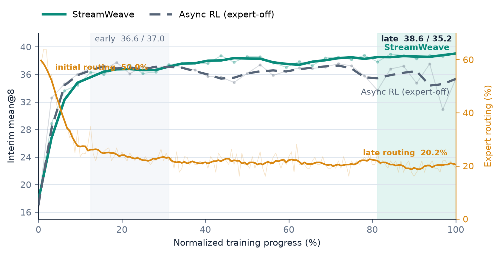

# StreamWeave 전체 논문 초안 (한국어)

> **Working title:** *StreamWeave: Reconciling Off-Policy Expert Supervision with
> Fully-Asynchronous Policy Learning*

## Abstract

Reinforcement learning with verifiable rewards (RLVR)는 policy가 아직 해결하지 못한 문제에서 긴
rollout에 많은 generation workload를 사용하지만, 같은 prompt의 모든 응답이 실패하면 group-relative
learning signal을 얻지 못한다. Fully-asynchronous RL은 rollout generation과 model training을
병행하여 실행 비용을 줄이고, expert trajectory는 policy-generated signal이 사라진 문제에 외부의
해결 경로를 제공한다. 우리가 다루는 group-conditioned setting에서는 complete-group outcome이
training source와 각 sample의 학습 역할을 함께 정하지만, fully-asynchronous runtime은 trajectory
attempt를 독립적으로 실행한다. 우리의 핵심 판단은 complete group을 학습 결정의 경계로 보존하면서
그 completion을 pipeline-wide execution barrier에서 분리할 수 있다는 것이다. **StreamWeave**는
attempt를 독립적으로 실행하고 source-decision boundary에서 complete group을 복원하며,
확정된 source와 생성 맥락을 source에 맞는 training input으로 변환한다. Policy와 expert input은
하나의 policy objective와 같은 averaging rule을 사용하는 one primary update에서 학습되고, rollout
generation과 model training은 계속 병행된다. 수학 추론에서 StreamWeave는 평균 38.5를 달성하여 같은
group-success selector를 사용하는 동기식 quality reference의 37.7과 대등한 reasoning performance를
보인다. 또한 128개 prompt group의 처리 시간을 46초에서 28초로 줄이고, 동일한 GPU 예산에서
prompt-group throughput을
1.64$\times$ 높인다. StreamWeave는 group-conditioned heterogeneous learning의 역할을 보존하면서
fully-asynchronous execution의 효율을 하나의 training system에서 함께 실현한다.

### English Draft

Reinforcement learning with verifiable rewards (RLVR) expends generation workload on difficult
problems, yet receives no group-relative learning signal when every response to a prompt fails. Fully
asynchronous RL reduces execution cost by overlapping rollout generation with model training, while expert
trajectories provide solution paths where policy-generated signal is absent. In the group-conditioned setting
we study, complete-group outcomes determine the training source and each
sample's learning role, while fully asynchronous runtimes execute trajectory attempts independently. Our key
insight is that a complete group can remain a learning-decision boundary without making its completion a
pipeline-wide execution barrier. **StreamWeave** executes attempts independently, reconstructs each complete
group at the source-decision boundary, and converts the resolved source and generation context into
source-appropriate training inputs. Policy and expert inputs are consumed in one primary update, using one policy
objective and the same averaging rule, while rollout generation and model training remain concurrent. On
mathematical reasoning benchmarks, StreamWeave scores 38.5, comparable to 37.7 for a synchronous quality
reference using the same group-success selector. It also reduces the time for 128 prompt groups from 46 to 28
seconds, improving prompt-group throughput by 1.64$\times$ under the same GPU budget. StreamWeave preserves
group-conditioned heterogeneous learning while realizing fully asynchronous execution.

### TL;DR

StreamWeave ends the wait for a complete-group decision where the source is fixed and retains its learning
context only until the corresponding training input is built, preserving group-conditioned expert supervision
under trajectory-level fully asynchronous RLVR. It achieves reasoning performance comparable to the
synchronous reference while improving prompt-group throughput by 1.64x under the same GPU budget.

## 1. Introduction

Reinforcement learning with verifiable rewards (RLVR)는 자동으로 검증 가능한 성공을 강화하여
LLM의 reasoning 능력을 높이지만, policy가 아직 해결하지 못한 문제에서는 많은 generation workload를
사용하고도 학습 신호를 얻지 못할 수 있다. Group-based RLVR은 정답을 탐색하기 위해 같은 prompt에서
여러 rollout을 생성하며, 이 과정은 긴 reasoning trajectory 때문에 학습 wall-clock의 큰 비중을
차지한다. 그 rollout이 모두 실패하면 group 내 보상 차이가 사라져 relative learning signal도 남지
않는다. 실제 training trace에서 all-failure group은 전체 group의 22.4\%였지만 generated response
token의 26.8\%를 차지했다. 따라서 계산 부담과 성공 신호 부족은 같은 어려운 영역에 함께 집중된다.
Fully-asynchronous RL은 rollout generation과 model training을 병행하여 실행 병목을 줄이고,
expert trajectory를 활용하는 방법은 policy가 성공하지 못한 문제에 외부의 해결 경로를 제공한다.
그러나 두 역량을 함께 두는 것만으로는 complete group에 정의된 decision이 trajectory attempt를
독립적으로 전진시키는 runtime에 어떻게 전달되어야 하는지가 정해지지 않는다.

두 역량은 complete-group outcome이 relative signal을 만드는 데서 그치지 않고 training source까지
결정하기 때문에 직접 맞물린다. 성공을 포함한 group은 policy rollout으로 학습하고, all-failure
group은 대응하는 expert trajectory를 선택한다. 따라서 group은 사용할 source와 선택된 sample이
update에 기여하는 방식을 함께 정한다. 반면 fully-asynchronous execution은 같은 group의 trajectory
attempt를 독립적으로 진행시켜 효율을 얻는다. Complete group을 실행 단위로 유지하면 가장 늦게
끝나는 trajectory가 pipeline의 critical path가 되고, source identity를 잃으면 policy와 expert
sample의 서로 다른 학습 역할도 사라진다. 핵심 과제는 trajectory 실행을 다시 묶지 않으면서
complete-group decision을
asynchronous training stream이 그대로 소비할 수 있는 형태로 옮기는 것이다. 따라서 본 논문의 질문은
다음과 같다. **Complete-group decision을 보존하면서 trajectory-level fully-asynchronous
execution을 유지할 수 있는가?**

<!-- 편집 결정 (2026-07-28): 기존 timeline Figure 1은 source routing을 현행 data-state figure와
중복하고, 나머지는 상속한 asynchronous scheduling을 재진술하므로 본문에서 제거했다. Local waiting
판단은 Introduction·§3.2 산문과 Algorithm 1이 소유하며, 이 timeline을 독립 figure로 복원하지 않는다. -->

우리는 이를 위해 **StreamWeave**를 제안한다. StreamWeave는 trajectory attempt를 독립적으로
실행하고 source decision에 필요한 시점에만 complete group을 복원하며, 확정된 source와 생성 맥락을
하나의 training record로 queue 너머까지 전달한다. 이 record는 source가 요구하는 training input으로
구성되므로, Generator는 다음 trajectory를 계속 생성하고 learner는 준비된 input을 학습한다. Complete
group은 학습 판단의 경계로 남지만 그 completion에 필요한 기다림은 다른 group의 generation과 model
training으로 전파되지 않는다.

이 handoff는 두 source의 학습 역할도 보존한다. Complete-group decision은 training input에 표현할
sequence, signal, ratio reference와 policy-lag correction을 확정한다. Policy와 expert input은 이후
하나의 policy objective와 같은 averaging rule을 사용하는 one primary update에 들어가며, 각각
group-relative reinforcement와 supervised learning으로 환원된다. StreamWeave는 필요한 결합을
complete-group decision과 training-input construction에 국소화하고 나머지 pipeline을
trajectory-level asynchrony에 열어 둔다.

수학 추론 실험에서 StreamWeave는 동일한 평가 절차로 비교한 방법들 가운데 경쟁력 있는 평균 성능
38.5를 달성하며, 같은 group-success selector를 사용하는 동기식 quality reference의 37.7과 대등한
reasoning performance를 보인다. Learning dynamics에서는 expert source가 필요한 어려운 영역이 학습
후반에도 지속되며, expert-off control과의 성능 차이가 학습이 진행되면서 나타난다. StreamWeave는
expert input을 사용하는 run에서 더 긴 generation workload가 관찰되는 조건에서도 이 online expert
channel을 유지하며, 128개 prompt group의 처리 시간을 46초에서 28초로 줄이고 동일한 GPU 예산에서
prompt-group throughput을 1.64$\times$ 높인다. 이 결과는 group-conditioned learning composition을
보존하면서 fully-asynchronous execution의 효율을 하나의 training system에서 함께 회수할 수 있음을
보여준다.

Complete-group decision은 수명이 서로 다른 두 요구를 만든다. Group을 기다리는 실행은 source가
확정되면 끝나지만, 선택된 source의 학습 역할을 재현하는 정보는 training input이 완성될 때까지
유지되어야 한다. StreamWeave는 각 요구를 실제로 소비되는 경계에서 끝내며, 이 구분에 따라 다음을
기여한다.

1. **Asynchrony-compatible learning composition.** 확정된 source가 선택한 학습 역할을 재현하는 데
   필요한 정보, 즉 source 자체, complete group의 reward context와 각 rollout의 generation policy를
   식별한다. 이를 source가 요구하는 training input으로 표현하고 나면 learner와 optimizer 경로에
   source별 판단이 더 남지 않으므로, 두 source는 하나의 policy objective와 같은 averaging rule을
   공유한다. 구성적 유도를 통해 두 input이 각각 의도한 group-relative reinforcement와 supervised
   contribution으로 환원됨을 보인다.
2. **Boundary-localized asynchronous architecture.** Trajectory attempt를 독립적으로 실행하면서
   source decision 직전에만 complete group을 복원하고, 확정된 source와 생성 맥락을 training-input
   construction까지 보존한다. 필요한 처리를 asynchronous queue의 경계에 배치하여 Generator와
   learner의 기본 역할을 유지하고, complete-group waiting을 source decision에 국소화한다.
3. **Composition-aware empirical study.** 성공 신호가 부족한 영역에 generation workload가 함께
   집중되고 expert 수요가 학습 후반까지 지속되며, expert supervision이 asynchronous workload를
   변화시키는 과정을 분석한다. 이 조건에서 StreamWeave가 경쟁력 있는 reasoning performance와
   동일한 GPU 예산의 1.64$\times$ prompt-group throughput을 함께 달성함을 보인다.

## 2. Related Work

StreamWeave와 직접 맞닿는 선행연구는 rollout generation과 model training을 비동기화한 연구와,
policy rollout 밖의 expert data를 학습에 활용한 연구다. 두 방향은 각각 실행 효율과
policy-generated signal의 부족을 다뤘다. StreamWeave는 complete-group outcome이 학습 source까지
결정하는 경우의 composition을 다룬다.

**Fully-asynchronous policy learning.** 시스템 계층에서 HybridFlow (EuroSys 2025)는 RLHF의
computation과 data dependency를 분리하여 다양한 알고리즘과 resource mapping을 유연하게 구성할 수
있는 실행 기반을 제공했다. Asynchronous RLHF (ICLR 2025)는 generation과 learning을 직접 분리하고,
이전 policy가 생성한 sample로 학습할 때 발생하는 policy lag와 실행 효율 사이의 trade-off를 분석했다.
AReaL (NeurIPS 2025)은 rollout worker와 training worker를 완전히 분리하고 workload balancing과
staleness-aware optimization을 결합하여 fully-asynchronous LLM RL을 end-to-end로 실증했으며, TBA
(NeurIPS 2025)는 asynchronous actor가 수집한 replay experience를 off-policy objective로 학습한다.
Laminar (EuroSys 2026)는 GRPO에서 trajectory를 독립적으로 실행하여 group 내 generation latency의
편차를 흡수한다. 이 계보는 policy-generated rollout의 생성과 소비를 비동기화하고 그 과정에서
발생하는 policy lag를 관리한다.

**Learning from policy rollouts and expert trajectories.** 다른 연구 방향은 demonstration, offline
data, expert trajectory를 활용하여 학습을 policy가 스스로 생성한 experience에만 의존하지 않도록
확장해 왔다. 일반 RL에서는 DQfD (AAAI 2018)가 demonstration을 temporal-difference update와 supervised
loss에 사용했고, RLPD (ICML 2023)는 offline data를 online RL에 지속적으로 결합했다. LLM
post-training에서는 InstructGPT (NeurIPS 2022)가 demonstration-based supervised learning과 RLHF를
단계적으로 연결했고, SimpleMix (ICML 2025)는 preference learning에서 on-policy와 off-policy data를
직접 혼합했다. Reasoning post-training의 LUFFY (NeurIPS 2025)는 off-policy reasoning trace와 policy
rollout을 mixed-policy learning으로 결합하고, CHORD (ICLR 2026)는 SFT를 on-policy exploration과 함께
최적화되는 dynamically weighted auxiliary objective로 재구성한다. ReLIFT와 SRFT도 reasoning
post-training에 expert trajectory를 활용한다. 이 계보는 외부 data를 선택하고 각 data source에 학습
역할과 가중치를 부여하는 방법을 발전시켰다.

**Composing asynchronous execution with heterogeneous supervision.** 두 계보를 결합하려면
complete-group decision을 asynchronous stream이 소비할 수 있는 training record로 변환해야 한다.
Group outcome은 policy rollout과 expert trajectory 중 학습할 source를 정하며, source에 따라 update에
사용할 sequence와 training input의 조건도 달라진다. 그러나 어느 계보도 이 outcome을 기다리는
범위가 어디까지여야 하는지, 선택된 source와 group context가 언제까지 유지되어야 하는지를 정하지
않는다. Group이 learning signal에 영향을 주지 않는 system은 첫 질문을 갖지 않고, 모든 sequence를
update까지 묶는 synchronous barrier는 둘째 질문에 전역적인 답을 기본값으로 제공한다.

## 3. StreamWeave

StreamWeave는 trajectory attempt를 실행 단위로, complete prompt group을 학습 판단 단위로,
source에 맞는 training input을 최적화 단위로 구분한다. Attempt는 독립적으로 실행되고, complete
group은 policy group과 대응하는 expert trajectory 중 하나를 선택한다. Cross-attempt waiting은
source가 확정되면 끝나지만, source와 필요한 group context는 input construction까지 유지된다. 이
handoff 바깥에서 Generator는 rollout generation을 계속하고 learner는 준비된 input을 학습한다.
§3.1은 complete-group decision이 선택한 역할을 learner가 재현하려면 어떤 정보를 training input까지
전달해야 하는지를 묻는다. §3.2는 그 decision을 기다리는 실행의 범위가 어디까지여야 하는지를 묻는다.
그림 1은 queue handoff의 세 data-state boundary를, Algorithm 1은 concurrent control flow를
요약한다.

[그림 1 위치: `final/figures/figure2.pdf`]

*그림 1: StreamWeave의 세 data-state 경계(실험의 $\gamma=0$ source rule). Complete group은
$n$-sequence policy record 또는 singleton expert record 중 하나를 만들고, 서로 다른 prompt의
source-fixed record(A--C)는 하나의 queue를 공유한다. Trainer는 source에 맞는 signal, reference와
correction을 구성하며, policy provenance는 rollout-to-entry correction으로, expert는 identity
correction으로 이어진다. 두 input은 하나의 policy objective와 같은 averaging rule을 사용하는 one
primary update로 들어간다.*

### 3.1 Learning Composition

Complete-group decision은 학습할 sequence뿐 아니라 learner가 그 sequence를 해석하는 조건까지
확정한다. 이 절은 그 decision이 전달해야 할 정보를 식별하고, 이를 source가 요구하는 training
input으로 표현하며, 두 input이 하나의 policy objective와 같은 averaging rule에 들어가는 방식을
보인다. 실험에서는 complete rollout group의 outcome에 따라 policy group과 expert trajectory 중
하나를 선택하는 Hybrid Post-Training (HPT)을 구체적인 source rule로 사용한다.

**Source selection from a completed group.** Prompt $x$에 대해 policy가 생성한 $n$개의 rollout을
$G_x=\{\tau_{x,1},\ldots,\tau_{x,n}\}$이라 하자. 각 rollout은 verifier score
$R(\tau_{x,i})$를 가지며, complete group의 success rate는 다음과 같다.

$$
P_x=\frac{1}{n}\sum_{i=1}^{n}
\mathbf{1}\!\left[R(\tau_{x,i})>\delta\right],
\qquad
z_x=S_\gamma(G_x)=
\begin{cases}
\mathrm{expert}, & P_x\le\gamma,\\
\mathrm{policy}, & P_x>\gamma.
\end{cases}
$$

$z_x=\mathrm{policy}$이면 생성된 group $G_x$를, $z_x=\mathrm{expert}$이면 같은 prompt에 대응하는
expert trajectory $\tau_x^\star$를 학습에 사용한다. 이 결정은 개별 trajectory가 아니라 $G_x$
전체의 관측 결과에 정의되므로, $n$개의 score가 모두 모인 뒤에만 source를 확정할 수 있다. 구체적인
$n$, $\gamma$, 그리고 expert trajectory의 제공 범위는 Experimental Setup에서 명시한다.

**Constructing source-specific training inputs.** Source decision은 update에 사용할 sequence와 함께
learning signal을 만드는 방법, policy ratio의 reference, policy-lag correction의 적용 여부를
정한다. 선택된 sequence $r$의 token $t$에서 $A_{r,t}$는 learning signal, $\rho_{r,t}$는 policy
ratio, $w_{r,t}$는 rollout policy와 update 시작 시점의 policy 사이를 보정하는 importance weight라
하자.

Policy source에서는 $n$개의 rollout을 group으로 유지하고, verifier score를 group 안에서 비교하여
GRPO advantage $A^{\mathrm{grp}}_{r,t}$를 계산한다. 각 rollout은 update보다 앞선 policy version에서
생성될 수 있으므로, update 시작 시점의 policy를 ratio의 reference로 사용하고 generation 시점부터의
policy lag를 별도의 weight로 보정한다.

$$
A_{r,t}=A^{\mathrm{grp}}_{r,t},
\qquad
\rho_{r,t}
=\exp\!\left(\ell_{\theta,r,t}-\ell^{\mathrm{entry}}_{r,t}\right),
\qquad
w_{r,t}=w^{\mathrm{lag}}_{r,t}.
$$

Expert trajectory는 policy가 생성한 과거 경험이 아니라 외부에서 주어진 target sequence다.
StreamWeave는 여기에 group-relative signal이나 policy-lag correction을 적용하지 않고,
정답 sequence의 likelihood를 직접 높이는 역할로 구성한다. Supervision의 강도 $\beta_r$를 signal로
사용하고 current-policy log-probability의 stop-gradient copy를 reference로 두면 forward ratio는
1이 되며, expert에는 rollout-to-entry correction을 적용하지 않는다.

$$
A_{r,t}=\beta_r,
\qquad
\rho_{r,t}
=\exp\!\left(
\ell_{\theta,r,t}-\operatorname{sg}[\ell_{\theta,r,t}]
\right)=1,
\qquad
w_{r,t}=1.
$$

두 source의 input은 같은 token-level policy objective $\Phi$에 들어간다. Batch $B$에 대해

$$
\mathcal{L}(B)=\frac{1}{|B|C}
\sum_{r\in B}\sum_t m_{r,t}
\Phi\!\left(\rho_{r,t};A_{r,t},w_{r,t}\right),
$$

여기서 $m_{r,t}$는 response mask이고 $C$는 모든 sequence에 공통으로 적용하는 normalization
constant다. Policy input은 group-relative policy contribution을 만든다. Expert input은 forward ratio가 1이지만
numerator의 gradient가 남으므로 $\beta_r$로 가중된 supervised negative-log-likelihood contribution을
만든다. 두 input은 하나의 optimizer path에서 같은 policy objective와 averaging rule을 공유한다.
실험에서는 $\Phi$로 vanilla clipped PPO를 사용한다. Appendix A.2--A.3은 expert endpoint의 gradient와
두 source에 공통인 averaging rule을 유도하여, source의 학습 의미는 input construction에서 정해지고
objective와 aggregation은 하나로 유지됨을 확인한다.
Effective source mixture는 routing frequency만으로 정해지지 않으며, source별 row cardinality, token
volume과 $\beta_r$가 함께 작용한다. Appendix A.3은 공통 normalization 아래에서 이 감쇠 과정을
정량화하고 token share를 gradient contribution으로 해석하지 않아야 하는 이유를 설명한다.

Complete group에서 정한 source는 사용할 sequence와 그 sequence가 update에 기여하는 방식을
함께 정한다. 그러나 이 설명만으로는 그 decision을 위해 실행이 얼마나 오래 기다려야 하는지가
정해지지 않는다. 다음 절은 바로 그 질문을 다룬다.

### 3.2 Fully-Asynchronous Execution

Fully-asynchronous execution은 independent attempt scheduling, bounded queue, backpressure와
parameter refresh를 사용해 rollout generation과 model training을 병행한다. StreamWeave는 이
composition에 필요한 처리를 generation--training handoff의 두 경계에 집중한다. Queue 앞에서 complete
group을 복원해 source를 확정하고, queue 뒤에서 source-fixed record를 대응하는 training input으로
구성한다. 이 경계 밖에서 Generator는 trajectory attempt를 생성하고 learner는 준비된 input으로 기존
policy update를 수행한다.

**Algorithm 1: StreamWeave.**

```text
Input: prompt pool X, group size n, verifier R, source rule S_gamma, expert store E
State: accumulator A[g_x] for prompt-group key g_x, queue Q of source-fixed records,
       learner parameters theta

GENERATOR and TRAINER run concurrently.

GENERATOR:
 1  launch one attempt in every idle rollout slot
 2  when attempt (g_x, i) finishes under pi_gen_i:
 3      A[g_x][i] <- <tau_i, R(tau_i), pi_gen_i>     # keep per-attempt provenance
 4      launch the next attempt                      # slot freed; no wait on siblings
 5      if |A[g_x]| = n:                             # boundary 1: complete-group decision
 6          G_x <- ordered A.pop(g_x);  z_x <- S_gamma(G_x)
 7          Q.push(SOURCE_RECORD(x, z_x, G_x, E[x])) # source fixed before the queue

TRAINER:
 8  records <- DEQUEUE(Q);  B <- empty
 9  for q in records:                                # boundary 2: source-conditioned inputs
10      if q.source = policy: B += POLICY_INPUTS(q)  # n rows; group-relative + lag correction
11      else:                 B += EXPERT_INPUT(q)   # 1 row; beta signal, no correction
12  theta <- LEARNER_UPDATE(theta, L(B))             # one objective, one averaging rule
13  PUBLISH(theta)
```

`SOURCE_RECORD`는 선택된 data와 필요한 context를 보존하며, `POLICY_INPUTS`와 `EXPERT_INPUT`은
§3.1에서 정의한 두 training-input construction을 나타낸다.

**Execute attempts independently and reconstruct each group locally.** 하나의 prompt group을 이루는
trajectory attempt들은 group identity와 위치를 유지한 채 독립적으로 실행된다. 먼저 끝난 attempt는
rollout slot을 다음 작업에 넘기고 accumulator에 들어간다. 모든 attempt가 도착하면 accumulator가
source decision을 위해 원래 순서의 complete group을 복원한다. 그동안 다른 group의 generation과
준비된 input의 training은 계속되므로, complete-group requirement는 trajectory 실행이 아니라 decision
가능 시점을 제한한다.

**Fix the source before the queue.** Group이 완성되면 §3.1의 $S_\gamma$를 적용하여 policy rollout
group과 대응하는 expert trajectory 중 사용할 data를 확정한다. 선택된 data, group outcome과 rollout별
policy provenance는 하나의 source-fixed record로 queue를 건넌다. Policy record는 complete-group
scores와 rollout별 generation policy를, expert record는 선택된 target과 source를 보존한다. Source는
transport 전에 확정되므로 record의 소비 순서는 update timing에는 영향을 주지만 source decision을
바꾸지 않는다.

**Construct training inputs after the queue.** Trainer는 queue에서 꺼낸 record를 §3.1의 input으로
구성한다. Policy record는 GRPO signal과 policy-lag correction에 필요한 complete-group scores와
provenance를 제공하고, expert record는 $\beta$-weighted supervised contribution에 필요한 target을
제공한다. Trainer는 두 input에 §3.1의 policy objective와 averaging rule을 적용한다.

**Keep one asynchronous flow.** Source-fixed record는 기존 queue, backpressure와 parameter-refresh
flow를 따르고, 두 input은 하나의 learner와 optimizer path를 공유한다. Complete-group waiting은
accumulator가 source를 확정할 때 끝나며, policy route의 scores와 generation context만 input
construction까지 record에 남는다. 이 handoff는 주변 asynchronous flow의 핵심 interface를 유지하면서
complete-group decision과 source별 학습 역할을 보존한다. Appendix B는 source-fixed record가 queue와
parameter refresh를 지나는 과정을 추적하여, 확정된 source를 보존하면서 기존 asynchronous flow를
유지하는 방식을 보여준다.

## 4. Experiments

실험은 StreamWeave가 policy rollout과 expert trajectory의 서로 다른 학습 역할을 보존하면서 학습
효과와 실행 효율을 함께 달성하는지를 세 질문으로 평가한다. 첫째,
StreamWeave가 경쟁력 있는 수학 추론 성능을 달성하고 cross-domain reasoning 성능도 유지하는가. 둘째,
expert trajectory가 선택되는 all-failure group에 성공 신호의 부족과 generation workload가 함께
집중되며, 선택적인 expert supervision이 이 영역을 넘어 shared policy의 학습 전반에 기여하는가.
셋째, 이러한 지속적인 expert supervision에 동반되는 generation workload와 source에 따라 달라지는 training input을
필요한 경계에서 처리하여, complete-group decision을 pipeline-wide execution barrier로 만들지 않고
동일한 GPU 예산에서 prompt-group throughput을 높이는가.

### 4.1 Experimental Setup

**Training setting and control.** StreamWeave는 Qwen2.5-Math-1.5B를 기반으로 하며,
OpenR1-Math의 prompt와 verified expert trajectory로 구성한 training set을 사용한다. 각 prompt에서
$n=8$개의 policy rollout을 생성하고, complete-group source rule을 $\gamma=0$으로 설정해 여덟
rollout이 모두 실패한 group에만 대응하는 expert trajectory를 사용한다. Expert channel의 역할과
generation workload는 같은
fully-asynchronous execution stack에서 expert trajectory의 학습 사용만 비활성화한 Async RL
(expert-off)과 비교한다. 이후 산문에서는 이를 expert-off control로 부른다. Expert-signal scale,
asynchronous correction, loss averaging과 정확한 optimization 설정은 Appendix A.2--A.4와 C.1에서
명세한다.

**Quality evaluation.** 각 모델은 AIME24, AIME25, AMC(83), MATH500, Minerva(272),
Olympiad(674)의 여섯 수학 추론 benchmark에서 fixed-checkpoint evaluation을 수행한다. 보고하는 모든
checkpoint는 동일한 sampling configuration, Math-Verify grader와 반올림 절차로 직접 평가하며,
SRFT, ReLIFT, Oat-Zero, LUFFY, ExGRPO, EMPO, AceMath와 DFT에는 각 연구가 공개한 공식
checkpoint를 사용한다. AIME24,
AIME25와 AMC에는 32개 stochastic generation의 평균 pass@1인 mean@32를, 나머지 benchmark에는
mean@8을 사용한다. Math Avg.는 반올림
전 여섯 점수의 동일 가중 macro-average다. Training reward와 자체 수학 평가는 동일한 Math-Verify
grader를 사용한다. 같은 checkpoint의 cross-domain reasoning은 ARC-Challenge, GPQA-Diamond와
MMLU-Pro에서 별도로 평가하고 세 점수의 macro-average를 보고한다. 비교군은 base와 instruct model,
Async RL (expert-off)과 여러 post-training 방법을 포함하며, HPT는 같은 all-failure 기준으로
expert trajectory를 선택하는 동기식 quality reference다. Appendix C.2는 benchmark별 sample count와 checkpoint
provenance를 명세하여 이 공통 protocol과 Table 1을 선택된 peak가 아닌 fixed-checkpoint evaluation으로
검증한다.

**Learning-process analysis.** Expert channel이 필요한 영역과 학습 과정에서의 역할은 세 층위에서
살펴본다. 먼저 generator-side census에서 complete generated group을 all-failure와 any-success로 나누어
발생 빈도, response-token volume, rollout 길이와 group 내 generation-time spread를 비교한다. 이어서
expert-off control과 StreamWeave의 routing history, 중간 checkpoint quality와 held-out prompt의
all-failure rate를 함께 비교한다. 마지막으로 같은 prompt와 첫 encounter의 성공 수를 맞춘 뒤 후속
encounter의 결과를 비교하여, 관찰된 차이가 expert input을 직접 받은 prompt에만 국한되는지 분석한다.

**Efficiency evaluation.** 실행 분석은 두 reference를 구분한다. Expert-off comparison은 expert
trajectory를 학습에 사용하는 동안 generation workload와 서로 다른 policy version에서 생성된
rollout을 함께 포함하는 group의 비율이 어떻게 달라지는지 살펴본다. 동일한 GPU 예산의 synchronous
execution은 end-to-end payoff를 측정한다. 공통 작업 단위는 learner sample 수나 optimizer
step 수 대신 routing 이전의 고유 prompt group으로 둔다. Throughput은 validation과 checkpoint를
제외한 training-loop wall-clock 동안 소비한 prompt group으로 계산한다. GPU activity와 동일
wall-clock에서 누적된 prompt-group work를 함께 측정하고, source에 따른 sample 수의 차이가 고정된
prompt-group input budget 안에서 처리되는지도 확인한다. 정확한 hardware 배치, run identifier,
work-weighted throughput estimator와 telemetry normalization은 Appendix C.5에서 정의하고, 같은 작업량
비교와 telemetry sensitivity로 headline의 matched-budget 해석을 검산한다.

### 4.2 Learning Effectiveness

**Overall mathematical reasoning performance.** Table 1은 learning composition을
fully-asynchronous execution으로 옮겨도 수학 추론 성능을 반납하지 않음을 보여준다. StreamWeave는
38.5를 달성하여 평가한 방법 중 가장 높은 여섯 benchmark 평균을 기록하고, HPT의 37.7
수준을 유지한다.
Decoding-cap sweep에서 expert-off control의 cap을 네 배 늘려도 여섯 benchmark 평균은 0.02점만
변했고, 가장 큰 cap에 도달한 sample은 없었다. 같은 sweep에서 StreamWeave는 4,096-token cap에서
이미 38.5를 달성했으며, 공통 8,192-token protocol에서는 LUFFY와 유사한 수준의 score를 기록하면서
평균 response token은 LUFFY의 48%를 사용했다(Appendix C.2).

| Type | Model | Async | Expert | AIME24 | AIME25 | AMC | MATH500 | Minerva | Olympiad | Avg. |
|---|---|:---:|:---:|---:|---:|---:|---:|---:|---:|---:|
| Basic | Base | -- | -- | 6.6 | 3.5 | 31.2 | 43.3 | 10.9 | 24.9 | 20.1 |
|  | Instruct | -- | -- | 10.6 | 9.4 | <u>47.0</u> | 75.5 | 29.5 | 40.4 | 35.4 |
| Expert | HPT | -- | ✓ | 15.4 | 12.6 | 45.8 | 78.0 | 31.3 | <u>43.2</u> | <u>37.7</u> |
|  | SRFT | -- | ✓ | 12.3 | 10.4 | 43.0 | 71.6 | 26.1 | 38.4 | 33.7 |
|  | ReLIFT | -- | ✓ | 12.6 | 8.1 | 40.3 | 74.6 | 28.6 | 39.4 | 34.0 |
|  | LUFFY | -- | ✓ | 15.1 | **14.0** | 46.0 | 77.5 | 30.0 | **43.5** | <u>37.7</u> |
| Fully Async | Async RL | ✓ | -- | 12.9 | 7.9 | 44.9 | 75.8 | 28.8 | 39.5 | 35.0 |
| Ours | **StreamWeave** | ✓ | ✓ | <u>16.1</u> | <u>13.0</u> | <u>47.0</u> | **78.5** | <u>33.0</u> | <u>43.2</u> | **38.5** |
| Additional | Oat-Zero | -- | -- | **17.2** | 12.6 | **49.6** | 73.7 | 30.1 | 38.1 | 36.9 |
|  | AceMath | -- | ✓ | 11.3 | 6.6 | 45.4 | <u>78.1</u> | **34.8** | 39.4 | 35.9 |
|  | ExGRPO | -- | -- | 12.1 | 9.0 | 46.3 | 73.2 | 27.2 | 37.3 | 34.2 |
|  | EMPO | -- | -- | 14.1 | 8.0 | 45.5 | 72.5 | 25.1 | 35.8 | 33.5 |
|  | DFT | -- | ✓ | 6.0 | 4.3 | 32.0 | 63.5 | 26.1 | 29.0 | 26.8 |

*Table 1: Fixed-checkpoint mathematical reasoning results. Type은 비교 범주를 나타내며 행 배경도
동일한 범주를 따른다. Async는 rollout generation과 training의 fully-asynchronous execution을,
Expert는 외부 expert trajectory 사용을 뜻한다. Scores are rounded to one decimal place. Avg. is the unweighted
macro-average computed from unrounded benchmark scores. 각 열의 최고값은 bold, 차선값은 underline으로
표시하며 동률은 같은 서식을 공유한다.*

**A costly hard region.** StreamWeave가 expert source를 선택하는 $0/8$ all-failure group은
policy branch에 reward-derived group-relative signal을 제공하지 않는다. Generator-side census를
통해 이 영역이 generation 과정에서도 더 큰 부담을 요구하는지 분석한다.

| Group outcome | 발생 빈도<br>(전체 group 중) | 생성 token 점유율<br>(전체 response token 중) | Rollout당 평균 길이 | Group 내 완료 시간 차이<br>(slowest--fastest) |
|---|---:|---:|---:|---:|
| Any success | 77.6% | 73.2% | 1,347 tokens | 7.7 s |
| **All failure** | **22.4%** | **26.8%** | **1,713 tokens** | **11.0 s** |

*표 X: Routing 이전 policy rollout의 generator-side 특성. 완료 시간 차이는 같은 prompt에서 생성한
여덟 request 중 가장 늦은 request와 가장 빠른 request의 duration 차이다.*

All-failure group은 발생 빈도보다 더 큰 생성량을 차지하며 rollout도 더 길고 불균등하게 완료된다.
따라서 policy-generated signal의 부재는 더 큰 generation workload와 completion imbalance에 겹쳐
나타난다. 긴 generation에는 asynchronous execution이, $0/8$ outcome에는 expert source가 필요하다.
StreamWeave는 두 요구를 하나의 continuous training system에서 지속한다.



*그림 X: 정규화한 학습 진행에 따른 추론 성능과 지속적인 expert 수요. 청록색과 회색 곡선은 각각
StreamWeave와 expert-off control의 여섯 benchmark 중간 평가 성능을, 주황색 곡선은 expert source로
선택된 prompt group의 비율을 나타낸다. 옅은 선은 개별 관측값을, 굵은 선은 평활한 추세를 표시한다.
가로축은 두 run의 공통 비교 구간을 0--100\%로 선형 정규화한다.*

Expert routing은 policy가 빠르게 개선되는 초기에 크게 감소하지만, 이후 안정적인 tail을 형성한다.
필요한 supervision의 범위는 좁아지지만, policy-generated signal이 사라지는 residual region은 학습
후반에도 남는다. 이 변화하는 expert 사용은 policy rollout과 함께 하나의 fully-asynchronous training
stream에 지속적으로 반영된다.

StreamWeave와 expert-off control은 execution stack, policy objective, optimizer, prompt population과
expert access를 공유하며, all-failure outcome이 선택한 expert input을 실제로 소비하는지에서 갈린다.
이 group은 reward-derived relative direction을 제공하지 않으므로 expert-off run은 다른 prompt의
신호가 이 영역으로 전이되는 데 의존한다. 두 run은 초기에 유사하게 개선된 뒤 분리되며, 평균
benchmark 성능과 held-out all-failure rate가 같은 방향으로 갈라진다.

같은 prompt와 첫 encounter의 성공 수를 맞춘 비교에서, first-to-second encounter improvement의
run 간 가중 평균 차이는 8개 attempt group당 성공 rollout **$+0.169$개**였다. 이 차이는
$k=0,\ldots,8$의 모든 구간에서 양수이고 partial-success 영역에서 가장 크며, third encounter에서도
**$+0.159$**로 유지됐다. 이 pattern은 selective expert contribution이 대응 prompt뿐 아니라 shared
policy의 acquisition과 retention에도 연결된다는 해석을 지지한다. Appendix C.3은 matched population,
전체 stratum별 estimate와 standard error, 후속 encounter를 제시한다. 소비한 prompt group 수를 맞춘
비교에서도 StreamWeave의 후반 all-failure rate는 4.8 percentage points 낮게 유지된다. 이 비교는 두
개의 고정된 training run에 기반하며 randomized 또는 multi-seed study는 아니다.

**Cross-domain reasoning.** 수학 중심의 selective expert supervision이 cross-domain reasoning을
좁히는지 확인하기 위해 ARC-Challenge, GPQA-Diamond와 MMLU-Pro에서 같은 checkpoint를
fixed-checkpoint evaluation으로 평가한다.

| Model | ARC-C | GPQA-D | MMLU-Pro | **Avg.** |
|---|---:|---:|---:|---:|
| Base | 5.7 | 3.6 | 3.3 | **4.2** |
| Instruct | 54.6 | 27.7 | 30.3 | **37.5** |
| HPT | <u>60.5</u> | 28.8 | 33.9 | <u>41.1</u> |
| SRFT | 48.0 | 24.2 | 28.0 | **33.4** |
| ReLIFT | 52.8 | 24.5 | 30.2 | **35.8** |
| LUFFY | 56.5 | 27.0 | <u>34.5</u> | 39.3 |
| Async RL | **60.8** | **30.6** | 31.7 | <u>41.1</u> |
| **StreamWeave** | 60.2 | <u>30.3</u> | 33.2 | **41.2** |
| Oat-Zero | 41.9 | 13.5 | 21.5 | **25.6** |
| AceMath | 59.9 | 25.9 | **34.7** | 40.2 |
| ExGRPO | 58.7 | 28.3 | 29.2 | **38.7** |
| EMPO | 24.8 | 12.3 | 16.2 | **17.8** |
| DFT | 44.8 | 22.0 | 24.0 | 30.2 |

*표 X: Fixed-checkpoint cross-domain reasoning results. Avg.는 ARC-C, GPQA-D와 MMLU-Pro의 동일 가중
macro-average다.*

StreamWeave는 Async RL (expert-off)과 HPT의 cross-domain aggregate 수준을 유지하고 개별
점수도 두 reference의 범위에 머물면서, 수학 추론에서는 더 높은 성능을 보인다. 추가 학습 이득은
cross-domain reasoning의 뚜렷한 저하 없이 목표 수학 영역에 집중된다.

### 4.3 Execution Efficiency with Expert Supervision

Expert source가 학습 전반의 online stream에 참여하므로, 그에 동반되는 generation workload와 group
completion pattern은 fully-asynchronous execution이 지속적으로 처리해야 할 실행 조건이다.
이 절은 이러한 조건이 complete-group decision을 나머지 pipeline의 제약으로 확장하는지를 평가한다.

같은 fully-asynchronous execution stack의 expert-off control과 비교하면, expert-supervised run은 더
긴 response와 group tail을 만들고 인접한 policy version의 rollout을 함께 포함하는 group도 늘어난다
(Table 2).

| 관측 범위 | 지표 | Reference | **StreamWeave** | 변화 |
|---|---|---:|---:|---:|
| Generation workload | Rollout당 평균 response length | 896 tokens | **1,429 tokens** | **1.59$\times$** |
| Generation workload | Group별 최장 rollout time의 평균 | 6.59 s | **12.79 s** | **1.94$\times$** |
| Generation workload | 인접한 두 policy version의 rollout을 포함한 groups | 2.03\% | **7.00\%** | **3.46$\times$** |
| End-to-end execution | 128 prompt groups 처리 시간 $\downarrow$ | 46.0 s | **28.0 s** | **39\% 감소** |
| End-to-end execution | Prompt-group throughput $\uparrow$ | 2.78 groups/s | **4.58 groups/s** | **1.64$\times$** |

*표 2: Expert-supervised asynchronous training에서 관찰된 generation workload와 end-to-end execution
efficiency. 위 세 행은 같은 fully-asynchronous execution stack에서 expert input만 비활성화한
Async RL (expert-off)을 reference로
사용하며, generation 관련 값은 source decision 이전의 policy rollout에서 계산한다. 아래 두 행은 동일한
GPU 예산의 synchronous execution을 reference로 사용한다. 모든 efficiency metric은 routing 이전의 고유
prompt group을 공통 작업 단위로 사용한다.*

이 시간적 노출은 모든 group에 균일하지 않았다. StreamWeave 안에서는 최종적으로 expert source가
선택되는 all-failure group의 10.0\%가 두 policy version의 rollout을 포함하여 가장 높은 비율을 보였다.
즉 expert source가 필요한 영역은 학습 신호뿐 아니라 complete group이 준비되는 시점에서도
asynchronous execution과 가장 강하게 맞물린다.

길고 완료 시점이 불균등한 group이 하나의 execution phase를 공유하면 가장 늦은 trajectory가 pipeline
진행을 결정한다. Synchronous trace에서 개별 request는 평균 7.6초에 완료되지만 가장 느린 request는
23.7초까지 이어지고, 후처리를 포함한 generation phase는 25.1초에 종료된다. 먼저 끝난 request도
phase가 닫히기 전에는 다음 attempt를 시작할 수 없고 model training도 generation 이후에 시작한다.
따라서 completion tail은 후속 rollout과 training을 함께 제한한다.

StreamWeave는 attempt가 끝날 때마다 빈 rollout slot에 다음 작업을 공급한다. 독립적으로 완료되는
동안에도 group identity와 rollout별 generation policy를 보존하고, source decision을 위해서만
group을 복원한다. 한 group이 완성되지 않은 동안에도 다른 group은 계속 생성되고 준비된 data는 계속
학습된다. 필요한 조정은 decision과 input-construction 경계에서 끝나며 pipeline-wide waiting으로
전파되지 않는다.


*그림 X: 동일한 8-GPU 예산에서의 end-to-end execution efficiency. (a)--(b)는 각 run의 전체
non-validation training history를 독립적으로 0--100\%로 정규화하여 GPU별 SM activity와 20\%를
초과하는 SM activity를 보인 GPU 수를 나타낸다. (c)는 synchronous run의 전체 79.7분과 StreamWeave의
동일 길이 prefix를 비교하며, 누적 작업량은 synchronous endpoint를 1.0으로 두어 정규화한다.*

그림 X는 이 설계의 하드웨어 수준 signature를 보여준다. StreamWeave는 여러 GPU의 activity가 함께
낮아지는 구간을 줄이고 더 넓은 concurrent activity를 유지하며, 같은 wall-clock에서 더 많은
prompt-group work를 누적한다. 이는 complete-group waiting의 범위를 제한한 설계를 실제 작업량과
연결한다.

StreamWeave는 128개 prompt group의 처리 시간을 46초에서 28초로 줄이고, 동일한 GPU 예산에서
**1.64$\times$의 full-history prompt-group throughput**을 달성한다(Table 2). 이 end-to-end 이득에는
서로 연결된 두 실행 효과가 함께 작용한다. 첫째, 동기식에서 generation 이후에 시작되던 model
training이 rollout generation과 병행된다. 둘째, attempt가 끝날 때마다 빈 rollout slot에 다음 작업을
공급하여, 먼저 끝난 rollout이 complete-group tail을 기다리는 동안 잃던 유효 rollout capacity를
회수한다. 두 효과는 complete-group decision을 유지한 채, 그 기다림이 model training과 다른 rollout
slot의 진행까지 묶는 범위를 줄인다.

Appendix C.4--C.5는 resource-normalized accounting, source별 policy-version 구성과 request-level
timing으로 이 해석을 검산하고, 이를 exact speedup decomposition으로 확장할 수 없는 범위를 명시한다.

## 5. Conclusion

StreamWeave는 trajectory 실행과 training source 및 학습 역할을 정하는 complete-group decision을
분리하여 group-conditioned RLVR을 fully-asynchronous execution으로 실현한다. 그 decision을 기다리는
실행은 source가 확정되는 곳에서 끝나고, 선택된 학습 역할을 재현하는 정보는 training input이
완성되는 곳에서 끝난다. 이 의존성의 국소화는 complete group을 학습 판단의 경계로 유지하면서 그
completion을 pipeline-wide execution barrier에서 분리한다.

실험에서 policy-generated relative signal이 사라지는 all-failure 영역에는 더 큰 generation
workload가 집중되고 expert 수요는 학습 후반에도 지속되며, selective expert contribution은 직접
routing된 prompt를 넘어 shared policy의 acquisition과 retention에 연결된다. StreamWeave는 수학에서
동기식 quality reference와 대등한
성능을 달성하고, 경쟁력 있는 cross-domain reasoning performance를 유지했다. Expert input을 사용하는
run에서 더 긴 generation workload가 관찰되는 조건에서도 동일한 GPU 예산의 prompt-group throughput을
1.64$\times$ 높였다. 본 연구가 직접 검증한 범위는 하나의 backbone과 training seed, 동일한 8-GPU
예산, 수학 중심의 group-conditioned two-source RLVR이다. 이 범위에서 StreamWeave는 complete-group
learning composition을 보존하고 그 의존성의 실행
범위를 제한하여, selective expert supervision과 fully-asynchronous execution의 효율을 하나의 training
system에서 함께 실현했다.

## Appendix A. Exact Learning Realization

이 Appendix는 §3.1의 learning composition을 현행 main configuration이 어떻게 실현하는지 명세한다.
여기서 설명하는 singleton construction, self-detached reference, token-level correction은 StreamWeave의
별도 novelty가 아니라, source별 training input이 하나의 policy objective에서 의도한 두 endpoint로
환원됨을 보이는 realization이다.

### A.1 Routing domain and failure handling

Training prompt $x$마다 policy는 $n=8$개의 rollout을 생성한다. Main selector는 success-rate
rule을 $\gamma=0$으로 사용하므로, verifier가 여덟 rollout을 모두 실패로 판정한 경우에만 matched expert
trajectory를 선택한다. 이 결정은 모든 attempt의 score가 도착한 complete group에만 정의된다. Main
realization은 전처리된 training data에서 prompt에 대응하는 verified trajectory를 조회한다. Selector가
expert source를 요구했는데 matched trajectory가 없으면 해당 prompt를 다른 source로 조용히 바꾸지 않고
fail-closed 처리한다.
Generation attempt가 실패한 경우에도 불완전한 group으로 결정을 만들지 않고 group 전체를 닫는다.

각 routed record는 적어도 `prompt_uid`, `group_uid`, source decision, group success statistics를 가진다.
Policy record는 여기에 rollout을 생성한 policy context를 유지한다. 이 metadata는 queue가 학습 의미를
해석하게 만들기 위한 것이 아니라, trainer가 §3.1의 입력 조건을 완성하기 위한 정보다.

### A.2 Source-specific inputs on one policy loss

Policy로 route된 group은 여덟 rollout row를 유지하고, `group_uid`를 기준으로 GRPO relative advantage를
계산한다. Main은 learner가 batch를 받아 update를 시작할 때의 policy를 proximal reference로 사용하며,
rollout policy에서 이 entry policy까지의 mismatch는 token-level truncated importance weight
$w_{r,t}$로 분리해 보정한다. Truncation cap은 $C_w=2.0$이며 rejection sampling과 learner-side stale drop은
사용하지 않는다. Base objective는 lower 0.2, upper 0.28의 vanilla clipped PPO다.

Expert로 route된 record는 하나의 supervised row로 materialize된다. Response mask $m_{r,t}$가 학습할
token을 정하고, terminal reward channel에 상수 $\beta=0.3$을 넣는다. GRPO implementation은 singleton
group의 baseline을 0, scale을 1로 두므로 expert advantage는 supervised response 위의

$$
A^{\mathrm{exp}}_{r,t}=\beta m_{r,t}
$$

로 환원된다. Expert row에는 rollout behavior policy가 없으므로 asynchronous correction은
$w_{r,t}=1$로 둔다. Effective old log-probability는 current log-probability의 stop-gradient copy다.

$$
\widetilde{\ell}^{\mathrm{old}}_{r,t}
=\operatorname{stopgrad}\!\left(\ell_{\theta,r,t}\right),
\qquad
\rho_{r,t}
=\exp\!\left(\ell_{\theta,r,t}-\widetilde{\ell}^{\mathrm{old}}_{r,t}\right)=1.
$$

Forward ratio는 1이므로 PPO clipping은 expert token에서 활성화되지 않지만, numerator의 gradient는
남는다. 따라서 하나의 policy loss에서 expert endpoint는 다음 supervised contribution을 복원한다.

$$
\nabla_\theta \mathcal{L}_{\mathrm{exp}}
=-\operatorname{Reduce}_{r,t}
\left[\beta m_{r,t}\nabla_\theta\log\pi_\theta(a_{r,t}\mid h_{r,t})\right].
$$

두 source는 별도 optimizer step이나 primary-loss branch로 갈라지지 않는다. Source별 input이 구성된
뒤에는 같은 vanilla PPO function을 통과한다.

### A.3 Same loss averaging across sources

Main realization은 policy와 expert token에 동일한 `seq-mean-token-sum-norm`을 적용한다. Token-level
loss를 $\phi_{r,t}$, update가 소비하는 sequence 수를 $|B|$, 최대 response length를 $L_{\max}$라 하면
공통 loss는 다음과 같다.

$$
\mathcal{L}(B)
=
\frac{1}{|B|}
\sum_{r\in B}
\frac{1}{L_{\max}}
\sum_t m_{r,t}\phi_{r,t}.
$$

각 sequence 안에서는 유효 token의 loss를 합산하고 고정된 $L_{\max}=8192$로 나눈 뒤, sequence
차원에서 평균한다. 실제 response length를 sequence별 denominator로 사용하지 않으므로 짧은 response가
역으로 더 큰 token weight를 얻지 않으며, batch의 길이 구성과 무관하게 token 하나의 scale이
고정된다. 긴 sequence의 총 contribution은 더 많은 유효 token을 포함한 만큼 증가하지만, 개별 token의
scale은 response length에 따라 달라지지 않는다. 이 averaging은 policy objective가 사용하는 길이
정규화 방식을 그대로 따르고, expert source의 강도는 별도 denominator가 아니라 명시적인 $\beta$로
조절한다.

Policy와 expert sample은 동일한 식으로 집계되며 source별 sequence weight나 loss denominator를 두지
않는다. 따라서 effective mixture는 routing 빈도, source별 sequence 수와 token 수, $\beta$가 함께
결정한다. Main run에서 앞의 세 요인이 만드는 감쇠는 다음과 같다.

| 층위 | 값 | 산출 |
|---|---:|---|
| Expert source가 선택된 prompt group | **22.74\%** | 19,600 / 86,174 |
| 목적함수에 들어간 학습 행 | **3.55\%** | 19,600 / 552,192 |
| 목적함수에 들어간 response token | **2.40\%** | 19,129,581 / 796,194,751 |

첫 층위에서 둘째로의 감쇠는 row cardinality가 만든다. Policy-routed group은 8행, expert-routed
group은 1행을 낸다. 둘째에서 셋째로의 감쇠는 token 길이가 만든다. Expert 행의 평균 응답은 `976`
token, policy 행은 `1,459` token이며 가중평균 `1,442` token이 `response_length/mean`과 일치한다.

이 층위의 분모는 trainer가 소비한 `86,174` group이므로, C.3.1이 생성된 `126,465` complete group에서
보고하는 \(k=0\) 비율 `22.38%`와는 다른 모집단이다.

이 감쇠는 expert 경로의 **학습 신호 몫이 아니라 token과 weight의 몫**이다. SFT 분기의 token당 loss는
policy 대리손실과 다른 척도이므로 이 비율을 gradient 기여의 비율로 읽지 않는다. Source별 gradient
norm 비교는 source별 backward pass가 필요하며 수행하지 않았다.

이는 두 source의 gradient 크기를 같게 만들기 위한 규칙이 아니라, source별 학습 역할을 input에서
표현하고 averaging 자체는 하나로 유지하기 위한 선택이다.

### A.4 Auxiliary and correction domains

Rollout policy provenance가 있는 policy row에만 rollout-to-entry importance correction을 적용한다.
Expert row는 correction과 version-staleness의 기준이 되는 generation policy가 없으므로 correction을
identity로 통과한다. Entropy regularization도 expert token에서는 제외한다. Main 전체에서 KL loss는
비활성이다. 이 구분은 expert data가 policy rollout보다 더 fresh하다는 뜻이 아니라, 두 source에서
정의되는 reference가 다르다는 뜻이다. Expert trajectory는 current policy 밖에서 왔지만 특정 rollout
version에 묶이지 않은 supervised target이다.

## Appendix B. Asynchronous Realization

### B.1 Three physical units

§3.2의 두 dependency boundary는 runtime에서 세 물리적 단위로 구현된다.

| Unit | Runtime responsibility | Consumed dependency |
|---|---|---|
| Trajectory attempt | 독립적인 rollout generation과 자원 반환 | Group dependency를 아직 소비하지 않음 |
| Source-resolved prompt group | Complete-group reconstruction, source decision, transport | Complete-group context를 source decision에서 소비 |
| Training sample | Tokenization, masks, reference와 correction 구성, one primary update | Source identity를 training-input construction에서 소비 |

Rollouter는 각 attempt에 `group_uid`와 group 안의 index를 부여해 독립적으로 실행한다. Accumulator는
중복 index와 mixed prompt identity를 거부하며, $n$개 attempt가 모두 도착한 group만 원래 순서로
복원한다. Gate는 이 복원 뒤에만 실행된다. Source가 확정된 prompt-group record가 queue에 들어가고,
trainer가 이를 최종 training sample로 변환한다. 따라서 inference engine은 expert tokenization이나
training tensor construction을 알 필요가 없고, trainer는 미확정 source에 대해 학습 결정을 다시
내리지 않는다.

### B.2 Shared asynchronous substrate

Independent scheduling, bounded queue, backpressure, partial rollout reuse, parameter refresh는 기존
fully-asynchronous substrate의 기능이다. StreamWeave는 이를 우회하는 별도 synchronous expert path를
만들지 않는다. Complete group을 기다리는 상태는 accumulator 안의 해당 group에 국한되며, 다른 attempt의
rollout generation과 ready group의 model training은 계속된다. Source-resolved records는 동일한 message queue와
freshness control을 사용하고, updated policy는 기존 parameter-refresh loop를 통해 generator로 돌아간다.

Attempt generation이나 infrastructure가 실패하면 그 group을 gate와 queue 이전에 닫아 partial decision을
막는다. Queue와 scheduler의 모든 drop은 별도 metric으로 회계한다. 이 정책은 universal zero-waste를
보장하기 위한 것이 아니라, transport failure가 조용히 다른 training source나 training input을 만들지
않게 하기 위한 것이다.

## Appendix C. Experimental and Evaluation Details

각 하위절은 하나의 본문 주장을 지지하며 같은 순서를 따른다. 무엇을 모집단으로 삼았는지, 어떤 양을
어떻게 정의했는지, 관측값이 무엇인지, 그리고 그 관측이 무엇을 지지하지 않는지다.

### C.1 Training configuration

| Item | Main configuration |
|---|---|
| Framework | `verl` fork (HybridFlow~\citep{sheng2025hybridflow}); fully-asynchronous policy path는 `verl/experimental/fully_async_policy` |
| Base model | Qwen2.5-Math-1.5B |
| Training data | `Elliott/Openr1-Math-46k-8192`를 prompt/verified-trajectory contract로 전처리한 `openr1_hpt_main_v2` |
| Rollouts per prompt | 8 |
| Source selector | Complete-group success-rate rule, $\gamma=0$; only 0/8 groups route to expert |
| Expert strength | Constant $\beta=0.3$ |
| Policy objective | Vanilla clipped PPO with GRPO advantage; clip range $[1-0.2,1+0.28]$ |
| Async policy handling | Learner-entry proximal reference and token IS, $C_w=2.0$ |
| Disabled mechanisms | Rollout rejection, learner stale-drop, KL loss; CISPO is not part of main |
| Sequence limits | Prompt 1536 tokens, response 8192 tokens |

### C.2 Fixed-checkpoint evaluation

AIME24, AIME25, AMC(83)은 각 problem에 32 stochastic generations를 사용한 mean@32를 보고한다.
MATH500, Minerva(272), Olympiad(674)는 mean@8을 사용한다. 여기서 mean@$k$는 $k$개 generation의
평균 pass@1이며 pass@$k$가 아니다. Training reward와 자체 수학 평가는 동일한
Math-Verify grader~\citep{kydlicek2025mathverify}를
사용한다. 자체 평가 score는 원시 binary correctness에서 계산한 뒤 소수점 한
자리로 한 번만 반올림한다. Avg.는 표시된 점수를 다시 평균하지 않고, 반올림 전 여섯 benchmark score의
동일 가중 macro-average를 계산한 뒤 반올림한다. 보고하는 모든 fixed-checkpoint 행은 같은 sampling
configuration, Math-Verify grader와 반올림 절차로 직접 평가한다. SRFT, ReLIFT, Oat-Zero와
LUFFY, ExGRPO, EMPO, AceMath와 DFT에는 각 연구가 공개한 공식 checkpoint를 사용한다. 최종
제출본에는 직접 평가한 각 행의 checkpoint, grader와 decoding configuration,
evaluation-seed manifest, raw result artifact identifier를 하나의 provenance manifest로 연결한다.
이 provenance는 각 reported row를 하나의 명시된 checkpoint에 연결하여, 여러 checkpoint 중 최고값을
선택한 selected-peak reporting과 구분한다.

**Decoding-cap sweep.** 위 프로토콜은 모든 모델에 동일한 `8,192` token cap을 적용한다.
`max_tokens`는 정지 규칙이므로 `8,192` 생성분을 임의의 \(C\)에서 절단해 재채점하면
`max_tokens=`\(C\)로 생성한 것과 분포가 같다. 이 성질을 이용해 세 모델 \(\times\) 여섯 수학
벤치마크 \(\times\) 네 cap을 추가 생성 없이 재채점했다.

| cap | StreamWeave | Expert-off | LUFFY | SW \(-\) expert-off |
|---:|---:|---:|---:|---:|
| 1,024 | 26.08 (881 tok) | 31.80 (653) | 17.41 (1,004) | **\(-5.72\)** |
| 2,048 | 37.49 (1,145) | 34.93 (699) | 33.62 (1,699) | +2.56 |
| 4,096 | 38.49 (1,206) | 34.95 (700) | 37.43 (2,181) | +3.54 |
| 8,192 | 38.49 (1,221) | 34.95 (700) | 37.67 (2,532) | +3.54 |

**Expert-off는 주어진 예산을 쓰지 않는다.** Expert-off control은 `8,192` cap에서 평균 `700` token에
자가 종료하고 cap에 닿은 샘플이 전 벤치마크 `0.00%`다. 예산을 `2,048`에서 `8,192`로 네 배 늘려도
점수 변화가 `0.02`점이다. 따라서 `+3.5`의 gap은 expert-off가 사용할 수 있었던 response budget의
산물이 아니다. 반론이 요구하는 개입이 이미 적용되어 있고 효과가 없다.

**`1,024`에서는 반전한다.** \(\Delta\)가 `-5.72`로 뒤집힌다. `1,024`는 StreamWeave의 무제약 평균
응답 길이 `1,221`보다 낮아 상당 비율이 절단되므로, 이 cap의 비교는 추론 능력이 아니라 절단률에
지배된다. 이득은 `2,048` 이상을 요구하고 `4,096`에서 포화한다. 따라서 이 sweep을 **length를
통제했다고 쓰지 않는다.** Length 행동 자체가 expert supervision이 만든 결과이므로 length를 통제하면
처치를 통제한다. 정확한 진술은 반사실 개입이 적용됐고 효과가 없었다는 것이다.

**Cap 도달률과 LUFFY 비교의 범위.** `8,192` 프로토콜에서 도달률은 StreamWeave `0.14%`, expert-off
`0.00%`, LUFFY `6.29%`(AIME24 `18.35%`)다. StreamWeave는 `4,096` cap에서 이미 `38.49`에 도달하며
이때 실현 토큰은 `1,206`으로 `8,192`의 LUFFY(`37.67`, `2,532` token)의 `48%`다. 다만 LUFFY는 이
프로토콜에서 천장에 있지 않으므로, 이 비교는 **공통 예산 아래의 비교**이며 LUFFY의 상한을 넘었다는
주장이 아니다.

### C.3 Learning effectiveness

#### C.3.1 Hard-region census

Main run `oki4kv8u`의 generator census에는 생성된 prompt group이 `126,498`개 있고, 여덟 attempt가 모두
존재하는 complete group이 `126,465`개다. \(k\)는 한 prompt의 여덟 policy attempt 가운데 verifier가
성공으로 판정한 수이며, \(k=0\)인 group이 \(\gamma=0\) rule에서 expert source를 선택한다.

Complete group 가운데 \(k=0\)은 `22.38%`이고 생성된 response token의 `26.83%`를 차지한다. Group당
token은 all-failure에서 `13,705`, any-success에서 `10,776`으로 `1.27×` 차이가 나며 attempt당으로는
`1,713` 대 `1,347` tokens다.

이 관계는 이분 분할이 만든 것이 아니다. Group당 token은 성공 수에 따라 거의 단조 감소한다.

| Group success count \(k/8\) | Group share | Token share | Mean tokens/group |
|---:|---:|---:|---:|
| `0/8` | 22.38\% | **26.83\%** | **13,705** |
| `1/8` | 10.85\% | 13.01\% | 13,711 |
| `2/8` | 8.36\% | 9.78\% | 13,369 |
| `3/8` | 7.33\% | 8.25\% | 12,858 |
| `4/8` | 7.05\% | 7.52\% | 12,191 |
| `5/8` | 7.24\% | 7.26\% | 11,463 |
| `6/8` | 8.07\% | 7.49\% | 10,607 |
| `7/8` | 10.45\% | 8.55\% | 9,345 |
| `8/8` | 18.25\% | 11.31\% | **7,082** |

따라서 본문 표의 any-success 대 all-failure 분할은 임의로 고른 절단점이 아니라 이 단조 관계의 한
지점이다. Response token 수를 FLOPs, GPU-hours, wall time 또는 waste로 바꾸어 부르지 않으며, 이
모집단을 C.5.1의 learner-consumed `86,174` groups와 결합하지 않는다.

#### C.3.2 Interim validation and held-out behavior

Expert channel의 역할은 같은 fully-asynchronous execution stack에서 expert routing만 비활성화한
control과 비교한다. 두 run은 동일한 held-out panel을 반복 평가하며, metric은 final fixed-checkpoint
Table 1과 별개인 interim `lenient6_naive_mean_at_8` validation이다.

- Panel: 매 checkpoint에서 동일한 `1,546 prompts × 8 responses`.
- Checkpoints: main 39개(cycles `0, 5, ..., 190`), expert-off control 33개(cycles `0, 5, ..., 160`).
- Prompt identity: 전체 `input`의 canonical hash로 run과 checkpoint 사이를 정렬.
- All-failure prompt: 해당 checkpoint의 여덟 response가 모두 score `0`.
- Persistent `7/7`: cycles `130, 135, ..., 160`의 일곱 checkpoint에서 모두 all-failure.

| 관측 | StreamWeave | Expert-off |
|---|---:|---:|
| Early macro quality (cycles 20--50) | 36.6 | 37.0 |
| Early all-failure rate | 32.7\% | 33.3\% |
| Late macro quality (cycles 130--160) | **38.6** | 35.2 |
| Late all-failure rate | **32.4\%** | 37.0\% |
| Late persistent `7/7` prompts | **349** | 410 |

Late all-failure 차이의 paired prompt-bootstrap 95\% interval은 `3.61--5.71 pp`이고 persistent `7/7`
차이는 `2.59--5.37 pp`다. 이 interval은 두 학습 run이 고정된 상태에서 panel의 불확실성만 나타내며
training-seed uncertainty가 아니다.

**Equal consumed-group budget.** 같은 public cycle에서는 두 run이 그때까지 소비한 prompt group 수가
다르다. 누적 `hpt/onpolicy_num_groups`가 가장 가까운 checkpoint끼리 다시 정렬하면 차이가 유지되고
오히려 커진다.

| 구간 | StreamWeave | Expert-off | 차이 |
|---|---:|---:|---:|
| Early, equal budget | 32.5\% | 33.3\% | `0.9 pp` |
| Late, equal budget | **32.2\%** | 37.0\% | **`4.8 pp`** |

Late difference의 interval은 `3.71--5.85 pp`이고 persistent `7/7`도 `354` 대 `410`이다. 따라서 후반
분리는 main이 더 많은 prompt group을 소비했기 때문에 생긴 결과가 아니다.

**Concentration in the initially hard region.** Cycle 0에서 양쪽 모두 all-failure였던 공통 hard set은
`577/1,546` prompts다. 이 집합은 panel의 `37.3%`이지만 후반 persistent set의 `94.0%`와 `92.9%`를
차지한다. 공통 hard set 안에서 후반 일곱 checkpoint 모두 all-failure인 prompt는 StreamWeave `328`,
expert-off `381`이다. 후반 실패는 panel 전체에 퍼진 노이즈가 아니라 처음부터 어려웠던 residual
region에 집중된다.

서로 다른 step에서 얻은 peak는 비교하지 않는다. 이 분석은 expert channel의 후반 보완 역할을 해석하기
위한 것이며 final mean@32 ranking이나 보편적인 long-run convergence 주장을 대신하지 않는다.
Validation JSONL은 prompt의 source route를 기록하지 않으므로, 이 결과를 특정 held-out prompt가
training에서 expert로 routing되어 직접 구제됐다는 서사로 연결하지 않는다.

#### C.3.3 Matched control

두 run은 같은 prompt population, group size와 data-source composition을
사용하며 모든 prompt에 동일한 expert trajectory가 제공된다. 차이는 all-failure outcome에서 이
trajectory를 training input으로 사용하는지 여부다.

| Item | StreamWeave | Expert-off |
|---|---:|---:|
| Generator-side groups | 126,498 | 128,000 |
| Unique prompts | 45,764 | 45,764 |
| Encounters per prompt | 2.76 | 2.80 |
| Group size | 8 | 8 |
| Expert-trajectory availability | 100% | 100% |

StreamWeave census의 126,498개 group 가운데 126,465개가 complete group이다. 두 run은 동일한
45,764개 prompt를 반복적으로 만나므로, 같은 prompt와 첫 encounter의 성공 수 \(k\)를 맞춘 종단
비교가 가능하다. 이 matching은 prompt difficulty 차이를 줄이지만, shared policy를 통한 spillover와
서로 다른 이전 training history까지 제거하는 randomized intervention은 아니다.

#### C.3.4 Repeat encounters

두 run에서 first-encounter \(k\)가 같은 17,938개 prompt를 층화하고,
second encounter에서 나타난 성공 수 변화의 run 간 차이
\(\Delta_{\mathrm{SW}}-\Delta_{\mathrm{off}}\)를 계산한다. 단위는 한 prompt에서 생성한 여덟 응답 중
성공한 응답 수다.

| Initial \(k\) | Matched prompts | \(\Delta_{\mathrm{SW}}-\Delta_{\mathrm{off}}\) | SE | \(z\) |
|---:|---:|---:|---:|---:|
| 0 | 8,232 | +0.096 | 0.011 | 8.42 |
| 1 | 1,379 | +0.156 | 0.051 | 3.05 |
| 2 | 779 | +0.253 | 0.078 | 3.24 |
| 3 | 577 | +0.314 | 0.097 | 3.22 |
| 4 | 519 | +0.356 | 0.113 | 3.17 |
| 5 | 520 | +0.404 | 0.111 | 3.62 |
| 6 | 583 | +0.389 | 0.089 | 4.35 |
| 7 | 1,035 | +0.436 | 0.058 | 7.54 |
| 8 | 4,314 | +0.131 | 0.017 | 7.91 |
| **Weighted mean** | **17,938** | **+0.169** | -- | -- |

모든 stratum에서 차이가 같은 방향이고 third encounter에서도 weighted mean `+0.159`로 유지된다.
관측된 차이는 expert input이 직접 사용되는 \(k=0\)보다 \(k=5\ldots7\)에서 더 크다. 절대 변화를
분리하면 \(k=1\ldots5\)에서는 StreamWeave가 더 많이 개선되고, \(k=6\ldots8\)에서는 expert-off에서
나타나는 감소가 더 크다. 예를 들어 \(k=6\)의 변화는 `+0.281` 대 `-0.108`, \(k=7\)은
`+0.097` 대 `-0.339`, \(k=8\)은 `-0.279` 대 `-0.411`이다.

\(k=0\)에서도 두 run은 다음 encounter에서 각각 `0.625/8`, `0.529/8`로 개선된다. 첫 encounter의
all-failure는 prompt의 고정된 성공 확률이 아니므로 이 변화에는 평균 회귀와 다른 prompt에서 얻은
전역적 학습이 함께 포함된다. 따라서 run 간 `+0.096`을 expert trajectory 한 번의 순수 인과효과로
해석하지 않는다. 전체 패턴은 selective expert contribution이 shared policy를 통해 acquisition과
retention 양쪽에 연결된다는 해석을 지지한다.

#### C.3.5 Signal accounting and late-process dynamics

\(1\le k\le7\)인 group은 reward-derived
group-relative contrast를 만들고, \(k=0\)은 StreamWeave에서 expert source로 전환된다.

| Run | Informative \(k=1\ldots7\) | Expert \(k=0\) | Zero-signal | Effective contribution |
|---|---:|---:|---:|---:|
| StreamWeave | 59.35% | 22.38% | 18.25% | 81.73% |
| Expert-off | 54.50% | 0% | 45.50% | 54.50% |

Effective-contribution share의 대부분은 \(k=0\)을 expert contribution으로 바꾸는 routing rule의
정의적 결과다. 더 비자명한 관측은 informative \(k=1\ldots7\) 영역이 `4.85 pp` 넓고, \(k=0\)과
\(k=8\)의 양쪽 zero-variance 극단이 각각 `2.50 pp`, `2.38 pp` 줄었다는 점이다.

| Consumed-group progress | StreamWeave \(k=0\) | StreamWeave mean \(k\) | Expert-off \(k=0\) | Expert-off mean \(k\) |
|---:|---:|---:|---:|---:|
| 0--10% | 34.74% | 2.488 | 32.55% | 2.811 |
| 20--30% | 22.70% | 3.719 | 21.23% | 4.101 |
| 40--50% | 21.61% | 3.854 | 30.37% | 3.466 |
| 70--80% | 19.62% | 4.156 | 21.74% | 4.169 |
| 90--100% | 18.78% | 4.293 | 25.62% | 3.946 |

Expert-off의 mean \(k\)는 후반에 낮아지고 all-failure rate는 다시 증가하지만, StreamWeave는 마지막
구간까지 반대 방향을 유지한다. 같은 구간에서 평균 response length는 expert-off에서
`1,169 -> 667`, StreamWeave에서 `1,665 -> 1,362` tokens로 변한다. Length는 학습 방법이 만든
endogenous outcome이므로 이를 독립 원인으로 통제하거나 entropy collapse의 직접 증거로 사용하지
않는다. 이 분석은 하나의 training run pair에 대한 prompt-level longitudinal evidence이며,
표의 uncertainty를 training-seed uncertainty로 확대하지 않는다.

### C.4 Group completion tail

#### C.4.1 Cost of holding slots to group completion

Main run `oki4kv8u`의 generator census를 사용한다. Census에는 attempt timestamp가 없으므로 착수 시차는
attempt의 첫 generate 호출 시점 parameter version(`min_global_steps`)으로 복원한다. 완전군
`126,465`개 가운데 `126,461`개(`99.997%`)가 여덟 attempt를 **하나의 parameter version 안에서 모두
착수**하고, 두 version에 걸친 group은 4개, 세 version 이상은 0개다. 착수 시점이 version 경계에 대해
대략 균등하다고 가정하면 평균 시차는 약 `4.3 ms`(95% 상한 `11 ms`)이고, 이는 같은 census의
\(\max_i d_i\) 중앙값 `9.3`초의 `0.05%`이며 group 내 관측 산포 \(\max_i d_i-\min_i d_i\)의 중앙값
`4.5`초보다 세 자릿수 작다. 따라서 group이 완결되는 시각은 실질적으로 가장 느린 attempt의 완료
시각과 같다. 각 attempt의
실행 slot을 자기 group이 완결될 때까지 붙잡는 규율이 요구하는 slot-초는 attempt duration
\(d_i\)만으로 정해진다.

$$
S_{\mathrm{pinned}}=8\max_i d_i,
\qquad
S_{\mathrm{executed}}=\sum_i d_i
$$

이 반사실은 규율의 가격을 매긴 것이며 그 규율 아래의 실행을 모사한 것이 아니다. Pinning에서 달라졌을
admission 시점, backlog 동역학과 batching은 모형에 포함하지 않는다.

**Capacity accounting.** 전체 group에 대해 두 양을 합산한 비와, 그 차이가 뜻하는 예약량은 다음과 같다.

| Run | \(\sum S_{\mathrm{pinned}}\big/\sum S_{\mathrm{executed}}\) | 생성 없이 예약될 slot-시간 |
|---|---:|---:|
| Main (`oki4kv8u`) | **1.798$\times$** | 1,595 |
| Expert-off (`qzsnwc08`) | 1.528$\times$ | 648 |
| M5 variant | 1.779$\times$ | 940 |

배수는 group 내 최장 attempt와 평균 attempt duration의 비와 같다. Main의 `12.79` 대 `7.11`초,
expert-off의 `6.59` 대 `4.31`초가 공개 §4.3 표의 두 행과 같은 값이므로 이 배수는 본문 표에서 직접
검산된다. 절대 slot-시간은 run 길이에 비례하므로 run 간 비교에는 배수만 사용한다.

**Discriminating test.** 두 규율은 서로 반대를 예측한다. Attempt 단위 재사용에서는 동시에 실행되는
attempt 수가 pinning이 예약했을 slot-초와 무관해야 하고, slot을 붙잡는 규율에서는 그 양과 함께
올라가야 한다.
Parameter version을 pinning이 예약했을 slot-초 가운데 slot 재사용이 되돌린 비중으로 순위 매겨
등빈도 사분위로 나눈다.

$$
f_v=\frac{\sum_g\left(8\max_i d_i-\sum_i d_i\right)}{\sum_g 8\max_i d_i}
$$

여기서 \(g\)는 version \(v\)에 착수한 prompt group이다. \(f_v\)는 `0.257`에서 `0.650`까지 약 2.5배
변동하고 중앙값은 `0.383`이며, 상수 누출이 있었다면 이 범위에서 방향이 드러나야 한다. `version_time`이
매칭되지 않은 1개를 제외한 191개 version을 사용한다.

| 사분위 | 실제로 실행된 동시 attempt | Pinning이 요구하는 동시 attempt |
|---|---:|---:|
| Q1 (최저) | 363 | 521 |
| Q4 (최고) | **372** | **850** |
| Pearson \(r\) | **+0.055** | **+0.559** |

같은 version을 시간순으로 사분위 분할하면 pinning 계열이 `735`에서 `562`로 오히려 감소하고 실행
계열은 `367`에서 `380`으로 여전히 평평하다. 두 결과는 모순이 아니라 서로 다른 사실이다. 학습이
진행되면서 응답 길이의 이질성이 줄어 pinning 비용은 시간에 따라 감소하고, 동시에 이질성이 큰
version일수록 pinning 비용이 크다는 단면 관계가 성립한다. 이 절이 검사하는 것은 후자이며 시간순
정렬로는 볼 수 없다.

둘 중 하나만 고정된 물리적 자원 풀일 수 있다. 동시 attempt 수를 \(\sum_i d_i+\lambda\cdot(\text{예약분})\)으로
맞추면 \(\hat\lambda=-0.08\)이며, resume cycle을 제외한 민감도 검사에서 \(+0.24\pm0.19\)로 이동한다.
따라서 방어 가능한 구간은 \(\lambda\in[-0.2,+0.4]\)이고, 재사용이 전혀 없는 \(\lambda=1\)은 이 구간
밖이다. 190개 version은 독립적인 반복 실험이 아니므로 \(r\)과 \(\hat\lambda\)는 기술 통계로만
제시하며 유의성 판정에 사용하지 않는다.

**Concurrency limit.** 런타임이 동시에 유지하는 attempt 수의 상한은
`min(replica 수 × 16, max_inflight_prompt_groups) × rollout.n`이며, replica 6개
(`tensor_model_parallel_size=1`, rollout GPU 6)와 `max_inflight_prompt_groups=96`에서 두 항이 모두
96이 되어 `768`이 된다. **이 값은 완결 group 큐의 상한과 다른 양이다.** 큐 상한은
`max_queue_size=384` groups이고 attempt 환산이 `3,072`이며, Appendix D.2가 다루는 `768→384` 다이얼은
그 큐 상한으로 단위가 group이다. 같은 `768`이라는 숫자가 두 곳에 나오지만 서로 다른 제약이다.

동시 attempt 수는 version별 Little's law로 복원한다(점유를 version_time으로 나눈다). 실행된 동시
attempt는 중앙값 `373`, p95 `442`, 최대 `507`로 `768` 아래에 머문다. Pinning이 요구하는 동시 attempt는
중앙값 `597`, p95 `983`, 최대 `1,220`(`768`의 `1.59배`)이다. 이 추정량은 짧은 version 창에 다수 group이
착수하면 과대추정된다. Expert-off run의 한 version에서 실행 동시성이 `997`로 물리적 상한을 넘는 것이
그 증거이므로, 방어선은 최대값이 아니라 분위수에 둔다. 상한은 초과되는 대신 새 group의 투입을
지연시키므로, 이 수치가 뜻하는 것은 위반이 아니라 pinning으로는 관측된 속도를 공급할 수 없었다는
것이다. 다만 pinning의 총량 이용률은 `65.3%`로 상한 안에 들어간다. 따라서 이 절이 보이는 것은 그
규율이 불가능했다는 것이 아니라 그 대가를 치르지 않았다는 것이다.

**Where the cost lands.** 완료된 attempt의 저장 예산은 완결 prompt group `384`개에 대응하는
`3,072` attempts다. 시간 평균 점유는 다음과 같다.

| 저장 게이트 점유 (시간 평균) | Attempts | 예산 대비 |
|---|---:|---:|
| 트레이너 대기 중인 완결 group | 2,128.8 | 69.3\% |
| 불완결 group 안에 갇힌 완료 attempt | 222.5 | **7.2\%** |
| 합 | 2,351.3 | 76.5\% |

Complete-group 요건이 실제로 소비하는 것은 실행 slot이 아니라 이 `7.2%`다. 같은 기간 rollouter는
새 작업 제출을 parameter-version 구간의 `23.2%` 동안 보류하고 트레이너의 차단 대기는 같은 구간의
`2.1%`이므로, 압력은 group
재구성이 아니라 트레이너의 소비 속도를 따른다. 두 값 모두 지속시간 가중이다(\(1-\sum A/\sum V\), 전 스텝 `n=192`). 스텝별 비율을 단순 평균하면
rollouter가 `19.95%`가 되지만, 벽시계의 몇 퍼센트냐는 지속시간 질문이므로 지속시간 가중을 사용한다.
트레이너 측 벽시계 지표가 없어 `fully_async/total_wait_time`(스텝당 초)을 rollouter의 `version_time`으로
나눈다. 두 프로세스가 같은 parameter-version 경계를 공유하므로 정당하지만, 이 값은 트레이너 스텝
시간이 아니라 parameter-version 구간에 대한 비율이다. 완결 group 항목은 평균 queue
길이를 attempt로 환산한 것과 같은 양이다(\(\mathrm{mq\_len}/384\equiv 8\,\mathrm{mq\_len}/3072\)).
두 표현을 독립적인 증거로 제시하지 않는다.

**Scope.** Rollouter는 동시 attempt 카운터를 내보내지만 Ray worker에 있어 로그에 남지 않으므로, 동시 attempt 수는
census의 attempt duration에서 재구성한 값이다. \(\lambda\)는 version 간 변동에서만 식별된다. Version
단위 귀속은 11-version 블록 이상에서만 사용하며, 단일 version 상관은 `+0.41`이고 group의 `7.0%`가
version 경계를 걸친다(C.4.3). 이 절은 slot 재사용이 실행 용량을 절약했음을 보이되, 그 절약분을
`1.64×`의 가산적 성분으로 분해하지 않는다.

#### C.4.2 Synchronous phase exposure

Request-level timing과 generation-phase timing이 함께 존재하는 104개 synchronous cycles를 짝지어
분석한다. 개별 request의 평균 완료 시간은 7.61초지만, cycle별 가장 느린 request의 평균 완료 시간은
23.69초이고 generation phase는 평균 25.13초에 종료된다. Phase time과 slowest-request time의 비율은
평균 1.062이며 두 값의 cycle-level correlation은 \(r=0.996\)이다. 또한 104개 cycle 모두에서 가장
느린 request의 response가 8,192-token limit에 도달했다. 따라서 synchronous generation phase는
평균적인 request가 아니라 completion tail에 사실상 고정된다. 이 관측은 request completion과 GPU
idle의 일대일 대응이나 \(1.64\times\) speedup의 가산적 성분 분해를 제공하지 않는다.

#### C.4.3 Version span across the tail

Generator census는 126,498개 StreamWeave group 가운데 126,465개 complete group을 포함한다. Complete
group의 93.00\%는 하나의 policy version에서 생성된 rollout만 포함하고, 7.00\%는 인접한 두 policy
version에서 생성된 rollout을 함께 포함한다. Expert-off run의 대응 비율은 각각 97.97\%와 2.03\%이며,
두 run 모두 세 개 이상의 policy version에서 생성된 rollout을 포함한 group은 관찰되지 않았다.

| StreamWeave route | Complete groups | Adjacent-version groups (\%) |
|---|---:|---:|
| Zero-variance policy | 23,080 | 1.87 |
| Informative policy | 75,081 | 7.45 |
| Expert | 28,304 | **10.00** |
| **All routes** | **126,465** | **7.00** |

인접한 policy version의 rollout을 함께 포함한 StreamWeave group은 same-version group보다 generation
time이 길고(`12.43` 대 `6.71`초), 평균 response도 길다(`2,116` 대 `1,377` tokens). 이 결과는 version
span이 낮은 성공률의 원인이라는 뜻이 아니다. 오래 걸리는 group일수록 refresh boundary와 겹칠
가능성이 높고, 두 run의 발생률 차이는 expert supervision이 응답을 길게 만든 결과다.

**Attempt-level continuation.** Group 단위 span과 별개로, 한 attempt 자체가 refresh를 가로질러
continuation된 행이 있다. 20-step 간격으로 저장된 89개 training dump에서 이런 행은 StreamWeave
`347 / 9,728`(`3.57%`)이고 **expert-off에는 하나도 없다**. 이 행들은 rollout-to-entry correction의
부담이 크다. 같은 run에서 correction weight가 `0.5` 아래로 내려간 비율이 continuation 행에서
`21.08%`, 그 외 행에서 `3.85%`로 약 5.5배다. 따라서 rollout provenance를 행 단위로 보존하는 것은
부기가 아니라 correction이 정의되기 위한 요건이며, 그 요건이 발생하는 빈도는 긴 generation과 함께
올라간다. StreamWeave는 continuation 이후에도 group identity와 rollout을 생성한 policy 정보를 유지해
같은 complete-group decision과 하나의 training path로 연결한다.

이 수치의 범위는 두 가지로 제한된다. 전 구간 census가 아니라 20-step 간격 dump 표본이고,
`3.57%`는 **행 단위** continuation이므로 위 **group 단위** span 비율(`7.00%` 대 `2.03%`)과 다른
양이다. Group은 서로 다른 attempt가 다른 version에서 생성되어도 span으로 세지만, 그 각 attempt는
단일 version 안에서 완성될 수 있다.

### C.5 Throughput and its sources

#### C.5.1 Runs, work unit, and estimator

동기식 reference와 StreamWeave는 동일한 8$\times$B200 예산을 사용한다. 전자는 colocated synchronous
execution, 후자는 2-GPU trainer와 6-GPU rollouter partition을 사용한다. Run identifier는 각각
`v96fvd0p`와 `oki4kv8u`다. 공통 work unit은 routing 이전 prompt group이며, throughput은 cycle별 비율의
평균이 아니라 다음 full-history aggregate로 계산한다.

$$
\operatorname{Throughput}=\frac{\sum_i G_i}{\sum_i T_i},
$$

여기서 $G_i$는 소비된 고유 prompt group 수, $T_i$는 validation과 checkpointing을 제외한
training-loop time이다.
Synchronous run은 13,312 groups를 4,780.2초에, StreamWeave는 86,174 groups를 18,828.4초에 처리한다.
`perf/total_num_tokens`는 두 run 사이에서 비교하지 않는다. sync는 gate가 all-failure group의 여덟
attempt를 버리기 전의 생성 배치(1,024행)를 세고 main은 버린 뒤의 학습 배치를 세므로, 분자가 서로
다른 대상을 가리킨다. 이 지표로 계산하면 `0.849×`가 되어 부호가 뒤집힌다.

여기서 `86,174`는 trainer가 소비한 prompt group이며, C.3.1과 C.4.3의 생성된 `126,465` complete
group과 서로 다른 모집단이다. 앞의 것은 학습이 실제로 소비한 작업량을, 뒤의 것은 generator가
지불한 생성량을 센다. 두 수를 같은 모집단으로 결합하지 않는다.
이는 2.78 대 4.58 groups/s, 또는 128 groups당 46.0 대 28.0초다. 첫 13,312 groups로 작업량을 맞춘
StreamWeave window도 4.66 groups/s를 기록하므로 더 긴 async history가 headline을 만든 것은 아니다.
이 비교는 end-to-end prompt-group throughput이며 time-to-quality가 아니다.

#### C.5.2 Token-based recount

같은 실행 결과를 token 단위로 다시 세어도 방향은 유지된다. 분모는 두 run 모두
\(\sum\) `timing_s/step`(validation 제외)이며 C.5.1의 `4,780.2`초와 `18,828.4`초와 같다. 분자는
sync가 `hpt/real_rows` \(\times\) `hpt/real_response_length_mean`, main이
(`hpt/num_rl_groups`\(\times 8\) + `hpt/num_sft`) \(\times\) `response_length/mean`이다.

| | sync `v96fvd0p` | main `oki4kv8u` |
|---|---:|---:|
| 트레이너 소비 response token | 155,265,135 | 796,194,751 |
| Tokens/s | **32,481.0** | **42,286.9** |

공개 채택 정의는 이 `1.302×`다. 일곱 work unit과 일곱 시간창의 49개 조합에서 하한은 `1.158×`이며,
그 한 칸을 제외한 48칸이 `1.20×`를 넘는다. 공개 표현은 하한을 그대로 반영해 `1.15×`로 쓴다.

| Work unit | 전체 | 최소 |
|---|---:|---:|
| Response token, 패딩 제외 (**공개 채택**) | **1.302** | **1.158** |
| Response token, 배치 전체 | 1.640 | 1.430 |
| 전체 token, 패딩 제외 | 1.473 | 1.311 |
| Prompt group | 1.643 | 1.448 |
| 학습 행 | 2.254 | 1.946 |
| RL 행 / RL group | 2.421 | 2.044 |

시간창 일곱은 전체, 첫 십분위 제외, 전반 50%, 후반 50%, 앞 104 스텝, 중간 50%, 마지막 사분위다.
하한 `1.158×`은 `response token 패딩 제외` \(\times\) `중간 50%` 칸에서 나온다. Optimizer step/s는
work unit에서 제외한다. Main의 스텝당 배치가 sync의 약 4배이므로 스텝 수가 작업량을 재지 않기
때문이다(`0.464×`).

**왜 token 기준이 group 기준보다 낮은가.** 그룹당 소비 response token은 sync `11,664`, main
`9,239`로 main이 `21%` 적다. Expert-routed group이 8개 policy 행을 1개 expert 행으로 대체하기
때문이다. 따라서 `1.302×`가 group 기준 `1.643×`보다 낮은 것은 측정 규약의 인공물이 아니라 source
구성의 결과다. 같은 학습 결과를 더 적은 response token으로 소비했다는 뜻이며, 이 해석을 token
효율의 독립 주장으로 확대하지는 않는다.

두 수치는 같은 실행 결과를 서로 다른 work unit으로 센 것이다. Response length는 각 학습 방법이
만든 결과이므로 어느 work unit도 architecture만의 효과를 분리하지 않는다.

#### C.5.3 Where the gain comes from

동기식 pipeline은 128 groups의 generation에 25.1초, 전체 generation과 training에 46.0초가 든다.
StreamWeave는 두 작업을 포함한 전체 pipeline을 28.0초에 처리한다. Async learner의 acquisition/assembly
share와 sync generation share는 서로 다른 timer이므로 하나의 stall 감소율로 합치지 않는다.

이 차이는 generation과 training의 overlap만으로는 산술적으로 모두 설명되지 않는다. Synchronous
implementation은 8개 GPU를 generation에 사용하므로 128 groups당 유효 generation rate는

$$
r_{\mathrm{sync}}
=
\frac{128}{25.13\times 8}
=
0.637
\quad\text{groups/(GPU$\cdot$s)}
$$

이다. StreamWeave는 6-GPU rollouter가 전체 pipeline throughput을 유지해야 하므로, generation과
training을 모두 포함한 28.0초를 보수적인 분모로 사용해도 필요한 공급률은

$$
r_{\mathrm{StreamWeave}}
\ge
\frac{128}{27.97\times 6}
=
0.763
\quad\text{groups/(GPU$\cdot$s)}
$$

로, 약 1.20$\times$ 높다. 동일한 GPU당 group generation rate였다면 6개 GPU의 generation만
약 33.5초가 필요했을 것이다. Queue가 최대 384 groups로 유계이고 전체 관측량이 86,174 groups이므로,
이 잔차는 초기 backlog의 소모만으로 설명되지 않는다. 이는 attempt-level scheduling이 phase overlap뿐
아니라 complete-group tail을 기다리며 잃던 유효 rollout capacity도 회수한다는 해석을 지지한다.
Training interval의 전체 GPU busy가 65.5\%에서 84.6\%로 높아진 사실도 이 해석과 방향성 있게
일치하지만, 이는 순수 rollouter utilization만을 측정한 지표는 아니다.
다만 prompt group당 생성 token 수, batching, colocated execution의 contention이 완전히 통제된
성분 분해는 아니므로, 약 20\%를 barrier 제거 하나의 독립적인 인과 효과로 부르지 않는다. Partial-rollout
recovery 역시 불필요한 prefix 재생성을 줄이는 보조 요인이지만, 그 기여율은 별도로 분리하지 않는다.

#### C.5.4 Hardware activity and energy

GPU-activity 분석은 validation cycle을 제외한 training interval의 15초 W\&B system telemetry를
사용한다. 각 device에서 `smActive`가 20\%를 초과했는지를 계산하며, synchronous run은 94 cycles의
287 rows, StreamWeave는 152 cycles의 974 rows를 포함한다. Threshold를 10--50\%로 바꾸거나 첫
training cycle을 제외해도 전역적으로 낮은 activity interval이 줄고 동시에 active한 GPU 수가 늘어나는
방향은 유지된다. Figure X의 panels (a)--(b)는 각 run의 전체 non-validation history를 독립적으로
0--100\%로 정규화하고, panel (c)는 synchronous full-run 79.7분과 StreamWeave의 동일 wall-clock
prefix를 비교한다. Telemetry row는 독립적인 반복 실험이 아니며, threshold 아래의 activity를 GPU
idle이나 stall로 바꾸어 해석하지 않는다.


*그림 Y: 완전 관측된 non-validation cycle에서 prompt-group work로 정규화한 estimated GPU
energy의 누적 분포. 세로 점선은 cycle-weighted aggregate이며, energy는 15초 device-power
telemetry를 여덟 GPU에 합산한 sample-based estimate다.*

보조적인 energy accounting에서도 StreamWeave는 평균 total GPU power가 더 높지만 prompt group당
추정 GPU energy는 1.504에서 1.066 kJ/group으로 낮다. Pooled power, cycle-edge trimming, 첫 cycle
제외와 validation coverage를 바꾸어도 감소 폭은 약 24--29\%로 유지된다. 이 결과는 추가 hardware
activity가 더 많은 prompt-group work로 이어진다는 본문의 해석과 일치하지만, node 전체 에너지나
독립 전력계 측정, 또는 architecture만의 독립적인 에너지 절감 효과로 해석하지 않는다.

## Appendix D. Ablations and Proximal-Update Diagnostics

### D.1 Ablating expert use and the proximal update rule

Fully-asynchronous policy learning에서는 rollout을 생성한 behavior policy와 learner-entry policy 사이의
staleness, 그리고 learner-entry policy에서 현재 policy까지의 optimization movement를 구분해야 한다.
StreamWeave의 policy route는 AReaL식 Decoupled PPO를 사용해 policy token의 비율을

$$
\bar w_t
=
\min\!\left(
C_w,
\frac{\pi_{\mathrm{entry}}(a_t\mid s_t)}
     {\pi_{\mathrm{behav}}(a_t\mid s_t)}
\right),
\qquad
r_t(\theta)
=
\frac{\pi_\theta(a_t\mid s_t)}
     {\pi_{\mathrm{entry}}(a_t\mid s_t)}
$$

로 분리한다. \(\bar w_t\)는 rollout-to-entry staleness를 보정하고, \(r_t\)에 적용되는 proximal rule은
learner-entry 이후의 movement를 제한한다. Main과 CISPO-style variant는 같은 learner-entry
reference와 token-level truncated correction \((C_w=2)\)을 사용한다. Main은 \(r_t\)에 PPO
Clip-Higher와 dual-clip을 적용하는 반면, variant는 lower bound를 비활성화하고
\(\operatorname{sg}[\min(r_t,1.28)]\)을 coefficient로 사용해 PPO clip 경계 밖의 active policy-token
gradient도 유지한다. 이는 Decoupled PPO를 CISPO로 교체한 비교가 아니라, 공통 Decoupled-PPO
factorization 안에서 proximal gate만 바꾼 비교다.

HPT의 expert input은 stale behavior-policy rollout이 아니라 외부에서 주어진 target sequence다. 따라서
두 realization 모두 expert row에는 rollout correction을 적용하지 않고, \(w=1\), self-detached
\(r=1\)과 동일한 \(\beta\)-weighted supervised endpoint를 사용한다. 다만 all-failure 영역의 target을
직접 학습하는 expert contribution은 shared policy에 강한 correction을 줄 수 있으므로, staleness를
분리한 뒤에도 PPO proximal gate가 유효한 policy-row gradient를 지나치게 일찍 차단하는지 시험할
동기가 된다.

이 구조에서 Main을 기준으로 expert-input use와 proximal-update rule을 각각 한 축씩 통제한다. 모든
score는 동일한 fixed-checkpoint evaluation protocol로 얻었다.

| Variant | Expert input | Behavior correction | Proximal update rule | Math Avg. | Cross-domain Avg. |
|---|---|---|---|---:|---:|
| **StreamWeave Main** | On | Rollout-to-entry token TIS | PPO Clip-Higher / dual-clip | **38.5** | **41.2** |
| Expert-off | Off | Rollout-to-entry token TIS | PPO Clip-Higher / dual-clip | 35.0 | 41.1 |
| CISPO-style gate | On | Rollout-to-entry token TIS | Detached upper-capped coefficient | 36.8 | 38.9 |

Main과 expert-off는 asynchronous stack, behavior correction과 proximal rule을 유지하고, all-failure
outcome이 선택한 expert input의 소비 여부만 바꾼다. Expert input을 끄면 math 평균은 38.5에서
35.0으로 낮아지는 반면 cross-domain 평균은 41.2와 41.1로 같은 aggregate 수준에 머문다. 이는 §4.2의
학습 동역학과 matched longitudinal analysis가 보인 차이를 fixed-checkpoint 결과에서도 확인한다.

Main과 CISPO-style gate의 비교는 expert routing·endpoint, rollout-to-entry correction과 asynchronous
stack을 유지하고 learner-entry ratio의 proximal rule만 바꾼다. Gradient-preserving variant는 math
36.8과 cross-domain 38.9로 PPO-gated Main보다 낮다. 이 tested regime에서는 PPO Clip-Higher가
Decoupled PPO의 staleness correction과 중복되는 제약이라기보다 learner-side movement를 제한하는
유효한 경계였다는 해석과 일치한다. 이는 original CISPO의 보편적 열위나 expert input이 policy
movement를 증가시켰다는 인과효과를 뜻하지 않는다. 또한 표는 완전한 \(2\times2\) factorial design이
아니며, fixed-checkpoint 차이를 동일 training horizon의 순수 효과나 두 축의 interaction·additivity로
해석하지 않는다.

### D.2 Queue freshness and proximal-update behavior

이 절은 두 종류의 편차를 구분한다. 하나는 rollout을 생성한 behavior policy와 update가 시작되는
learner-entry policy 사이의 lag이고, 다른 하나는 update가 진행되는 동안의 learner-side movement다.
각각을 다음 계측으로 본다.

| 구분하려는 편차 | 계측 |
|---|---|
| Behavior \(\leftrightarrow\) learner-entry **lag** | Peak rollout KL, importance-weight ESS |
| Update 중 **learner-side movement** | Upper-cap activation \(P(w_t>C_w)\), 평균 correction weight |

Lag 쪽을 먼저 개입했다. CISPO-style proximal gate를 유지한 채 completed-group queue budget을 768에서
384로 줄이자 초기 위험 구간의 peak rollout KL이 9.21에서 0.124로 낮아지고 ESS가 0.20에서
0.95--0.99로 회복됐다. Queue freshness는 초기 staleness amplification을 크게 완화했다. 그러나 더
최신의 queue에서도 fixed-checkpoint 품질은 회복되지 않았다.

Movement 쪽은 Main에서 측정했다. Upper-cap activation \(P(w_t>C_w)\)의 중앙값이 0.10\%이고 평균
correction weight가 0.954로, correction은 대부분 identity 근처에서 작동했다. 이는 해당 run에서 강한
behavior-policy staleness가 지속적으로 실현되지 않았다는 scope diagnostic이며, decoupling이
불필요하다는 ablation이나 Main--variant 품질 차이의 원인은 아니다.

같은 계측을 run 사이에서 비교하면 두 gate realization의 서명이 다르다. 아래는 전 구간 집계이며
위 queue-freshness 개입의 초기 위험 구간 값과 다른 집계다.

| | Main (PPO-gated) | CISPO-style gate | Expert-off |
|---|---:|---:|---:|
| ESS floor | 0.5653 | **0.3175** | 0.3655 |
| Rollout-correction KL p95 | 3.22 | **0.14** | 2.06 |
| Rollout-correction KL max | 7.01 | **23.11** | 13.25 |
| max / p95 | 2.2 | **165** | 6.4 |

구별되는 것은 ESS 바닥이 아니라 비율이다. CISPO-style arm의 ESS 바닥 `0.3175`는 expert-off의
`0.3655`와 비슷하지만, 정상 상태에서 가장 조용하면서(p95가 Main의 약 1/23) 최댓값이 p95의 165배로
튄다. 두 realization을 가른 것은 correction의 꼬리 사건이며 발동 빈도가 아니다. 이는 상관 서명이고
fixed-checkpoint 품질 차이의 원인으로 해석하지 않는다.

**Clip fraction은 공개하지 않는다.** Main의 PPO 하한 게이트는 token의 `0.032%`(최대 `0.86%`)에만
발동하고 전체 clip fraction은 `1.31%`다. 그런데 token 단위 clipping의 영향은 발동한 token 수에
비례하지 않는다. Clipping은 update의 이동 범위를 제한하고 그 제약이 스텝당 약 91회 갱신에서
누적되므로, 낮은 발동률을 작은 효과로 읽는 것은 잘못이다. 이 수치를 실으면 본문의
`clipping is not redundant`와 나란히 놓여 그 오독을 유도하므로 공개 원고와 Appendix에서 제외한다.

| 검산 | 고정한 조건 | 개입 또는 대조 | 관측된 의미 |
|---|---|---|---|
| Queue freshness | CISPO-style proximal gate | Completed-group queue budget \(768\rightarrow384\) | 초기 rollout KL·ESS 악화를 크게 완화 |
| Unchanged continuation | CISPO-style gate와 동일 설정 | 동일 checkpoint에서 설정 변경 없이 resume | 같은 양상의 후반 training history가 재현됨 |
| Robustness bundle | CISPO-style gate 계열 | 여러 stabilizer를 함께 적용 | 같은 양상이 남음 |
| PPO-gated Main | Final asynchronous stack과 behavior correction | Proximal gate를 PPO Clip-Higher로 변경 | 더 긴 관측 이력에서 대응하는 큰 event 없이 더 높은 fixed-checkpoint 품질 |

이 비교 순서가 두 편차의 역할을 분리한다. Queue intervention은 lag을 줄이지만 CISPO-style history의
후반 양상은 설정을 바꾸지 않은 resume에서도 재현되고 stabilizer를 묶어도 남는다. 같은 final stack과
behavior correction에서 PPO-gated Main은 math 38.5, CISPO-style gate는 36.8이다. 따라서 현재 증거는
이 regime에서 PPO-gated Decoupled PPO를 canonical realization으로 선택한 근거를 제공한다. 다만
unchanged continuation은 독립 seed 반복이 아니고 robustness bundle은 여러 변경을 포함한다. Final-stack
expert-off+CISPO arm도 없으므로, 이 결과를 CISPO의 보편적 불안정성, 각 stabilizer의 독립 효과 또는
HPT와 proximal gate 사이의 interaction으로 확대하지 않는다.

**Scope.** §3.1의 endpoint 유도는 fixed complete group, admitted batch, learner-entry parameters,
objective와 reduction 아래에서 source-conditioned inputs가 의도한 policy 및 supervised contribution을
복원한다는 주장이다. 전체 optimizer trajectory의 동등성, 임의 routing policy, 무제한 source mixture,
보편적 convergence를 뜻하지 않는다. §3.2의 실행 결과 역시 한 backbone과 group-outcome-based
two-source RLVR instantiation에서의 end-to-end demonstration이다. 이 범위를 넘어서는 일반화보다,
필요한 dependency가 어디에서 소비되고 어디에서 끝나는지를 명시한 decomposition이 본 연구의 주된
결과다.

---

## 내부 편집 메모 (본문 아님)

### 0. Cold-start onboarding contract

이 대화의 맥락 없이 이 파일을 처음 읽는 에이전트는 다음 순서를 따른다.

1. 먼저 위의 공개 원고(Abstract--Appendix D)를 읽어 현재 논증과 실제 문안을 파악한다.
2. 이어서 이 메모의 §0·§1·§4·§6·§7을 읽어 claim boundary, design ledger, evidence status,
   Method 규율을 확인한다.
3. `PAPER_PLAN.md`의 §0·§8·§9·§11에서 남은 작업과 금지된 회귀를 확인한다.
4. 코드나 수치의 exact provenance가 필요할 때만 `Overview_RL.md`, `Codemap_RL.md`, launcher,
   `Efficiency.tex`, `Ablation_RL.md`, DR 문서로 내려간다. 하위 문서의 과거 용어나 수치가 이 파일의
   공개 claim을 덮어쓰지 않는다.

현재 상태를 다음 capsule로 고정한다.

| 항목 | Cold-start 기준 |
|---|---|
| **원고 상태** | Abstract, Introduction, Related Work와 §3.1의 English v2 개정을 완료했다. 현재는 §3.1이 확립한 learning contract와 §3.2가 푸는 systems problem의 관계를 정확히 정렬하면서 §3.2의 opening과 산문을 정제하는 단계다. §4의 evidence order와 핵심 수치, 현행 Figure 1--3의 역할은 유지한다. 이후 작업 순서는 `PAPER_PLAN.md`의 현행 backlog를 따른다. |
| **Canonical thesis** | Source decision에 필요한 complete-group waiting을 해당 group에 국소화하고, 확정된 source와 필요한 group context를 queue 뒤의 training-input construction까지 보존하면, group-conditioned heterogeneous learning의 의미를 유지하면서 pipeline-wide execution barrier나 source별 engine을 만들지 않을 수 있다. |
| **소유하는 novelty** | Complete-group outcome이 정한 source를 learner-ready input과 one-path primary update로 닫는 learning composition, 그리고 source-decision waiting만 국소화하면서 source-fixed group을 기존 asynchronous stream의 queue와 core engines 사이에 연결하는 architecture. |
| **독립 novelty가 아닌 것** | Fully-asynchronous RL, expert trajectory, HPT learning program, PPO·GRPO·IS·decoupling, unified estimator, accumulator·queue·self-detach 각각과 특정 framework의 batching 절차. |
| **Canonical main** | `M5abl_nocispo`, W&B `oki4kv8u`: AReaL식 behavior/proximal 분리를 따르는 Decoupled PPO, learner-entry reference, token-level truncated IS, PPO Clip-Higher proximal gate, 0/8 expert routing, constant $\beta=0.3$. CISPO는 canonical method가 아니라 Appendix D가 소유하는 CISPO-style proximal-gate variant다. |
| **잠긴 evidence** | Fixed-checkpoint evaluation 평균 38.5와 HPT 37.7, expert-off learning dynamics, 같은 stack의 CISPO variant 36.8, expert input을 사용한 run에서 관찰된 generation workload 변화와 3.46$\times$ 높은 adjacent-version group 비율, 동일 8$\times$B200의 2.78→4.58 groups/s 및 1.64$\times$ prompt-group throughput. |
| **보조 평가 상태** | ARC-Challenge, GPQA-Diamond, MMLU-Pro의 cross-domain reasoning 결과 수집과 §4.2 benchmark-level 표 반영을 완료했다. Async RL (expert-off)과 HPT는 각각 Table 1의 동일 모델에 대한 추가 평가이며, CISPO-style proximal-gate variant의 대표 수치와 해석은 §4.2의 `Choosing the policy-update rule` 문단이 소유하고, 전체 결과와 stability diagnostics는 Appendix D의 ablation 원장이 소유한다. |
| **통합 evidence 서사** | A는 all-failure 영역에 generation workload와 signal scarcity가 함께 집중됨을, C는 expert channel이 그 residual hard region에 후반까지 필요함을, E는 그 channel을 fully-asynchronous execution 안에 유지하면서 phase serialization과 completion-tail exposure를 회수함을 보인다. 셋은 별도 novelty가 아니라 하나의 architecture thesis를 닫는 증거다. |
| **주장하지 않는 것** | LUFFY +0.8 headline, quality-versus-wall-clock, architecture-isolated speedup, `54.7%→3.25%` stall 감소, universal correctness·convergence·optimizer-trajectory equivalence. |
| **현재 next** | §3.2의 systems-problem-first opening과 본문 흐름을 확정하고, Figure 1·Algorithm 1과의 중복을 점검한 뒤 English v2를 렌더한다. 이후 Method 전체와 contribution promise의 대응을 검토한다. 새로운 RL training은 필수 gate가 아니다. |

**Figure retirement lock (2026-07-28).** 기존 timeline Figure 1은 source routing을 현행
data-state figure와 중복하고, 그 중복을 제거하면 상속한 asynchronous scheduling만 남으므로
공개 원고에서 제거했다. 현행 data-state figure가 새 Figure 1이며, local waiting과 slot reuse는
Introduction·§3.2 산문과 Algorithm 1이 소유한다. Historical ledger의 과거 `KEEP Figure 1`
판정은 이 결정을 덮어쓰지 않으며, 새롭고 비중복적인 claim 없이는 timeline을 복원하지 않는다.

작업 중 충돌이 생기면 권한은 `공개 원고와 이 내부 메모 → PAPER_PLAN.md → evidence ledger →
historical documents` 순서다. 코드가 문서와 다르면 구현 사실을 먼저 확인하되, 그 사실을 어떤 공개
주장으로 올릴지는 이 파일의 논문 헌법과 evidence gate에 따라 다시 결정한다. `Async-HPT`를 공개
방법명으로, `branch-blind integration`을 novelty framing으로, CISPO를 main objective로 복원하지 않는다.

이 메모의 권한은 절별로 나눈다. §1은 thesis와 claim boundary, §2는 공통 작문 원칙, §3은
Introduction과 contribution의 회수, §4는 design ledger, §5는 positioning과 공개 정보의 층위,
§6은 evidence ledger, §7은 Method 작성 계획을 소유한다. 뒤 절은 앞 절의 결정을 다시 정의하지 않고,
자기 역할에 필요한 적용 방식과 세부 명세만 덧붙인다.

### 1. 논문 헌법

이 헌법은 Related Work만의 포지셔닝 메모가 아니라, 논문 전체의 논증 순서와 증거 위계를 정하는
최상위 기준이다. 모든 주요 문단, 그림, 기여, 실험은 아래 어느 층위를 전진시키는지 설명할 수 있어야
한다. 어느 층위에도 대응하지 않는 구현 세부는 Appendix로 내리고, 여러 층위를 반복하는 문단은
압축한다.

| 논증 층위 | 논문 전체의 핵심 판단 |
|---|---|
| **필드의 궤적** | RLVR은 실행 확장성을 위해 generation과 learning의 시간적 결합을 풀어 왔고, 신호 부족을 극복하기 위해 학습 source를 policy rollout 바깥으로 넓혀 왔다. 어려운 reasoning regime은 두 방향을 동시에 요구한다. |
| **숨은 충돌** | Fully-asynchronous execution은 rollout을 독립적인 attempt stream으로 해체하지만, 우리가 다루는 group-conditioned policy/expert learning은 complete group을 바탕으로 어떤 data를 사용할지와 그 data가 하나의 update에 들어갈 조건을 함께 결정한다. |
| **연구 문제** | 실행 시점의 자유와 학습 source의 자유를, 서로의 의미를 바꾸지 않고 함께 실현할 수 있는가? |
| **핵심 통찰** | 비동기화는 학습 경계를 지우는 일이 아니다. 필요한 학습 의존성이 그것을 실제로 소비하는 연산을 넘어 pipeline 전체의 실행 제약으로 번지지 않게 하는 일이다. |
| **우리의 방법** | StreamWeave는 queue 앞에서 complete group을 복원해 source를 확정하고, queue 뒤에서 source와 policy-side group context를 learner-ready input으로 변환한다. Generator는 독립 attempt를 생성하고 learner는 준비된 input에 하나의 primary objective를 적용한다. |
| **구성적 근거** | §3.1은 source별 training input이 하나의 policy objective에서 의도한 policy·expert contribution으로 환원됨을 보여, asynchronous handoff가 보존해야 할 learning contract를 확립한다. §3.2는 이 contract를 제약으로 받아들이되, complete-group waiting을 source decision에 국소화하고 필요한 context만 input construction까지 운반하는 별도의 systems problem을 푼다. |
| **실증과 범위** | Group-conditioned policy/expert learning을 사용하는 RLVR에서 선언한 learning composition, model quality, resource-matched execution efficiency를 함께 보인다. |

**Canonical thesis, 핵심 철학과 novelty kernel:** 이 논문의 모든 positioning과 Method 판단은 다음
명제를 출발점으로 삼는다.

> **학습의 의미와 비동기 실행의 자유는 양자택일이 아니다. StreamWeave는 학습에 필요한 결합만
> 보존하고, 그 결합이 전체 pipeline의 실행 장벽이나 별도의 learner path로 번지지 않게 한다.**

이를 StreamWeave에 적용하면 두 개의 평이한 판단이 도출된다.

> **Complete group은 무엇을 배울지 정하는 데 필요하지만 rollout을 함께 실행할 이유는 없다. Source의
> 차이는 engine을 나누는 이유가 아니라, 하나의 update에 들어갈 input을 다르게 구성하는 이유다.**

Fully-asynchronous RL은 실행의 시간적 제약을 완화하고, expert-guided learning은 supervision의 source를
policy experience 밖으로 넓힌다. 기존 비동기 RL도 complete group을 복원해 group-relative statistics나
filtering decision을 계산할 수 있다. 이 논문의 추가 문제는 group을 사용할 수 있느냐가 아니라,
**group outcome이 policy lineage 밖의 source를 호출하고 하나의 update에 필요한 signal, reference와
correction까지 바꾸는 경우를 어떻게 asynchronous stream으로 닫느냐**다. 이 setting에서 group
completion은 단순한 data-availability condition을 넘어 control dependency가 되지만, 그 dependency가
groupwise execution이나 별도 source-specific engine을 요구하는 것은 아니다.

이 결합이 어려운 근본 이유는 두 계보가 서로 다른 **중간 계약**을 전제하기 때문이다. 대표적인
fully-asynchronous policy-learning stack은 policy가 생성한 rollout과 그 generation context가 stream을
따라온다고 보고 trajectory 단위로 실행·운반한다. 반면 우리가 다루는 group-conditioned expert use는
complete group의 결과가 policy rollout과 expert trajectory 중 무엇을 학습할지 정하며, 이 선택은
update에 사용할 signal·reference·correction 조건까지 바꾼다. 따라서 한쪽의 출력은 다른 쪽이
기대하는 입력으로 자연스럽게 환원되지 않는다. 필요한 것은 두 component를 함께 호출하는 일이 아니라,
**group-level mixed-source program을 trajectory-level asynchronous stream에서 learner-ready input과
하나의 update로 닫는 변환 규칙**이다.

이 변환이 다루는 의존성은 두 개뿐이다. 각 의존성의 **blocking scope**는 실제로 필요한 경계에서
끝내고, 이후 연산에 필요한 information만 명시적으로 보존해야 한다.

| 의존성 | 무엇에 필요한가 | 어디에서 끝내는가 | 범위를 잘못 잡았을 때의 결과 |
|---|---|---|---|
| **Complete-group context** | Group 결과에 따른 source decision과 policy-side relative signal | Source decision을 위한 cross-attempt waiting은 source를 확정하는 순간 끝낸다. Policy route에서는 complete group과 reward context를 source가 확정된 record에 보존해 queue 뒤의 converter가 relative signal을 구성한다 | Waiting을 실행까지 거슬러 올리면 group barrier가 되고, group payload를 너무 일찍 지우면 source decision이나 policy-side relative signal을 구성할 수 없음 |
| **Data origin** | Policy rollout과 expert trajectory에 맞는 signal·reference·correction | Learner-ready input을 구성하는 순간 | 너무 일찍 지우면 부적절한 reference·correction이 적용되고, 이후까지 control flow로 전파하면 source별 pipeline으로 갈라짐 |

StreamWeave의 소유점은 이 두 의존성을 새로 발명했다는 데 있지 않다. **각 의존성이 필요한 범위를
정의하고, 그 범위 밖의 coupling을 제거한 decomposition을 처음부터 끝까지 닫았다**는 데 있다. 따라서
`AReaL + HPT`는 사용한 능력의 출처를 요약할 수는 있어도, 이 논문의 연구 객체를 요약하지는 못한다.

논증의 위계는 아래 순서로 고정한다. 사실과 mechanism은 상위 판단을 대체하지 않고 이를 구성적으로
지지한다.

| 위계 | 논문이 담당하는 역할 |
|---|---|
| **필드에 남길 판단** | 비동기성은 learning structure의 부재가 아니라, 국소적인 학습 의존성이 전역 실행 의존성으로 증식하지 않는 상태다. |
| **StreamWeave thesis** | Source decision을 위한 cross-attempt dependency는 complete-group reconstruction에서 끝내고, source dependency는 learner-ready input construction에서 끝낼 수 있다. Policy-side group context는 source가 확정된 record 안에 보존되므로 queue 뒤의 converter가 다른 record를 기다리지 않고 relative signal을 구성한다. |
| **StreamWeave architecture** | Independent attempts, local group reconstruction, source-before-queue, source-fixed group record와 trainer-side input conversion이 learning contract를 지키면서 blocking과 source-specific control flow의 범위를 실제 architecture에서 제한한다. |
| **실증** | A는 결합된 compute--signal pressure를, C는 persistent expert channel의 학습 가치를, E는 국소화가 회수한 실행 payoff를 보이며, endpoint 유도와 fixed-checkpoint quality가 construction의 학습 측면을 닫는다. |

| 피해야 할 잘못된 등치 | StreamWeave의 설계 판단 | 도출되는 architecture |
|---|---|---|
| **Complete context = blocking execution** | Complete group은 source decision과 policy-side relative signal에 필요하지만, 다른 group을 막는 실행 단위일 필요는 없다 | Attempt는 독립 실행하고 decision 직전에 group을 국소적으로 복원하며, policy route는 complete group을 한 record로 운반 |
| **Heterogeneous source = separate learner** | Source 차이는 sample의 signal·reference·correction 조건이다 | Learner-ready inputs를 하나의 policy objective와 같은 averaging rule로 소비 |
| **Asynchronous arrival = arrival-defined semantics** | Runtime의 도착 순서는 학습 결정을 다시 쓸 수 없다 | Source를 queue 전에 확정하고 learner-ready input은 queue 뒤의 converter에서 구성 |

따라서 StreamWeave의 novelty는 개별 mechanism의 새로움이 아니라, **group-conditioned heterogeneous
learning이 요구하는 의존성의 정당한 범위를 정의하고, 그 범위를 넘는 coupling을 제거한
algorithm-system decomposition**에 있다. 이를 `minimal`, `optimal`, 유일한 decomposition이라고
주장하지 않는다. 세 물리적 단위나 shared objective 자체도 novelty가 아니다. 이들은 complete-group
dependency와 source dependency가 실제로 필요한 연산에서 끝난다는 상위 판단의 constructive witness다.

이 위치에서 StreamWeave는 두 연구 방향이 만날 때 생기는 learning--execution boundary를
end-to-end로 닫는 algorithm-system architecture다. §3.1의 learning contract와 §3.2의 architecture는
서로 무관한 병렬 부품도, 정의와 하위 구현의 관계도 아니다. 전자는 어떤 학습 의미를 보존해야 하는지
확립하고, 후자는 그 제약 아래 complete-group waiting의 범위를 제한하는 독립적인 systems problem을
푼다. 두 기여와 공동 실증은 하나의 composition thesis를 서로 다른 층위에서 완성한다.

**향후 서술의 즉시 판정 규칙:** 새로운 문장, mechanism, figure element를 본문에 올리기 전에 아래 세
질문에 답한다.

1. 이 요소는 **무엇이 반드시 함께 있어야 하는지**를 밝히는가?
2. 이 요소는 **무엇을 분리해도 되는지**를 보여주는가?
3. 이 요소는 필요한 coupling을 **어느 경계에 국소화하여 어떤 실행 자유를 보존하는가?**

세 질문 중 어느 것도 전진시키지 않는다면 core novelty가 아니다. Core design을 구현하는 witness면
Method 또는 Appendix에 두고, 특정 framework의 shape·alignment·예외 처리만 해결한다면 공개 논문
범위에서 제외하고 코드 문서에만 둔다.
반대로 여러 component를 나열하지 않고도 이 세 질문에 하나의 인과로 답한다면, 그 문단은 철학과
판단을 전달하는 본문급 서술이다.

| 지위 | 해당 내용 |
|---|---|
| **소유하는 주장** | Group-conditioned heterogeneous learning과 trajectory-level asynchrony 사이의 composition problem, source decision을 위한 waiting과 data origin을 각각 complete-group reconstruction과 learner-ready input construction에서 닫는 learning composition, learning decision boundary와 execution barrier의 분리, 이를 end-to-end로 실현하는 StreamWeave |
| **주장을 지지하는 명세와 증거** | Learning-input specification, one-path objective의 policy·expert endpoint에 대한 구성적 유도, fixed-checkpoint quality, resource-matched throughput과 critical-path breakdown |
| **독립 novelty로 주장하지 않음** | Fully-asynchronous RL 자체, success-conditioned selector, expert trajectory 사용, unified policy-gradient formulation, PPO/GRPO/IS, accumulator·queue·backpressure와 self-detach 각각 |

Learning-input specification은 보존할 composition을 압축하는 명세이고, group-conditioned two-source RLVR은
보편성의 증명이 아니라 핵심 주장을 실물로 보이는 empirical witness다. 공개 브랜드는 StreamWeave
하나만 유지하며 별도의 named principle이나 audit를 novelty와 동급으로 세우지 않는다.

**기존 방어 자산의 현행 지위:** 과거 메모의 강한 논거는 폐기하지 않되, 서로 경쟁하는 이름으로
세우지 않고 아래처럼 하나의 decomposition thesis를 지지하는 역할로 재배치한다.

| 기존 자산 | 현행 역할 | 공개 서술 규율 |
|---|---|---|
| `homogeneous-stream assumption` | 기존 async stack과 mixed-source program의 중간 계약이 왜 자동으로 맞물리지 않는지 설명하는 원인 | 이름 붙은 적수로 전면화하지 않고, policy-rollout stream이 기대하는 입력과 expert source가 추가하는 조건의 차이로 평이하게 설명 |
| `provenance principle` | Data origin이 learner-ready input construction까지 유지되어야 한다는 두 번째 의존성 | 별도 principle로 브랜드화하지 않고, source가 signal·reference·correction 조건을 정한다는 Method 인과로 흡수 |
| Learning-input specification | Complete-group decision, learner-ready input construction, one-path primary update를 압축하는 명세 | Mechanism과 endpoint 유도 뒤 §3.1 결론에서만 한 번 제시하며 독립 contribution으로 세우지 않음 |
| Necessity·sufficiency·selectivity와 `counterfactual audit` | 왜 이 경계가 필요한지 판단하게 한 내부 evidence 조직법 | 공개 taxonomy로 사용하지 않음. 구성적 유도, quality, efficiency, Appendix의 제한된 failure analysis가 각 역할을 자연스럽게 수행 |
| 구현 중 발견한 bug·QA | 경계를 지우면 실패가 조용히 발생할 수 있음을 보여준 개발 근거 | 논문의 중심 증거로 승격하지 않고, 재현 가능한 분석이 있을 때만 Appendix의 구현·failure evidence로 사용 |

### 2. 최상위 작문 원칙

- **Interpretation first, mechanism backed.** 논문의 1차 산출물은 사실 목록이 아니라 연구가 제시하는
  철학과 판단이다. 다만 판단은 첫 독자가 이해할 수 있는 관찰에서 출발해야 한다. 대상과 원인이 생략된
  평가를 먼저 선언하지 않고, 무엇이 어떤 조건에서 왜 문제인지 보인 뒤 그 구조를 해석한다. 사실과
  mechanism은 이 판단을 정당화하고 반증 가능하게 만드는 근거로 사용한다.
- **Direct affirmative claims.** 각 문장은 저자가 소유할 판단을 주어와 서술어로 곧바로 제시한다.
  `A가 아니라 B`, `단순한 X가 아니다`처럼 부정할 대상을 먼저 세우는 대조형 문장은 실제 오해를
  교정해야 할 때만 제한적으로 사용한다. 기본 서술은 `StreamWeave는 B를 한다`처럼 긍정형으로 쓰고,
  차이는 구조와 관측 결과로 직접 보여준다.
- **Claim before component list.** StreamWeave를 소개할 때 scheduler, accumulator, queue를 순서대로
  열거하지 않는다. 먼저 complete-group decision을 learner-ready input으로 변환하고 그 경계를
  global barrier로 만들지 않는다는 판단을 밝힌다. 이어서 이를 가능하게 하는 architecture의 핵심
  동작을 설명한다. Abstract에는 §5의 전용 논증 법칙을 적용한다. Method는 §3.1에서 보존할 learning
  contract를 먼저 확립하고, §3.2에서 그 contract를 지키면서 complete-group waiting을 국소화하는
  systems design을 제시한다. 이 논리적 연결을 숨기지 않되 §3.2를 §3.1의 구현 세부로 낮추지 않는다.
- **Define and scope before abstracting.** `adaptive heterogeneous learning`, `source-selection rule`
  같은 포괄어를 정의 없이 사용하지 않는다. 먼저 policy-generated rollout, expert-provided trajectory,
  완성된 group의 결과가 학습 data를 정하는 **group-conditioned setting**을 설명한다. 이 조건을 모든
  expert-guided learning의 보편적 성질로 확대하지 않으며, HPT는 이 setting에서 사용하는 구체적인
  selector로만 attribution한다. 자체 용어와 slogan은 설명을 대신하지 않고 이미 설명한 내용을
  압축하는 표지로만 사용한다. Source는 독자가 이미 아는 기술적 지위를 추정하게 하는 이름이 아니라,
  **무엇이 그것을 생성했는지**를 직접 드러내는 평이한 명칭으로 구별한다. 실행 시점에 따라 참·거짓이
  달라지는 `on-policy` 같은 표지는 Abstract의 source 이름으로 사용하지 않는다.
- **One primary home per claim.** Introduction은 문제와 design judgment를, Related Work는 attribution과
  scope boundary를, Method는 정확한 mechanism을 소유한다. 다른 섹션에서 같은 주장을 회수할 때는
  다시 전개하지 않고 해당 섹션의 역할에 필요한 한 문장만 남긴다.
- **Evidence shown, implication written.** 표와 그림은 exact value, comparison과 시간적 pattern을
  소유한다. 본문은 panel이나 row를 순서대로 다시 읽어 주지 않고, 관측이 어떤 설계 판단을 지지하며
  그 판단이 어떻게 학습 또는 실행 이점으로 이어지는지를 해석한다. 결론을 세우는 headline 수치만
  필요한 위치에서 제한적으로 반복한다.
- **Body closes the claim; Appendix closes the trust path.** 본문은 연구 질문을 바꾸는 대표 수치와
  그 수치에서 얻은 판단을 먼저 완결한다. Appendix는 모집단·matching·estimator·전체 breakdown,
  uncertainty·sensitivity와 금지 해석을 제공해 그 판단을 검증할 수 있게 한다. `자세한 내용은
  Appendix`처럼 역할이 없는 참조는 쓰지 않고, 본문에서 해당 Appendix가 어떤 분석과 검산을
  제공하는지 구체적으로 밝힌다. Appendix에만 새로운 headline이나 본문이 해석하지 않은 결론을
  고립시키지 않는다.
- **Strength through structure.** 주장의 힘은 `fundamental`, `critical`, `inevitable` 같은 수식어가
  아니라 구조적 긴장과 그 결과에서 만든다. 강한 문장은 hook, research question, design principle처럼
  방향을 바꾸는 지점에만 두고, 나머지는 차분하고 정확하게 기전을 뒷받침한다. 서로 다른 충돌을 한
  문장에 압축하지 않는다. 특히 `complete group을 요구하는 source decision ↔ 독립 trajectory 실행`의
  control dependency와 `source에 따라 advantage·reference·correction 조건이 달라짐 ↔ 하나의 shared
  objective에서 소비됨`의 학습 구성을 분리하고, 일반적인 group-relative RL의 특징을 결합 문제
  자체처럼 제시하지 않는다.
- **Explicit recovery.** 이름 붙인 문제·원리·기여는 장식으로 남기지 않고, Method의 설계와
  Experiment의 evidence에서 명시적으로 회수한다. 결론은 부정형 가능성 주장보다 StreamWeave가
  group-conditioned expert use를 새로운 global barrier 없이 full asynchrony에 통합했다는 달성
  사실로 닫는다.
- **Scope stated, not apologized.** 결론은 달성 사실과 함께 **실증의 범위를 직접 확정한다.** 현행
  범위는 하나의 backbone, 하나의 training seed, 8-GPU 예산, 수학 중심 training이다. 이를 약점
  목록이나 사과로 쓰지 않고 "여기까지 확인했다"는 범위 진술로 쓴다. 특히 단일 seed는 이 문헌에서
  이미 이름이 붙은 검토 축이므로, 리뷰어가 먼저 발견하게 두지 않고 저자가 먼저 확정한다.
  Architecture의 구성 가능성과 실증 범위는 구별하여 서술한다.

**Public-draft conformance checklist:** 공개 원고를 갱신할 때 아래 항목을 먼저 확인한다.

| 점검 항목 | 현행 규율 |
|---|---|
| **Orphan evidence** | `counterfactual audit`처럼 Method나 Experiments에서 회수되지 않는 별도 evidence를 약속하지 않으며, 정합 근거는 §3.1의 구성적 유도와 §3.2의 architecture로 회수한다. |
| **Placeholders** | Abstract와 Introduction에는 `[ΔQ]`, `[T×]`, `[I_sync%]`를 남기지 않고 §6 evidence ledger의 현재 승인값만 사용한다. |
| **Claim hierarchy** | Primary headline은 학습 의미와 비동기 실행의 자유가 양립한다는 판단이다. Endpoint derivation은 보존한 학습 역할을, quality는 실용성을, resource-matched efficiency는 실행 payoff를 각각 맡으며 어느 하나가 다른 둘의 증거를 대체하지 않는다. |
| **Canonical vocabulary** | 공개 본문은 `trajectory는 독립적으로 실행하고 source 결정 시점에 complete group을 복원한다`, `queue 앞에서 source를 확정하고 queue 뒤에서 training input을 구성한다`고 pipeline 순서로 설명한다. 압축어는 반복 독해 비용을 실제로 줄일 때만 사용한다. |
| **Method identity** | RL과 expert gradient를 별도 learner path에서 계산한 뒤 사후 결합한다고 서술하지 않는다. Source 차이는 primary objective에 들어갈 signal·reference·policy-lag correction으로 먼저 표현되고, 이후 하나의 objective와 같은 averaging rule을 통과한다. Generator와 learner는 group-level source decision을 맡지 않는다. |
| **Contribution recovery** | 세 공개 기여는 각각 Method의 한 위치와 Experiments의 한 evidence에서 명시적으로 회수한다. Method에만 있고 실험에서 닫히지 않거나, 결과는 있으나 어느 기여를 지지하는지 불분명한 항목을 남기지 않는다. 다만 **구성적 기여의 회수 방식은 다르다.** 구성이 유효하다는 주장은 유도로 확정되고 측정으로 반증되지 않으므로, 전용 실험을 붙이는 대신 그 구성 위에서 시스템이 실제로 작동하고 결과를 낸다는 사실로 회수한다. 여기에 경험적 관찰을 억지로 배정하면 주장의 성격이 바뀌고, 특히 expert supervision의 학습 효과에 대한 관측을 기여 1에 붙이면 기여 1이 selector 계열 선행연구의 기여로 읽힌다. |
| **Body--Appendix handoff** | 본문은 대표 수치와 함의를 완결하고 Appendix reference는 확인 가능한 matching, 전체 breakdown, uncertainty와 robustness를 명시한다. Appendix가 새로운 중심 주장을 단독으로 도입하거나 본문이 표를 읽지 않은 채 `details`로 넘기는 구성을 금지한다. |
| **Submission-facing copy** | Abstract는 한 문단으로 유지하고 OpenReview 입력란에는 Markdown·LaTeX 표기를 넣지 않는다. TL;DR은 §5의 네 요소를 모두 회수하며 공백과 문장부호를 포함한 raw-character 제한을 지킨다. |

**공개 용어 잠금:** 아래 표는 Introduction부터 Experiments, 표, caption과 figure legend까지 같은
개념에 같은 이름을 사용하기 위한 기준이다. 이는 전역 문자열 치환 규칙이 아니다. 서로 다른 역할을
가진 quality reference와 execution reference, objective와 update는 의도적으로 구분한다.

| 범주 | Canonical term | 사용 규율 |
|---|---|---|
| **Main method** | `StreamWeave` | 공개 본문에서 `main`, `nocispo`, `Async-HPT`를 방법명으로 사용하지 않음 |
| **Expert-off control** | `Async RL (expert-off)` | 표와 첫 등장에 사용하고, 이후 산문에서는 `expert-off control`로 줄임. `Async RL (SFT + RL)`과 혼용하지 않음 |
| **Synchronous quality reference** | `HPT` | 같은 all-failure 기준으로 expert trajectory를 선택하는 동기식 quality reference. 공개 표와 본문에서 `HPT`로 통일하며 `HPT (sync)`, `HPT(sync)`, `synchronous counterpart`와 혼용하지 않음 |
| **Execution reference** | `synchronous execution` | §4.3의 동일 GPU 예산 실행 비교에만 사용하며 `HPT`와 같은 이름으로 부르지 않음 |
| **Learning decision** | `complete-group decision` | Complete group의 결과로 학습 source를 정하는 canonical boundary |
| **Input construction** | `training-input construction` | Source가 요구하는 signal·reference·policy-lag correction을 queue 뒤에서 구성하는 과정. 공개 본문에서는 adapter나 tensor field를 설명하지 않고 `learner가 source를 다시 판단한다`고 쓰지 않음 |
| **Training input** | `training input` | 위 과정이 만든 입력. `learner-ready input`은 내부 구현 메모에서만 허용 |
| **Update** | `one primary update` | 두 source가 하나의 learner와 optimizer path에서 함께 소비되는 update. `shared learner`, `unified update`, `source-specific update`를 핵심 명칭으로 사용하지 않음 |
| **Objective and aggregation** | `policy objective`, `same averaging rule` | 두 source에 별도 loss나 denominator를 두지 않는다는 뜻을 평이하게 서술. Exact `seq-mean-token-sum-norm` 식과 선택 이유는 Appendix A.3이 소유하며, `common reduction` 같은 압축어를 공개 본문에서 반복하지 않음 |
| **Core engine roles** | `Generator generates; learner consumes` | §3 도입부에서 architecture 철학을 열고 §3.2에서 집중적으로 회수한다. Queue 앞의 group 복원·source 결정과 queue 뒤의 training-input construction이 두 engine 사이의 handoff를 완성한다. 모든 backend가 무수정이라고 확대하지 않고 core engines가 group-level source 판단을 맡지 않는다고 주장 |
| **Asynchronous regime** | `fully-asynchronous execution` | `full asynchrony`, `fully async`, `asynchronous pipeline`을 핵심 명칭으로 번갈아 쓰지 않음 |
| **Execution phases** | `rollout generation`, `model training` | `trajectory generation`, `policy learning`, `trainer execution`을 같은 의미로 혼용하지 않음 |
| **Version-spanning group** | `group containing rollouts from adjacent policy versions` | 공개 본문에서는 `policy-refresh span`처럼 정의가 필요한 압축어 대신 현상을 직접 설명 |
| **Measured generation cost** | `generation workload` | Response length와 generation time의 측정 문맥에서 사용. 해석 문맥의 computational burden과 구분 |
| **Efficiency metric** | `prompt-group throughput` | Routing 이전의 고유 prompt group을 공통 work unit으로 사용. `rows/s`, `samples/s`, `steps/s`를 headline으로 사용하지 않음 |
| **Execution obstacle** | `pipeline-wide execution barrier` | `global barrier`, `group-wide barrier`, `serialized barrier`를 핵심 표현으로 번갈아 쓰지 않음 |
| **Checkpoint evaluation** | `fixed-checkpoint evaluation` | `best checkpoint`, `final checkpoint`와 혼용하지 않음 |
| **Reported quality** | `reasoning performance` | Benchmark score의 서술에 사용하고 `quality`, `performance`를 같은 문단에서 무작위로 교대하지 않음 |
| **Broader evaluation** | `cross-domain reasoning` | `OOD`, `out-of-domain`, `general capability`로 확대하거나 혼용하지 않음 |
| **Sampling metric** | `mean@32`, `mean@8` | 첫 등장에 stochastic generations의 평균 pass@1로 정의하며 `pass@32`, `pass@8`과 혼동하지 않음 |

#### 2.1 공개 본문 개정 잠금

현행 공개 원고는 §4.2의 A+C learning 서사와 §4.3의 E 서사 및 선택된 figure composition을
정리했다. §3의 core dataflow와 수식은 안정적이며, English v2에서는 §3.1의 learning contract와
§3.2의 systems problem 사이의 관계를 정제하고 있다. 이 작업은 중심 설계나 evidence order를 다시
여는 일이 아니라, architecture를 하위 구현으로 낮추거나 두 절을 무관한 병렬 부품으로 만드는
표현을 제거하는 국소 Method refinement다. 이후의 구체적인 실행 순서와 진행 상태는
`PAPER_PLAN.md`의 현행 backlog를 따른다.

| 분류 | 잠긴 결정 |
|---|---|
| **구조 동결** | Related Work의 두 계보와 §3의 `Learning Composition → Fully-Asynchronous Execution` 구조, complete-group selector와 one-path primary-update 유도, learning-decision boundary와 execution barrier의 분리 |
| **완료된 본문 통합** | §4.2에서 A의 compute--signal concentration, C의 persistent expert channel과 matched repeat-prompt 해석을 하나의 learning finding으로 연결하고, Appendix C.3이 matching·전체 strata·uncertainty·process diagnostics를 소유하도록 정렬. §4.3은 expert-supervised run의 generation-side workload 변화와 completion-tail pressure를 GPU activity·prompt-group throughput으로 회수하며, Appendix C.4--C.5가 telemetry scope·route별 version span과 paired completion-tail timing을 소유하도록 연결. `verl` fixed-grain alignment와 carryover는 공개 원고에서 제외 |
| **완료된 도입부와 용어 정렬** | §4 도입부는 완료된 §4.1--§4.3이 실제로 답하는 세 질문만 예고하며 결과나 재현 세부를 선행 반복하지 않음. 공개 원고는 `Async RL (expert-off)`, `HPT`, `training input`, `one primary update`, `policy objective`, `same averaging rule`, `fully-asynchronous execution`, `generation workload`, `prompt-group throughput`을 일관되게 사용 |
| **Method 상태** | §3의 수식, `queue 앞의 source decision → queue 뒤의 training-input construction → one primary update` dataflow와 Algorithm 1의 control flow는 유지한다. §3.1은 learning contract를 확립하고 §3.2는 그 제약 아래 waiting을 국소화하는 systems problem을 푼다는 관계를 English v2에서 정제 중이다. |
| **후속 정렬** | Introduction·Contributions·Related Work와 Abstract의 상위 서사를 English v2에 반영했다. 현재 §3.2를 닫은 뒤 Method 전체, Figure 1·Algorithm 1과 contribution promise의 대응을 검토하고 PDF를 다시 렌더한다. |
| **Related Work 본문 정렬 완료** | Laminar를 fully-asynchronous 계보 안에 담백하게 배치하고, 마지막 문단에서 source가 확정된 training record의 필요성을 회수했다. Accepted-conference citation metadata의 최종 closure만 남음 |

개정의 성공 기준은 문장 수가 아니라 reviewer classification이다. 첫 독자가 StreamWeave를 새로운
selector, 별도 RL/SFT learner의 병치, 또는 AReaL 위에 HPT를 얹은 integration으로 요약할 수 있으면
개정이 끝난 것이 아니다. 올바른 요약은 **complete group이 정한 source를 queue 양쪽의 국소 변환으로
learner-ready input까지 운반해 하나의 update에서 소비하고, 그 decision boundary를 serialized execution barrier로
만들지 않는 algorithm-system architecture**여야 한다.

### 3. Introduction 서사와 기여 회수

아래 표는 논문 헌법을 세 개의 공개 contribution으로 투영한다. Learning composition은 무엇을
보존해야 하는지를 확립하고, execution architecture는 그 제약 아래 complete-group waiting의 범위를
제한하는 별도의 systems problem을 푼다. 공동 실측은 두 목표가 실제로 함께 달성되었는지를 담당한다.

| 기여 축 | 핵심 주장 | 본문 회수 | 주된 evidence |
|---|---|---|---|
| **1. Complete-group decision을 하나의 update로 닫는 학습 구성** | Complete group이 정한 source를 signal·reference·policy-lag correction으로 표현하고, policy와 expert sample을 하나의 primary objective와 같은 averaging rule로 학습한다 | §3.1의 complete-group decision, source별 learner-ready inputs, one-path primary update; 두 경계를 하나의 제어 흐름으로 보이는 Algorithm 1(§3.2 개요 직후, 명세는 §7.7) | Primary objective의 policy·expert endpoint 환원과 동일한 aggregation. **구성적 기여이므로 전용 실험이 아니라 이 구성 위에서 시스템이 작동한다는 사실로 회수한다** — fixed-checkpoint evaluation이 construction의 실용성을 닫으며, 이는 §1 지위 표의 `주장을 지지하는 명세와 증거`와 같은 배치다 |
| **2. 필요한 의존성만 국소화하는 asynchronous architecture** | Group은 학습 결정 경계로 유지하되 source decision에 필요한 cross-attempt waiting만 국소화한다. Queue 앞에서 source를 확정하고 queue 뒤에서 learner-ready input을 구성하여, Generator와 learner의 역할과 asynchronous flow를 유지한다 | §3.2의 independent attempts, prompt별 group 복원, source-fixed record, trainer-side conversion과 engine-preserving handoff | Resource-matched throughput과 critical-path analysis |
| **3. 결합 조건의 실측과 두 목표의 공동 달성** | 이 regime에 대해 세 가지를 확인한다. 성공 신호가 사라지는 영역이 generation 부담도 함께 짊어지고(A), expert 수요가 학습 후반까지 남으며(C), expert supervision이 비동기 실행의 workload 자체를 바꾼다(E). 이 조건에서 StreamWeave는 경쟁력 있는 fixed-checkpoint quality와 prompt-group throughput을 함께 달성한다. **앞의 세 사실은 우리 아키텍처와 무관하게 이 regime에 성립하는 성질이므로 먼저 제시하고, 우리 방법의 검증을 뒤에 둔다.** 공개 문안은 사용한 분석 방법을 나열하는 형태로 쓰지 않는다 | Learning Effectiveness와 Execution Efficiency with Expert Supervision | Compute--signal concentration, persistent expert-channel dynamics, expert-off workload comparison, competitive quality, end-to-end throughput과 completion-tail analysis |

Learning-input specification은 독립 기여나 정리가 아니라 기여 1의 learning composition을 압축하는 명세다.
§3.1은 source별 learner-ready inputs가 같은 objective와 averaging rule에서 의도한 두 endpoint로 환원됨을
보여 learning contract를 확립한다. §3.2는 이 contract를 지키면서 complete-group waiting을 source
decision에 국소화한다. Unit·contract test는 implementation QA로만 남긴다. 공개 핵심 약속은
`preserve the intended learning composition without turning its
boundaries into execution barriers`로 고정하고, 최적성을 요구하는 `maximize` 대신 `retain`, `realize`,
`without giving back`을 사용한다.
Headline은 quality SOTA가 아니라, 필요한 학습 결합을 보존하면서 그 결합이 pipeline 전체의 실행
제약으로 번지는 것을 막았다는 architecture thesis다. Learning fidelity는 §3.1의 endpoint derivation이
맡고, fixed-checkpoint quality는 construction의 실용성을, resource-matched comparison은 end-to-end
payoff를 맡는다. Synchronous HPT는 같은 group-success selector를 사용하는 quality reference로
보고한다. 결과는 **어려운 영역에서 compute와 signal
pressure가 왜 함께 생기는가(A) → expert channel이 왜 online stream 안에 후반까지 필요한가(C) →
그 필요를 global barrier 없이 어떻게 실행했는가(E)**의 순서로 읽히게 한다. 이 셋은 새 contribution
세 개가 아니라 Method의 decomposition을 필요성, 학습 가치, 실행 payoff로 닫는 하나의 evidence
chain이다. Abstract에는 quality와 throughput의 대표 결과만 남기고 A·C의 세부 수치와 별도 정의가
필요한 mechanism metric은 Experiments로 내린다.
서로 다른 low-level operation에서 얻은 비율을 하나의 이름으로 압축하지 않으며, 작은 benchmark
margin은 headline이 아니라 전반적 경쟁력을 보조하는 증거로만 사용한다.

| 문단 | 서사적 역할 | 독자가 가져갈 판단 |
|---|---|---|
| **1문단** | Compute–signal double bottleneck | 어려운 RLVR일수록 비싼 rollout과 부족한 성공 신호가 같은 영역에 함께 집중되므로 두 연구 방향을 함께 다뤄야 한다. 이 집중을 보이는 **압축 수치 하나**는 여기에서 사용할 수 있다(§6 `Compute--signal concentration`). Rollout 길이, 완료 편차, 전체 census 분해는 §4.2가 소유한다. |
| **2문단** | 단일 composition gap과 research question | 기존 async RL도 group-relative statistics를 다룰 수 있지만, 이 setting에서는 complete-group outcome이 학습 source와 update input까지 바꾼다. 이 추가 의존성을 execution barrier로 만들지 않아야 한다. |
| **3문단** | StreamWeave의 두 설계 판단 | Source decision을 위한 waiting은 complete-group reconstruction에만 남기고, policy group payload와 확정된 source는 queue 뒤의 learner-ready input construction까지 보존한다. Generator는 생성하고 learner는 준비된 input을 소비한다. |
| **4문단** | Learning-composition boundary | Learning-input specification은 runtime이 다시 쓰면 안 되는 complete-group decision, learner-ready input construction, one-path primary update를 압축한다. 정확한 구성과 learning-role derivation은 Method가 소유한다. |
| **5문단** | Empirical payoff | Expert channel이 후반까지 남는다는 정성 판단과 competitive quality를 학습 가치로, resource-matched 작업 시간·throughput을 실행 payoff로 회수한다. **그 payoff가 expert supervision으로 실행 조건이 더 어려워진 상태에서 얻어졌다는 사실을 한 절로 덧붙인다** — 결과를 결과의 자리에서 강화하는 것이며, 문제 서술(1·2문단)에 자기 방법의 결과를 근거로 끌어오지 않는다. C·E의 정확한 수치와 breakdown은 Experiments가 소유한다. |

### 4. 비합성성 지도와 실현 원장

**역할:** 아래 표는 기여 1·2, learning-input specification, §3.1·§3.2, runtime figure가 공유하는 **단일
authoritative design ledger**다. 여기서 비합성성은 어느 부모 방법이 잘못되었다는 뜻이 아니라, 한쪽이
내보내는 중간 표현과 다른 쪽이 기대하는 입력 계약이 그대로 맞지 않는다는 뜻이다. Policy-rollout
stream을 전제로 한 async substrate에 complete-group source decision을 그대로 붙이면, source decision의
맥락과 source에 따른 학습 조건을 어느 경계에서 소비할지가 정의되지 않는다. 아래 세 경계는 이 누락된
변환을 decision, learner input, update의 순서로 닫는다. 이후 절은 이 세 경계를 다시 정의하지 않고, 해당 절에서 필요한
realization과 공개 표현만 덧붙인다. 공개 Introduction은 세 경계를 열거하지 않고, **의미적 경계를
그대로 실행 장벽으로 두면 효율을 잃고, 경계를 지우면 runtime이 learning composition을 다시 쓴다**는
하나의 composition gap으로 추상화한다.

| Canonical boundary | 보존할 요구 | 나이브 결합의 실패 | StreamWeave design | Implementation witness | 소유 범위와 공개 위치 |
|---|---|---|---|---|---|
| **Complete-group decision** | Complete group이 source와 policy-side relative signal을 결정하되, trajectory attempt는 서로를 막지 않고 실행 | Group을 그대로 실행 단위로 두면 먼저 끝난 attempt의 rollout slot이 그 group이 닫힐 때까지 비어 있다. 유휴 구간의 크기는 group 내 완료 편차이며, §6의 `All-failure generation-time spread`가 그 편차가 expert source를 선택하는 group에서 더 크다는 측정을 소유한다. 반대로 local closure 없이 attempt stream만 직접 소비하면 complete-group outcome이 정하는 source-fixed record를 구성할 경계가 사라진다 | Attempt-level execution을 유지하고 source decision 직전에만 group을 복원한다. Source를 queue 전에 확정하고, policy route는 complete group을 하나의 record로 운반해 queue 뒤의 converter가 relative signal을 계산한다 | `group_uid`·attempt 순서, `HptPromptGroupAccumulator`, `HptRolloutGate`; 실패 group의 fail-closed 처리는 Appendix | StreamWeave의 핵심 bridge이며 §3.2에서 회수. Reconstruction만을 독립 novelty로 주장하지 않음 |
| **Learner-ready input construction** | Complete group이 정한 source를 signal·reference·policy-lag correction으로 보존 | Expert를 stale rollout처럼 취급하거나 source 정보를 잃은 default를 적용하면 의도한 supervised contribution이 변형 | Source가 확정된 record와 필요한 generation context를 queue로 운반한 뒤, trainer-side converter가 learner update 전에 final input을 구성 | `route_rollout_sample`, `materialize_training_batch`, `hpt_is_sft`, policy rollout context; exact pseudo-reward·self-detached reference·IS identity는 Appendix | §3.1의 learning definition과 §3.2의 engine-preserving handoff에서 회수 |
| **One-path primary update** | Source 의미가 input으로 정해진 뒤 모든 sample을 하나의 primary policy objective와 같은 averaging rule로 소비 | Source마다 learner path나 reducer를 나누면 data origin이 optimizer topology·scheduling·effective mixture까지 전파되어 하나의 asynchronous stream으로 닫히지 않음 | Source 차이는 objective 이전의 input values에만 국소화하고, 이후 하나의 trainer·optimizer에서 같은 policy-loss path와 averaging rule을 적용 | `losses.py::ppo_loss`, 공통 `policy_loss_fn`, obsolete per-branch weight field 거부, 명시적 expert strength와 공통 aggregation | §3.1의 핵심 구성적 유도로 회수. Exact tensor construction과 weighting realization은 Appendix |

**상속된 비동기 기반과 framework-specific 실현:** 아래 요소는 end-to-end 실행에 필요하지만
StreamWeave의 독립 기여와 동급으로 세우지 않는다. 본문에서는 완전한 시스템의 작동을 닫는 데 필요한
만큼만 언급하고, 정확한 제어와 정렬 절차는 Appendix에서 설명한다. 이 표는 **상속된 기반이 제공하지
않는 것**도 함께 기록한다. 상속과 소유의 경계를 한 곳에서 보아야 어느 절에서든 같은 귀속을 쓸 수
있기 때문이며, 해당 행은 `공개 지위` 열에 상속 항목이 아님을 명시한다.

| 요소 | 현행 역할 | 공개 지위 |
|---|---|---|
| **Independent attempt scheduling** | Trajectory-level 실행 자유를 제공 | Fully-asynchronous runtime에서 상속한 효율 전제. StreamWeave의 novelty는 complete-group decision과의 결합 |
| **Prompt-단위 group identity** | Trajectory 단위로 실행되는 stream에서 group-relative signal과 source decision의 단위를 성립시킨다 | 상속 항목이 아니다. Trajectory-level 실행을 보고한 계열은 group 형성 지점을 명시하지 않으며, batch 단위 비동기에서는 필요하지 않았다. §7.5의 `complete-group reconstruction`이 이 지위를 소유하고 §3.2가 회수 |
| **Bounded queue, backpressure, parameter refresh** | Backlog와 policy freshness를 제어하며 generator–trainer overlap 유지 | 상속된 async substrate. §3.2에서 한 문장으로만 인정 |

Learning-input specification은 위 세 canonical boundary를 학습 관점에서 압축하는 명세다. 실제 수행한
조치와 공개 위치는 같은 표의 implementation witness와 마지막 열을 따르며, Introduction에서는 이를
장문의 조항으로 다시 열거하지 않는다. Method는 각 장치보다 그것이 보존하는 boundary를 먼저 설명한다.
별도 RL/SFT learner나 reducer가 모든 경우에 수학적으로 틀렸다고 주장하지 않는다. 그것은 가능한 다른
architecture다. StreamWeave가 보이는 더 강하고 정확한 사실은 **source별 의미를 learner-ready input에서
모두 표현할 수 있어, data origin을 별도 optimizer path나 runtime control flow로 전파할 필요가
없다**는 것이다.

**2문단 논증 순서:** 조건부 expert source를 먼저 설명하고, complete group의 source-admission·RL-signal
이중 역할을 밝힌 뒤, trajectory-level execution과의 double bind를 제시한다. Group reconstruction에서
멈추지 말고 source choice가 data와 update input까지 정한다는 결과로 전진한 다음 research
question을 제시한다. HPT, `n:1`, reducer, deferred materialization은 이 문단에 넣지 않는다.

**사실 앵커와 회수 위치:**

| 주장 | 사실 앵커 | 회수 위치 |
|---|---|---|
| Fully-asynchronous separation | AReaL (NeurIPS 2025)의 generation-learning 분리. 보고된 구성은 critic 없이 advantage를 training batch 전체에서 정규화하므로, 완성된 group이 학습 신호에 결과를 남기지 않는다 | Intro의 효율 원리; Related Work의 계보와 범위 |
| Trajectory-level execution | Laminar (EuroSys 2026)의 trajectory 단위 독립 실행. GRPO 아래에서 대규모로 실증하되 group 형성 지점과 trainer의 experience-buffer 소비는 직교 과제로 남긴다; `fully_async_rollouter.py::_submit_hpt_trajectory_attempts` | Intro의 효율 원리; Method의 Execution Architecture |
| Complete-group decision | `hpt_gate.py::HptRolloutGate.route` | Intro의 판단 경계; Method의 selector와 attribution |
| Group-relative RL signal | `ray_trainer.py::compute_advantage`; `core_algos.py::compute_grpo_outcome_advantage` | Intro의 group 역할; Method의 objective |
| Nonblocking group reconstruction | `hpt_rollout_accumulator.py::HptPromptGroupAccumulator`; `fully_async_rollouter.py::_record_hpt_trajectory_attempt_result` | Method의 Execution Architecture |
| Training-input construction | `hpt_gate.py::route_rollout_sample`; `hpt_assembler.py::materialize_training_batch`; `losses.py::ppo_loss` | Method의 learning composition과 stream interface; exact tensor realization과 공통 loss averaging은 Appendix A |
| Partial-group routing | 설계 대안으로 존재하지 않는다. Fully-asynchronous RL은 group을 조기에 판정하지 않으며, 실재하는 대안 비용은 complete group을 실행 단위로 유지할 때의 barrier 하나다 | **기각.** 파생 논의인 `부분 group에서의 판정`, `판정 술어의 정의역`도 사용하지 않는다. Attempt 실패로 group을 닫는 fail-closed 처리는 성질이 다른 운영 정책이며 Appendix가 소유한다. 기각 이력: 2026-07-24 Figure 1 설계, 2026-07-26 Introduction 본문 |

**본문 승격 필터:** 본문급 설계는 `nonblocking group reconstruction`과 source를 확정한 뒤 그 맥락을
training-input construction까지 보존하는 queue boundary다. Accumulator 자료구조, queue 크기, fixed-grain
row alignment, subset-sum, trim-and-carryover와 tensor field는 공개 논문에서 제외한다. 반면 공통
loss averaging은 두 source의 실제 기여를 결정하므로 Appendix A.3에서 식과 이유를 명시한다. 실현된
mixture는 `β`만이 아니라 routing 빈도, sequence 수와 token volume에도 의존한다.

### 5. 포지셔닝과 정보 계층

**Research object and title:** 논문의 주인공은 complete-group 결과가 policy와 expert 중 사용할 data와
update를 결정하는 group-conditioned setting을 fully-asynchronous execution과 결합하는
algorithm-system architecture인 **StreamWeave**다. 제목은 **StreamWeave: Reconciling Off-Policy
Expert Supervision with Fully Asynchronous Policy Learning**으로 고정한다. HPT는 policy rollout과
expert trajectory를 선택적으로 사용하는 concrete learning program일 뿐 방법의 정체성이나 포지셔닝
근거가 아니다.

| Accepted-conference 계보 | 해결한 제약 | 이 논문의 범위 밖에 남긴 문제 |
|---|---|---|
| **Fully-asynchronous policy learning**: Asynchronous RLHF, AReaL, TBA, Laminar | Rollout 생성과 학습을 비동기화하고 policy lag를 관리하며, trajectory 단위 실행으로 generation latency의 long-tail 편차를 흡수. 보고된 구성은 critic 없이 advantage를 training batch 전체에서 정규화하거나, group-relative 학습을 사용하더라도 trainer가 experience buffer에서 무엇을 소비할지를 직교 과제로 남긴다 | Learning stream의 source가 policy experience 밖으로 바뀌며, complete group의 결과가 학습 source와 learner-ready input을 함께 결정하는 경우 |
| **Policy/expert learning**: LUFFY, CHORD, ReLIFT, SRFT | Expert signal을 선택·가중하여 policy-generated signal의 한계를 보완 | 그 learning decision을 trajectory-level full asynchrony에서 유지하는 실행 구조 |
| **StreamWeave** | Complete-group decision을 learner-ready input으로 변환해 하나의 update에서 소비하고, 이를 global execution clock 없이 실현 | 실증 범위는 현행 two-source, group-conditioned RLVR setting으로 제한 |

**Reviewer classification을 잠그는 규칙:** StreamWeave를 새로운 hybrid objective나 범용 async framework로
분류시키지 않는다. 올바른 분류는 **heterogeneous learning을 full asynchrony 아래에서 실현하는
composition architecture**다. AReaL이 policy-generated experience의 비동기 실행과 group-relative
learning을 다룬다는 사실, HPT가 complete-group 결과에 따른 source selection을 제공한다는 사실을
숨기지 않는다. 그러나 전자는 policy-rollout record를 입력으로 기대하고, 후자는 group-level decision
뒤에 policy group 또는 expert trajectory를 내보내므로 두 중간 계약은 그대로 맞물리지 않는다.

따라서 `AReaL + HPT`라는 평가는 **component lineage로는 맞지만 novelty classification으로는 틀리다.**
어느 부모도 complete-group mixed-source program을, 도착 순서가 source와 학습 방식을 다시 쓰지 않는
trajectory-level asynchronous stream과 learner-ready input으로 변환하는 규칙을 정의하지 않는다.
StreamWeave가 소유하는 것은 바로 이 변환과 decomposition이다. §4의 세 경계는 그 주장을 다음처럼
구성적으로 닫는다. Complete-group decision을 groupwise 실행에 묶으면 blocking이 생기고, source를
지우면 잘못된 learner input이 되며, source를 끝까지 control flow로 전파하면 pipeline이 다시 갈라진다.
StreamWeave는 source decision을 위한 waiting을 local reconstruction에서 끝내고 source-fixed group을
trainer-side converter까지 보존한 뒤, source 차이는 learner-ready input construction에서 닫아 나머지 실행과 update를
공유한다.

**Group-role distinction:** 기존 async RL도 complete group을 복원해 advantage statistics나 filtering
decision을 계산할 수 있다. StreamWeave의 공백은 group support 자체가 아니라, complete-group outcome이
policy lineage 밖의 source와 learner-ready input을 함께 바꾸는 경우다. 따라서 `기존 async는
group을 다루지 못했다`, `StreamWeave가 처음으로 group decision을 도입했다`고 쓰지 않는다. 정확한
주장은 **group의 통계적 역할을 지원하던 async stream에 source-resolving 역할을 추가하고, 그 추가
dependency를 pipeline-wide barrier 없이 닫았다**는 것이다.

**Off-policy distinction:** asynchronous policy rollout은 기록된 rollout-policy context를 가지므로
learner-entry policy와의 mismatch correction이 정의된다. 반면 현행 expert artifact는 그 correction이
요구하는 rollout-policy reference를 제공하는 policy sample이 아니라 supervised target으로 사용된다.
Expert를 단순히 더 오래된 rollout로 취급하지 않으며, 이 구별의 정확한 objective와 유도는
Introduction이 아니라 §3.1이 소유한다. 모든 expert trajectory에 생성 policy가 존재하지 않는다는
보편 명제나, 기존 expert method가 이 차이를 이해하지 못했다는 평가는 하지 않는다.

**Related Work와 literature rule:** 각 계보는 `분야명 -> 해결한 문제 -> 대표 accepted-conference
연구 -> 범위 밖에 남은 문제` 순서로 쓴다. 선행연구의 결함 목록을 만들지 않고 마지막 composition
문단에서만 StreamWeave의 위치를 회수한다. 포지셔닝 근거에는 accepted-conference 논문만 사용하며,
HPT는 Introduction과 Related Work에서 제외하고 Method에서 selective expert-trajectory learning의
출처로 한 번 attribution한다.

**Abstract and TL;DR writing law:** Abstract는 Introduction을 짧게 옮긴 글이 아니라, 논문의 가치
판단을 가장 작은 완결된 논증으로 만드는 글이다.

1. **문제는 역설로 해석한다.** 단순히 비용과 신호 부족을 나열하지 않고, 추가 학습이 가장 필요한
   영역에서 계산은 커지지만 self-generated signal은 약해진다는 하나의 구조적 긴장으로 묶는다.
2. **선행연구는 이름이 아니라 역할로 호출한다.** 서로 다른 연구 방향이 각각 어느 병목을 풀었는지
   먼저 보이고, 두 방향이 상보적이기 때문에 결합할 가치가 있음을 만든다. Related Work식 논문 나열은
   하지 않는다.
3. **선택의 이유를 밝힌 뒤 의존성을 제시한다.** Expert signal을 선택적으로 사용하는 이유를 먼저
   이해시킨 뒤, 그 선택이 complete context를 요구한다는 충돌로 넘어간다. 구체 selector의 이름이나
   threshold는 Method가 소유한다.
4. **충돌은 실행과 학습의 두 축으로만 압축한다.** Complete-context decision과 독립 실행의 충돌,
   source에 따라 trainer-side converter가 구성해야 할 signal·reference·policy-lag correction의 차이를 각각 한
   번만 제시한다. Accumulator, queue, correction 식처럼 해결책 내부의 부품은 넣지 않는다.
5. **방법은 부품보다 설계 판단으로 소개한다.** 필요한 학습 경계는 보존하되 그것을 pipeline 전체의
   장벽으로 만들지 않는다는 판단을 먼저 세우고, 이를 이해시키는 최소한의 실행 동작만 덧붙인다.
6. **결과는 주장과 같은 순서로 닫는다.** Endpoint derivation은 보존한 학습 역할을, fixed-checkpoint
   quality는 construction의 실용성을, 공통 분모를 가진 end-to-end efficiency는 실행 payoff를 각각
   담당한다. 서로 다른 증거의 역할을 합치지 않고, 별도 정의가 필요한 mechanism metric과 작은 margin의
   해석은 본문으로 내린다.
7. **마지막 문장은 가능성이 아니라 달성으로 쓴다.** 두 목표가 양립할 수 있다고 추상적으로 말하지
   않고, StreamWeave가 보존한 것과 실현한 것을 함께 회수한다.

TL;DR은 위 논증을 다시 요약하지 않는다. **연구 객체, 소유하는 설계 판단, 보존되는 학습 조건,
대표 empirical payoff**만 남기는 독립적인 한두 문장으로 쓴다. 한 요소가 빠지면 단순 selector나
단순 async scheduler로 오독될 수 있는지 확인한다. 제출 표면의 길이 제한은 raw character 기준으로
검사하고, Markdown·LaTeX에 의미를 맡기지 않는 plain text로 작성한다.

| 위치 | 남길 내용 |
|---|---|
| **Abstract** | 관찰 가능한 compute–signal bottleneck, group-conditioned setting의 범위, 필요한 학습 결합과 비동기 자유가 양립한다는 핵심 판단, 이를 실현하는 최소 architecture, competitive quality와 synchronous implementation 대비 작업 시간·throughput. Accumulator, queue, mask, self-detach와 구체적인 hardware 구성은 명명하지 않음 |
| **Introduction** | Group-based RLVR의 compute–signal double bottleneck, complete group의 source-admission·RL-contribution 이중 역할, 하나의 composition gap, StreamWeave의 design judgment, learning-composition boundary, headline empirical payoff |
| **Related Work** | 동기식 RL의 실행 효율을 개선한 연구와 policy-generated signal을 외부 data로 보완한 accepted-conference 연구, 그리고 group-dependent learning을 fully-asynchronous execution에 결합할 때 남는 문제 |
| **Method: Learning Composition** | HPT learning-program attribution과 정확한 routing rule, source별 training input, one primary objective와 같은 averaging rule, 두 learning role의 좁은 구성적 유도 |
| **Method: Execution Architecture** | Trajectory-level execution 안의 prompt별 group reconstruction, source-before-queue, source-fixed record와 trainer-side conversion; queue와 flow control은 end-to-end realization으로만 언급 |
| **Experiments** | Row별 평가 protocol의 출처를 명시한 fixed-checkpoint quality, expert-off 대비 generation workload 변화, end-to-end throughput, 정의가 분리된 execution breakdown, 학습 동역학 해석 |
| **Appendix** | One-path learning composition의 exact singleton·pseudo-reward·self-detach 구성과 전체 미분, `seq-mean-token-sum-norm`의 식과 선택 이유, route별 version-span·completeness·partial-rollout 회계, queue configuration, controlled learning variants와 stability·realization-scope 진단 |

Aliasing lemma, n-source 일반화, necessity/sufficiency/selectivity 서사, CISPO·decoupling의 부정
결과는 Introduction과 공개 contribution에서 제외한다.

### 6. 증거 게이트와 주장 규율

아래 표가 논문 주장과 수치의 단일 evidence ledger다. `LOCKED`는 공개 본문에 사용할 수 있는 결과,
`DERIVED`는 내부 분석은 끝났지만 공개 asset과 함께 제시해야 하는 결과, `PENDING`은 분석이 닫히기 전까지
headline에 사용할 수 없는 결과, `APPENDIX`는 본문 논증을 보조하는 구현·진단 자료를 뜻한다.

| Claim | Status | Source | Public home | 허용 문구 | Caveat |
|---|---|---|---|---|---|
| **Fixed-checkpoint quality** | `LOCKED` | §6.1의 반올림 전 score 원장과 고정 checkpoint 평가 | §4.1은 Table 1의 모든 checkpoint를 같은 sampling configuration, Math-Verify grader와 rounding으로 직접 평가했음을 명시하고, SRFT·ReLIFT·Oat-Zero·LUFFY·ExGRPO·EMPO·AceMath·DFT에는 각 연구가 공개한 공식 checkpoint를 사용했음을 밝힌다. Table 1·Abstract·Introduction이 결과를 회수 | 비교한 방법 중 가장 높은 평균 38.5; 같은 group-success selector를 사용하는 synchronous HPT quality reference는 37.7 | 직접 평가한 각 행의 정확한 checkpoint와 raw evaluation artifact ID는 Table 1 확정 전에 provenance manifest에 등록 |
| **Cross-domain reasoning robustness** | `RESULTS COMPLETE; PUBLIC TABLE INTEGRATED` | Table 1과 동일한 StreamWeave·Async RL·HPT 모델 및 외부 비교군의 ARC-Challenge, GPQA-Diamond, MMLU-Pro fixed-checkpoint evaluation; §8.6의 14-row result table | §4.2의 benchmark-level result table; CISPO는 Appendix D.1 | StreamWeave는 cross-domain 평균 41.2로 Async RL과 same-selector HPT의 41.1과 같은 aggregate 수준을 보인다. 허용되는 중심 해석은 policy-generated learning의 broader reasoning 수준을 유지하면서 추가 학습 이득이 residual math-hard region에 집중되고, full asynchrony에서도 same-selector synchronous quality reference의 수준을 유지했다는 것 | 공개 명칭은 formal `OOD`가 아니라 `cross-domain reasoning`으로 제한. `0.1` point를 우위·통계적 동등성으로 부르지 않음. 반올림 전 원장과 checkpoint·grader·decoding provenance는 Appendix·submission 정합 작업이며 §4.2 집필 gate가 아님. Per-cell `tr`은 내부 진단으로만 유지 |
| **Expert-input ablation** | `LOCKED; MAIN RESULT, APPENDIX D SUMMARY` | Main `oki4kv8u`와 expert-off `qzsnwc08`: 같은 asynchronous stack에서 source threshold sentinel만 바꾸어 expert input을 봉인 | §4.2의 Table 1·learning dynamics·matched process analysis가 결과를 소유하고, Appendix D.1은 controlled-variant 표에서 비교 축만 요약 | Expert input을 사용하는 main은 math 평균 38.5, expert-off는 35.0이며, 차이는 후반 dynamics와 repeat-prompt comparison에서도 같은 방향이다 | 단일 training seed의 controlled run이다. 보편적 collapse prevention이나 개별 prompt rescue의 인과효과로 확대하지 않고, Appendix D에서 §4.2·C.3의 분석을 중복 전개하지 않음 |
| **Proximal-update rule ablation** | `LOCKED SCORES; PUBLIC APPENDIX D INTEGRATED; FINAL PROVENANCE PENDING` | Main `oki4kv8u`와 CISPO-style arm `f5ugxklh`: AReaL식 Decoupled PPO의 learner-entry reference, rollout-to-entry token correction, expert routing·endpoint와 asynchronous stack을 고정하고, learner-entry ratio $r$의 gate만 PPO Clip-Higher/dual-clip에서 detached upper-capped CISPO-style coefficient rule로 교체 | §4.2가 `Choosing the policy-update rule` 한 문단을 소유한다. 그 문단은 왜 이 검사가 필요한지(Decoupled PPO가 lag를 교정하니 clipping이 남는 값이 있는지), 무엇을 고정하고 무엇만 교체했는지, 대표 수치 `36.8` 대 `38.5`, queue를 더 신선하게 해도 후반 이탈이 남았다는 정성 진술, 그리고 해석 한 문장까지 담는다. 한 문단으로 늘린 근거는 아래 금지 조항의 명명 규율(`PPO 대 CISPO`가 아니라 gate만 교체)을 한 문장으로는 지킬 수 없기 때문이다. Appendix D.1이 math·cross-domain 전체 결과와 정확한 변경 축을, D.2가 queue-freshness 수치를 소유 | 같은 evaluation protocol에서 PPO-gated main은 math 38.5·cross-domain 41.2, gradient-preserving proximal-gate variant는 36.8·38.9다. 이 tested regime에서 PPO-gated Decoupled PPO를 canonical realization으로 선택한 근거 | 독립적인 `PPO 대 CISPO` 비교나 original CISPO의 완전한 재현이 아니다. 공통 behavior-correction $w$는 유지되고 proximal gate $g(r)$만 바뀐다. CISPO의 보편적 열위, HPT가 실제 policy movement를 키웠다는 인과효과, CISPO instability가 HPT 때문에 발생했다는 interaction을 주장하지 않음 |
| **Queue-freshness intervention** | `DERIVED; PUBLIC APPENDIX D INTEGRATED; FINAL QA PENDING` | CISPO-style proximal gate를 공유하는 M4→M5의 completed-group queue budget `768→384`와 process histories | Appendix D.2의 첫 비교. §4.2의 `Choosing the policy-update rule` 문단은 수치 없이 `freshness가 초기 lag를 줄였으나 후반 이탈을 제거하지 못했다`는 정성 진술 한 문장만 사용한다 | 같은 proximal-update rule에서 queue를 더 최신 상태로 유지하자 초기 위험 구간의 peak rollout KL이 `9.21→0.124`로 낮아지고 ESS가 `0.20→0.95--0.99`로 회복됐다. Freshness는 초기 behavior-policy lag amplification을 크게 완화했다 | 이 비교는 queue freshness의 초기 효과를 진단하며, 이것만으로 후반 instability의 제거 또는 proximal gate의 효과를 주장하지 않음 |
| **Proximal-gate stability triangulation** | `DERIVED; PUBLIC APPENDIX D INTEGRATED; FINAL QA PENDING` | CISPO-style arm `f5ugxklh`, unchanged resume `2hz6tp01`, multi-delta stabilized variant `4wl3f5do`, PPO-gated main `oki4kv8u`의 W&B histories와 as-run configs | Appendix D.2. 최종 provenance와 공통 event criterion이 닫힌 뒤 §4.2 handoff 확장을 검토 | 이 tested regime에서 CISPO-style proximal-gate run의 후반 불안정성은 unchanged resume에서 재현되고 separately stabilized variant에서도 해소되지 않았으며, PPO-gated main은 같은 final stack에서 대응하는 큰 event 없이 더 긴 이력을 유지했다 | M5R은 fresh seed replication이 아니라 unchanged resume이고, M7은 여러 delta가 함께 바뀐 robustness check다. `CISPO가 collapse를 보편적으로 유발한다`거나 HPT와의 interaction이 식별됐다고 쓰지 않음 |
| **Decoupled behavior-correction scope** | `APPENDIX D` | Main의 rollout-correction history: $P(w>C_w=2)$ 중앙값 0.10%, 평균 $w=0.954$와 truncation activation | Appendix D.2의 closing scope note | Learner-entry proximal reference와 rollout-to-entry correction은 Main과 CISPO-style variant가 공유하는 Decoupled-PPO 기반이며, 관찰된 regime에서는 $w$가 대부분 identity 근처에서 작동했다 | Decoupling이 불필요하거나 효과가 없다는 ablation이 아니다. 이 run에서 강한 behavior-policy staleness stress가 실현되지 않았다는 scope diagnostic이며 Main–variant 품질 차이의 원인으로 사용하지 않음 |
| **Source-decision invariant audit** | `INTERNAL EVIDENCE RESERVE` | M′ pre-fix/post-fix 500-group replay와 `rm_scores[-1]→sum(-1)` 수정, 회귀·통합 테스트 | 현 공개 Appendix D에는 넣지 않음. Exact asset이 복원되고 지면상 필요할 때만 별도 implementation audit로 재검토 | Complete-group source decision은 terminal reward의 tensor 위치나 right padding에 의존해서는 안 된다. 해당 replay에서는 policy-routed group 비율이 0에서 23.6%로 복구됐다 | 성능 ablation이나 M′ 전체 학습 개선으로 부르지 않음. 23.6%는 500-group implementation audit의 routing 복구율이며, 공개하려면 수정 전후 commit·replay artifact·집계 script를 연결해야 함 |
| **Historical D0--M bundle** | `INTERNAL; OPTIONAL HISTORICAL NOTE` | 같은 pre-fix routing generation의 D0 `gvqi3cgq`와 M `uvbi7wq3`; `Ablation_RL.md` §13--14와 `Improvement_RL.md` §5.9 | 기본적으로 공개하지 않으며, 초기 failure-mode의 역사적 맥락이 꼭 필요할 때만 Appendix D 말미의 짧은 note로 검토 | 내부적으로 matched policy-version 부근에서 truncation-dominated group이 D0 약 42%, M 약 82%로 관찰되어 C1+C2 bundle이 기존 failure mode를 제거하지 못했음을 보여준다 | D0→M은 decoupling과 CISPO뿐 아니라 세대·설정 차이가 얽힌 bundle이며 단일요인 ablation이 아니다. 내부 permissive validation 34.04/33.76은 최종 fixed protocol이 아니므로 공개 성능 표에 사용하지 않음. 현 migration bundle은 D0·M·M′·M7 checkpoint 전체를 보존하지 않으므로 asset recovery가 제출 gate가 아님 |
| **LUFFY 대비 +0.8 points** | `PENDING` | Main 38.4910, LUFFY 37.6678의 문항별 결과 | Experiments 본문만 | Paired uncertainty analysis가 닫힌 뒤 제한적으로 해석 | Abstract·Introduction headline 금지 |
| **Compute--signal concentration** | `DERIVED; 본문 반영 승인` | Main generator census: 126,465 complete groups와 pre-routing response-token count | §4.2가 전체 census를 소유. Introduction에는 concentration을 보이는 **압축 수치 하나**까지 허용한다(예: group 점유율 대 token 점유율). Rollout 길이, 완료 편차, route별 분해는 §4.2에 둔다. **추가 배정(2026-07-28):** \(k=0\ldots8\)별 group share·token share·group당 token 표는 Appendix C.3.1이 소유하고, 본문 표 캡션이 단조성 한 구절로 그것을 가리킨다. 이분 분할이 임의 절단점이라는 반론을 막기 위한 심화이며 본문 표를 대체하지 않는다 | All-failure group은 22.38%지만 response tokens의 26.83%를 차지하고 any-success group보다 평균 27.2% 더 길다. Signal scarcity와 generation burden이 같은 어려운 영역에 집중되는 경향 | Response tokens를 FLOPs·GPU-hours·wall time 또는 waste로 부르지 않음. Proposal C의 86,174 learner-consumed groups와 모집단을 합치지 않음. Repository manifest와 재생성 script를 공개 asset 확정 전에 등록 |
| **All-failure generation-time spread** | `DERIVED; 본문 보조 승인` | 같은 generator census의 group별 per-attempt `generation_time` range | §4.2에서 §4.3으로 넘어가는 한 문장; exact 값은 Appendix | All-failure group은 any-success group보다 같은 group 내 generation-time range가 약 `1.4x` 크다. Expert source가 필요한 영역에 generation burden과 completion-tail pressure가 함께 집중되는 경향 | Async generator trace의 duration spread이며 synchronous GPU idle, phase wall time 또는 `1.64x`의 독립적인 speedup 성분으로 해석하지 않음 |
| **Persistent expert channel** | `DERIVED; 본문 반영 승인` | Main `oki4kv8u`와 expert-off `qzsnwc08`의 routing history, prompt-aligned validation panel과 matched generator census | §4.2 figure와 본문 | Expert routing은 후반에도 약 20%로 유지되고, 초반에는 유사하던 quality와 held-out all-failure rate가 후반에 함께 분리된다. Expert supervision은 cold-start-only가 아니라 residual hard region에 지속되는 channel이라는 해석과 일치 | `mechanism-consistent longitudinal evidence`로 한정. 개별 prompt rescue, 평균 인과효과, 보편적 수렴 우위, multi-seed uncertainty로 확대하지 않음 |
| **Matched process census and repeat-prompt dynamics** | `DERIVED; PUBLIC INTERPRETATION INTEGRATED; DETAILS IN APPENDIX C.3` | Main과 expert-off의 generator census: 동일한 45,764개 prompt, 동일 source composition과 expert-trajectory availability, initial-\(k\)-matched repeat encounters | §4.2는 weighted mean `+0.169`, 모든 strata의 같은 방향과 third-encounter `+0.159`를 대표 수치로 소유한다. Exact accounting·stratified table·standard error는 Appendix C.3이 소유한다. **지지하는 기여는 3이다.** 기여 1의 구성적 주장에 대한 증거로 사용하지 않는다 — 이 관측은 expert supervision이 무슨 일을 하는지에 대한 것이고, 기여 1에 배정하면 selector 계열 선행연구의 기여로 읽힌다 | 같은 prompt를 다시 만났을 때 StreamWeave의 후속 결과는 모든 initial-\(k\) strata에서 expert-off보다 높고, 차이는 expert가 직접 선택되는 \(k=0\)에 국한되지 않고 partial-success region에서 더 크다. Selective expert contribution이 같은 policy update를 통해 broader learning과 retention으로 이어졌다는 해석을 지지 | Prompt-level matched longitudinal evidence이지 randomized treatment effect가 아님. \(k=0\) 차이를 expert의 순수 인과효과로 부르거나, 결과를 local prompt rescue·보편적 collapse prevention·training-seed uncertainty로 확대하지 않음. **또한 이 관측은 one-path primary update와 별도 learner path를 구별하지 않는다** — 별도 path도 같은 parameter를 갱신하므로 동일한 전파를 예측한다. 구별되는 것은 `국소 교정 대 policy 수준 기여`이며, §4의 architecture 중립 규정(`별도 RL/SFT learner가 모든 경우에 수학적으로 틀렸다고 주장하지 않는다`)과 정합하게 사용한다 |
| **Decoding-cap intervention** | `DERIVED; 2026-07-29; 논문 체크포인트` | StreamWeave `nocispo`, expert-off, LUFFY의 `8,192` 생성분을 네 cap에서 사후 절단 재채점(추가 GPU 0). `max_tokens`가 정지 규칙이라 절단 재채점이 근사가 아니라 동일 분포 | 본문 §4.2가 expert-off 자가 종료(`700` token, 도달률 `0.00%`, 예산 4배에 `0.02`점)와 `4,096` cap 파레토를 소유. C.2가 sweep 표·반전·도달률을 소유 | Expert-off는 주어진 예산을 쓰지 않으므로 `+3.5` gap은 그 run의 response budget 산물이 아니다. StreamWeave는 `4,096`에서 `38.49`에 도달하며 실현 토큰이 `8,192` LUFFY의 `48%`다 | **`length를 통제했다`로 쓰지 않는다** — cap은 설정 예산만 맞추고 실현 토큰은 여전히 다르며, length 행동 자체가 처치의 산물이다. `1,024`의 반전(`-5.72`)을 생략하지 않는다. LUFFY 도달률이 `6.29%`(AIME24 `18.35%`)이므로 **LUFFY의 상한을 넘었다고 쓰지 않는다** |
| **Realized source mixture cascade** | `DERIVED; 2026-07-29` | Main `oki4kv8u`의 `hpt/num_sft`, `hpt/onpolicy_num_groups`, `actor/hpt/sft_response_token_count`와 재구성 응답 토큰 | Appendix A.3이 세 층위와 감쇠 원인을 소유. 본문에는 넣지 않는다 | Expert source는 소비된 prompt group의 `22.74%`에서 선택되지만 row cardinality(8행 대 1행)와 짧은 \(\tau\) 길이(`976` 대 `1,459` token)를 거쳐 목적함수 response token의 `2.40%`가 된다. 용도는 RL objective에 supervised 항을 섞는 것의 안정성 범위를 보이는 것이다 | 이 몫을 **학습 신호의 몫으로 읽지 않는다.** SFT 분기의 token당 loss는 policy 대리손실과 척도가 달라 비율 비교가 성립하지 않는다. \(\beta\) 가중 몫(`0.72%`)은 같은 오독을 유도하므로 사용하지 않는다. Source별 gradient norm은 측정하지 않았다 |
| **Attempt-level continuation cost** | `DERIVED; 2026-07-29` | 20-step 간격 89개 training dump의 version span과 correction weight | Appendix C.4.3이 소유 | Continuation 행은 StreamWeave `347/9,728`(`3.57%`)이고 expert-off에는 없다. 그 행의 correction weight가 `0.5` 아래인 비율이 `21.08%`로 그 외 행 `3.85%`의 약 5.5배다. Row 단위 provenance 보존이 요건임을 지지 | Dump 표본이며 전 구간 census가 아니다. 행 단위 `3.57%`를 group 단위 span `7.00%`와 합치지 않는다. 발생률 차이의 기전은 길이이며 expert 채널 자체가 아니다(selection 설명 유지) |
| **Token-normalized recount** | `DERIVED; 2026-07-28 이중 재현` | Sync `v96fvd0p`와 main `oki4kv8u`의 스텝별 학습 행 수 \(\times\) 응답 길이, 분모는 \(\sum\) `timing_s/step` | 본문 §4.3 한 절이 `1.302×`와 그룹당 토큰 `21%` 감소를 소유하고, C.5.2가 49칸 격자·절대값·분자 정의를 소유 | 트레이너 소비 response token 기준 `32,481 → 42,287` tok/s, `1.302×`. 그룹당 소비 토큰은 sync `11,664` 대 main `9,239`로 main이 `21%` 적으며, expert-routed group이 8개 policy 행을 1개 expert 행으로 대체한 결과다 | Token 효율을 독립 기여로 주장하지 않는다. `1.640×`(비대칭)와 `perf/total_num_tokens` 기반 값(`0.849×`, 분자 불일치)을 사용하지 않는다 |
| **Resource-matched execution efficiency** | `LOCKED` | W&B full history: sync `v96fvd0p` 13,312 groups / 4,780.2 s, main `oki4kv8u` 86,174 groups / 18,828.4 s | Abstract, Introduction, Execution Efficiency; exact hardware는 Appendix | Abstract·Introduction은 synchronous implementation 대비 `1.64×`와 128 groups `46→28초`만 사용. Execution Efficiency는 `2.78→4.58 groups/s`와 함께, speedup을 generation--training overlap과 complete-group tail idle에서의 유효 rollout-capacity 회수라는 두 연결된 효과로 해석한다. 본문은 이 해석이 overlap만으로 닫히지 않음을 **이미 본문에 있는 두 측정치의 병치**로 보인다: 동기식은 8개 GPU로 generation만 `25.1초`, StreamWeave는 generation에 6개 GPU를 배정하고 generation과 model training을 합쳐 `28.0초`. 새 비율이나 단위를 도입하지 않고 부등식만 남긴다. Appendix C.5.3은 `0.637→0.763 groups/(GPU·s)`, same-rate counterfactual `33.5초`, 보수적 하한 `1.12×`와 비교 가능성의 단서로 이 해석을 닫는다 | Throughput은 `∑groups / ∑time`의 work-weighted aggregate다. `46→28초`와 resource-normalized rate는 같은 실행 결과에서 유도한 해석이며 독립 speedup이 아니다. Exact 20\%를 barrier 제거의 인과 효과로 분해하지 않는다. Token 기준 재집계는 트레이너 소비 response token 기준 `1.302×`로 함께 제시하되(C.5.2, 하한 `1.20×`), response length가 각 학습 방법이 만든 결과이므로 어느 work unit도 architecture만의 효과를 분리하지 않는다. 따라서 `architecture-isolated speedup`으로 부르지 않는다. Sync generation share `54.7%`와 async learner-side acquisition·assembly share `3.25%`를 하나의 stall 감소율로 합치지 않는다. exact `8×B200`와 topology는 Appendix에서만 명시하고, 기존 CISPO run의 `1.54×`와 섞지 않는다 |
| **Concurrent GPU activity distribution** | `LOCKED` | 같은 두 run의 15초 W&B system telemetry; validation cycle을 제외한 94 sync cycles/287 rows와 152 StreamWeave cycles/974 rows | §4.3 통합 효율성 그림 | 20% SM-active 기준으로 아무 GPU도 threshold를 넘지 않은 interval은 `27.9%→4.7%`, 평균 active GPU 수는 `5.40→6.92`; StreamWeave는 전역적으로 낮은 activity를 줄이고 더 많은 GPU에서 concurrent work를 유지한다 | 10–50% threshold와 first-cycle exclusion에서도 방향이 유지됨. Telemetry row는 독립 실험 반복이 아니며 `zero active`를 idle, stall, 0% utilization로 바꾸어 부르지 않음. `1.64×`의 가산적·인과적 분해로 사용하지 않음 |
| **Expert-supervised workload and policy-refresh continuation** | `DERIVED; PUBLIC INTERACTION EVIDENCE INTEGRATED` | Main과 expert-off generator census의 pre-routing response length, group별 최장 generation time, attempt-level `min_global_steps`·`max_global_steps`, partial-rollout 구현 경로 | §4.3의 통합 Table 2와 해석; exact route breakdown·absolute count·completeness는 Appendix | 같은 asynchronous stack에서 expert input을 사용한 run은 expert-off보다 response가 1.59$\times$, group별 최장 rollout이 1.94$\times$ 길고, 인접한 두 policy version의 rollout을 포함한 group 비율이 3.46$\times$ 높다. 이 비율은 최종적으로 expert source가 선택되는 all-failure group에서 가장 높다. **Group-relative 학습은 group 구성원이 비교 가능하다는 것을 전제하지만, trajectory 단위 독립 실행은 그것을 보장하지 않는다.** 이 측정이 그 조건이 실제로 발생함을 보이며, 따라서 §4 상속 표의 `Prompt-단위 group identity`가 부기가 아니라 요건임을 지지한다. StreamWeave는 generation state, group identity와 rollout-policy 정보를 복원 시점까지 보존해 version이 섞인 group에서도 row별 correction이 정의되게 하고, complete group을 같은 source-decision 경로로 연결한다 | Run-level matched comparison에서 관찰된 workload 변화이며 expert supervision의 보편적 causal effect로 확대하지 않음. Version span은 낮은 success의 원인이나 독립 speedup이 아니고, partial continuation 자체도 StreamWeave의 고유 primitive가 아니다. Same-version-only discard 반사실과 IS·KL 기반 `objective distortion 감소` 주장은 본문에서 사용하지 않음 |
| **Shared loss averaging** | `LOCKED; APPENDIX A.3` | Main config와 `core_algos.py::agg_loss`: `seq-mean-token-sum-norm`, $L_{\max}=8192$ | §3.1은 같은 averaging rule만 명시하고 Appendix A.3이 정확한 식과 선택 이유를 소유 | 각 sequence의 token loss를 합산해 고정 $L_{\max}$로 나눈 뒤 sequence 차원에서 평균한다. 실제 response length나 source별 denominator를 사용하지 않으며 expert strength는 $\beta$가 명시적으로 정한다 | 두 source의 gradient 크기나 prompt별 총기여가 같다는 뜻이 아니다. Effective mixture는 routing, sequence 수, token volume과 $\beta$가 함께 결정 |
| **One-path learning composition** | `LOCKED` | §3.1의 primary objective 구성적 유도 | Method와 Appendix proof | 고정된 complete group과 learner parameter 아래에서 source별 training input이 하나의 objective와 averaging rule을 통과하고 policy·expert learning role이 의도한 contribution으로 환원 | 전체 system correctness, 보편적 necessity, optimizer-trajectory equivalence는 주장하지 않음 |
| **Implementation QA** | `APPENDIX` | Unit·contract test, gradient/reducer equality check | 저장소와 필요시 Appendix | 선택한 구현이 명세를 따르는지 확인 | 논문의 독립 evidence나 section으로 사용하지 않음 |

**A·C·E 통합 규율.** A, C와 E는 세 개의 독립 novelty나 ablation이 아니다. A는 왜 selective
expert source가 필요한지를, C는 그 필요가 warm start 뒤에도 남는지를 보인다. E는 이 online
expert channel이 asynchronous execution의 두 위치에 서로 다른 요구를 만든다는 것을 보인다.
Generation 측에서는 response length, group completion time과 policy-refresh span이 달라진다.
§4.2는 A와 C를 하나의 `compute--signal concentration → persistent expert channel` 발견으로 쓰고,
§4.3은 `generation workload 변화 → complete-group decision에서의 국소 처리 → concurrent execution
→ 1.64x payoff`로 닫는다. B의 partial-group
counterfactual은 조기 판정이 설계 대안으로 존재하지 않으므로 본문 evidence로 사용하지 않는다.

**§4.3 본문--Appendix handoff.**

| 위치 | 소유하는 내용 | 금지되는 확장 |
|---|---|---|
| **§4.3 Table 2와 본문** | Expert-off 대비 response length `1.59x`, group별 최장 rollout `1.94x`, adjacent-version group `3.46x`; all-failure route의 `10.0%`; synchronous 대비 `46→28초`와 `1.64x`; generation phase가 slowest request에 사실상 고정된다는 해석 | Table 2에 MFU, queue depth, blocking이나 framework-specific learner accounting을 추가하지 않음. 다섯 지표를 exact speedup decomposition이나 하나의 causal chain으로 합치지 않음 |
| **Appendix C.4 group completion tail** | `PUBLIC INTEGRATED`: slot-pinning 반사실과 per-version 동시 attempt 비교(C.4.1); paired synchronous request/phase timing(C.4.2); total/complete census population과 route별 version-span breakdown(C.4.3) | Pinning 반사실을 `불가능했다`로 쓰지 않는다. Group-pinned 규율도 총량으로는 admission budget의 `65.3%`에 머물기 때문이다. Version span을 낮은 success의 원인이나 독립 speedup으로 해석하지 않는다 |
| **Appendix C.5 throughput and its sources** | `PUBLIC INTEGRATED`: work unit·estimator·equal-work 검사(C.5.1); token 기준 재집계(C.5.2); generation-rate 잔차(C.5.3); telemetry population·threshold sensitivity와 energy accounting(C.5.4) | `idle_ratio`를 idle로 부르지 않는다. 계측기가 유휴 시간을 재는 것이고 그 원인을 backpressure로 귀속하지 않기 때문이다 |
| **Internal-only diagnostics** | Local/global multiplier 비교, 전체 correlation audit, M5·M5R·M7의 absolute-step chronology와 low-level crash timeline, pseudo-batch max/mean 재집계, W&B와 census coverage 차이의 원인 추적 | 본문·Appendix의 독립 headline이나 새로운 기여로 승격하지 않음. Appendix D는 §6.2 gate를 통과한 normalized stability pattern과 variant-level conclusion만 공개하며 디버깅 연대기를 옮기지 않음 |

**2026-07-28 Appendix C 재편 기록.** 구 `C.4 Resource-matched efficiency protocol`은 `C.5 Throughput
and its sources`로, 구 `C.5 Execution interaction diagnostics`의 두 하위절은 신설된 `C.4 Group
completion tail`의 `C.4.2`·`C.4.3`으로 이동했다. 재편 근거는 세 자료가 모두 group completion tail의
결과이기 때문이다. 용량은 `C.4.1`, phase 시간은 `C.4.2`, 버전 동질성은 `C.4.3`이 소유한다. 이 날짜
이전의 기록과 GPT 원장에 나오는 `C.4`·`C.5`는 구 번호이며 고치지 않는다. 같은 날 `C.3`도
`Learning dynamics and matched comparison`에서 `Learning effectiveness`로 개명하고 하위절을 다섯으로
재편했다(`C.3.1 Hard-region census` 신설, 구 `C.3.1`을 `C.3.2 Interim validation and held-out
behavior`로 확장, 나머지는 번호만 하나씩 뒤로). `D.2`는 두 편차와 그 계측을 절 앞에서 명시하는
순서로 재구성했다. 같은 날 표 5의 사분위 정렬키를 \(f_v=(\text{pinned}-\text{realised})/\text{pinned}\)로
확정했다. `pinned slot-초` 자체로 정렬하면 재현되지 않는다(Q4가 `810`, Q1 실행이 `350`).

공개 Appendix C.4.3은 다음 명칭과 집계 범위를 사용한다. `126,498`은 total census groups,
`126,465`는 complete groups로 구분한다. Synchronous completion-tail 분석은 request와 phase metric이
함께 존재하는 104개 paired cycles를 사용한다. Fixed-grain learner alignment와 carryover 회계는
`verl` 구현에 종속되므로 공개 본문과 Appendix에서 제외한다.

**Efficiency evidence discipline.**

1. **작업 단위와 estimator를 맞춘다.** Policy-routed group은 8 rows, expert-routed group은 1 row를
   만들기 때문에 rows/s와 steps/s는 source mixture에 의존한다. Prompt group은 routing 이전의 공통
   단위이며 모든 group이 동일하게 8 rollout attempts를 요구하므로, 효율은 고유 `group_uid`로 센
   prompt groups를 non-evaluation training-loop time으로 나눈 값으로 정의한다. Cycle은 sync에서
   128 groups, async에서 261–489 groups를 담는 서로 다른 제어 단위이므로 직접 평균하거나 비교하지 않는다.
2. **기전은 overlap과 rollout-capacity recovery를 함께 설명한다.** Sync에서는 complete-group
   generation이 serialized loop의 54.7%를 차지하고 128 groups당 25.1초가 든다. StreamWeave의 전체
   128-group pipeline은 28.0초이므로, 첫 번째 효과는 동기식에서 generation 뒤에 놓인 계산의 대부분을
   generation과 겹친 것이다. 동시에 8-GPU synchronous generation의 유효 rate는 0.637
   groups/(GPU·s)인 반면, 6-GPU rollouter가 28.0초의 pipeline rate를 유지하려면 최소 0.763
   groups/(GPU·s)가 필요하다. 이 약 1.20$\times$ 잔차는 complete-group tail waiting에서 회수한
   generation-side capacity와 정합되지만, token volume과 topology가 완전히 맞춰진 인과 분해는 아니다.
   Async acquisition·assembly 3.25%는 별도 interface metric이며 sync generation timer와 직접 차감하지
   않는다.
3. **GPU activity 분포로 실행 기전을 직접 보여준다.** Validation timer가 있는 cycle을 제외하고 각
   W&B history row의 `[timestamp - timing_s/step, timestamp]` 구간에 포함된 15초 system telemetry만
   사용한다. 여덟 GPU의 SM activity가 모두 존재하는 row에서 20%를 넘은 GPU 수를 세며, sync
   94 cycles/287 rows와 StreamWeave 152 cycles/974 rows가 남는다. `0 active` 비율은
   `27.9%→4.7%`, 평균 active GPU 수는 `5.40→6.92`다. Threshold를 10–50%로 바꾸어도 각각
   `26.5–30.0% 대 4.4–5.9%`, `5.02–5.47 대 6.80–6.95`로 방향이 유지된다. 본문은 20% 분포만
   시각화하고 sensitivity는 Appendix가 소유한다. 양쪽 첫 training cycle을 제외해도 `24.9% 대 4.7%`,
   평균 `5.63 대 6.93`으로 같은 실행 패턴이 남는다.
4. **Unequal run length는 Appendix에서 방어한다.** Async의 첫 13,312 groups만 사용해도 4.66 groups/s,
   sync 대비 1.67×이며 마지막 동일 작업량에서는 1.76×다. 따라서 full-history 1.64×는 더 긴 async
   기록이나 특정 peak를 선택해 얻은 수치가 아니다. 다만 같은 group 수가 같은 token 수를 뜻하지 않으므로
   공개 명칭은 `resource-matched end-to-end prompt-group throughput`으로 고정하고,
   `architecture-isolated speedup`이나 `time-to-quality`로 확대하지 않는다.
5. **Token 기준 재집계를 함께 제시한다.** 공통 작업 단위의 정당성은 위 1번의 `모든 group이 동일하게
   8 rollout attempts를 요구한다`이고, 공개 headline은 prompt group 기준 `1.64×`다. 여기에 트레이너가
   소비한 response token 기준 `1.302×`를 같은 문장에서 함께 제시한다. 일곱 work unit과 일곱
   시간창의 49개 조합에서 하한이 `1.158×`이므로(C.5.2) 공개 표현은 `1.15×`로 쓴다. `1.302×`는 두 차례
   독립 분석에서 각각 재현됐다.
   **대칭성:** `1.302×`는 sync와 main 양쪽의 트레이너 소비 토큰을 비교한 대칭 값이다. `1.640×`는 sync의
   소비 토큰과 main의 생성 토큰을 비교하므로 대칭이 아니며 우리에게 유리하게 어긋난다. 후자를 공개
   수치로 쓰지 않는다.
   **금지 지표:** `perf/total_num_tokens`는 sync가 생성 배치, main이 학습 배치를 세므로 두 run 사이에서
   비교할 수 없다. 이 지표로는 `0.849×`가 되어 부호가 뒤집힌다. 두 수치를 함께 두는
   이유는 단위 선택에 관한 질의를 리뷰어가 계산하기 전에 닫는 것이다. 다만 `architecture-isolated
   speedup`으로는 확대하지 않는다. Response length는 각 학습 방법이 만든 결과이므로 어느 work unit도
   architecture만의 효과를 분리하지 않기 때문이다.
   **미결정 사항:** 동기식 run의 평균 응답 길이를 C.5.2에 명시할지는 정하지 않았다. `1.302×`를 제시한
   뒤에는 감추는 실익이 줄어드는 반면, 길이 자체를 정규화 인자로 제시하면 endogenous covariate를
   통제한 것처럼 읽힐 위험이 남는다. 결정 전까지는 길이를 제시하지 않는 현행을 유지한다.

효율 수치의 machine-readable 단일 원장은
`figures/execution_efficiency/data/verified_snapshot.json`이며, run ID·metric key·default/system
raw history·equal-work 계산·GPU threshold sensitivity와 §4.3 통합 효율 그림 입력의 refresh 경로는 같은
디렉터리의 manifest와 script가 소유한다.

Quality protocol은 AIME24·AIME25·AMC에 `mean@32`, MATH500·Minerva·Olympiad에 `mean@8`을
사용한다. 실제 training dump에서 비자명한 failure의 빈도와 효과 크기가 확인된 분석만 Experiments
승격을 검토한다. `maximize`, `provably necessary`, `zero-waste`, 무조건적 data preservation,
“mixture strength는 β만으로 결정된다”는 표현을 사용하지 않고 실제 보장 범위와 예외를 직접 명시한다.

**Evaluation provenance manifest:** Table 1을 최종 배치하기 전에 자체 평가한 각 행에 대해
`model artifact/checkpoint`, grader와 decoding config, 공유 evaluation-seed manifest, raw result
artifact의 경로 또는 ID를 한 원장에 기록한다. 현행 score와 macro-average는 잠겼지만 main과 sync의
정확한 checkpoint/artifact 식별자는 이 문서에 아직 등록되지 않았다. 이를 추정해서 채우지 않고,
Experimental Setup 또는 Appendix의 reproducibility block에서 확정한다.

#### 6.1 최종 benchmark 표 산술 원장

최종 quality 표는 모든 행을 **소수점 한 자리**로 통일한다. 자체 평가와 통일 grader로 재평가한
행은 현재 표시된 두 자리 수를 다시 반올림하지 않고, 문항별 binary correctness의 원시 합계에서
benchmark score를 계산한 뒤 한 번만 반올림한다. `AVG`는 여섯 benchmark의 **반올림 전 score를
동일 가중한 macro-average**로 계산한 뒤 한 번만 반올림하며, 표에 표시된 한 자리 수를 다시 평균하지
않는다. 이 규칙은 `16.1458... -> 16.1`을 `16.15 -> 16.2`로 잘못 바꾸는 이중 반올림을 막는다.

| Benchmark | 문항 수 | Sampling | Binary 판정 수 | 최소 score 간격 (percentage points) |
|---|---:|---:|---:|---:|
| AIME24 | 30 | `mean@32` | 960 | 0.10417 |
| AIME25 | 30 | `mean@32` | 960 | 0.10417 |
| AMC | 83 | `mean@32` | 2,656 | 0.03765 |
| MATH500 | 500 | `mean@8` | 4,000 | 0.02500 |
| Minerva | 272 | `mean@8` | 2,176 | 0.04596 |
| Olympiad | 674 | `mean@8` | 5,392 | 0.01855 |

`mean@32`는 32개 stochastic generation의 평균 pass@1이며 `pass@32`가 아니다. Experimental Setting에는
AMC 평가본이 83문항이고 Olympiad 평가본이 674문항임을 명시한다. 공개 checkpoint를 직접 평가한
baseline은 공통 grader, decoding과 sampling protocol을 사용하며, SRFT, ReLIFT, Oat-Zero, LUFFY,
ExGRPO, EMPO, AceMath와 DFT에는 각 연구가 공개한 공식 checkpoint를 사용한다.

| Model | Async | Expert | AIME24 | AIME25 | AMC | MATH500 | Minerva | Olympiad | AVG |
|---|:---:|:---:|---:|---:|---:|---:|---:|---:|---:|
| Base | -- | -- | 6.6 | 3.5 | 31.2 | 43.3 | 10.9 | 24.9 | 20.1 |
| Instruct | -- | -- | 10.6 | 9.4 | <u>47.0</u> | 75.5 | 29.5 | 40.4 | 35.4 |
| Async RL | ✓ | -- | 12.9 | 7.9 | 44.9 | 75.8 | 28.8 | 39.5 | 35.0 |
| HPT | -- | ✓ | 15.4 | 12.6 | 45.8 | 78.0 | 31.3 | <u>43.2</u> | <u>37.7</u> |
| SRFT | -- | ✓ | 12.3 | 10.4 | 43.0 | 71.6 | 26.1 | 38.4 | 33.7 |
| ReLIFT | -- | ✓ | 12.6 | 8.1 | 40.3 | 74.6 | 28.6 | 39.4 | 34.0 |
| Oat-Zero | -- | -- | **17.2** | 12.6 | **49.6** | 73.7 | 30.1 | 38.1 | 36.9 |
| ExGRPO | -- | -- | 12.1 | 9.0 | 46.3 | 73.2 | 27.2 | 37.3 | 34.2 |
| EMPO | -- | -- | 14.1 | 8.0 | 45.5 | 72.5 | 25.1 | 35.8 | 33.5 |
| LUFFY | -- | ✓ | 15.1 | **14.0** | 46.0 | 77.5 | 30.0 | **43.5** | <u>37.7</u> |
| AceMath | -- | ✓ | 11.3 | 6.6 | 45.4 | <u>78.1</u> | **34.8** | 39.4 | 35.9 |
| DFT | -- | ✓ | 6.0 | 4.3 | 32.0 | 63.5 | 26.1 | 29.0 | 26.8 |
| **StreamWeave** | ✓ | ✓ | <u>16.1</u> | <u>13.0</u> | <u>47.0</u> | **78.5** | <u>33.0</u> | <u>43.2</u> | **38.5** |

CISPO-style proximal-gate variant의 `13.2 / 13.1 / 43.9 / 77.2 / 31.8 / 41.3 / 36.8`은 공개
Table 1의 순위 모집단에서 제외하며 Appendix D.1의 proximal-update ablation 원장이 소유한다.

표시값만 다시 평균하면 SRFT와 ReLIFT는 각각 33.6과 33.9로 보이지만, 반올림 전 score의 macro-average는
각각 33.6542와 33.9593이므로 공개 `AVG`는 33.7과 34.0이 맞다. 이 오해를 막기 위해 표 각주는 다음으로
고정한다.

> Scores are rounded to one decimal place. Avg. is the unweighted macro-average computed from
> unrounded benchmark scores.

현재 원점수 기준 main의 macro-average는 38.4910, LUFFY는 37.6678이며 격차는 0.8233 points다. 공개
표에는 반올림된 두 값을 그대로 제시하되, Abstract에서는 이 작은 margin을 headline으로 삼지 않는다.
대신 비교한 RL·expert-trajectory 활용 방법들 가운데 경쟁력 있는 평균 성능과 synchronous HPT
reference의 품질을 함께 제시한다. `+0.8 points`의 직접 해석은 두 행이 같은 grader, decoding, sampling
budget을 사용하고 paired uncertainty analysis까지 닫힌 경우에만 Experiments에서 허용한다.

#### 6.2 Appendix D ablation 작성 계약

Appendix D는 run 목록을 나열하지 않고 다음 **두 개의 큰 ablation 질문**만 소유한다.

1. **무엇이 최종 품질을 만드는가?** Main을 중심으로 expert-input use와, 공통 Decoupled-PPO
   기반 위의 proximal-update rule을 각각 한 축씩 통제한다.
2. **Queue staleness를 줄인 뒤에도 어떤 proximal-update behavior가 남는가?** CISPO-style gate를
   유지한 queue-freshness intervention으로 초기 behavior-policy lag를 먼저 줄이고, continuation·
   robustness histories와 PPO-gated main을 통해 남은 장기 behavior를 검산한다.

**알고리즘 맥락과 비교 단위.** AReaL의 Decoupled PPO는 rollout을 만든 behavior policy와 update
진입 시점의 proximal policy를 분리한다. Policy token마다

\[
w_t=\frac{\pi_{\mathrm{entry}}}{\pi_{\mathrm{behav}}},
\qquad
r_t(\theta)=\frac{\pi_\theta}{\pi_{\mathrm{entry}}},
\qquad
\rho_t=w_t r_t
\]

로 두면, $w_t$는 rollout-to-entry staleness correction이고 $r_t$는 learner-entry 뒤의
optimization movement다. Main과 CISPO-style variant는 같은 learner-entry reference와
token-level truncated $\bar w_t$를 사용한다. 차이는 오직 $r_t$에 적용되는 proximal gate다.

- **Main:** $\bar w_t\,g_{\mathrm{PPO}}(r_t,A_t)$; PPO Clip-Higher의 pessimistic min-clipping과
  dual-clip을 사용해 improvement 방향에서 clip 경계를 넘은 일부 token gradient를 멈춘다.
- **CISPO-style variant:** $\bar w_t\,\operatorname{sg}(\min(r_t,C_g))$; lower bound를 비활성화한
  detached coefficient cap으로 active policy token의 advantage-direction gradient를 계속 보존한다.

Original CISPO는 같은 generation batch를 여러 번 off-policy update할 때 PPO가 clip 바깥 token을
후속 update에서 제거하는 문제를 겨냥한다. 여기서는 CISPO를 Decoupled PPO의 대안으로 통째로
도입하지 않는다. AReaL식 behavior correction은 공통으로 유지하고, CISPO의 gradient-preserving
coefficient rule만 proximal $r$-slot에 적용한다. 따라서 정확한 명칭은 **CISPO-style proximal-gate
variant within a Decoupled-PPO objective**이며, 공개 표의 짧은 `CISPO variant`는 이 정의를 먼저
제시한 뒤에만 사용할 수 있다.

HPT expert trajectory는 distributionally off-policy인 external target이지만 stale behavior-policy
rollout은 아니다. Expert input은 두 arm 모두에서 $w=1$, self-detached $r=1$과
$\beta$-weighted NLL endpoint를 사용한다. HPT가 shared policy에 강한 correction을 줄 수 있다는
점은 proximal gate가 지나치게 보수적인지 시험한 **설계 동기**다. 현재 증거는 HPT가 실제 policy
movement를 증가시켰거나 CISPO-style run의 instability를 유발했다는 인과효과를 식별하지 않는다.

Energy candidate는 ablation evidence가 아니므로 Appendix C.4로 이동했다. 일반적인 연구 범위는
D.2 뒤의 짧은 closing note만 소유하며 별도 ablation으로 세지 않는다. 상단 공개 Appendix D는 아래
두 절 구조와 표 schema로 정렬했다. 제출용 TeX 이식과 최종 provenance·history QA는 아직 남아 있다.

| 절 | 최종 역할 | 현재 확보된 사실 | 최종 QA |
|---|---|---|---|
| **D.1 Ablating expert use and the proximal update rule** | Main-centered one-factor-at-a-time comparisons로 expert-input 축과 proximal-gate 축을 분리. 모든 row가 같은 Decoupled-PPO behavior correction을 공유함을 표에서 보이기 | Math/cross-domain macro-average는 main 38.5/41.2, expert-off 35.0/41.1, CISPO-style gate 36.8/38.9다 | 각 row의 checkpoint와 raw evaluation artifact를 provenance manifest에 연결. 완전한 \(2\times2\)가 아니므로 expert use와 proximal gate의 interaction·additivity를 주장하지 않음 |
| **D.2 Queue freshness and proximal-update behavior** | CISPO-style proximal gate를 고정한 채 queue freshness를 높여 초기 staleness amplification을 줄인 뒤, 남은 history를 continuation·robustness checks와 PPO-gated main에 대조 | M4→M5에서 queue budget `768→384`, 초기 peak rollout KL `9.21→0.124`, ESS `0.20→0.95--0.99`; M5R·M7에서 후반 event가 남고 PPO-gated main에서는 더 긴 관측 이력 동안 대응하는 큰 event가 없음 | 공통 metric semantics, run endpoint, as-run config와 history export를 확정. coefficient audit와 event criterion이 닫히기 전에는 mechanism을 확정형으로 쓰지 않음 |

**D.1 표 계약.** `Policy objective` 한 열로 Main과 variant를 `PPO 대 CISPO`처럼 보이게 하지 않는다.
공통 Decoupled-PPO 기반과 실제로 바뀐 proximal gate를 분리해 다음 schema를 사용한다.

| Variant | Expert input | Behavior correction | Proximal update rule | Math Avg. | Cross-domain Avg. |
|---|---|---|---|---:|---:|
| **StreamWeave Main** | On | rollout-to-entry token TIS | PPO Clip-Higher/dual-clip | **38.5** | **41.2** |
| Expert-off | Off | rollout-to-entry token TIS | PPO Clip-Higher/dual-clip | 35.0 | 41.1 |
| CISPO-style gate | On | rollout-to-entry token TIS | detached upper-capped coefficient | 36.8 | 38.9 |

Main↔expert-off는 같은 asynchronous stack과 Decoupled-PPO realization에서 all-failure outcome이
선택한 expert input의 소비 여부만 바꾼다. Main↔CISPO-style gate는 expert routing·endpoint,
behavior correction과 execution stack을 유지하고 proximal $r$-gate만 바꾼다. 전자는 §4.2의
learning dynamics와 longitudinal analysis가 주된 해석을 소유하고, D.1은 fixed-checkpoint 비교와
통제 축만 요약한다. 후자는 이 tested regime에서 PPO-gated Decoupled PPO를 canonical realization으로
선택한 근거이지 original CISPO의 보편적 열위나 StreamWeave의 architecture novelty가 아니다.

**D.2 실험 절차.** 추상적인 `두 단계 안정성 분석`이라는 이름을 사용하지 않고 실제 비교 순서를
그대로 쓴다.

1. CISPO-style proximal gate를 고정하고 completed-group queue budget을 줄였다. 초기 위험 구간의
   rollout KL과 ESS가 크게 개선되므로 queue freshness가 behavior-policy lag amplification을
   완화했음을 확인한다.
2. 더 최신의 queue에서도 후반 event가 남는지 확인하고, unchanged resume와 multi-delta stabilizer
   run에서 같은 유형의 behavior가 남는지 검산한다.
3. 같은 final asynchronous stack과 Decoupled-PPO behavior correction에서 proximal gate만 PPO
   Clip-Higher로 되돌린 Main의 history와 fixed-checkpoint 품질을 대조한다.

이 순서는 `staleness correction`과 `proximal movement control`을 분리한다. Queue intervention은
초기 behavior-policy lag를 줄였고, Main–variant 비교는 그 위에 남은 learner-side gate의 차이를
검토한다. 현재 결과는 PPO gate 선택을 지지하지만, CISPO의 보편적 instability나 HPT와 CISPO 사이의
interaction을 식별하지 않는다.

**D.2 분석 seed 원장.** 아래 값은 기존 run note에서 회수한 출발점이다. 최종 공개 자산은 raw
signature를 모두 옮기지 않고, 각 비교가 배제하는 대안과 소수의 공통 metric만 제시한다.

| 내부 arm | 현재 기록된 signature | 공개 역할 |
|---|---|---|
| **Deeper-queue CISPO-style gate / M4** | completed-group queue budget 768, 초기 위험 구간 peak rollout KL 9.21과 ESS 0.20 | M5와의 freshness comparison 기준 |
| **Fresher-queue CISPO-style gate / M5** (`f5ugxklh`) | queue budget 384에서 같은 구간 peak rollout KL 0.124, ESS 0.95--0.99; 후반에는 별도 instability event가 기록됨 | Freshness가 초기 lag를 완화하지만 장기 event를 모두 제거하지 않는다는 연결점 |
| **Unchanged resume / M5R** (`2hz6tp01`) | M5 configuration을 그대로 resume한 뒤 같은 유형의 급격한 이탈이 재현됨 | Fresh seed replication이 아닌 unchanged-continuation evidence |
| **Stabilized CISPO-style bundle / M7** (`4wl3f5do`) | 여러 stabilizer를 함께 적용해도 후반 instability가 남음 | Multi-delta robustness check; 개별 stabilizer 효과를 분해하지 않음 |
| **PPO-gated Main** (`oki4kv8u`) | 대응하는 큰 instability event 없이 더 긴 관측 이력을 유지 | 같은 final asynchronous stack과 behavior correction을 공유하는 canonical proximal-gate reference |

**추가 분석 계획 — 새 training 불필요.**

0. **Counterfactual proximal-gate audit는 재현 run 없이는 불가하다(2026-07-29 확인).** 저장된 89개
   training dump에는 `response_mask`, `old_log_probs`, `rollout_log_probs`, `advantages`,
   `hpt_is_sft`가 있으나 **현재 정책의 `log_probs`가 없다.** `DUMP_TENSOR_KEYS`에 선언은 있지만
   추출 시점이 `update_actor` 이전이다. 따라서 gate가 작용하는 비율
   \(r_t=\exp(\log\pi-\log\pi_{\mathrm{entry}})\)를 복원할 수 없다. `ppo_epochs=1`이지만
   `ppo_mini_batch_size=32`로 스텝당 약 91회 갱신이 일어나 \(r_t\)가 미니배치마다 드리프트하므로,
   첫 미니배치를 제외하면 사후 복원이 원리적으로 불가능하다. 아래 계획은 재현 run을 전제로만
   유효하다.
1. **Counterfactual proximal-gate audit (재현 run 전제).** Main, CISPO-style variant와 expert-off의 저장된
   policy-token dump에 PPO와 CISPO-style gate를 모두 사후 적용한다. Policy row만을 대상으로
   PPO에서 gradient가 0이 되는 token 비율, CISPO-style gate가 보존하는 token 비율과
   \[
   \frac{\sum_{\mathrm{PPO\text{-}dead}}|\bar w_t\,g_{\mathrm{CISPO}}(r_t)A_t|}
        {\sum_{\mathrm{active}}|\bar w_t\,g_{\mathrm{CISPO}}(r_t)A_t|}
   \]
   로 정의한 rescued gradient mass를 계산한다. Advantage 부호, $r_t$, token position과
   rollout-to-entry staleness별로 분해하고, CISPO-style run의 token에 PPO를 적용했을 때 멈췄을
   counterfactual brake mass도 보고한다. 이는 CISPO-style gate가 실제로 회수할 gradient가 충분했는지,
   또는 PPO gate가 드물지만 중요한 movement를 차단했는지를 같은 token 집합에서 판정한다.
2. **Expert pressure와 proximal movement의 연관.** Main 안에서 normalized progress와 token volume을
   맞춘 뒤 expert group/token 비율이 높은 update와 낮은 update의 $r_t$ 분포, `ppo_kl`, `grad_norm`,
   PPO-dead mass를 비교하고 expert-off의 같은 진행 구간을 보조 대조한다. Routing은 난이도와 학습
   진행에 의해 내생적으로 결정되므로 이 분석은 HPT의 causal effect가 아니라
   mechanism-consistent association으로만 해석한다.
3. **Event chronology.** CISPO-style history에서 counterfactual brake mass, learner-side movement,
   entropy·response length, rollout KL·ESS의 순서를 normalized progress 또는 event-aligned axis에서
   점검한다. M4, M5와 Main을 함께 놓아 queue freshness가 줄인 초기 staleness와 proximal gate 아래
   남은 behavior를 분리한다. 사전에 공통 event criterion을 정하고 absolute optimizer step,
   cycle과 consumed-group count는 공개 figure에서 사용하지 않는다.

Counterfactual gate audit가 끝나기 전에는 `CISPO가 보존한 gradient가 실제 instability를 일으켰다`,
`PPO가 제거한 gradient가 유해했다`고 확정형으로 쓰지 않는다. 현재 잠긴 것은 gate의 구조적 차이,
fixed-checkpoint 품질 차이와 history pattern이다.

Validation score는 final fixed-checkpoint protocol과 다를 수 있으므로 D.2 stability 판단의 보조축으로만
사용하고 D.1 quality 수치와 섞지 않는다. 공개 figure나 표에서는 training scale을 노출하는 absolute
optimizer step·cycle·consumed-group count를 사용하지 않는다.

**내부 evidence reserve.** D0→M은 세대와 설정이 얽힌 historical bundle이고 M′은
source-decision invariant audit이므로 final ablation 구조에 넣지 않는다. M2↔M3의 truncation
semantics와 Mprime2↔Mprime3의 entropy-null result도 기록 가치가 있지만, 각각 과거 failure-mode
진단과 짧은-regime sensitivity이므로 D.1·D.2의 독립 arm으로 승격하지 않는다. Exact artifact가
복원되고 추가 방어가 필요할 때만 짧은 supplementary note로 재검토한다.

**본문--Appendix handoff.** §4.2의 Overall Performance 문단은 Appendix를 읽지 않아도 proximal-gate
ablation의 대표 결과를 알 수 있도록 다음 수준의 문장 하나를 소유할 수 있다.

> 동일한 evaluation protocol에서 rollout-to-entry correction과 expert endpoint를 고정하고
> learner-entry proximal gate만 CISPO-style gradient-preserving rule로 바꾼 variant는 36.8을
> 기록하여, PPO Clip-Higher를 사용하는 Decoupled-PPO Main의 38.5보다 낮다(Appendix D).

Counterfactual gate audit와 D.2의 history·criterion·provenance가 모두 닫힌 뒤에만 다음 확장 해석을
본문 후보로 검토한다. 이 문단은 아직 공개 본문에 반영하지 않는다.

> Fully-asynchronous policy update의 behavior-policy staleness와 learner-side movement는 서로 다른
> 편차다. Main은 Decoupled PPO로 전자를 rollout-to-entry correction에 분리하고, 후자에는 PPO
> Clip-Higher를 적용한다. HPT expert input은 stale rollout이 아니지만 shared policy에 직접적인
> supervised correction을 제공하므로, proximal PPO gate가 유효한 policy-row gradient까지 일찍
> 차단할 가능성을 검토했다. Behavior correction과 expert endpoint를 고정하고 proximal gate만
> CISPO-style coefficient rule로 바꾼 variant는 Main보다 낮은 fixed-checkpoint 품질을 보였고,
> queue freshness를 높인 history에서도 후반 instability가 남았다. 이 tested regime에서는 PPO clip
> 경계 밖의 active policy-token gradient를 계속 보존하는 것보다 PPO gate를 유지하는 구성이 더 강한
> 품질과 안정적인 history를 보였다(Appendix D).

그 전에는 fixed-checkpoint 차이만 본문에 쓸 수 있다. Expert-off의 35.0은 이미 Table 1,
learning-dynamics figure와 §4.2가 소유하므로 이 문장에서 반복하지 않는다.

**공개 분석 규율.**

1. Training scale을 유추할 수 있는 absolute optimizer step, cycle 수와 consumed-group count는 stability
   figure와 본문에서 사용하지 않는다. X축은 normalized observed training progress로 표시하고, exact
   run coverage와 endpoint는 reproducibility note가 소유한다.
2. M5R을 independent seed replication으로, M7을 single-factor ablation으로 부르지 않는다. 둘은 각각
   unchanged-resume 재현과 multi-delta robustness check다.
3. CISPO-style 결과는 “이 tested regime에서 PPO-gated Decoupled PPO를 canonical realization으로
   선택한 근거”로 한정한다. Original CISPO의 보편적 열위, 모든 instability의 단일 원인 또는
   StreamWeave novelty로 확대하지 않는다.
4. M4→M5는 queue freshness의 초기 효과를 진단한다. M′의 23.6%는 routing audit의 복구율이며
   model-quality gain이 아니다.
5. 새 training은 Appendix D의 필수 gate가 아니다. 필요한 작업은 기존 history·config·checkpoint
   provenance의 복원, 공통 metric semantics 확인과 재현 가능한 집계 script 작성이다. M7·M5R
   checkpoint가 현 migration bundle에서 제외된 사실은 기록하되, dynamics 분석에 checkpoint가
   필요하지 않다면 W&B history와 config export로 닫는다.

**현재 작업 상태.** 이 절의 내부 계약과 상단 한국어 공개 Appendix D를 Decoupled-PPO common base와
proximal-gate ablation으로 정렬했다. 공개 §3.1, `streamweave_v2.tex`와 §4.2 본문은 이번 작업에서
수정하지 않았다. 다음 공개 개정에서는 §3.1의 `vanilla clipped PPO` shorthand를 Decoupled-PPO
realization으로 정확히 풀고, Appendix D를 TeX로 이식해야 한다. 남은 gate는 D.1 checkpoint·raw-result
provenance, counterfactual gate audit, D.2 history/config export와 공통 instability criterion의 최종
QA다. 이 gate가 닫히기 전에는 공개 Appendix D를 submission-ready
evidence로 부르거나 본문의 stability mechanism claim을 확장하지 않는다.

### 7. Method §3 작성 헌장

#### 7.1 두 subsection의 단일 역할

§3은 `Learning Composition → Fully-Asynchronous Execution` 순서로 고정한다. 두 subsection은
서로 끊어진 병렬 구성요소도, 정의와 하위 구현의 관계도 아니다. §3.1은 complete-group decision이
선택한 learning role을 재현하기 위해 training input이 만족해야 할 조건을 확립한다. §3.2는 그
learning contract를 지키면서 complete-group waiting이 pipeline progress를 지배하지 않게 하는 별도의
systems problem을 푼다. 따라서 §3.1이 먼저 읽히는 것은 §3.2의 제약을 이해하기 위한 논리적 순서이며,
C2의 architecture contribution을 C1의 implementation으로 낮추는 기여 위계가 아니다. 두 절의
경계를 다음처럼 잠근다.

| 절 | 독자의 질문 | 이 절이 소유하는 답 | 넘기지 않을 내용 |
|---|---|---|---|
| **3.1 Learning Composition** | Complete group이 정한 source를 어떤 training input으로 바꾸면 선택된 learning role이 하나의 policy objective에서 재현되는가? | Complete-group decision, source별 training inputs, one-path primary update와 두 endpoint의 구성적 유도 | Scheduler, accumulator, queue, backpressure와 exact tensor construction |
| **3.2 Fully-Asynchronous Execution** | 이 learning contract를 지키면서 complete-group waiting을 source decision보다 멀리 전파하지 않으려면 pipeline을 어떻게 구성해야 하는가? | Independent attempts, local complete-group reconstruction, source-before-queue, source-fixed record와 post-queue input construction | Loss 유도, self-detach 증명, averaging 식과 개별 tensor field |

#### 7.2 Method 주장 구조: learning contract → derivation → constrained systems design → realization

Method 안의 개별 주장은 아래 네 수준으로 구별한다. 이 순서는 learning semantics가 systems design에
부과하는 제약을 나타내지만, contribution의 중요도나 소유권 순위를 뜻하지 않는다. 목적은
**무엇을 보존 조건으로 확립하고, 그 조건 아래 어떤 systems problem을 StreamWeave가 소유하며,
무엇을 현행 시스템의 구체적인 구현으로 제시할지** 구분하는 것이다.

| 수준 | 핵심 질문 | 논문에서의 역할 |
|---|---|---|
| **Learning contract** | Complete-group decision이 선택한 learning role을 재현하려면 training input과 shared tail이 어떤 조건을 만족해야 하는가? | Source가 정하는 signal·reference·policy-lag correction과 하나의 objective·source-independent normalization을 명시 |
| **Constructive derivation** | 현재 objective가 그 contract의 두 endpoint를 실제로 재현하는가? | Source별 input을 primary objective에 대입하면 policy와 expert가 각각 의도한 contribution을 만들고 input construction 뒤 source-specific learner control이 끝남을 직접 유도 |
| **Constrained systems design** | 그 contract를 지키면서 complete-group waiting이 pipeline 전체의 실행 제약으로 번지지 않게 하려면 어떻게 해야 하는가? | Waiting은 source resolution에서 끝내고 필요한 source·group context만 input construction까지 보존하는 StreamWeave architecture |
| **Concrete realization** | 현재 실험과 코드에서 그 설계를 어떤 objective와 mechanism으로 구현했는가? | Main-run 명세와 Appendix의 구현 세부 |

Learning contract는 모든 heterogeneous learning에 대한 보편 공리가 아니라 이 논문이 다루는
**group-conditioned policy/expert composition의 정체성 조건**이다. 구성적 유도는 source별 training
input을 primary objective에 대입해 두 역할이 선언한 contribution으로 환원됨을 보인다. Architecture는
그 유도의 단순 구현이 아니라, 이 contract와 independent execution을 동시에 만족시키기 위해
StreamWeave가 선택하고 소유하는 systems design이다. 구현 테스트는 코드 품질을 관리할 뿐 구성적
유도나 과학적 실험을 대신하지 않는다. Composition requirement, core design, inherited substrate의
지위는 §4가 소유하며, 이 절은 현행 시스템의 concrete realization만 기록한다.

| Concrete element | 지위 | 본문에서의 취급 |
|---|---|---|
| Source-before-queue와 learner-ready input construction의 분리 | **Core architectural design** | Source decision을 transport timing으로부터 고정하면서 Generator와 learner가 group-level source 판단을 맡지 않게 하는 비대칭 경계 |
| Routed-group queue와 `AgentLoopOutput` adapter | **Concrete realization** | 위 경계를 현행 runtime과 verl interface에서 구현하는 방식 |
| HPT selective expert-trajectory learning | **Concrete instantiation** | 실험에서 사용한 policy/expert learning program의 출처로 한 번 attribution |
| AReaL식 Decoupled PPO, token TIS와 PPO Clip-Higher proximal gate | **Main-run realization** | Behavior-policy staleness와 learner-side movement를 분리하는 현행 policy branch의 정확한 명세이며 StreamWeave 자체의 일반 원리는 아님 |
| Self-detached expert reference | **Implementation mechanism and formal witness** | 하나의 policy-loss path에서 supervised contribution을 복원하는 exact realization이며 전체 구성과 미분은 Appendix에 둠 |
| Shared `seq-mean-token-sum-norm` | **Main-run realization** | 본문은 같은 averaging rule을 명시하고 Appendix A.3이 exact 식, 고정 $L_{\max}$와 source별 denominator를 두지 않는 이유를 설명 |

Self-detach는 이 위계를 보여주는 대표 사례다. 본문은 expert input이 같은 objective 안에서 의도한
supervised contribution으로 환원된다는 결과만 보인다. Appendix는 현행 realization이 expert
reference를 self-detach하여 그 역할을 구현함을 전체 미분과 함께 제시한다.
이 유도는 self-detach가 유일한 해법임을 보이는 것이 아니라, **선택한 realization이 목표
contribution을 만족함을 보이는 formal witness**다.

#### 7.3 §3.1 Learning Composition

§3.1은 **mechanism-first, specification-last**로 쓴다. Specification-first는 Introduction을 반복하고,
objective-first는 HPT의 estimator를 재서술한 논문처럼 보이므로 사용하지 않는다. 문단 순서는 아래
네 단계로 고정한다.

| 문단 | 역할 | 반드시 전달할 판단 | 이후 회수 |
|---|---|---|---|
| **Source selection from a complete group** | 무엇을 학습할지 정의 | Complete rollout group이 policy 또는 expert source를 선택하며, 이 결정은 개별 trajectory가 아니라 group 결과에 의존 | §3.2의 complete-group reconstruction과 arrival-order independence |
| **Source-specific training inputs** | 선택된 source를 실제 update input으로 바꿈 | Source selection은 data와 함께 signal, ratio reference와 policy-lag correction을 정한다. Policy와 expert input을 각각 설명해 source별 철학을 먼저 보인다 | Learning-role derivation과 §3.2의 context-preserving handoff |
| **One policy objective** | 두 source를 하나의 update로 닫고 역할을 복원 | Input이 준비된 뒤에는 같은 policy objective와 averaging rule을 통과한다. Policy는 group-relative contribution으로, expert는 $\beta$-weighted supervised contribution으로 환원된다 | Appendix A.2의 exact endpoint와 A.3의 loss averaging |
| **Information-boundary conclusion** | §3.1의 약속을 자기 절 안에서 닫음 | Endpoint identities와 source-independent normalization이 training-input construction에서 learning contract를 완성하며, 이후 learner control은 source에 따라 갈라지지 않음 | §3.2 opening이 이 contract를 systems constraint로 받아 별도의 execution question을 연다 |

본문의 display 수식은 개념이 바뀌는 지점마다 분리한다. 첫째는 complete group의 success rate와
source-selection rule이다.
이 논문은 policy rollout과 expert trajectory를 선택적으로 사용하는 learning program으로 HPT를
채택하고, complete-group performance에 따른 source decision을 $S_\gamma$로 나타낸다. HPT의 역할은
외부 expert trajectory를 선택적으로 사용하는 learning program의 출처로 한정하며, threshold 자체를
StreamWeave의 novelty로 주장하지 않는다.
`gamma=0`, `n=8`은 Experimental Setting으로 보낸다.
Matched expert가 필요한데 없는 경우는 main과 동일하게 fail-closed이며, 예외 절차는 Appendix로 보낸다.

이후 policy input, expert input과 shared objective를 각각 짧은 display로 제시한다. 하나의 큰 cases
식에 source semantics와 batch aggregation을 함께 넣지 않는다. Policy 식은 group-relative signal,
entry-policy ratio와 rollout-to-entry correction을, expert 식은 explicit $\beta$, self-detached
ratio와 correction identity를 보여준다. 마지막 식은 두 input이 같은 objective와 denominator를
통과한다는 사실만 닫는다.

$$
A_{r,t}=A^{\mathrm{grp}}_{r,t},
\quad
\rho_{r,t}=\exp(\ell_{\theta,r,t}-\ell^{\mathrm{entry}}_{r,t}),
\quad
w_{r,t}=w^{\mathrm{lag}}_{r,t},
$$

$$
A_{r,t}=\beta_r,
\quad
\rho_{r,t}=\exp(\ell_{\theta,r,t}-\operatorname{sg}[\ell_{\theta,r,t}])=1,
\quad
w_{r,t}=1.
$$

$$
\mathcal{L}(B)=\frac{1}{|B|C}
\sum_{r\in B}\sum_t m_{r,t}
\Phi(\rho_{r,t};A_{r,t},w_{r,t}).
$$

Exact singleton·pseudo-reward·self-detached reference·token-level correction·mask·tensor construction은
Appendix A.2가 소유하고, exact `seq-mean-token-sum-norm` 식과 선택 이유는 Appendix A.3이 소유한다.

`Off-policy`는 §3.1에서 한 번만 구분한다. Asynchronous policy rollout은 기록된 rollout-policy
context를 가지므로 update 시작 시점의 policy와의 차이를 보정할 수 있다. Expert trajectory는 policy
rollout이 아니라 supervised target이므로 이 correction을 적용하지 않는다. 이 차이는 별도 용어로
브랜드화하지 않고, correction이 policy input에만 들어가는 이유로만 쓴다.

이어지는 learning-role derivation은 좁게 주장한다. Complete group과 learner parameter를 고정하면
policy input은 선언된 group-relative policy contribution으로, expert input은 $\beta$-weighted supervised
contribution으로 환원되며, 두 경우 모두 같은 $\Phi$와 averaging rule을 통과한다. 이는 전체 optimizer
trajectory의 동등성이나 임의의 SFT implementation과의 동일성을 주장하지 않는다.

현행 Main의 policy route는 AReaL식 Decoupled PPO를 따른다. Rollout을 만든 behavior policy와
learner-entry proximal policy 사이의 편차는 token-level rollout-to-entry correction으로 보정하고,
learner-entry 뒤의 optimization movement만 PPO Clip-Higher proximal gate로 제한한다. 두 source가
하나의 objective에 들어가는 방식은 Method에서 realization family로 한 번만 명세한다. Exact clipping,
expert-signal scale, learner-entry reference와 rollout-to-entry token correction 설정은 Appendix의
reproducibility block이 소유한다. 본문의 구성적 유도는 이 realization이 두 learning role을 만족함을
보이되, Decoupled PPO나 특정 proximal gate 자체를 StreamWeave의 novelty로 세우지 않는다.

Learning contract는 출발점에 별도 장문의 Definition으로 두지 않고, source별 input과 endpoint 유도를
통해 구체적으로 확립한다. §3.1은 `endpoint identities + source-independent normalization →
information boundary at training-input construction`이라는 자기 결론으로 닫는다. §3.1 closing에서
§3.2를 `이 composition의 realization`로 규정하지 않는다. 두 절의 연결은 §3.2 opening이 소유하며,
앞서 확립한 contract를 지키면서 complete-group waiting을 source decision에 국소화해야 한다는 별도의
systems problem을 한 번만 연다.

#### 7.4 Canonical main objective

공개 Method와 모든 내부 요약은 아래 현행 main을 단일 기준으로 사용한다.

> **Main = AReaL-style Decoupled PPO with token-level rollout-to-entry correction and a
> PPO Clip-Higher proximal gate.**

| 축 | 현행 main (`M5abl_nocispo`) |
|---|---|
| Decoupled policy roles | Behavior policy = rollout-generation policy; proximal policy = learner-entry policy; current policy = inner optimization의 $\pi_\theta$ |
| Behavior correction $w$ | rollout-to-entry token-level truncated IS, `C_w=2.0` |
| Proximal movement rule $g(r)$ | `vanilla` PPO Clip-Higher; lower `0.2`, upper `0.28`, dual-clip `10.0` |
| RL signal | GRPO group-relative advantage; std normalization 활성 |
| Proximal reference | learner-entry policy (`rl_old_logprob_source=entry`) |
| Rejection / learner stale-drop | rejection 비활성, `k_max=null` |
| Expert contribution | constant `beta=0.3`, self-detached current-policy reference, IS identity |
| Auxiliary | expert entropy 제외; KL은 main 전체에서 비활성 |
| Composition | Source별 signal·reference·policy-lag correction + one primary policy objective + same averaging rule; effective mixture는 routing, cardinality, token volume, `beta`, aggregation이 함께 결정 |

**CISPO는 Method 구성요소가 아니다.** §3의 어느 절도 CISPO를 구성요소로 도입하지 않는다. Appendix D의 controlled proximal-gate variant이며, §4.2의 `Choosing the policy-update rule` 문단이 그 대표 수치와 해석을 회수한다.
이 variant도 Main과 같은 AReaL식 Decoupled PPO behavior correction과 expert endpoint를 유지하며,
learner-entry ratio $r$에 적용되는 PPO gate만 CISPO-style detached upper-capped coefficient로
교체한다. 따라서 이를 `Decoupled PPO 대 CISPO` 또는 `PPO 대 CISPO`로 부르지 않고,
**PPO-gated 대 CISPO-style-gated Decoupled PPO**로 기록한다. 이 비교는 같은 stack에서 canonical
PPO-gated realization을 선택한 근거와 그 범위를 보여준다.

Decoupling은 Main에 활성인 realization이지만 StreamWeave의 novelty가 아니며, 이 regime에서
behavior correction $w$가 대부분 identity 근처였다는 결과 역시 Appendix D의 scope diagnostic에
둔다. 효율 headline은 §6에 잠근 main-run W&B 원장의 `1.64x`를 사용하며, 기존 CISPO-style arm의
`1.54x`와 혼용하지 않는다. `entropy/KL 제외`라고 뭉뚱그리지 않고, Main에서는 expert entropy
exclusion만 활성이고 KL은 전역 비활성이라고 쓴다.

#### 7.5 §3.2와 Generator–Trainer authoritative flow

코드 기준 실행 순서는 아래가 단일 진실이다. Accumulator는 Generator 내부에서 Gate보다 먼저
동작하고, Queue에는 learner row가 아니라 source가 확정된 prompt-group record가 들어간다.

§3.2의 architecture는 module 목록이 아니라 **core engine을 단순하게 유지하는 두 경계**로 설명한다.
Rollout-side controller는 queue 앞에서 complete group을 복원하고 source를 확정한다. Trainer-side
converter는 queue 뒤, learner update 전에 source-fixed record를 learner-ready input으로 바꾼다.
전자는 도착 순서가 source decision을 바꾸지 못하게 하고, 후자는 expert tokenization과 training tensor
construction이 Generator로 번지는 것을 막는다. Generator는 attempt를 생성하고, learner는 준비된
input을 하나의 policy-update path로 소비한다. 모든 backend가 무수정이라고
확대하지 않고, 두 engine이 group-level source decision을 맡지 않는다는 architecture claim으로 제한한다.

| 물리적 단위 | 담당하는 역할 | 분리의 이점 |
|---|---|---|
| **Trajectory attempt** | 독립적인 generation 실행 | Complete group을 실행 장벽으로 만들지 않음 |
| **Source-fixed prompt group** | Complete-context decision과 transport | Source decision과 execution scheduling을 분리 |
| **Learner-ready sample** | Source별 input values와 one-path optimization | 기존 learner·optimizer·loss aggregation 경로를 재사용 |

세 단위 자체를 novelty로 주장하지 않는다. 소유 지점은 각 단위 사이의 전환이 **어떤 blocking
dependency를 끝내고 어떤 information을 다음 경계까지 보존하는지**에 있다. Source decision을 위한
cross-attempt waiting은 source-fixed prompt group을 만드는 순간 끝나지만, policy route의 complete
group과 reward context는 queue 뒤의 converter가 record 내부에서 relative signal을 계산할 때까지
보존된다. Attempt와
group을 합치면 complete-group waiting이 실행 장벽으로 번지고, group과 learner batch를 합치면
expert tokenization과 training-input construction이 Generator까지 누출된다. 따라서 이 구분은 module
chronology가 아니라 서로 다른 state ownership, blocking scope, closure property를 갖는 architecture다.

```text
Prompt group
  -> independent attempt scheduling                    [inherited async substrate]
  -> parallel trajectory generation
  -> complete-group reconstruction                     [core StreamWeave design]
  -> group-conditioned source decision  <- expert trajectory store
  -> source-fixed group + source/generation context    [core StreamWeave boundary]
  -> bounded group queue                               [inherited async substrate]
  -> trainer-side input conversion                     [concrete realization]
  -> learner-ready input
  -> one primary update
  -> updated policy
  -> parameter refresh back to Generator               [inherited async substrate]
```

§3.2는 §4 authoritative design ledger의 세 boundary를 같은 순서와 명칭으로 회수하고, 각 문단을
`requirement → naive failure → StreamWeave design → 보존되는 성질`의 인과로 쓴다. 전체 서술은
`inherited asynchronous freedom → added group dependency → local reconstruction →
source-before-queue → trainer-side input conversion → engine-preserving handoff → end-to-end overlap`
순서를 따른다. §3.2 opening에서는 §3.1이 확립한 `learning contract`를 한 번만 받아 systems problem의
제약을 분명히 하고, 이후 본문은 waiting의 종료점과 context의 보존을 평이한 architecture 언어로
설명한다. Independent attempt scheduling, bounded queue, backpressure, parameter refresh는 상속한
실행 기반으로 인정하되 별도 기여로 나열하지 않는다. StreamWeave의 소유 지점은 complete group이
source와 update input까지 결정하는 환경에서 필요한 context만 국소적으로 복원하고, source decision의
waiting scope와 post-queue input construction을 분리하는 architecture다. Group dependency는 기존 staleness,
backpressure와 parameter-refresh loop를 우회하는 별도 synchronous path가 아니라 해당 flow control에
편입되어야 한다.

§3.2의 좁고 강한 구성적 성질은 **completion-order-independent interpretation**이다. 고정된 realized
group, admitted batch, learner-entry parameter 아래에서 attempt의 완료 순서가 달라져도 complete-group
source decision과 최종 learner-ready input은 달라지지 않는다. 비동기가 update 시점,
batch membership, 전체 optimizer trajectory까지 보존한다고 주장하지 않는다. 이 성질은 §3.2의
architecture가 §3.1의 learning contract를 completion order와 무관하게 보존한다는 좁은 확인이며,
§3.2를 contract의 하위 구현으로 분류하는 근거가 아니다.

Engine 보존은 architecture claim이지 모든 backend에 대한 실증적 범용성 주장이 아니다. 공개 본문은
composition logic이 backend-specific inference engine 내부에 hard-code되지 않고 기존 async generation과
policy-update interface를 유지한다고 쓴다. 임의의 inference engine, trainer backend, selector 또는
다중 source를 모두 검증했다는 표현은 사용하지 않는다.

`n:1`, required multiple, subset-sum, trim-and-carryover와 framework-specific discard는 논문의
학습·실행 주장을 설명하지 않으므로 공개 본문과 Appendix에서 제외한다. 구현 세부는 코드 문서에만
남긴다. 논문은 source-fixed record가 training input으로 변환되고 같은 objective와 averaging rule을
통과한다는 경계까지만 소유하며, exact loss averaging은 Appendix A.3에서 설명한다.

#### 7.6 Runtime figure contract

Figure 1은 두 층의 `learning specification 대 asynchronous realization` correspondence diagram이
아니다. 실제 역할은 queue handoff를 따라 **data object가 어떤 형태로 바뀌는지** 보여주는
data-state backbone이다. Timing, slot reuse와 다른 group의 진행은 §3.2 산문과 Algorithm 1이
소유하므로 Figure 1에서 다시 그리지 않는다.

```text
attempts
  -> complete-group decision
  -> one of two source-fixed records
  -> one shared queue
  -> source-appropriate training input
  -> one primary update
  -> parameter refresh
```

이 그림의 핵심 자산은 stage 이름이 아니라 **두 record와 두 input의 형태**다. Policy route는
$n$개의 rollout, verifier outcome과 rollout별 generation-policy provenance를 가진다. Expert route는
하나의 target sequence와 확정된 source를 가진다. 두 record는 별도 pipeline으로 갈라지지 않고 여러
prompt의 record가 섞인 하나의 queue를 통과한다. Queue 뒤에서는 같은 input schema의
`sequence / signal / reference / correction` 슬롯을 source에 맞게 채운다. Policy provenance는
rollout-to-entry correction으로 이어지고, expert input에는 rollout policy가 없으므로 identity
correction이 들어간다. 두 input은 하나의 primary update로 합류한다.

| Data-state boundary | 그림이 보여줄 변화 | 이 변화가 닫는 주장 |
|---|---|---|
| **Complete-group decision** | Attempts를 complete group으로 복원하고 outcome에 따라 policy record 또는 expert record 중 하나를 확정 | Source와 record cardinality는 queue 전에 정해진다 |
| **Training-input construction** | Source-fixed record를 source가 요구하는 sequence·signal·reference·correction으로 변환 | §3.1의 learning contract는 queue 뒤에서 완성되고 source-specific learner control은 여기서 끝난다 |
| **One primary update** | 두 input이 하나의 learner tail로 합류 | Source 차이는 별도 trainer·optimizer topology로 전파되지 않는다 |

| 시각 요소 | 표시할 의미 |
|---|---|
| 여러 attempt 막대와 version tag | 한 prompt의 rollout cardinality와 per-rollout provenance |
| $n$-sequence policy card / singleton expert card | One-of-two source decision이 만드는 서로 다른 record 형태 |
| A--C record가 섞인 shared queue band | 여러 prompt와 두 source가 하나의 transport를 공유함 |
| Policy/expert input의 같은 네 슬롯 | 공통 schema 안에서 source별 학습 조건이 값으로 표현됨 |
| Filled correction / identity correction | Policy lag은 policy data에만 적용되고 expert에는 rollout-to-entry correction이 없음 |
| 하나의 update box와 dashed parameter-refresh arrow | Shared learner tail과 기존 asynchronous feedback loop |

Figure 1은 attempt, source별 record와 boundary 번호를 하나의 일관된 시각 어휘로 사용한다. 다만
text table이 아니라 topology를 소유해야 하므로, exact field 정의와 endpoint 유도는 §3.1과 caption에
맡기고 그림 안의 문자열을 최소화한다. Accumulator, converter, queue 크기, self-detach 미분, token
IS, `beta=0.3`, carryover와 framework-specific adapter 이름은 넣지 않는다.

Figure 1은 C1과 C2의 공통 witness다. §3.1 관점에서는 source가 선택한 learning role이 어떤 input
형태로 완성되는지 보여주고, §3.2 관점에서는 그 변환이 queue 양쪽의 두 경계에 배치되어 core engine
역할을 유지함을 보여준다. 이 공통 사용은 §3.2가 §3.1의 하위 realization이라는 뜻이 아니라, 하나의
data-state backbone이 두 기여의 접점을 시각적으로 닫는다는 뜻이다.

#### 7.7 Algorithm 1 명세

**왜 필요한가.** Algorithm 1은 §3.1의 수식을 반복하지 않고, 병렬 attempt 실행, accumulator의
group 복원과 source 결정, source별 input 구성, 하나의 update를 한 흐름으로 보여준다.
`POLICY_INPUTS`와 `EXPERT_INPUT`의 정확한 정의는 §3.1이 소유한다.

```text
Algorithm 1  StreamWeave

Input: prompt pool X, group size n, verifier R, source rule S_gamma, expert store E
State: accumulator A[g_x] for prompt-group key g_x, queue Q of source-fixed records,
       learner parameters theta

GENERATOR and TRAINER run concurrently.

GENERATOR:
 1  launch one attempt in every idle rollout slot
 2  when attempt (g_x, i) finishes under pi_gen_i:
 3      A[g_x][i] <- <tau_i, R(tau_i), pi_gen_i>     # keep per-attempt provenance
 4      launch the next attempt                      # slot freed; no wait on siblings
 5      if |A[g_x]| = n:                             # boundary 1: complete-group decision
 6          G_x <- ordered A.pop(g_x);  z_x <- S_gamma(G_x)
 7          Q.push(SOURCE_RECORD(x, z_x, G_x, E[x])) # source fixed before the queue

TRAINER:
 8  records <- DEQUEUE(Q);  B <- empty
 9  for q in records:                                # boundary 2: source-conditioned inputs
10      if q.source = policy: B += POLICY_INPUTS(q)  # n rows; group-relative + lag correction
11      else:                 B += EXPERT_INPUT(q)   # 1 row; beta signal, no correction
12  theta <- LEARNER_UPDATE(theta, L(B))             # one objective, one averaging rule
13  PUBLISH(theta)
```

**주석은 장식이 아니다.** 이 알고리즘은 §3.2의 세부 문단보다 앞에 놓여 roadmap으로 읽히므로,
독자가 설명을 읽기 전에 각 줄이 무엇을 주장하는지 알아야 한다. 아래 일곱 항목이 알고리즘 형태를
바꿀 때 검사하는 기준이며, 줄 번호가 아니라 주장 단위로 확인한다.

1. **병렬 실행.** Generator와 trainer가 서로를 기다리지 않고 전진한다.
2. **Slot 즉시 반납.** 완료된 attempt는 형제를 기다리지 않고 rollout slot을 다음 작업에 넘긴다.
   Group을 실행 단위로 두지 않았다는 진술이며, 그 대안의 비용은 §4 `Complete-group decision` 행의
   `나이브 결합의 실패` 칸이 소유한다.
3. **완료 처리 안의 복원.** Complete group은 별도의 대기 지점이 아니라 attempt 완료 처리 내부에서
   복원된다.
4. **Transport 전 source 확정.** Source는 queue에 들어가기 전에 정해지므로 소비 순서가 이미 내려진
   결정을 바꾸지 못한다.
5. **Provenance 보존.** 생성 policy를 attempt와 함께 기록하여, 인접한 policy version의 rollout을
   함께 포함하는 group에서도 correction이 row별로 정의된다.
6. **Row cardinality 1 대 n.** Source에 따라 한 group이 만드는 learner row 수가 갈린다는 사실은
   감출 세부가 아니라 보여줄 사실이다. §4 `Variable-cardinality batch alignment`가 왜 필요한 문제인지가
   이 분기에서 드러난다.
7. **단일 update.** 분기 뒤에는 하나의 $\mathcal{L}(B)$, 하나의 averaging rule, 하나의 optimizer
   step만 남는다. `AReaL + HPT를 병치했다`는 분류에 대한 가장 짧은 반증이 이 부재다.

**넣지 않은 것과 사는 곳.** 알고리즘의 일은 두 경계와 공유되는 꼬리를 보이는 것이다. 상수를 넣으면
구성 목록이 되고 현행 realization이 유일한 선택처럼 읽힌다.

| 넣지 않은 것 | 소유하는 곳 |
|---|---|
| $\beta=0.3$, $C_w=2.0$, clip 범위 | Appendix C.1 main configuration |
| Exact `seq-mean-token-sum-norm` 식, 고정 divisor와 선택 이유 | Appendix A.3 |
| Queue 크기, backpressure, eviction | Appendix B.2 |
| Exact tensor·mask 구성, self-detach의 미분 | Appendix A.2 |

**세 표현의 역할 분담.** 같은 흐름을 §7.5 pipeline, §7.6 Figure 1, Algorithm 1이 각각 보여주므로
본문에서 같은 해설을 반복하지 않도록 역할을 나눈다. §7.5의 pipeline은 메모 내부 장치이며 단계별
귀속을 기록할 뿐 본문 산출물이 아니다. Figure 1은 **data-state topology**를 담당한다 — source
decision이 서로 다른 record를 만들고, 하나의 queue를 지난 뒤 source-appropriate input과 shared
learner tail로 이어지는 모양이다. Algorithm 1은 **제어 흐름**을 담당한다 — 무엇이 어떤 순서로
동시에 일어나며 complete-group waiting이 어디에서 끝나는지. 본문 산문은 도형과 pseudocode를
순서대로 다시 읽지 않고, 각각이 지지하는 architecture 판단만 해석한다.

**배치.** Figure 1은 Introduction에서 미리 선언해 2페이지 최상단에 배치하고, §3은 이를 두 절이
공유하는 data-state map으로 해석한다. Algorithm 1은 §3.2 opening 직후에 두어 systems problem의
concurrent solution을 보여준다. 이후 §3.2의 세부 문단은 independent attempts, local reconstruction,
source-fixed queue와 post-queue input construction을 같은 순서로 설명하되 Figure 1의 field
semantics와 Algorithm의 줄별 동작을 반복하지 않는다.

### 8. A--F 분석 원장과 본문 통합 결정

이 절은 A--F 분석의 상세 근거와 본문 반영 결정을 함께 보관한다. A·C·E의 로그 분석과 §4.1--§4.3의
중심 논증 및 분석 정의는 정리됐고, 현재는 이를 예고하는 §4 도입부를 정렬 중이다.
아래 상세 절은 provenance와 claim boundary를 제공하지만, 상세 수치가 §0·§1의 상위 claim boundary나
`PAPER_PLAN.md` P0의 실행 순서를 다시 정의하게 두지 않는다.

| 후보 | 질문 | 현재 상태 |
|---|---|---|
| **A. Quantified coupled-bottleneck hook** | 어려운 prompt가 생성 계산과 성공 신호 부족을 동시에 악화시킨다는 동기를 기존 로그로 정량화할 수 있는가? | **본문 반영 승인:** §4.2의 필요성, Introduction의 정성 판단 |
| **B. Decision-boundary counterfactual** | Complete group 이전의 source decision이 실제로 얼마나 다른 결정을 만드는가? | **REJECTED:** 조기 판정이 설계 대안으로 존재하지 않으므로 반사실 자체가 성립하지 않는다. §4의 `Partial-group routing` 항목을 따름 |
| **C. Expert-channel mechanism** | Expert channel이 언제, 어떤 prompt 집합에서 학습을 지속시키는가? | **본문 반영 승인:** §4.2의 중심 learning finding |
| **D. Formal anchors** | §3의 핵심 구성을 Proposition과 Algorithm으로 얼마나 선명하게 고정할 것인가? | **Algorithm 1 작성 승인:** 기여 1이 구성적 주장이라 전용 실험으로 강화할 수 없으므로, 구성을 제어 흐름으로 읽히게 하는 것이 남은 강화 수단이다. 전문과 서술 규율은 §7.7이 소유하며 최종 배치는 렌더 후 결정. **Proposition은 생략:** 현행 유도에 별도 비자명한 정리를 추가하지 못하고, completion-order-independent interpretation은 §7.5가 이미 정확한 범위의 산문으로 소유한다 |
| **E. Critical-path mechanism accounting** | `1.64x`가 어떤 실행 구조의 변화에서 나오는지 원인별 과장 없이 설명할 수 있는가? | **LOCKED:** §4.3의 local strengthening |
| **F. Method--Experiment correspondence** | 실험 구성을 Method의 canonical boundary와 동형으로 재편할 필요가 있는가? | **DEFERRED/현행 기각:** §4의 effectiveness/efficiency 구조가 A·C·E를 자연스럽게 수용하므로 전면 재편하지 않음 |

#### 8.0 통합 thesis와 본문 반영 상태

세 분석은 다음 하나의 논증으로만 공개한다.

> **All-failure 영역은 성공 신호가 없을 뿐 아니라 더 긴 rollout을 요구한다(A). Expert channel은
> 그 residual hard region에 학습 후반까지 계속 필요하며(C), expert input을 사용한 run은 더 긴
> generation과 더 잦은 policy-refresh span을 형성한다. StreamWeave는 이렇게 달라진 workload에서도
> complete-group decision을 global group barrier 없이 유지하며, phase serialization과
> completion-tail exposure를 함께 회수한다(E).**

이 서사의 목적은 `AReaL + HPT`라는 component-level 분류를 수사적으로 부정하는 데 있지 않다.
StreamWeave가 두 능력을 병치한 것이 아니라, **group outcome이 source와 learner input을 바꾸는
추가 coupling을 source decision과 learner-input construction이라는 두 경계에만 배치했다**는 사실을
Method와 Experiments가 함께 보이게 하는 데 있다.

| 공개 위치 | 반영 강도 | 맡길 내용 |
|---|---|---|
| **§4.2 Learning Effectiveness** | **PUBLIC PROSE, APPENDIX EVIDENCE AND FIGURE INTEGRATED** | Table 1의 수학 추론 성능, hard-region census 표, routing persistence·expert-off dynamics, matched repeat-prompt 해석과 benchmark-level cross-domain 표를 하나의 effectiveness 논증으로 통합했다. Cross-domain guardrail이 이 main learning chain을 닫고, proximal-update rule 비교는 그 뒤에서 canonical realization을 검증하는 별도 epilogue로 둔다. Appendix C.3은 control matching, 전체 \(k\)-별 결과와 uncertainty, signal accounting과 late-process dynamics를 소유한다. Learning figure는 공통 비교 구간을 normalized progress로 제시해 raw cycle 수를 노출하지 않는다. |
| **§4.3 Execution Efficiency with Expert Supervision** | **PUBLIC PROSE AND TWO-SIDED INTERACTION EVIDENCE INTEGRATED; FIGURE RENDER/QA COMPLETE** | Async RL (expert-off)과의 비교로 expert-supervised run의 generation workload와 adjacent-version group 변화를 보인다. Synchronous execution comparison은 completion tail, rollout generation과 model training의 overlap, active-GPU coverage, matched-wall-clock cumulative work와 1.64$\times$ prompt-group throughput으로 닫는다. Table 2는 workload와 end-to-end reference를 행 블록으로 분리하고, Appendix는 route별 version span·completion-tail timing·telemetry scope를 소유한다. Framework-specific alignment와 carryover는 논문 범위에서 제외한다. 통합 효율 그림은 본문·caption 연결과 SVG/PDF/PNG export를 완료했으며 최종 번호와 배치 확인만 LaTeX 이관에서 수행한다. |
| **§4.1 Experimental Setup** | **PUBLIC PROSE COMPRESSED AND REASSIGNED** | Training setting, expert-off control, fixed-checkpoint evaluation 범위와 quality reference만 정의한다. Learning-process methods는 §4.2의 각 evidence가, execution reference와 공통 prompt-group work unit은 §4.3과 execution table이 소유하며 exact hyperparameter는 Appendix로 분리한다. |
| **§4 도입부** | **PUBLIC PROSE UPDATED AND LOCKED** | 완료된 §4.1--§4.3이 답하는 세 질문만 예고하고 결과 수치와 분석 세부를 선행 반복하지 않음 |
| **Introduction·Conclusion** | **PUBLIC PROSE UPDATED** | §3·§4의 composition thesis, 공동 payoff와 직접 검증한 범위를 상위 서사에서 회수했다. |
| **Related Work** | **PUBLIC PROSE ALIGNED** | Async의 시간적 비동기와 expert 계보의 source 확장을 담백하게 서술하고, source가 확정된 training record의 composition gap을 마지막 문단에서 회수했다. Citation closure만 남음 |
| **§3 전체** | **CORE DESIGN LOCKED; ENGLISH PROSE REFINEMENT ACTIVE** | §3 도입부와 §3.1의 learning contract는 정렬됐다. 현재 §3.2 opening과 산문에서 contract를 명시적 제약으로 받되 architecture를 하위 구현으로 낮추지 않는 관계를 정제 중이다. Queue 앞의 source 확정, queue 뒤의 input construction, Figure 1의 data-state backbone과 Algorithm 1의 concurrent control flow는 유지한다. |
| **Abstract** | **PUBLIC PROSE UPDATED** | A·C 세부 수치 없이 thesis, competitive quality와 `1.64x`를 한 문단으로 압축하고 English Draft와 TL;DR을 동기화했다. |

현재 실행 순서는 `PAPER_PLAN.md`의 P0가 단독으로 소유한다. 이 절은 evidence의 본문 반영 상태만
기록하며, 공개 문단의 개정 순서나 작업 우선순위를 다시 정의하지 않는다. Proposal A·C·E의 아래
상세 절도 provenance와 claim boundary를 위한 evidence warehouse일 뿐, 공개 문단 구조를 독립적으로
결정하는 권한은 갖지 않는다.

#### 8.1 Proposal E -- Critical-path mechanism accounting

##### 최종 판정

Proposal E의 문제의식은 타당하지만, 이를 **정확한 additive speedup decomposition**으로 쓰면 안 된다.
현재 자산으로 가장 강하게 소유할 수 있는 형태는 다음의 **critical-path mechanism accounting**이다.

> **StreamWeave는 두 종류의 기다림을 제거한다. Trainer가 rollout generation phase 전체를
> 기다리지 않게 하고, 먼저 끝난 rollout이 batch의 최장 trajectory를 기다리며 다음 작업을
> 받지 못하는 구조를 없앤다. Complete group은 source decision의 경계로 남지만, 그 기다림은
> 다른 group과 전체 pipeline으로 전파되지 않는다.**

이 해석은 §3.2의 architecture thesis를 실행 결과로 직접 회수한다. Novelty는 단순히 두 stage를
병렬화한 데 있지 않다. **필요한 complete-group dependency만 source-decision boundary에
국소화하고, 그 밖의 generation과 training을 다시 자유롭게 만든 decomposition**이 핵심이다.

##### 직접 관측된 증거

Authoritative run은 synchronous `v96fvd0p`와 StreamWeave main `oki4kv8u`다.

| 관측 | Synchronous | StreamWeave | 해석 |
|---|---:|---:|---|
| Full-history groups | 13,312 | 86,174 | `hpt/onpolicy_num_groups`로 센 실제 prompt groups |
| Non-evaluation training-cycle time | 4,780.2 s | 18,828.4 s | Cycle별 비율 평균이 아니라 full-history 합 |
| Prompt-group throughput | 2.78 groups/s | **4.58 groups/s** | **1.64x** |
| 128-group-equivalent time | 46.0 s | **28.0 s** | 위 throughput과 동일한 결과의 역수 표현 |
| Synchronous generation phase | 25.13 s / 128 groups | -- | Generation이 serialized critical path 안에 있음 |
| Synchronous non-generation remainder | 20.83 s / 128 groups | -- | Generation 뒤에 model training과 weight update가 이어짐 |
| Mean rollout-request completion | 7.61 s | -- | Sync batch 안에서 대다수 request는 일찍 완료 |
| Slowest rollout-request completion | 23.69 s | -- | Batch generation은 completion tail에 묶임 |
| Slowest response length | 104/104 cycles에서 8,192 tokens | -- | Tail이 일부 cycle의 우연한 현상이 아님 |
| Generation wall--slowest latency correlation | $r=0.996$ | -- | Generation phase가 longest request에 지배됨 |
| No GPU above 20\% SM-active threshold | 27.9\% | **4.7\%** | 전역적으로 낮은 activity interval 감소 |
| Mean GPUs above threshold | 5.40 | **6.92** | 더 많은 GPU에서 concurrent work 유지 |

첫 번째 기전은 **cross-stage serialization 제거**다. Sync는 128 groups의 generation에 25.1초를
사용한 뒤 나머지 계산을 순차적으로 수행하여 46.0초가 걸린다. StreamWeave에서는 generation과
training을 포함한 전체 training cycle이 28.0초다. Async learner의 같은 work-normalized
`timing_s/step`은 거의 전부 `update_actor`, `old_log_prob`, `param_sync`, queue acquisition으로
설명되며, 실제 generation은 이 learner critical path 밖에서 계속된다.

두 번째 기전은 **completion-tail replenishment**다. Sync의 request 평균 완료 시간은 7.61초지만,
가장 느린 request는 평균 23.69초에 끝나며 generation phase는 25.13초까지 반환되지 않는다.
Sync control flow는 이 batch-wide barrier가 닫힐 때까지 다음 prompt batch를 공급하지 않는다.
반면 StreamWeave는 `asyncio.FIRST_COMPLETED`마다 완료된 attempt slot에 다음 attempt를 공급하고,
source decision 직전에만 local group을 복원한다. 따라서 한 group의 straggler는 그 group의
decision만 늦출 뿐, 다른 group의 generation과 이미 준비된 group의 training을 막지 않는다.

이 관측을 `약 70% GPU idle`이라고 부르지 않는다. Request completion time의 분산은
**slowest-bound generation phase** 또는 **completion-tail exposure**를 직접 보여주지만, finished
request와 GPU utilization 사이의 일대일 대응을 제공하지는 않는다.

Training-interval system telemetry는 이 control-flow 차이가 hardware activity에 남긴 실행
signature를 보여준다. Validation cycle을 제외한 15초 telemetry에서 아무 GPU도 20\% SM-active
threshold를 넘지 않은 interval은 `27.9%→4.7%`로 줄고, threshold를 넘은 GPU 수의 평균은
`5.40→6.92`로 늘었다. Threshold를 10--50\%로 바꾸어도 방향은 유지된다. 이 분포는
attempt replenishment와 overlap이 더 지속적인 concurrent work로 나타난다는 직접 관측이며,
telemetry row를 독립 trial로 보거나 1.64x의 정확한 인과 성분으로 분해하지 않는다.

##### `1.64x`의 timing scope

현재 sync `timing_s/step`에는 checkpoint 2회의 4.87초가 포함되지만 async checkpoint는
`timing_s/step` 바깥에 있다. 동일한 checkpoint-excluded scope로 다시 계산하면 synchronous
throughput은 2.79 groups/s가 되고 ratio는 `1.6418x`다. 양쪽 checkpoint를 모두 포함해도 ratio는
`1.628x`다. 따라서 공개 headline은 다음으로 고정한다.

> **동일한 8-GPU 예산에서 약 `1.6x`, checkpoint-excluded non-evaluation training-cycle
> throughput 기준으로 `1.64x`.**

Abstract와 Introduction에서는 `46 -> 28초`, `1.64x`만 사용한다. Experimental Setup 또는
Appendix에서 `training cycle`이 generation, learner update, parameter refresh를 포함하되 validation과
checkpoint를 제외한다고 정의한다. `end-to-end`를 사용할 경우에도 **해당 training cycle 내부의
end-to-end**라는 scope를 명확히 한다.

##### 기존 `1.20x` residual의 재판정

기존 계산은 synchronous rollout-phase rate를

$$
\frac{128}{25.13\times 8}=0.637
\quad\text{groups/(GPU$\cdot$s)}
$$

로 두고, StreamWeave의 6-GPU rollouter가 전체 pipeline rate를 유지하려면 최소

$$
\frac{128}{27.97\times 6}=0.763
\quad\text{groups/(GPU$\cdot$s)}
$$

를 공급해야 하므로 약 `1.20x`의 rollout-side rate 차이가 필요하다고 보았다. 이 산술은
**overlap만으로 전체 결과가 설명되지 않는다는 consistency check**로는 유효하지만, 정확한
barrier-removal effect가 아니다.

- Sync `timing_s/gen`은 순수 request generation뿐 아니라 `sleep_replicas`와 postprocessing을 포함한다.
- Async의 분모는 독립적으로 측정한 producer-only generation time이 아니라 전체 pipeline time이다.
- 두 런에는 routing 전 generated tokens/group을 같은 정의로 기록한 공통 원장이 없다.
- Prompting version, `gpu_memory_utilization` (`0.80` 대 `0.85`), colocated 대 dedicated topology,
  batching, partial-rollout reuse가 함께 다르다.

따라서 본문에서 “약 20%를 complete-group tail에서 회수했다”고 단정하지 않는다. 더 보수적으로
sync의 slowest-request time만 사용해 non-request overhead를 제거하고, async에 completed queue
384 groups와 in-flight 96 groups의 최대 초기 inventory까지 허용하면 effective group-supply
하한은 약 `1.12x`다. 이 값도 **attempt-level scheduling의 capacity-recovery 해석과 일치한다**는
Appendix consistency check일 뿐, token-normalized causal effect는 아니다.

##### 주장 지위

| 주장 | 지위 | 공개 사용 |
|---|---|---|
| `2.78 -> 4.58 groups/s`, `46 -> 28초`, `1.64x` | **LOCKED** | Abstract, Introduction, §4.3 |
| Sync generation이 serialized critical path에 있음 | **DIRECT** | §4.3 |
| 평균 request 7.61초 대 slowest 23.69초의 completion tail | **DIRECT** | §4.3 또는 compact figure; exact distribution은 Appendix |
| Active-GPU distribution의 `27.9%→4.7%`, `5.40→6.92` | **LOCKED DIRECT** | §4.3 통합 효율 그림; threshold sensitivity는 Appendix |
| StreamWeave가 completion마다 새 attempt를 공급하고 group을 decision 직전에 복원 | **CODE-DIRECT** | §3.2와 §4.3의 mechanism bridge |
| Attempt-level scheduling이 rollout-side capacity recovery를 만든다는 해석 | **SUPPORTED INTERPRETATION** | 정성적으로 본문, 보수적 검산은 Appendix |
| Bounded queue 아래 장기 처리량이 backlog depletion 없이 유지됨 | **DIRECT SUPPORT** | Appendix |
| `0.637 -> 0.763`을 독립적인 `1.20x` speedup으로 추가 | **금지** | 사용하지 않음 |
| Exact `19.8%`를 barrier 제거 하나에 인과 귀속 | **금지** | 사용하지 않음 |
| `54.7% -> 3.25%`를 동일 정의의 stall 감소로 제시 | **금지** | 사용하지 않음 |
| `69% GPU idle`, token-matched 또는 architecture-isolated speedup | **금지** | 사용하지 않음 |
| Engine switching과 partial-rollout reuse의 독립 speedup | **금지** | cost ledger의 보조 관측만 허용 |

##### 본문 착지안

§4.3은 숫자를 나열하지 않고 `expert-off 대비 generation workload 변화 -> completion pressure ->
local asynchronous execution -> hardware signature와 end-to-end payoff`로 쓴다. 통합 Table 2가
대표 수치를 소유하며, 본문은 두 reference의 역할과 architecture-level 함의를 해석한다.

> 동기식 실행에서는 평균 rollout request가 약 7.6초에 완료되지만, generation phase는 가장 늦은
> request가 끝나는 약 23.7초까지 닫히지 않으며 128 prompt groups의 전체 training cycle에는
> 46.0초가 필요하다. StreamWeave는 complete group을 학습 판단의 경계로 유지하면서도, 먼저 끝난
> attempt의 실행 자원을 즉시 다음 작업에 사용하고 generation과 model training을 병행한다.
> 그 결과 동일한 GPU 예산에서 generation과 training을 포함한 cycle을 28.0초에 완료하여
> prompt-group throughput을 `1.64x` 높인다.

Appendix는 다음 네 가지를 소유한다.

1. `sum(groups) / sum(non-evaluation, checkpoint-excluded training-cycle time)` estimator.
2. Sync request mean/max, slowest-response length와 generation-wall correlation.
3. Checkpoint 포함·제외, equal-work window, bounded queue의 sensitivity.
4. `1.12x` conservative group-supply consistency check와 token-normalization 한계.

Engine transition과 partial-rollout reuse는 architecture를 보조하는 cost ledger로만 둔다.
`11,731` partial trajectories가 관측되었더라도 절약된 token·wall time을 별도로 식별하지 못했으므로
이를 독립 speedup으로 세지 않는다.

##### Policy-refresh continuation과 cost boundary

Generator census는 independent attempt execution이 parameter refresh와 만나는 실제 경계를 추가로
보여준다. StreamWeave complete group의 `93.00%`는 하나의 policy version 안에서 완성됐고 `7.00%`는
인접한 한 번의 refresh를 가로질렀으며, expert-off에서는 각각 `97.97%`, `2.03%`다. 두 run 모두
두 번 이상을 가로지른 group은 관측되지 않았다. Group completeness는 각각 `99.974%`, `100.000%`다.
StreamWeave에서 refresh를 가로지른 group은 same-version group보다 generation time이 길고
(`12.43초` 대 `6.71초`) response도 길었다(`2,116` 대 `1,377` tokens). Route별 span 발생률은
expert `10.00%`, informative policy `7.45%`, zero-variance policy `1.87%`다.

이 관측의 올바른 해석은 **오래 걸리는 generation이 refresh boundary와 겹칠 가능성이 높다**는
것이다. StreamWeave의 same-version과 spanning group의 mean \(k\)는 `3.907`과 `2.602`지만,
expert-off에서도 `3.857`과 `2.655`로 거의 같은 gap이 나타난다. Span 발생률은 두 run에서 크게
다른데 success gap은 비슷하므로, 관측은 `어려운 group -> 긴 generation -> refresh span`이라는
selection 설명과 일치한다. Version span이 낮은 success count의 원인이라는 뜻은 아니다.
StreamWeave의 architecture 관점에서 중요한 점은 이런 expensive partial work를 버리거나 별도 동기
경로로 보내지 않고, continuation 뒤 complete-group context와 rollout provenance를 보존해 같은
source-decision과 one-path update로 연결했다는 것이다. Partial continuation 자체는 기존
asynchronous substrate에서 물려받은 기능이므로 독립 novelty나 speedup으로 세지 않는다.

Main과 expert-off는 서로 다른 policy를 형성하므로 generation cost도 달라진다. Census에서 main은
group당 generation time과 평균 response length가 각각 `7.11초`, `1,429 tokens`이고 expert-off는
`4.31초`, `896 tokens`다. Training truncation rate는 `1.82%` 대 `0.28%`, 관측된 parameter version
수는 `191` 대 `161`이다. 평가에서도 평균 response length는 `1,221` 대 `700 tokens`로 같은 방향이다.
두 방법은 같은 `8,192` token budget을 사용한다. 이 차이가 더 큰 decoding budget을 준 결과가 아니라는
근거는 C.2의 decoding-cap intervention이 소유한다. Expert-off는 주어진 예산을 쓰지 않으며 cap
도달률이 `0.00%`이고 예산을 네 배 늘려도 점수가 `0.02`점 움직인다. 따라서 이 차이는 두 run에서
형성된 output behavior이며, 여기서 `main의 평균이 cap에서 멀다`는 간접 논거는 사용하지 않는다.

공개 §4.3은 이 가운데 pre-routing 평균 response length, group별 최장 attempt와 adjacent-version
group 비율만 사용해 **expert input을 사용하는 동안 asynchronous generation의 실행 조건도 달라졌음**을
보인다. Exact generation time, truncation, parameter-version 수, route별 span, completeness와
partial-rollout count는 Appendix의 cost ledger가 소유한다. Main의 실제 output length와 generation
cost는 관측된 end-to-end wall-clock 안에 이미 포함된다. 두 run의 token volume 차이를 반영한
재집계는 C.5.2가 소유하며, 트레이너 소비 response token 기준으로 `1.302×`다. 이는 work unit을 바꾸어
센 결과이고 architecture만의 효과를 분리한 speedup이 아니다. Process trajectory는 consumed groups로,
repeat-encounter 분석은 prompt encounter로 정렬하므로 `191 대 161`의 version count를 효과의 직접
원인으로 해석하지 않는다. Response length를 exact compute나 보편적 causal mechanism으로 바꾸어
말하지 않으며, 통합 Table 2에서도 expert-off workload comparison과 synchronous efficiency comparison의
reference를 명시적으로 분리한다.

Length는 학습 방법이 만든 endogenous outcome이므로 `StreamWeave policy가 expert-off와 같은 길이를
생성했더라면`이라는 반사실을 현재 로그에서 식별할 수 없다. 길이를 사후 matching하면 prompt
difficulty와 initial \(k\)까지 함께 바뀌어 새 교란을 만든다. 따라서 별도의 length-controlled causal
analysis는 수행하지 않는다. Length penalty나 entropy bonus는 reward·objective를 바꾸는 개입이며,
expert source를 source-conditioned shared update로 결합하는 이 논문의 기여와 같은 대안이 아니므로
필수 baseline으로 요구하지 않는다.

#### 8.2 Proposal C -- Persistent expert channel and residual hard-region dynamics

##### 최종 판정

Proposal C는 **본문급 보조 발견으로 승격할 가치가 있다.** 가장 강한 해석은 expert supervision이
초기 학습을 돕고 사라지는 일회성 warm start가 아니라, policy가 계속 성공 신호를 만들지 못하는
어려운 영역에 후반까지 작동하는 **persistent learning channel**이라는 것이다.

> **Expert supervision is not merely a cold-start scaffold. It remains an active channel for the
> residual hard region where self-generated learning signals continue to disappear.**

이 발견은 단순한 learning-curve 해설보다 논문의 필요성을 더 직접적으로 강화한다. Expert signal이
초기에만 필요하다면 `SFT warm start -> fully-asynchronous RL`이라는 순차적 pipeline으로도 충분하다.
그러나 expert 사용이 학습 후반까지 지속되고, 같은 시점의 expert-off control이 어려운 prompt에서
정체된다면, **expert supervision을 online asynchronous stream 안에서 계속 사용할 수 있게 만드는
StreamWeave의 composition architecture**가 필요해진다.

현재 증거는 이 해석과 강하게 일치하지만 개별 prompt에 대한 인과적 구제나 보편적인 장기 수렴을
증명하지는 않는다. 공개 표현은 `mechanism-consistent longitudinal evidence`로 고정한다.

##### 비교의 지위

Authoritative comparison은 StreamWeave main `oki4kv8u`와 expert-off control `qzsnwc08`이다.
Local W&B config를 비교하면 run name과 output path를 제외한 유일한 의미적 차이는
`async_hpt.success_threshold`다.

| Run | `success_threshold` | 결과 |
|---|---:|---|
| StreamWeave main `oki4kv8u` | `0.0` | `0/8` all-failure group을 expert source로 routing |
| Expert-off `qzsnwc08` | `-1.0` | 같은 fully-asynchronous stack에서 expert routing을 비활성화 |

따라서 이 비교는 별도의 framework나 scheduler를 바꾼 baseline이 아니라, **같은 실행 구조에서
expert channel만 끈 control**이다. 다만 expert routing의 활성화는 이후 policy trajectory와
source mixture를 함께 바꾸므로, 이를 고정된 sample에 대한 원자적 treatment effect로 해석하지 않는다.

##### Matched generator census의 비교 설계

두 run의 generator census는 control의 비교 범위를 더 정확히 닫는다.

| 항목 | StreamWeave main | Expert-off |
|---|---:|---:|
| Generator-side groups | 126,498 | 128,000 |
| 고유 prompt | 45,764 | 45,764 |
| Prompt당 평균 등장 | 2.76회 | 2.80회 |
| 주요 source 구성 | Olympiads 71.22%, CN 17.14%, AoPS 8.41% | 71.21%, 17.14%, 8.42% |
| Group size | 8 attempts | 8 attempts |
| Expert trajectory availability | 100% | 100% |

Main의 126,498개 group 가운데 126,465개가 complete group이며, 나머지 33개는 complete-group
분석에서 제외한다. 두 run은 동일한 45,764개 prompt와 사실상 같은 source composition을 사용하고,
평균 `12,564 characters`인 expert trajectory도 양쪽 dataset에 모두 존재한다. 따라서 비교의
직접적인 차이는 expert data에 접근할 수 있느냐가 아니라 **all-failure outcome에서 그 trajectory를
learner input으로 실제 사용하느냐**다.

이 matching은 expert-off 비교를 강하게 만들지만 randomized experiment로 바꾸지는 않는다. Expert
사용 여부는 이후 policy와 그 policy가 만드는 \(k\)-distribution, response length와 optimization
trajectory를 함께 바꾼다. 따라서 process census는 동일한 데이터 기회 아래 두 학습 체제가 어떻게
달라졌는지를 보여주는 longitudinal evidence로 사용한다.

##### Training stream에서의 expert 사용

`hpt/num_sft`와 `hpt/num_rl_groups`는 learner row 수가 아니라 각각 expert와 policy source로 routing된
고유 prompt-group 수다. Main은 `gamma=0`이고 전 cycle에서
`hpt/num_sft == hpt/p_success_zero_count`이므로, 여기서 expert group은 정확히 `0/8` all-failure
group을 뜻한다. 구간 비율은 cycle별 ratio의 단순평균이 아니라

$$
\frac{\sum_c N_{\mathrm{expert},c}}
{\sum_c \left(N_{\mathrm{expert},c}+N_{\mathrm{policy},c}\right)}
$$

로 계산한다.

| 구간 | 소비한 prompt groups | Expert-routing rate |
|---|---:|---:|
| 전체 190 cycles | 86,174 | **22.74%** (`19,600` groups) |
| Cycles 1--5 | 1,834 | 58.45% |
| Cycles 20--50 | 13,952 | 23.85% |
| Cycles 130--160 | 14,342 | **20.19%** |
| Cycles 161--190 | 13,742 | **18.75%** |

초기의 높은 사용률은 빠르게 감소하지만 channel은 사라지지 않는다. 전체 expert-routed group의
`67.47%`인 `13,224/19,600`이 cycle 50 이후에 발생하며, 마지막 30 cycles에도 대략 다섯 group 중
하나가 expert source를 사용한다. 따라서 이 run에서 expert supervision을 cold-start 전용 장치로
해석하는 것은 로그와 맞지 않는다. **필요한 supervision의 폭은 줄어들지만, residual hard region은
학습 후반까지 남는다.**

여기서 `cycle`은 W&B history의 training-cycle 순번이다. `training/global_step`은 `3 -> 759`로
증가하므로, `20--50`과 `130--160`을 global step이라고 부르지 않는다.

##### Held-out residual hard region

Selected validation dump는 두 run에서 동일한 held-out panel을 반복 평가한다. 이 분석은 아래의
training generator census와 모집단이 다르며, held-out behavior와 training-process trajectory를
서로 대체하지 않고 교차 확인하는 데 사용한다.

- StreamWeave main: 39 checkpoints, public cycles `0, 5, ..., 190`.
- Expert-off control: 33 checkpoints, public cycles `0, 5, ..., 160`.
- 각 checkpoint: 동일한 `1,546 prompts x 8 responses`.
- Prompt identity: 전체 `input`의 canonical hash로 run과 checkpoint 사이를 정렬.
- All-failure prompt: 해당 checkpoint의 8개 response가 모두 score `0`.
- Persistent `7/7`: cycles `130, 135, ..., 160`의 일곱 checkpoint에서 모두 all-failure.

| 관측 | StreamWeave | Expert-off | 해석 |
|---|---:|---:|---|
| Early macro quality, cycles 20--50 | 36.64 | 36.99 | 초반 학습은 유사 |
| Early all-failure rate, cycles 20--50 | 32.70% | 33.34% | 차이 `0.64 pp`; prompt-bootstrap interval이 0을 포함 |
| Late macro quality, cycles 130--160 | **38.60** | 35.17 | 후반에 quality trajectory가 분리 |
| Late all-failure rate, cycles 130--160 | **32.35%** | 37.00% | Expert-off가 `4.65 pp` 높음 |
| Late persistent `7/7` prompts | **349** | 410 | StreamWeave에 persistent failures가 61개 적음 |

Late all-failure 차이의 paired prompt-bootstrap 95% interval은 `3.61--5.71 pp`이고, persistent
`7/7` 차이는 `3.95 pp`로 interval은 `2.59--5.37 pp`다. 이 interval은 두 학습 run이 고정된
상태에서 prompt panel의 불확실성만 나타내며 training-seed uncertainty를 나타내지 않는다.

초기 cycle 0에서 양쪽 모두 all-failure였던 공통 hard set은 `577/1,546` prompts다. 이 집합은 전체
panel의 `37.3%`에 불과하지만, 후반 persistent set의 `94.0%`와 `92.9%`를 각각 차지한다. 공통 hard
set 가운데 후반 일곱 checkpoint에서 계속 all-failure인 prompt는 StreamWeave `328`, expert-off
`381`이다. 따라서 후반 실패는 전체 prompt에 고르게 퍼진 노이즈라기보다 **처음부터 어려웠던
residual region에 강하게 집중**된다.

##### 동일한 consumed-group budget에서의 검산

Public cycle을 그대로 맞추면 두 run이 해당 시점까지 소비한 prompt-group 수가 다르다. 이 차이가
후반 결과를 설명하는지 확인하기 위해 W&B의 누적 `hpt/onpolicy_num_groups`가 가장 가까운 checkpoint끼리
다시 정렬했다.

| 구간 | StreamWeave all-failure | Expert-off all-failure | 차이 |
|---|---:|---:|---:|
| Early, equal consumed-group budget | 32.45% | 33.34% | `0.89 pp` |
| Late, equal consumed-group budget | **32.23%** | 37.00% | **`4.77 pp`** |

Late difference의 paired prompt-bootstrap 95% interval은 `3.71--5.85 pp`다. Persistent `7/7`
prompt도 `354` 대 `410`으로 같은 방향이다. 따라서 후반 분리는 단순히 main이 더 많은 prompt group을
소비했기 때문에 생긴 결과로 설명되지 않는다.

##### Learning-signal accounting

Generator census에서 \(k\)는 한 prompt의 여덟 policy attempts 가운데 성공한 수다. \(1\le k\le7\)인
group은 group-relative contrast를 만들고, \(k=0\)은 StreamWeave에서 expert source로 전환되며,
나머지 zero-variance group은 reward-derived relative direction을 만들지 못한다.

| Run | Informative \(k=1\ldots7\) | Expert \(k=0\) | Zero-signal | Effective contribution |
|---|---:|---:|---:|---:|
| StreamWeave | 59.35% | 22.38% | 18.25% | **81.73%** |
| Expert-off | 54.50% | 0% | 45.50% | **54.50%** |

`54.50% -> 81.73%` 또는 `1.50x`의 대부분은 all-failure group을 expert contribution으로 바꾸도록
정의한 routing rule의 직접적인 결과다. 이를 새로운 발견이나 독립적인 성능 향상으로 headline화하지
않는다. 더 비자명한 관측은 StreamWeave에서 informative \(k=1\ldots7\) 영역 자체가 `4.85 pp`
넓고, \(k=0\)과 \(k=8\)의 양쪽 zero-variance 극단이 각각 `2.50 pp`, `2.38 pp` 줄었다는 점이다.
이는 expert contribution을 받은 shared policy가 이후 더 많은 group-relative signal을 생성하는
분포로 이동했다는 해석과 일치하지만, 두 run의 학습 궤적 전체가 달라졌으므로 그 변화량을 expert의
원자적 인과효과로 부르지 않는다.

##### Training-process dynamics

Consumed-group progress를 10등분하면 두 run의 후반 동역학이 다르게 나타난다.

| Progress | StreamWeave \(k=0\) | StreamWeave mean \(k\) | StreamWeave length | Expert-off \(k=0\) | Expert-off mean \(k\) | Expert-off length |
|---:|---:|---:|---:|---:|---:|---:|
| 0--10% | 34.74% | 2.488 | 1,665 | 32.55% | 2.811 | 1,169 |
| 20--30% | 22.70% | 3.719 | 1,381 | 21.23% | 4.101 | 1,127 |
| 40--50% | 21.61% | 3.854 | 1,556 | 30.37% | 3.466 | 825 |
| 70--80% | 19.62% | 4.156 | 1,313 | 21.74% | 4.169 | 736 |
| 90--100% | 18.78% | 4.293 | 1,362 | 25.62% | 3.946 | 667 |

StreamWeave는 첫 구간에서 마지막 구간으로 갈수록 mean \(k\)가 `2.488 -> 4.293`으로 높아지고
all-failure rate가 `34.74% -> 18.78%`로 낮아진다. Expert-off는 중간 구간에서 mean \(k=4.169\)까지
도달한 뒤 마지막 구간에서 `3.946`으로 낮아지고, all-failure rate도 관측 최저 `21.23%`에서
`25.62%`로 반등한다. 첫 구간 대비 마지막 구간의 평균 response length 변화는 expert-off
`1,169 -> 667`(`-42.9%`), StreamWeave `1,665 -> 1,362`(`-18.2%`)다. 마지막 구간에서
StreamWeave는 expert-off보다 all-failure가 `6.84 pp` 낮고, effective-contribution share는
`76.00%` 대 `51.45%`, 평균 response length는 `2.04x`다.

이 결과는 held-out quality와 all-failure behavior가 후반에 분리되는 관측과 같은 방향의
training-process signature다. 공개 해석은 **expert-off에서 late response contraction과 함께 mean
success가 낮아지고 all-failure가 다시 늘어난 반면, StreamWeave는 후반까지 개선을 유지했다**는
수준으로 제한한다. `entropy collapse`, `length collapse` 또는 expert supervision이 collapse를
인과적으로 방지했다는 표현은 별도의 직접 측정과 multi-seed evidence가 없으므로 사용하지 않는다.
Exact decile table과 response-length trajectory는 Appendix가 소유한다.

##### 동일 prompt의 repeat-encounter 분석

두 census는 같은 45,764개 prompt를 평균 2--3회 포함한다. 그중 두 run에서 첫 encounter의 \(k\)가
같은 17,938개 prompt를 initial-\(k\)별로 층화하고, 같은 prompt의 다음 encounter에서 나타난 변화의
run 간 차이를 계산한다.

| Initial \(k\) | Matched prompts | Second-encounter difference | SE | \(z\) |
|---:|---:|---:|---:|---:|
| 0 | 8,232 | +0.096 | 0.011 | 8.42 |
| 1 | 1,379 | +0.156 | 0.051 | 3.05 |
| 2 | 779 | +0.253 | 0.078 | 3.24 |
| 3 | 577 | +0.314 | 0.097 | 3.22 |
| 4 | 519 | +0.356 | 0.113 | 3.17 |
| 5 | 520 | +0.404 | 0.111 | 3.62 |
| 6 | 583 | +0.389 | 0.089 | 4.35 |
| 7 | 1,035 | +0.436 | 0.058 | 7.54 |
| 8 | 4,314 | +0.131 | 0.017 | 7.91 |
| **Weighted mean** | **17,938** | **+0.169** | -- | -- |

같은 방향은 third encounter에서도 유지되며 weighted mean difference는 `+0.159`다. 중요한 관측은
StreamWeave의 우위가 expert source가 직접 선택되는 \(k=0\)에 국한되지 않고 모든 initial-\(k\)
stratum에서 나타나며, 특히 \(k=5\ldots7\)의 partial-success 영역에서 더 크다는 점이다. \(k=0\)
prompt도 후속 encounter에서 두 run 모두 개선되므로 expert supervision을 local acquisition과 무관한
순수 preservation 장치로만 규정해서도 안 된다.

이 관측이 성립하는 구조적 근거는 selector에 있다. \(\gamma=0\)이므로 expert trajectory는 여덟
attempt가 모두 실패한 group에만 들어간다. 따라서 첫 encounter에서 \(k\ge1\)이었던 prompt는 policy로
routing됐고 그 prompt 자체는 expert trajectory를 받은 적이 없다. 그 구간에서도 run 간 차이가 같은
부호로 나타난다는 것은, 해당 prompt가 받은 것이 expert data가 아니라 **다른 prompt의 expert
contribution으로 갱신된 shared policy**임을 뜻한다. 이 부호의 일관성이 해석의 근거이며, strata 간
크기 순서는 \(k=0\)의 바닥과 \(k=8\)의 천장에서 변화 여지가 작다는 점이 함께 작용하므로 부호보다
약하게 사용한다.

Run 간 차이를 각 run의 절대 변화로 나누면 효과의 성격이 더 분명해진다.

| Initial \(k\) | StreamWeave change | Expert-off change | 주된 관측 |
|---:|---:|---:|---|
| 0 | +0.625 | +0.529 | 양쪽 모두 개선; run 간 차이는 +0.096 |
| 1 | +0.941 | +0.785 | StreamWeave가 더 크게 개선 |
| 3 | +0.705 | +0.392 | StreamWeave가 더 크게 개선 |
| 5 | +0.500 | +0.096 | StreamWeave가 더 크게 개선 |
| 6 | +0.281 | -0.108 | StreamWeave는 개선, expert-off는 퇴보 |
| 7 | +0.097 | -0.339 | StreamWeave는 유지, expert-off는 퇴보 |
| 8 | -0.279 | -0.411 | 양쪽 모두 평균 회귀, expert-off의 감소가 더 큼 |

\(k=0\)에서 두 run 모두 `0`에서 각각 `0.625/8`, `0.529/8`로 개선된다. 이는 첫 관측의
all-failure가 prompt의 고정된 true success probability를 뜻하지 않는 데서 오는 평균 회귀와, 두
encounter 사이에 다른 prompt로부터 얻은 전역적 학습을 함께 반영한다. 따라서 `+0.096`은 관측된
run 간 차이이지 expert trajectory 한 번의 순수 기여분이 아니다. 한 번의 expert exposure만으로 매우
어려운 prompt를 곧바로 습득시키는 것은 강한 기준이라는 해석은 가능하지만, 이를 expert supervision의
무력함이나 직접 구제의 증명으로 바꾸지 않는다.

\(k=1\ldots5\)에서는 StreamWeave가 후속 성과를 더 많이 높이고, \(k=6\ldots8\)에서는 이미 형성된
성과를 expert-off보다 덜 잃는다. 따라서 결과는 acquisition과 retention을 모두 포함하며,
initial \(k\)가 높아질수록 차이의 무게중심이 retention으로 이동한다. Expert contribution이 들어오는
group은 전체 stream의 일부지만 shared parameter update를 통해 그 효과가 다른 prompt와
partial-success 영역까지 확장될 수 있다는 점이 이 구성의 leverage다. 이는 input-side source
selection의 위치와 output-side effect의 범위가 같을 필요가 없음을 보여준다.

가장 강하고 방어 가능한 해석은 다음과 같다.

> **Selective expert contribution은 all-failure event에서 들어오지만, shared policy update를 통해
> 나타나는 후속 차이는 그 prompt에 국한되지 않는다. 관측된 이득은 직접적인 hard-prompt rescue보다
> broader policy learning과 이미 형성된 competence의 retention을 함께 반영한다.**

이 분석은 같은 prompt와 같은 initial-\(k\)를 맞춰 난이도 차이를 크게 줄이지만 randomized treatment
effect는 아니다. Shared policy의 spillover가 설계상 존재하고, 두 run은 첫 encounter 이전에도 서로
다른 history를 거친다. 따라서 \(k=0\)의 `+0.096`을 expert trajectory 한 번의 순수 효과로 해석하지
않고, prompt-level 표준오차와 \(z\)-score를 training-seed uncertainty로 확대하지 않는다. 본문에는
표를 추가하지 않고 모든 stratum에서 같은 방향이며 차이가 partial-success 영역까지 확장된다는
해석만 두세 문장으로 회수한다. 전체 표와 third-encounter 결과는 Appendix에 둔다.

##### 주장 지위와 한계

| 주장 | 지위 | 공개 사용 |
|---|---|---|
| Expert-routing rate가 초기 이후에도 약 20%로 유지됨 | **DIRECT** | §4.2 본문과 learning-dynamics figure. **실현(2026-07-28):** 본문이 `settles into a persistent tail of roughly 20%`로 수치를 명시한다 |
| 전체 expert-routed groups의 67.5%가 cycle 50 이후 발생 | **DIRECT SUPPORT** | 분모상 persistence headline에는 부적합하므로 본문에서 사용하지 않음 |
| 초반 quality와 all-failure는 유사하지만 후반에 함께 분리됨 | **DERIVED STRONG** | §4.2 본문; curve와 함께 |
| Late all-failure `32.35%` 대 `37.00%` | **DERIVED STRONG** | §4.2 또는 compact inset. **실현(2026-07-28):** compact inset은 지면 때문에 만들지 않고, 본문 한 문장이 `32.4%` 대 `37.0%`를 소유한다. Panel 정의·equal-budget 검산·bootstrap은 Appendix C.3.2 |
| Persistent `7/7` prompt `349` 대 `410` | **DERIVED SUPPORT** | Appendix C.3.2 |
| 후반 persistent 실패가 cycle 0의 공통 hard set `577/1,546`에 `94.0%`/`92.9%` 집중 | **DERIVED SUPPORT** | Appendix C.3.2. 분포 관측이며 특정 prompt가 expert로 직접 구제됐다는 경로 주장이 아니다 |
| Equal consumed-group budget에서도 late gap 유지 | **ROBUSTNESS** | Appendix C.3.2. 본문 C.3 포인터가 `a re-alignment at equal consumed-group budget`으로 존재를 알린다 |
| 동일 prompt의 repeat encounter에서 모든 initial-\(k\) stratum이 같은 방향 | **DERIVED STRONG** | §4.2에 정성 해석 두세 문장; exact table은 Appendix |
| 가장 큰 차이가 \(k=5\ldots7\) partial-success 영역에서 나타남 | **DERIVED STRONG** | Shared-policy effect가 local rescue에 국한되지 않는다는 해석 |
| Effective-contribution share `54.50% -> 81.73%` | **DEFINITIONAL + DERIVED SUPPORT** | Exact accounting은 Appendix; `1.50x` headline 금지 |
| Expert-off의 late response contraction과 success regression | **DERIVED SUPPORT** | Appendix 중심; 본문에서 collapse라고 부르지 않음 |
| Expert supervision은 cold-start-only가 아닌 persistent channel이라는 해석 | **SUPPORTED INTERPRETATION** | §4.2의 중심 판단 |
| 동일 training prompt가 expert routing으로 직접 구제됨 | **식별 불가** | 사용하지 않음 |
| \(k=0\)의 후속 차이를 expert의 순수 인과효과로 해석 | **금지** | 사용하지 않음 |
| Expert supervision이 entropy/length collapse를 방지함 | **식별 불가** | 사용하지 않음 |
| Length-matched counterfactual로 expert channel의 효과를 분리 | **식별 불가** | Length가 endogenous outcome이므로 수행·사용하지 않음. 아래 cap intervention은 length matching이 아니라 설정 예산 개입이므로 이 항목과 별개다 |
| Decoding-cap intervention으로 gap이 response budget의 산물인지 검사 | **수행함; DERIVED** | 본문 §4.2와 Appendix C.2. Expert-off는 `8,192` cap에서 `700` token에 자가 종료하고 도달률이 `0.00%`이며, 예산을 `2,048`에서 `8,192`로 네 배 늘려도 점수가 `0.02`점 움직인다. 따라서 `+3.5` gap은 expert-off가 쓸 수 있었던 budget의 산물이 아니다. `1,024`의 반전(`-5.72`)을 함께 싣고, cap이 실현 토큰을 맞추지 못하므로 `length를 통제했다`로 쓰지 않는다 |
| Length penalty·entropy bonus를 필수 composition baseline으로 요구 | **범주 불일치** | Reward/objective intervention이며 source composition의 대안으로 취급하지 않음 |
| Expert channel의 평균 인과효과 또는 보편적 수렴 우위 | **금지** | 사용하지 않음 |
| Bootstrap interval을 여러 training seed의 uncertainty로 해석 | **금지** | 사용하지 않음 |
| Benchmark별 persistent-failure 차이 | **식별 불가** | Validation JSONL에 `data_source`가 없으므로 사용하지 않음 |

Generator census는 training prompt의 반복 encounter를 추적할 수 있지만, validation prompt의 source
route는 기록하지 않는다. 따라서 repeat-encounter 결과를 특정 held-out prompt가 training에서 expert로
routing되어 직접 구제됐다는 서사로 연결하지 않는다.

##### 본문 착지안

현재 §4의 effectiveness/efficiency 구조는 유지하고, §4.2의
`When expert supervision matters`를 다음 두 판단으로 강화한다.

1. Normalized-progress figure는 expert 수요가 초기 이후 감소하지만 후반에도 대략 stream의 1/5에서
   유지되고, expert-off와 quality·all-failure trajectory가 함께 분리되는 과정을 보여준다. 본문은
   cycle 수와 exact window score를 반복하지 않고, expert channel이 one-time warm start가 아니라
   residual hard region에 후반까지 작동한다는 의미를 해석한다.
2. Matched process census는 같은 prompt를 다시 만났을 때 StreamWeave가 모든 initial-\(k\) stratum에서
   expert-off보다 높은 후속 결과를 보이며, 차이가 \(k=0\)의 직접 expert-selection 지점보다
   partial-success 영역에서 더 크게 나타남을 한두 문장으로 회수한다. 이는 selective contribution이
   shared policy를 통해 broader learning과 retention으로 이어졌다는 해석을 지지한다.

Learning figure는 normalized training progress 위에 macro quality와 expert-routing rate를 함께
정렬하되 raw cycle 수와 training scale을 노출하지 않는다. Held-out all-failure behavior는 본문
해석과 Appendix C.3이 소유하며, 연결되지 않은 별도 annotation으로 그림에 반복하지 않는다.
Signal-accounting table, complete repeat-\(k\) table, exact decile dynamics, bootstrap interval,
persistent-set 정의와 equal-budget 검산은 Appendix에 둔다. Abstract에는 C의 exact 수치를 넣지 않고,
§4.2·§4.3과
Introduction·Conclusion이 잠긴 뒤 최종 thesis만 반영한다.
Introduction에는 다음 판단만 한 문장으로 승격할 수 있다.

> **Expert channel은 학습이 진행되며 좁아지지만 사라지지 않으며, 이는 one-time warm start보다
> online heterogeneous stream이 필요한 이유를 보여준다.**

#### 8.3 Proposal A -- Compute--signal concentration in all-failure groups

##### 최종 판정

Proposal A는 **본문급 동기 증거로 채택할 가치가 있다.** 다만 결과는 압도적인 concentration이 아니라
크기가 분명하고 여러 조건에서 반복되는 **moderate but robust concentration**이다. 가장 강하면서도
정확한 판단은 다음과 같다.

> **Policy가 성공 신호를 전혀 만들지 못한 영역은 단지 학습 신호만 부족한 것이 아니다. 같은
> 영역이 더 긴 rollout을 요구하여 generation compute도 불균형하게 소비한다.**

이 관측은 Introduction의 문제를 새로운 로컬 정의로 바꾸지 않으면서, 계산 병목과 신호 부족이
동일한 어려운 영역에서 결합된다는 논지를 실제 training run으로 뒷받침한다. 특히 Proposal C와
결합하면 StreamWeave의 expert channel은 단순히 남은 실패를 처리하는 장치가 아니라, **더 많은 생성
비용을 쓰고도 self-generated success를 만들지 못하는 residual hard region을 학습 가능한 상태로
되돌리는 channel**로 해석할 수 있다.

##### 측정 대상과 모집단

분석 원장은 StreamWeave main `oki4kv8u`의 generator-side rollout census다.

- Census에는 생성된 prompt group `126,498`개가 있고, 이 가운데 8 attempts가 모두 존재하는
  complete group `126,465`개를 분석한다. Incomplete group은 `33`개뿐이며 full-group outcome과
  token sum이 정의되지 않으므로 제외한다.
- Group의 성공 수 \(k\)는 각 attempt의 실제 post-fix gate 입력인 `rm_scores`가 양수인 횟수다.
  \(k=0\)이면 여덟 policy rollout이 모두 실패한 all-failure group이다.
- Group의 generation work는 routing 이전 여덟 attempt의 `response_mask.sum()`을 합한 generated
  response-token 수로 측정한다. Expert trajectory의 길이나 routing 이후 learner row 길이는
  포함하지 않는다.
- 원장 파일은 `/private/tmp/streamweave_census_nocispo.parquet`이며 현재 SHA-256은
  `89d8a5f4282e5f3ff4e95e01344a4c38cd2975eedc6c58c4f0f60303ccccde79`다.

여기서 generator census의 `126,465` complete groups와 Proposal C의 learner-consumed
`86,174` groups는 서로 다른 모집단이다. A는 **실제로 지불한 generation work**를 묻기 때문에
trainer가 나중에 소비했는지와 무관하게 complete generated group을 전수 집계한다. C는 learner에
들어간 source mixture를 묻기 때문에 consumed-group count를 사용한다. 두 count의 분자와 분모를
교차하여 비율을 만들지 않는다.

##### 직접 관측된 결과

다음 두 비율은 group별 비율의 평균이 아니라 전체 모집단에서 분자와 분모를 먼저 합해 계산한다.

\[
Z=
\frac{\#\{G:k(G)=0\}}{\#\{G\}},
\qquad
W=
\frac{\sum_{G:k(G)=0}\sum_{r\in G}|r|}
{\sum_G\sum_{r\in G}|r|}.
\]

| 관측 | 값 | 해석 |
|---|---:|---|
| Complete generated groups | `126,465` | Generator-side 전수 모집단 |
| All-failure groups | `28,304` | Group의 **22.38%** (\(Z\)) |
| Generated response tokens | `1,445,707,038` | 여덟 policy attempts의 pre-routing token 합 |
| All-failure response tokens | `387,904,832` | 전체 token의 **26.83%** (\(W\)) |
| Token concentration \(W/Z\) | **`1.20x`** | All-failure group의 token 점유율이 group 점유율보다 큼 |
| Tokens per all-failure group | **13,705** | Attempt당 평균 1,713 tokens |
| Tokens per group with any success | 10,776 | Attempt당 평균 1,347 tokens |
| Per-group length ratio | **`1.27x`** | All-failure group이 평균 **27.2%** 더 긴 response를 생성 |

성공 수에 따른 평균 token 수는 같은 방향으로 거의 단조롭게 감소한다.

| Group success count \(k/8\) | Group share | Token share | Mean tokens/group |
|---:|---:|---:|---:|
| `0/8` | 22.38% | **26.83%** | **13,705** |
| `1/8` | 10.85% | 13.01% | 13,711 |
| `2/8` | 8.36% | 9.78% | 13,369 |
| `3/8` | 7.33% | 8.25% | 12,858 |
| `4/8` | 7.05% | 7.52% | 12,191 |
| `5/8` | 7.24% | 7.26% | 11,463 |
| `6/8` | 8.07% | 7.49% | 10,607 |
| `7/8` | 10.45% | 8.55% | 9,345 |
| `8/8` | 18.25% | 11.31% | 7,082 |

따라서 이 결과는 단순히 “all-failure group이 자주 나타난다”는 빈도 관측보다 강하다. 같은
8-attempt budget 안에서도 성공을 만들지 못하는 group일수록 rollout이 더 오래 지속되고, 완전히
성공한 group은 all-failure group의 약 절반 수준의 response tokens만 사용한다.

##### 강건성 검산

이 concentration은 초기 policy, 특정 source 또는 max-length truncation 하나로 설명되지 않는다.

- Policy-version 구간별 \(W/Z\)는 `1.16--1.21x`이며 다섯 구간 모두 1보다 크다.
- Prompt-length quintile별 \(W/Z\)도 `1.12--1.27x`로 모두 같은 방향이다. 긴 prompt가
  all-failure에 더 자주 포함되는 구성 효과만으로 결과가 생긴 것은 아니다.
- `source subtype x policy phase` 35개 cell 가운데 32개에서 all-failure group의 평균 generated
  tokens가 더 많다. Cell 구성을 동일하게 가중한 standardized mean은 `13,597` 대 `10,804`
  tokens/group으로 **`1.26x`**다.
- Truncated attempt가 하나라도 있는 group을 모두 제외해도 \(W/Z=1.17x\), per-group length
  ratio는 `1.22x`다.
- Partial rollout 또는 cross-version span이 있는 group을 제외해도 \(W/Z=1.19x\),
  per-group length ratio는 `1.26x`다.
- Attempt metadata의 generation time을 합한 보조 검산에서도 all-failure group은 전체 합의
  `26.64%`를 차지하여 group share 대비 `1.19x`다. 다만 request time의 합은 GPU-seconds나
  pipeline wall time과 동일하지 않으므로 공개 headline에는 사용하지 않는다.
- Group별 per-attempt `generation_time`의 최댓값과 최솟값 차이는 all-failure에서 평균 `11.0초`,
  any-success에서 `7.67초`로 약 `1.43x`다. Truncated attempt와 partial rollout 또는 cross-version
  span이 있는 group을 제외해도 각각 `6.56초`와 `4.67초`로 약 `1.40x`를 유지한다. 이 값은 async
  generator trace의 duration spread이며 synchronous phase wall time이나 GPU idle의 직접 측정값은
  아니다.

##### 주장 지위와 한계

| 주장 | 지위 | 공개 사용 |
|---|---|---|
| All-failure group은 complete generated groups의 `22.38%` | **DIRECT** | §4.2 또는 Appendix |
| All-failure group은 generated response tokens의 `26.83%` | **DIRECT** | §4.2 본문 |
| All-failure group은 any-success group보다 평균 `27.2%` 더 긴 response를 생성 | **DIRECT** | §4.2 본문 |
| All-failure group의 within-group generation-time range가 any-success보다 약 `1.4x` 큼 | **DERIVED SUPPORTING** | §4.2와 §4.3의 연결 문장; exact 값은 Appendix |
| 성공 수가 낮을수록 generation burden이 커지는 경향 | **DIRECT DESCRIPTIVE** | 본문 정성 해석, 전체 표는 Appendix |
| Compute 부족과 signal 부족이 같은 residual hard region에 집중됨 | **SUPPORTED INTERPRETATION** | Introduction 또는 §4.2 |
| 이 결과가 source·phase·truncation 하나의 산물은 아님 | **ROBUSTNESS** | Appendix |
| Generation-time range 차이를 synchronous GPU idle이나 `1.64x`의 독립 성분으로 해석 | **금지** | 사용하지 않음 |
| Response-token share를 정확한 FLOPs, GPU-hours 또는 wall time으로 해석 | **금지** | 사용하지 않음 |
| All-failure generation의 `26.83%`가 낭비되었다고 표현 | **금지** | Source decision에 필요하고 expert signal로 전환되므로 `waste`가 아님 |
| 어려운 prompt가 보편적으로 항상 더 길다는 인과 주장 | **금지** | 단일 run의 관측적 관계만 소유 |
| `126,465` generated groups와 `86,174` consumed groups를 같은 모집단처럼 결합 | **금지** | A와 C의 work unit을 분리 |
| 단일 run의 전수 집계를 training-seed uncertainty가 없는 보편적 사실로 확대 | **금지** | Run 내부 값은 exact지만 run 간 불확실성은 남음 |

##### 본문 착지안

현재 §4의 effectiveness/efficiency 구조는 유지한다. Proposal A는 §4.2의 expert-channel dynamics
앞에 한두 문장으로 배치하고, Proposal C가 왜 단순한 cold-start 분석을 넘어서는지 연결한다.

> Generator-side census에서 all-failure group은 complete groups의 22.4%였지만 generated
> response tokens의 26.8%를 소비했다. 각 all-failure group은 성공 trajectory를 하나라도 만든
> group보다 평균 27% 더 긴 rollout을 생성했다. 즉 self-generated signal이 사라지는 영역은
> generation 비용도 더 큰 영역이며, 다음 분석은 expert channel이 이 영역에 학습 후반까지
> 계속 작동하는지를 살펴본다.

Introduction에는 최종 지면과 문장 흐름이 허용할 때만 다음의 정성 판단을 한 문장으로 승격한다.
첫 문장을 로컬 숫자로 시작하거나 `least efficient`처럼 보편적 최상급을 사용하지 않는다.

> **성공 신호가 가장 부족한 prompt는 더 긴 rollout을 요구하는 경향까지 보여, 신호 부족과
> generation 비용은 같은 어려운 영역에서 함께 악화된다.**

Abstract에는 넣지 않는다. 이미 quality와 throughput의 핵심 수치가 있으므로 A까지 넣으면 결과
나열이 과밀해진다. 전체 \(k\)-별 표, source/phase stratification과 truncation sensitivity는
Appendix로 보낸다. Figure 공간이 남을 때만 `group share 22.4%` 대 `token share 26.8%`의 작은
inset으로 사용하며 독립적인 대형 figure로 승격하지 않는다.

#### 8.4 로그와 artifact를 빠르게 분석하는 절차

##### Local-first 원칙

분석의 첫 단계는 네트워크 다운로드가 아니라 **이미 로컬에 있는 HF bucket snapshot과 W&B binary를
찾는 것**이다. 현재 확인된 로컬 자산은 다음과 같다.

| 자산 | 위치 | 용도 |
|---|---|---|
| W&B archive | `/private/tmp/streamweave-qvw/B_wandb.tar.zst` | 전체 run의 scalar history, config, console, system stats |
| Selected validation dumps | `/private/tmp/streamweave-qvw/C_val_dumps_selected.tar.zst` | 고정 checkpoint와 learning-dynamics 분석 |
| Extracted W&B runs | `/private/tmp/streamweave-qvw/wandb_extract/wandb/` | `.wandb` binary와 run별 local files |
| 기존 extracted mirror | `/private/tmp/streamweave-qvw/extracted/wandb/` | 이전 분석 결과와 중복 여부 확인 |
| Local analysis environment | `/private/tmp/streamweave-qvw/venv/` | `wandb`와 protobuf parser |
| Main generator census | `/private/tmp/streamweave_census_nocispo.parquet` | Proposal A의 complete-group outcome과 pre-routing response lengths |
| Proposal C summary | `/private/tmp/streamweave-qvw/c_expert_channel_analysis.json` | Routing, held-out persistence, bootstrap과 claim boundary의 현재 파생 원장 |
| Proposal C prompt arrays | `/private/tmp/streamweave-qvw/c_prompt_dynamics.npz` | Prompt-aligned validation panel의 재계산용 배열 |
| Efficiency machine-readable ledger | `docs/papers_RL/figures/execution_efficiency/data/` | 공개 수치, manifest, refresh script |

`/private/tmp`는 영구 저장소가 아니므로 세션 시작 시 존재 여부를 먼저 확인한다. 파일이 이미 있으면
HF Hub에서 다시 받지 않는다. Network는 W&B scalar API와 논문 확인에 사용할 수 있지만,
`hf download`, `snapshot_download`, `artifact.download()`, `run.file(...).download()`는 명시적
재수집 지시가 없는 한 실행하지 않는다. 위 Proposal C의 JSON과 NPZ는 **파생 cache**이며 원본
archive를 대체하지 않는다. 수치를 공개 asset으로 승격할 때는 repository 안의 manifest와 재생성
script로 옮겨야 한다.

빠른 존재 확인:

```bash
ls -lah /private/tmp/streamweave-qvw
find /private/tmp/streamweave-qvw \
  \( -name 'run-v96fvd0p.wandb' -o -name 'run-oki4kv8u.wandb' -o -name 'run-qzsnwc08.wandb' \)
```

Canonical run:

| 역할 | W&B run ID | Local binary |
|---|---|---|
| Synchronous reference | `v96fvd0p` | `run-20260709_204429-v96fvd0p/run-v96fvd0p.wandb` |
| StreamWeave main | `oki4kv8u` | `run-20260709_232348-oki4kv8u/run-oki4kv8u.wandb` |
| Expert-off control | `qzsnwc08` | `run-20260710_065617-qzsnwc08/run-qzsnwc08.wandb` |

W&B project path는
`eoeldroal-sogang-university/async-hpt-openr1`이다.

##### 분석 우선순위

1. `Full_Paper_Draft_ko.md`의 evidence ledger와 claim boundary를 먼저 읽는다.
2. `figures/execution_efficiency/data/verified_snapshot.json`에서 현재 공개 수치를 확인한다.
3. Local `.wandb` binary에서 full history를 다시 계산한다.
4. Metric의 코드상 정의와 timer scope를 확인한다.
5. W&B API는 local binary에 없는 key, run config 또는 scalar history를 메모리에서 확인할 때만 사용한다.
6. `output.log`는 한 줄 길이 제한과 console truncation이 있으므로 scalar 원장으로 사용하지 않는다.

##### Local `.wandb` binary 읽기

`.wandb`는 JSON이 아니라 protobuf record stream이다. `DataStore`로 history record를 순회하고
`nested_key`를 `/`로 결합해야 W&B UI의 metric 이름을 복원할 수 있다.

```python
import json
from wandb.proto import wandb_internal_pb2
from wandb.sdk.internal import datastore

def read_history(path):
    store = datastore.DataStore()
    store.open_for_scan(path)
    rows = []
    while True:
        try:
            data = store.scan_data()
        except AssertionError:
            break
        if data is None:
            break
        record = wandb_internal_pb2.Record()
        record.ParseFromString(data)
        if record.WhichOneof("record_type") != "history":
            continue
        row = {}
        for item in record.history.item:
            key = "/".join(item.nested_key) if item.nested_key else item.key
            row[key] = json.loads(item.value_json)
        rows.append(row)
    return rows
```

System telemetry는 `history`가 아니라 `stats` record에 있다. `stats.timestamp`를 초 단위로
복원하고 `stats.item`의 key를 그대로 읽는다. Local binary에서는 GPU key가
`gpu.<i>.smActive`처럼 저장되며, W&B API가 반환하는 `system.gpu.<i>.smActive`와 접두사가 다르다.
같은 timestamp의 기존 API-exported system row와 exact join한 뒤에만 공개 자산으로 승격한다.

```python
def read_system_stats(path):
    store = datastore.DataStore()
    store.open_for_scan(path)
    rows = []
    while True:
        data = store.scan_data()
        if data is None:
            break
        record = wandb_internal_pb2.Record()
        record.ParseFromString(data)
        if record.WhichOneof("record_type") != "stats":
            continue
        row = {
            "_timestamp": (
                record.stats.timestamp.seconds
                + record.stats.timestamp.nanos / 1e9
            )
        }
        row.update(
            {
                item.key: json.loads(item.value_json)
                for item in record.stats.item
            }
        )
        if any(key.startswith("gpu.") for key in row):
            rows.append(row)
    return rows
```

실행 시 repository Python보다 archive와 함께 준비된 환경을 우선한다.

```bash
/private/tmp/streamweave-qvw/venv/bin/python analysis_snippet.py
```

별도 파일을 만들 필요가 없는 일회성 점검은 heredoc으로 실행한다. 먼저 metric key의 존재 빈도부터
출력하면 잘못된 key를 전제로 긴 분석을 시작하는 일을 막을 수 있다.

```python
from collections import Counter

counts = Counter(key for row in rows for key in row)
for key, count in sorted(counts.items()):
    if any(word in key.lower() for word in ("timing", "group", "response", "queue")):
        print(count, key)
```

##### W&B API를 보조적으로 사용하는 법

Network query는 허용되며, scalar history를 메모리로 읽는 것은 artifact 다운로드와 구별한다.

```python
import wandb

api = wandb.Api()
run = api.run(
    "eoeldroal-sogang-university/async-hpt-openr1/oki4kv8u"
)
rows = list(
    run.scan_history(
        keys=[
            "training/global_step",
            "hpt/onpolicy_num_groups",
            "timing_s/step",
            "timing_s/save_checkpoint",
        ],
        page_size=10_000,
    )
)
```

API 결과는 UI summary나 sampled history가 아니라 `scan_history`의 full scalar history로 읽는다.
같은 계산을 local binary와 API 양쪽에서 수행해 값이 같으면 local archive의 완전성을 확인할 수 있다.
API 분석 중 artifact나 run file을 디스크에 내려받는 호출은 사용하지 않는다.

##### Efficiency 계산 규율

Prompt-group throughput은 cycle별 `groups/time`의 산술평균이 아니다.

```python
training_rows = [row for row in rows if "training/global_step" in row]
groups = sum(row["hpt/onpolicy_num_groups"] for row in training_rows)
step_time = sum(row["timing_s/step"] for row in training_rows)
checkpoint_time = sum(row.get("timing_s/save_checkpoint", 0.0) for row in training_rows)

checkpoint_excluded_time = step_time - checkpoint_time
groups_per_second = groups / checkpoint_excluded_time
seconds_per_128_groups = 128 / groups_per_second
```

두 run의 timer scope가 다르면 metric 이름이 같아도 바로 나누지 않는다.

- Sync `timing_s/gen`: `generate_sequences`와 `sleep_replicas`가 포함된 inline generation phase.
- Async `timing_s/gen`: ready group의 queue acquisition, deserialization, alignment와 assembly.
- 따라서 `54.7% -> 3.25%`처럼 두 값을 직접 차감하지 않는다.
- Sync checkpoint는 `timing_s/step` 안, async checkpoint는 밖에 있으므로 headline 계산은 양쪽 모두
  checkpoint-excluded scope로 맞춘다.
- Validation은 양쪽 모두 training `step` 바깥이며 throughput 분모에서 제외한다.

Completion-tail 분석에는 sync의 다음 key를 사용한다.

```text
timing_s/agent_loop/generate_sequences/mean
timing_s/agent_loop/generate_sequences/max
timing_s/agent_loop/slowest/response_length
timing_s/gen
```

Request mean과 max는 동일한 104 cycles에서 단순 평균할 수 있다. 각 sync cycle이 같은 128 groups와
1,024 attempts를 포함하기 때문이다. 다른 work size를 갖는 async cycle과 합칠 때는 반드시
`hpt/onpolicy_num_groups`로 가중한다.

##### Expert-channel 분석 규율

Main의 expert-routing rate는 `hpt/offline_data_ratio`의 cycle별 산술평균이 아니라 group count를
먼저 합한 뒤 계산한다.

```python
training_rows = [
    row for row in rows
    if "hpt/num_sft" in row and "hpt/num_rl_groups" in row
]

def routing_summary(rows, first_cycle=None, last_cycle=None):
    # Public cycle은 1-based W&B training-row 순번이다.
    lo = 0 if first_cycle is None else first_cycle - 1
    hi = len(rows) if last_cycle is None else last_cycle
    window = rows[lo:hi]
    expert = sum(row["hpt/num_sft"] for row in window)
    policy = sum(row["hpt/num_rl_groups"] for row in window)
    return expert, policy, expert / (expert + policy)

assert all(
    row["hpt/num_sft"] == row["hpt/p_success_zero_count"]
    for row in training_rows
)
```

`num_sft`와 `num_rl_groups`는 group count다. Expert source는 한 row, policy source는 여덟 rows를
만들므로 learner-row count로 routing rate를 계산하면 mixture가 왜곡된다. `qzsnwc08`에서는
`success_threshold=-1.0`이 routing을 항상 policy 쪽으로 보내므로
`hpt/onpolicy_success_rate`를 실제 success statistic으로 사용하지 않는다.

Validation panel 분석은 다음 순서로 고정한다.

1. `C_val_dumps_selected.tar.zst`의 main과 RL-only 디렉터리를 로컬에서 읽는다. 파일명 stem은
   consumed-group counter이므로 public cycle로 직접 해석하지 않고 checkpoint 순서와 W&B history를
   함께 사용한다.
2. 각 JSONL에서 전체 `input`을 canonical serialization한 뒤 hash하여 prompt identity를 만든다.
   Record order나 잘라낸 prompt text만으로 정렬하지 않는다.
3. 각 prompt의 8개 row가 모두 존재하는지 확인하고, `score == reward == acc`인지 먼저 점검한다.
4. 한 checkpoint에서 여덟 score가 모두 0이면 all-failure로 정의한다.
5. 같은 prompt가 선택한 모든 checkpoint에서 all-failure일 때만 persistent set에 포함한다.
6. Main과 expert-off의 차이는 같은 prompt를 한 쌍으로 두고 bootstrap한다.
7. Equal-budget 검산은 W&B의 누적 `hpt/onpolicy_num_groups`가 가장 가까운 checkpoint끼리 다시
   정렬한다.

현재 validation JSONL에는 `data_source`가 없으므로 record order를 benchmark boundary로 간주하지
않는다. Prompt bootstrap interval은 고정된 두 policy 아래의 prompt uncertainty이며 seed uncertainty가
아니다. Training prompt identity와 반복 route history도 없으므로 validation persistence를
“동일 training prompt의 직접 구제”로 바꾸어 말하지 않는다.

##### Compute--signal concentration 분석 규율

Proposal A는 W&B의 aggregate `response_length/mean`이 아니라 generator-side census의
group별 `response_lengths`를 사용한다. Census의 각 complete group에는 routing 이전 policy
attempt 여덟 개가 모두 있으므로 다음처럼 계산한다.

```python
import pyarrow.parquet as pq

table = pq.read_table(
    "/private/tmp/streamweave_census_nocispo.parquet",
    columns=["complete", "correct_attempts", "response_lengths"],
).to_pydict()

groups = []
for complete, k, lengths in zip(
    table["complete"],
    table["correct_attempts"],
    table["response_lengths"],
    strict=True,
):
    if complete:
        assert len(lengths) == 8
        groups.append((int(k), sum(int(length) for length in lengths)))

all_failure = [(k, tokens) for k, tokens in groups if k == 0]
z_group_share = len(all_failure) / len(groups)
w_token_share = (
    sum(tokens for _, tokens in all_failure)
    / sum(tokens for _, tokens in groups)
)
concentration = w_token_share / z_group_share
```

현재 machine에는 `pyarrow`가 uv cache에 있으므로 새 package나 artifact를 받지 않고 다음처럼
offline으로 실행할 수 있다.

```bash
/Users/baghyeonbin/.local/bin/uv run \
  --offline --no-project --with pyarrow python analysis_snippet.py
```

분석 시 다음 경계를 지킨다.

- `correct_attempts`는 raw `acc`가 아니라 실제 gate와 같은 `rm_scores` 기준이다.
- `response_lengths`는 `response_mask.sum()`으로 얻은 generated response tokens이며 teacher
  trajectory와 learner-side padding을 포함하지 않는다.
- \(Z\)와 \(W\)는 complete generated-group population에서 각각 계산한다.
- Proposal C의 learner-consumed group count와 Proposal A의 generator census를 섞지 않는다.
- 전체 census에는 incomplete group 33개가 있으므로 complete-group 분모에서 제외한다.
- Truncation, partial rollout, policy phase와 source subtype을 제외·층화한 sensitivity를 함께
  확인한다.
- `sum(generation_times)`은 token 결과의 방향성 검산일 뿐 GPU utilization이나 wall-clock
  decomposition으로 사용하지 않는다.
- Response-token share는 generation work의 직접적인 양적 proxy지만 정확한 FLOPs라고 부르지 않는다.

##### Metric 의미를 코드에서 확인하는 빠른 경로

| 확인 대상 | 코드 |
|---|---|
| Sync serialized `step`과 `gen` timer | `verl/trainer/ppo/ray_trainer.py`의 training loop |
| Sync per-request timing과 slowest-response metric | `verl/experimental/agent_loop/agent_loop.py::_performance_metrics` |
| Async learner `timing_s/gen`의 실제 정의 | `verl/experimental/fully_async_policy/fully_async_trainer.py::_fit_generate` |
| `FIRST_COMPLETED` attempt replenishment | `verl/experimental/fully_async_policy/fully_async_rollouter.py::_wait_for_one_active_task` |
| Complete-group reconstruction | `verl/experimental/fully_async_policy/hpt_rollout_accumulator.py` |
| Expert/policy group count의 생성 | `verl/experimental/fully_async_policy/hpt_training.py` |
| Cycle 간 HPT count aggregation | `verl/experimental/fully_async_policy/detach_utils.py` |
| `gamma=0` all-failure routing | `verl/experimental/fully_async_policy/hpt_gate.py` |
| Generated response-length metric의 source | `verl/trainer/ppo/metric_utils.py::_compute_metric_response_length` |
| 공개 efficiency 수치 재생성 | `docs/papers_RL/figures/execution_efficiency/scripts/refresh_execution_efficiency.py` |

특히 `response_length/mean`은 run 간 정의를 확인하기 전에는 비교하지 않는다. Async main은
`hpt_generated_response_lengths`를 통해 원래 생성된 eight-attempt lengths를 복원하지만, sync run의
공통 response-length metric은 routing과 padding 이후 learner rows를 반영한다. 두 값을 generated
tokens/group 비교에 직접 사용하면 안 된다.

##### 빠른 종료 체크리스트

- [ ] 새 다운로드 없이 local archive와 `.wandb`를 먼저 확인했는가?
- [ ] Run ID, config, metric key와 history row 수를 기록했는가?
- [ ] `sum(work) / sum(time)` estimator를 사용했는가?
- [ ] Validation·checkpoint·startup의 timer scope를 양쪽에서 맞췄는가?
- [ ] Metric 이름이 아니라 코드상 측정 구간을 확인했는가?
- [ ] Group, row, token, cycle을 서로 다른 work unit으로 구분했는가?
- [ ] Generator-side complete groups와 learner-consumed groups를 서로 다른 모집단으로 유지했는가?
- [ ] All-failure token share를 routing 이후 SFT row 길이가 아니라 pre-routing policy response로 계산했는가?
- [ ] W&B cycle 순번과 `training/global_step`을 구분했는가?
- [ ] Validation prompt를 full-input identity로 정렬하고 8-response completeness를 확인했는가?
- [ ] Prompt-bootstrap uncertainty와 training-seed uncertainty를 구분했는가?
- [ ] Direct observation, derived consistency check, causal interpretation을 분리했는가?
- [ ] 공개 headline과 Appendix-only diagnostic을 구분했는가?
- [ ] 새 결과를 먼저 evidence ledger에 기록하고 본문 개정은 보류했는가?

#### 8.5 실행 효율 시각화 탐색 원장

이 원장은 §4.3의 증거 자산을 탐색하면서 확인한 후보, 기각 이유와 남은 검증을 누적한다. 대화 맥락이
압축되더라도 이미 검토한 낮은 정보량의 그림을 다시 제안하지 않기 위한 working ledger다. 증거 입력과
측정 범위는 검증된 자산만 사용하고, 현행 통합 구성을 중심으로 시각적 표현·caption·본문 연결을
개선한다. 새로운 efficiency 후보 탐색과 §4.3의 중심 논증은 종료했으며, 선택된 통합 그림은 최종
asset QA·caption·번호 확정만 남아 있다.

##### 현행 시각화 결정

- §4.3의 main figure는 **full-history per-GPU activity heatmap, active-GPU coverage,
  matched-wall-clock cumulative work**를 하나의 전폭 그림으로 통합한다. 세 패널은 각각
  `raw execution trace -> quantitative activity summary -> accumulated work payoff`를 담당한다.
- `2.78 -> 4.58 groups/s`, `46.0 -> 28.0 s/128 groups`, `1.64x`를 막대나 카드로 다시 그린
  기존 두 번째 패널은 **폐기한다**. 이 세 값은 하나의 end-to-end 결과이므로 일반 LaTeX 표와
  본문 문장으로 제시한다.
- Cumulative-work 패널은 standalone scalar plot으로 쓰지 않는다. Full-history activity와 결합하여
  높은 concurrent activity가 같은 wall-clock에서 더 많은 고유 prompt-group work로 이어졌음을
  닫는 payoff 패널로만 사용한다.
- Prompt-group-weighted estimated GPU energy/group ECDF는 유지할 경우 **Appendix C.4**에 둔다.
  유효한 보조 결과이지만 별도의 estimator 정의와 power-telemetry caveat를 요구하므로, 본문
  architecture thesis를 추가 claim surface로 확장하지 않는다. Appendix D는 ablation과
  realization-scope evidence만 소유하므로 energy 자산을 배치하지 않는다.
- Completion-tail 곡선도 **APPENDIX**에 둔다. 평균 request와 synchronous generation phase의
  차이가 보여주는 핵심 관측만 §4.3 산문에서 회수한다.

##### 통합 효율 그림의 공개 범위 계약

통합 그림의 세 패널은 서로 다른 질문에 답하므로 시간축과 estimator를 섞지 않는다. 최종 캡션은
아래 비교 범위를 독자가 바로 확인할 수 있게 명시한다.

- **Panels (a)--(b): run별 전체 이력.** Synchronous와 StreamWeave의 non-validation telemetry를
  각각 그 run의 전체 학습 이력에 대해 독립적으로 `0--100%` progress로 정규화한다. 두 패널은
  각 실행 전반의 GPU-activity pattern과 coverage를 비교하며, 같은 x 좌표가 같은 wall-clock
  시각을 뜻하지 않는다.
- **Panel (c): matched wall-clock.** Synchronous run의 complete non-validation training
  history인 `79.7 min`을 공통 horizon으로 고정하고, synchronous 전체 실행과 StreamWeave의
  동일 시간 prefix를 비교한다.
- **Matched-horizon work.** Panel (c)는 synchronous endpoint를 `1.0x`로 두고 두 run의
  누적 prompt-group work를 정규화한다. x축은 실제 wall-clock 분을 유지하며, 총 prompt-group
  수는 공개 그림과 caption에서 노출하지 않는다.
- **Full-history throughput.** `1.64x`는 각 run의 전체 non-evaluation,
  checkpoint-excluded training history에서 계산한 `2.78 -> 4.58 groups/s`의 비율이며
  **Table 2가 소유한다**. 그림 안에서 이 scalar result를 중복 표기하지 않는다.

따라서 최종 캡션은 적어도 다음 의미를 포함해야 한다.

> Panels (a)--(b)는 각 run의 전체 이력을 독립적으로 정규화하여 GPU activity와 active-GPU
> coverage를 보여준다. Panel (c)는 synchronous run의 전체 `79.7 min`과 StreamWeave의
> 동일 시간 prefix를 비교하고, 누적 작업량은 synchronous endpoint를 `1.0x`로 두어
> 정규화한다.

##### 후보 원장

| 후보 | 현재 관측 | 판정 | 공개 전 남은 일 |
|---|---|---|---|
| **Integrated execution-efficiency figure** | Full-history per-GPU activity와 active-GPU coverage를 같은 telemetry에서 제시하고, synchronous full-run `79.7 min`과 같은 시간에 상대 누적 작업량이 `1.00x -> 1.67x`로 벌어지는 과정을 연결 | `LOCKED MAIN; RENDER/VISUAL QA COMPLETE`; §4.3의 선택된 efficiency figure | 공개 범위 계약, 시각적 표현, caption과 본문 연결을 완료했다. `(a)--(b)`는 run별 full history를 독립 정규화하고 `(c)`는 실제 matched wall-clock과 synchronous-normalized work를 사용하며, 총 prompt-group 수를 공개하지 않는다. 최종 번호와 배치만 LaTeX 이관에서 확인한다 |
| **Standalone active-GPU distribution** | 20% SM-active 기준 zero-above-threshold interval `27.9% -> 4.7%`, 평균 active GPU `5.40 -> 6.92`; 10--50% threshold와 first-cycle exclusion에서 방향 유지 | `SOURCE ASSET`; 통합본의 activity-summary panel에 흡수 | `idle`, `stall`, 독립 반복으로 바꾸어 부르지 않음 |
| **Trainer--rollouter role concurrency** | 20% mean SM-active 기준 `both 76.1%`, `trainer-only 3.2%`, `rollouter-only 14.6%`, `neither 6.2%`. Both-active share는 10--50% threshold에서 `78.6% -> 69.2%`, training-progress decile에서도 `62.9--89.8%` | `VALIDATED APPENDIX`; async 고유의 sustained overlap을 직접 보여주지만 통합본의 activity evidence와 같은 SM telemetry의 다른 투영 | Appendix에서 role-level overlap을 보조할 때만 사용 |
| **GPU energy per prompt group** | 완전 관측 cycle의 15초 `powerWatts` telemetry를 cycle duration과 consumed groups로 가중하면 sync `1.504 kJ/group`, StreamWeave `1.066 kJ/group`; groups/kWh 약 `2394 -> 3377` | `APPENDIX C.4 CANDIDATE; EXCLUDED FROM D`; 더 높은 순간 전력을 쓰면서도 work당 추정 GPU energy가 약 `24--29%` 낮아 처리량이 단순 power increase만으로 설명되지 않는다는 보조 증거 | Raw power exact-timestamp join, refresh path, startup·validation population과 interval-edge sensitivity를 repository에 고정함. 독립 energy meter나 exact joule integration으로 과장하지 않음 |
| **Power--throughput operating map** | Non-validation cycle을 total GPU power와 prompt-group throughput의 2D operating point로 표시하면 두 run이 다른 iso-energy 영역에 분리됨 | `APPENDIX ALTERNATIVE / REJECTED AS MAIN`; 일반 표의 throughput 축을 다시 그려 정보가 중복됨 | Aggregate marker와 iso-energy 해석이 필요한 추가 분석에만 사용 |
| **SM activity--NVLink joint state** | StreamWeave telemetry의 `68.6%`가 `8 SM-active GPUs + 2 NVLink-active GPUs`에 집중되고, sync는 `8+0`, `8+8`, `0+0` 상태로 분리됨 | `APPENDIX`; role-separated topology가 sustained work를 만든다는 정보를 주지만 통합본과 병치하면 중복됨 | NVLink threshold와 2/6 topology 설명이 필요하므로 본문에 승격하지 않음 |
| **Per-device work depth** | 여덟 GPU 평균 `smActive`는 `43.0% -> 63.1%`, `smOccupancy`는 `11.2% -> 25.5%`; first-cycle 제외 시에도 각각 `44.9% -> 63.2%`, `11.7% -> 25.5%` | `STRONG APPENDIX`; 첫 패널의 concurrent device count에 각 device의 work depth를 보완 | DCGM telemetry counter이며 MFU나 FLOP utilization으로 바꾸어 부르지 않음. Run topology와 workload mix의 영향도 함께 소유 |
| **Memory-allocation churn** | 연속 15초 telemetry 사이 GPU memory-allocation 변화의 중앙값 `59.5 -> 3.5 percentage points`, `30 pp` 초과 변화 `63.6% -> 2.1%` | `STRONG APPENDIX`; sync의 반복적인 hybrid-engine 전환과 StreamWeave의 상주 role separation을 직관적으로 보여줌 | StreamWeave의 더 높은 resident memory라는 대가와 topology confound를 함께 기록. Main thesis의 독립 headline으로 승격하지 않음 |
| **Tensor--FP32 pipeline co-activity** | 두 pipeline이 동시에 8%를 넘는 telemetry가 `0.35% -> 46.6%` | `APPENDIX` | Kernel·workload 의존성이 크고 counter 해석이 생소하므로 main에서는 사용하지 않음 |
| **Parameter-refresh amortization** | Weight-refresh time/group 약 `25.9 -> 8.9 ms` | `APPENDIX TABLE` | Backend와 refresh cadence가 다르고 async outlier가 있으므로 별도 그림이나 독립 speedup으로 사용하지 않음 |
| **Actor/old-log-prob MFU** | Cycle 평균 actor MFU `13.3% -> 20.7%`, actor-infer MFU `18.0% -> 23.8%` | `APPENDIX ONLY` | Batch cardinality, sequence length와 source mix의 영향을 분리하지 못하므로 async architecture의 headline으로 사용하지 않음 |
| **Async internal idle ratios** | Main trainer acquisition/assembly ratio 평균 약 `3.6%`; rollouter version-window idle ratio 평균 약 `19.8%`, median `0%` | `APPENDIX ONLY` | 두 metric의 timer와 역할이 다르고 sync `timing_s/gen`과 직접 호환되지 않음. 한 축에서 stall 감소율로 그리지 않음 |
| **Queue occupancy와 partial rollout** | Queue boundary occupancy와 partial-ratio가 장기 실행의 boundedness를 보조 | `APPENDIX ONLY` | Framework-specific realization이므로 main figure의 중심 기여로 승격하지 않음 |
| **Standalone cumulative work** | Synchronous full-run horizon과 같은 시간에 상대 누적 work가 `1.00x -> 1.67x`로 벌어짐 | `SOURCE ASSET`; 통합본의 payoff panel에 흡수 | 독립 그림이나 `1.64x`의 반복으로 사용하지 않고 full-history activity와 실제 누적 work를 연결할 때만 사용. 총 prompt-group 수는 내부 provenance에만 유지 |
| **Completion tail** | Synchronous request 평균 `7.61초`, slowest `23.69초`, generation phase `25.13초` | `APPENDIX`; 핵심 관측만 §4.3 산문에서 회수 | Request spread를 measured GPU idle이나 `1.64x`의 exact causal decomposition으로 바꾸지 않음 |

##### 추가 system telemetry 후보의 재생 가능한 정의

아래 후보는 §4.3 통합 효율성 그림을 대체하지 않는다. 같은 canonical run과 통합본의 non-validation
population을 사용하며, 새로운 본문 headline이 아니라 Appendix에서 실행 기전을 교차 확인하는
자산이다. Sync는 287개, StreamWeave는 974개의 complete 15초 telemetry row를 사용한다.

- **SM--NVLink joint state.** 각 row에서 `smActive > 20%`인 GPU 수를 \(S_t\)로 센다. 각 GPU의
  `nvlinkRxBytes + nvlinkTxBytes > 100`인 GPU 수를 \(L_t\)로 센 뒤 \((S_t,L_t)\)를 기록한다.
  StreamWeave는 `(8,2)`에 `668/974=68.58%`가 집중된다. Sync는 `(8,0)` `41.46%`,
  `(0,0)` `25.44%`, `(8,8)` `20.91%`로 분리된다. `100`은 raw telemetry의 activity cutoff이며
  물리적 전송량 단위로 해석하지 않는다.
- **Memory-allocation churn.** Timestamp 간격이 22초 미만인 인접 complete row만 연결하고,
  여덟 GPU의 `memoryAllocated` 절대 변화량을 평균한다. Sync 275개 pair와 StreamWeave 913개
  pair에서 중앙값은 `59.51 -> 3.48 percentage points`, `30 pp`를 넘는 변화는
  `63.64% -> 2.08%`다. 이는 동기식의 반복적인 engine-role 전환과 StreamWeave의 상주형 역할
  분리를 강하게 구분하지만, StreamWeave의 더 높은 resident memory와 topology 차이를 함께
  소유해야 하므로 Appendix에 둔다.
- **Per-device work depth.** 같은 complete row에서 여덟 GPU의 `smActive`와 `smOccupancy`를
  각각 평균한다. 전체 평균은 `43.00% -> 63.12%`, `11.19% -> 25.51%`이며, 첫 training cycle을
  제외해도 `44.85% -> 63.18%`, `11.70% -> 25.55%`다. Telemetry를 시간 순서대로 10등분하면
  StreamWeave의 평균 occupancy는 모든 구간에서 `21.1--26.9%`, sync는 `7.7--15.0%`다.
  이는 active-GPU count의 증가가 threshold 바로 위의 얕은 activity만 늘린 현상이 아님을
  보조한다. 다만 DCGM counter를 MFU, FLOP/s 또는 architecture-isolated utilization gain으로
  바꾸어 부르지 않는다.
- **Tensor--FP32 co-activity.** Row마다 여덟 GPU의 `pipeTensorActive`와 `pipeFp32Active`를
  각각 평균하고 두 값이 모두 8%를 넘는 row를 센다. 비율은 `0.35% -> 46.61%`다. 이는
  system-wide coexistence이며 동일한 개별 GPU가 두 pipeline을 동시에 사용했다는 뜻이 아니다.
  Counter 해석이 workload와 kernel에 의존하므로 Appendix backup으로만 유지한다.

##### GPU power 후보의 현재 계산 범위

Canonical sync `v96fvd0p`와 StreamWeave main `oki4kv8u`의 local `.wandb` stats record에서
`gpu.<i>.powerWatts` 여덟 개가 모두 있는 15초 telemetry row를 읽었다. Validation timer가 없는
`timing_s/step` interval 안의 row만 선택했다. Power가 관측된 cycle은 sync 94개, StreamWeave
152개이며, 각 cycle에는 각각 주로 2--4개와 5--8개의 power sample이 존재한다.

| Run | Observed cycles | Mean total GPU power | Prompt groups | Estimated energy/group | Groups/kWh |
|---|---:|---:|---:|---:|---:|
| Synchronous | 94 | 4,165 W 수준 | 12,032 | 1,503.6 J | 2,394 |
| StreamWeave | 152 | 4,941 W 수준 | 68,963 | 1,066.1 J | 3,377 |

Estimator는 각 관측 cycle에서
`mean(total GPU power samples) * cycle duration / consumed prompt groups`를 계산한 뒤, group
count로 다시 가중한다. Cycle 경계에 가장 가까운 power sample을 양쪽에서 제거해도
`1,408.3 vs. 1,073.4 J/group`으로 방향이 유지된다. Selected-power 평균을 전체 headline time에
외삽한 별도 검산도 약 `1,495.6 vs. 1,079.7 J/group`으로 같은 결론을 준다. 공개 그림 후보는
cycle별 값을 group count로 가중한 ECDF를 사용하며, cycle을 독립 실험 반복으로 해석하지 않는다.

이는 동일 8-GPU budget에서 관측된 **sample-based GPU work-energy estimate**이며, node 전체 에너지,
냉각 비용, 정확한 적분 전력계나 architecture-isolated energy saving을 뜻하지 않는다. 순간 평균
전력은 StreamWeave가 더 높으므로, 허용되는 판단은 더 큰 hardware activity가 더 많은 work로
전환되어 prompt-group당 추정 GPU energy가 낮아졌다는 것이다.

##### 후보 선택에 사용한 원칙

현행 통합본을 잠그기 전 각 후보는 다음 순서로 평가했다. 이 기준은 결정 이력을 설명하기 위한
것이며 새로운 efficiency figure 탐색을 다시 여는 체크리스트가 아니다.

1. StreamWeave의 핵심 판단인 `complete-group dependency의 국소화`와 직접 연결되는가?
2. 첫 패널의 active-GPU count와 일반 표의 `1.64x`가 제공하지 않는 정보를 주는가?
3. 한눈에 읽히면서도 full-history distribution 또는 temporal structure를 충분히 담는가?
4. Framework-specific queue 조치나 batch-size confound보다 architecture-level execution effect를
   보여주는가?
5. Metric 이름이 아니라 코드상 정의와 telemetry population이 공개적으로 재생 가능한가?

현행 Figure 결정은 `full-history activity heatmap + active-GPU coverage + matched-wall-clock
cumulative work` 통합본으로 닫혔다. Full-history throughput과 128-group equivalent time은 일반
표가 소유하고, 통합본은 실행 상태가 실제 누적 work로 이어지는 과정을 보여준다. Energy ECDF,
completion tail, joint trainer--rollouter density, memory-allocation churn과 SM--NVLink state는
Appendix backup으로 유지한다. 새로운 efficiency figure 탐색은 종료하며, 이후 작업은 caption,
canonical snapshot과 LaTeX 배치의 정렬로 제한한다.

##### Validation-cycle coverage 검산

초기 power 분석은 W&B row timestamp에서 `timing_s/step`을 바로 빼도 학습 구간이 명확한
non-validation cycle만 사용했기 때문에 sync 94/104 cycles와 StreamWeave 152/190 cycles를
포함했다. 제외된 cycle이 결과를 만들었는지 확인하기 위해 validation이 끝난 뒤 기록된 row에서는
validation duration을 먼저 뺀 뒤 training interval을 복원했다.

- Sync는 `row_timestamp - timing_s/testing`을 training-step 종료 시각으로 사용한다. 코드상
  `timing_s/step`이 닫힌 뒤 validation이 실행되고 같은 W&B row에 기록된다.
- StreamWeave는 `row_timestamp - rollouter/validate_time`을 사용한다. Validation은 learner
  step과 parameter update 뒤에 실행되고 동일 W&B step에 병합된다.
- 이 보정으로 양쪽 모두 모든 training cycle에 power telemetry가 하나 이상 존재함을 확인했다.

| Population | Synchronous | StreamWeave | Relative reduction |
|---|---:|---:|---:|
| Non-validation cycles | 1,503.6 J/group | 1,066.1 J/group | 29.1% |
| Validation-shifted full cycles | 1,511.5 J/group | 1,073.5 J/group | 29.0% |
| First training cycle excluded | 1,480.7 J/group | 1,066.2 J/group | 28.0% |

Active-GPU 결과도 full-cycle 복원에서 유지된다. 20% SM-active 기준 zero-above-threshold telemetry
share는 `26.7% vs. 5.4%`, 평균 active GPU 수는 `5.51 vs. 6.84`다. 이는 기존 non-validation
population의 `27.9% vs. 4.7%`, `5.40 vs. 6.92`와 같은 방향과 크기다.

따라서 validation cycle 제외는 energy와 activity의 결론을 만들지 않았다. 다만 async의 한 W&B
row는 여러 learner step의 timing sum을 담고, 일부 parameter-sync anomaly에서는 인접 interval이
겹친다. Full-cycle 복원은 **coverage sensitivity**로만 사용하고, 공개 estimator는 경계가 명확한
non-validation cycle을 유지한다. Cycle-edge sample 제거와 trapezoidal/constant-edge 계산을 포함한
전체 sensitivity에서 energy/group 감소는 약 `24--29%`다. 공개 문구는 단일한 exact energy saving
대신 다음 범위로 제한한다.

> 같은 8-GPU system의 완전 관측 non-validation training cycles에서 StreamWeave는 소비한
> prompt group당 추정 GPU energy를 약 24--29% 낮췄다.

이 결과로 **GPU energy per prompt group** 후보의 coverage gate는 닫혔다. Raw power export,
cycle points, pooled/cycle-weighted/edge-trimmed sensitivity와 validation coverage를 repository에
고정했으므로 강한 보조 증거로 사용할 수 있다. 다만 본문 통합본이 activity에서 누적 work까지의
핵심 chain을 이미 닫으므로 상태는 `APPENDIX C.4 CANDIDATE`로 유지한다. Work-weighted ECDF와
power--throughput operating map은 유지할 경우 Appendix C.4에서만 사용하며, ablation을 소유하는
Appendix D에는 배치하지 않는다.

#### 8.6 Cross-domain reasoning 평가

##### 목적과 현재 지위

이 평가는 수학 중심의 expert trajectory를 선택적으로 사용하는 StreamWeave가 목표 영역의 성능을
높이면서 더 넓은 reasoning benchmark의 성능도 유지하는지를 본다. 내부 탐색 단계에서는 `OOD`라는
약칭을 사용할 수 있지만, 공개 원고에서는 pretraining·instruction-tuning 분포 밖임을 입증하지
않으므로 **cross-domain reasoning**으로 부른다.

2026-07-25 현재 ARC-Challenge, GPQA-Diamond, MMLU-Pro의 결과 수집은 완료됐다. StreamWeave,
Async RL (expert-off), HPT, 외부 비교군과 Base를 포함한 13개 공개 행이 모두 존재한다. 현재 상태는
`RESULTS COMPLETE; PUBLIC TABLE INTEGRATED`다. §4.2는 benchmark별 결과를 공개 본문에
반영했으며, 반올림 전 평균과 evaluation artifact의 연결은 Appendix와 submission provenance
작업에서 닫는다. 아래 표는 공개 결과와 내부 ablation을 함께 보관하는 전체 결과 원장이다.

| Model | ARC-C | GPQA-D | MMLU-Pro | Avg. |
|---|---:|---:|---:|---:|
| **StreamWeave** | 60.2 | 30.3 | 33.2 | **41.2** |
| HPT | 60.5 | 28.8 | 33.9 | **41.1** |
| Async RL | 60.8 | 30.6 | 31.7 | **41.1** |
| AceMath | 59.9 | 25.9 | 34.7 | **40.2** |
| LUFFY | 56.5 | 27.0 | 34.5 | **39.3** |
| CISPO | 57.4 | 26.1 | 33.4 | **38.9** |
| ExGRPO | 58.7 | 28.3 | 29.2 | **38.7** |
| Instruct | 54.6 | 27.7 | 30.3 | **37.5** |
| ReLIFT | 52.8 | 24.5 | 30.2 | **35.8** |
| SRFT | 48.0 | 24.2 | 28.0 | **33.4** |
| DFT | 44.8 | 22.0 | 24.0 | **30.2** |
| Oat-Zero | 41.9 | 13.5 | 21.5 | **25.6** |
| EMPO | 24.8 | 12.3 | 16.2 | **17.8** |
| Base | 5.7 | 3.6 | 3.3 | **4.2** |

Per-cell truncation count는 protocol 이상을 확인하는 내부 진단으로 별도 유지하며 공개 표에는 넣지
않는다. 이전 snapshot의 진단값을 순위나 scientific claim의 근거로 사용하지 않는다.

##### 소유할 해석

이 결과가 잠기면 세 대비를 서로 다른 층위에서 사용한다.

1. **전체 system의 cross-domain 결과.** StreamWeave는 현재 세 benchmark 모두에서 Instruct
   anchor를 상회하고 잠정 macro-average `41.2 대 37.5`를 보인다. 이는 목표 수학 영역의 향상과
   cross-domain reasoning performance가 함께 성립하는 system-level 결과다. Base는
   instruction-following과 answer-format 차이의 영향을 크게 받을 수 있으므로 headline anchor로
   사용하지 않는다.
2. **선택적 expert channel의 역할.** 현재 Async RL과 비교하면 cross-domain 평균은
   `41.2 대 41.1`로 사실상 같은 수준인 반면, 기존 수학 평가 평균은 `38.5 대 35.0`으로
   StreamWeave가 `3.5 points` 높다. 가장 강한 해석은 policy-generated learning이 확보한 폭넓은
   reasoning performance를 유지하면서, expert trajectory의 추가 학습 기여를 self-generated
   signal이 사라지는 residual math-hard region에 집중했다는 것이다.
3. **Fully-asynchronous execution과 performance level.** HPT는 수학과 cross-domain 평균에서
   각각 `37.7`, `41.1`을 기록하고 StreamWeave는 `38.5`, `41.2`를 기록한다. 이 관측은
   StreamWeave가 fully-asynchronous execution 아래에서도 HPT의 두 평가 축을
   유지했다는 해석을 지지한다.

이 세 대비가 만드는 결과 양상은 complete-group outcome에 따라 필요한 곳에서만 expert source를
선택하고 같은 policy objective에 반영하는 StreamWeave의 설계 의도와 정합된다. 추가 학습 이득은
목표 수학 영역에 집중되고 cross-domain reasoning 수준은 유지된다.

공개 표현에서 `지도학습을 녹여 넣었다`, `SFT를 결합했다`, `supervised-learning stage`라고 쓰지
않는다. 이 표현은 별도의 SFT phase·loss·learner path를 암시하여 §3.1의 one-path learning 구성을
흐린다. 상위 서사에서는 **selective expert supervision** 또는 **expert-provided supervision**을,
Method의 endpoint를 정확히 지칭할 때만 **supervised contribution**을 사용한다.

다음 해석은 금지한다.

- `0.1 point` 차이를 Async RL에 대한 cross-domain 우위로 headline하는 것
- Full asynchrony 자체가 일반 reasoning 능력을 높였다고 인과화하는 것
- Expert supervision이 cross-domain 성능을 높였다고 main--Async 차이를 인과화하는 것
- Process census가 cross-domain 동률의 원인을 식별했거나, 공통 RL framework가 그 성능을
  인과적으로 만들었다고 주장하는 것
- 세 benchmark를 근거로 universal general capability 또는 formal OOD generalization을 주장하는 것
- `tr` 차이가 큰 외부 방법까지 포함한 전체 순위를 핵심 scientific claim으로 사용하는 것
- 수학 점수와 다른 benchmark에서 측정한 truncation count를 결합해 LUFFY 대비 동일 품질·낮은
  truncation을 주장하는 것
- 이 결과를 비수학 training domain에서 StreamWeave architecture를 검증한 것으로 확대하는 것

##### 공개 배치

§4.2의 expert-channel dynamics 뒤, §4.3으로 넘어가기 직전에
**Cross-domain reasoning.** 문단과 benchmark-level 표를 둔다. 수학 benchmark는 Table 1이,
ARC-C·GPQA-D·MMLU-Pro는 별도 cross-domain 표가 각각 소유하며 Math Avg.를 두 표에서 반복하지
않는다. 공개 표는 Base, Instruct, Async RL (expert-off), HPT, SRFT, ReLIFT, Oat-Zero, ExGRPO,
EMPO, LUFFY, AceMath, DFT와 StreamWeave를 포함한다. CISPO-style arm은 canonical method가 아닌 controlled
proximal-gate variant이므로 Appendix D가 소유한다.
이 결과만을 위한 새 그래프는 만들지 않으며, 본문은 benchmark별 숫자를 다시 나열하기보다 다음
판단을 회수한다.

> StreamWeave는 policy-generated learning이 확보한 cross-domain reasoning 수준과 HPT의
> reasoning performance 수준을 유지하면서, self-generated signal이 사라지는 수학 영역에
> expert supervision을 선택적으로 집중한다.

Abstract에는 세부 수치를 추가하지 않는다. 최종 지면과 전체 서사가 허용할 때만
`while retaining cross-domain reasoning performance` 수준의 정성적 결과를 한 번 회수한다.

##### Submission provenance와 주장 경계

1. 각 benchmark score와 Avg.를 반올림 전 문항별 결과에서 계산하고 한 번만 반올림한다. 현재 표시된
   Async RL의 세 한자리 score를 단순 평균하면 `41.0`, CISPO는 `39.0`이므로, 보고된 `41.1`과
   `38.9`가 반올림 전 원장과 일치하는지 반드시 확인한다.
2. Model artifact/checkpoint, dataset split, prompt template, grader, decoding·sampling config,
   response-length cap과 evaluation seed를 provenance manifest에 등록한다.
3. Per-cell `tr`은 protocol 이상을 확인하는 내부 진단으로만 사용한다. 특히 truncation이 큰 외부
   방법의 순위는 핵심 해석을 지탱하는 근거로 사용하지 않는다.
4. StreamWeave--Async RL (expert-off)과 StreamWeave--HPT의 `0.1 point`에는 equivalence나 superiority를 주장하지 않고,
   세 benchmark의 aggregate 수준을 **유지했다**는 제한된 해석만 허용한다.

위 항목은 최종 Appendix·artifact manifest와 제출 정합을 위한 작업이다. §4.2의 공개 구조와
benchmark-level 표를 다시 잠정 상태로 돌리는 집필 gate로 사용하지 않는다.

---

## GPT-5.6 Sol Pro 주장 강화 상호작용 원장

> **목적.** 공개 본문을 바로 수정하지 않고, 원고 전문과 내부 메모를 함께 읽힌 장기 상호작용을
> 통해 StreamWeave의 주장·가치·철학·우아함을 강화할 개선 후보를 축적한다.
>
> **우선순위.** 주장 강화가 1순위이고 사실 정합은 허용 가능한 주장 범위를 지키는 2순위 제약이다.
> 숫자 검산, provenance, 추가 baseline이 논문의 연구 객체와 가치 판단을 밀어내지 않게 한다.
>
> **변경 규율.** 이 원장은 추천과 재판정만 기록한다. 이 상호작용 중에는 공개 한국어 본문,
> Appendix 본문, 제출용 TeX/PDF를 수정하지 않는다. 각 제안은 외부 모델의 의견을 그대로
> 채택하지 않고 `채택 / 보류 / 기각`으로 다시 판정한다.
>
> **권한과 현행 판정.** 이 원장은 사고 과정의 이력을 보존하는 historical ledger이며, 각 Round의
> `최종`, `동결`, `P0` 표시는 당시 snapshot에만 적용된다. 현재 작업 지침은 이 메모의 §0·§1·§7과
> 최신 공개 원고가 소유한다. 특히 아래 Round 01--08에서 오간 `§3.1 정의 → §3.2 실현`과
> `C1→C2 위계 완전 금지`는 모두 현행 규칙이 아니다. 현재 관계는 **§3.1이 보존할 learning
> contract를 확립하고, §3.2가 그 제약 아래 complete-group waiting을 국소화하는 별도의 systems
> problem을 푼다**는 것이다. 논리적 의존성은 명시하되 C2를 C1의 구현 세부로 낮추지 않는다.
> 마찬가지로 Round 01--08의 기존 timeline Figure 1 `KEEP`·역할 분담은 historical snapshot이며,
> 2026-07-28 `Figure retirement lock`에 따라 현행 원고나 figure set으로 복원하지 않는다.

### Round 01 — 논문의 분류 순서와 최상위 서사 병목

- **질문 목적:** 원고 전체와 내부 메모를 읽힌 뒤, 독자가 기억해야 할 단 하나의 판단, 공개
  원고의 상위 세 병목, `AReaL + HPT`라는 분류가 생기는 서사적 원인, 아직 회수되지 않은 내부
  자산을 찾게 했다. 문장 재작성과 사실 감사는 금지하고 reviewer failure mode, 강화할 claim,
  착지 위치, 가치와 오용 위험을 함께 요구했다.
- **외부 모델의 최상위 진단:** 원고에 새 내용이 부족한 것이 아니라 공개 서사의 추상화 수준이
  내부 메모보다 한 단계 낮다. 현재 원고는 complete-group decision, source-conditioned input,
  one primary update, independent attempts를 모두 설명하지만, 이들을 관통하는 판단보다 동작
  순서를 먼저 가르친다. 그 결과 리뷰어가 개념적 소유권을 비동기 실행 계보와 HPT 계보에 각각
  돌려주고 StreamWeave에는 연결 코드만 남길 수 있다.
- **복원된 단일 판단:** 비동기화는 학습 구조를 없애는 일이 아니라 각 학습 의존성을 실제로
  소비하는 경계까지만 유지하는 일이다. Complete-group context는 source decision에 필요한
  범위에서 보존하고 pipeline-wide blocking으로 확장하지 않으며, source 차이는 별도 learner
  path로 확장하지 않고 training input에서 소진한다. Accumulator, queue, 수식과 수치는 이 판단의
  주인공이 아니라 constructive witness와 empirical payoff다.
- **병목 P0 — 연구 객체의 늦은 등장:** Introduction이 `async는 비용`, `expert는 신호`라는 두
  해법의 상보성으로 출발하여 독자의 최초 분류를 조합 문제로 고정한다. 실제 연구 객체인
  `complete-group outcome이 policy lineage 밖의 source와 learner input의 의미를 함께 바꿀 때,
  그 group-level learning program을 trajectory-level stream으로 어떻게 옮길 것인가`는 뒤늦게
  등장한다. 단순한 연결로 닫히지 않는 이유가 Method 이전에 연구 문제의 지위를 얻어야 한다.
- **병목 P1 — 기여의 병렬화:** §3.1과 §3.2가 각각 learning novelty와 systems novelty처럼
  병렬로 읽히면, 전자는 HPT에 후자는 AReaL·Laminar에 환원될 수 있다. 외부 모델은 이를
  `정의 → 실현 → 제한된 의미 보존`의 관계로 재배치하자고 제안했다. 핵심 가치는 §3.1이
  보존해야 할 learning composition을 정하고 §3.2가 그 의미를 global group barrier 없이
  실현한다는 위계를 독자에게 먼저 주는 데 있다.
- **병목 P2 — 실험의 병렬 scorecard화:** §4.2의 quality와 §4.3의 efficiency가 각각 좋은
  결과로만 읽히면 왜 이 architecture가 필요한지 닫히지 않는다. 더 강한 사슬은
  `신호가 사라지는 영역에 generation 부담도 집중됨(A) → expert 수요가 warm start 이후에도
  지속됨(C) → 그 online heterogeneous stream의 기다림을 국소화해 실행 payoff를 회수함(E)`이다.
  특히 persistence는 `expert warm start 후 ordinary asynchronous RL`이라는 순차적 대안이
  충분하지 않음을 보여주는 해석 자산이다.
- **`AReaL + HPT` 분류의 원인:** 방어 문구의 부족이 아니라 원고가 제공하는 분해 순서다.
  부모 방법들이 execution freedom과 expert learning을 먼저 소유하고, StreamWeave가 accumulator와
  queue로 둘을 연결하는 순서로 읽힌다. `단순 조합이 아니다`라고 쓰는 대신, 둘이 만날 때 새로
  생기는 학습 의존성의 범위와 이를 끝내는 변환을 StreamWeave의 연구 객체로 먼저 확정해야 한다.
- **가장 가치 있는 내부 자산:** 첫째, 두 component 사이의 중간 표현이 자연스럽게 맞지 않는다는
  composition problem. 둘째, complete-group context와 source identity라는 두 의존성 및 각
  종료점. 셋째, persistent expert channel이 순차적 warm-start 대안을 무너뜨린다는 해석이다.

#### 우리의 재판정

- **강하게 채택:** `내용 부족`이 아니라 `추상화 수준과 분류 순서`가 핵심 병목이라는 진단.
  이는 더 많은 사실이나 mechanism을 추가하지 않고도 novelty의 소유권을 StreamWeave로
  되돌리는 방향이며, 현재 내부 헌장의 가치·철학 우선 원칙과 정확히 맞는다.
- **강하게 채택:** A–C–E를 필요성·지속성·실행 payoff의 한 사슬로 읽고, quality와 throughput을
  architecture의 서로 다른 payoff로 배치하는 방향. 현재 수치를 늘리지 않고도 §4가 Method의
  판단을 증명하게 만든다.
- **조건부 채택:** §3.1과 §3.2의 `정의 → 실현` 관계. 두 절이 독립된 부품처럼 보이는 문제는
  실제로 있으나, §3.2를 §3.1의 하위 구현으로 축소하면 boundary-localized architecture라는
  독립적인 기여가 약해진다. 다음 라운드에서 contribution 1과 2의 구별을 유지하면서도 하나의
  thesis로 묶는 더 정확한 위계를 요구한다.
- **조건부 채택:** Completion order가 source와 training-input interpretation을 바꾸지 않는다는
  제한된 의미 보존. Architecture를 단순 dataflow보다 한 단계 높이는 데 유용하지만, 이미 내부
  메모가 엄격한 전제를 둔 좁은 결과다. 이를 전면적 `불변성`이나 proposition으로 브랜드화하면
  사실 제약과 formalism이 철학을 밀어낼 수 있으므로 보조 문장 이상의 지위는 아직 주지 않는다.
- **표현은 기각, 통찰은 채택:** `composition contract`, `closure`, `intermediate contract`,
  `transformation architecture`를 새 핵심 용어로 전면화하는 방식. 연구 객체를 먼저 세우라는
  통찰은 강하지만, 이 용어들은 현재 원고가 지키는 담백하고 범용적인 언어를 해칠 수 있다.
  최종 공개 문구는 `무엇이 함께 있어야 하는가`, `무엇을 분리할 수 있는가`, `필요한 의존성을
  어디에서 끝내는가`라는 기존 언어로 회수한다.
- **기각:** 기존 asynchronous RL이 complete group을 다루지 못한다고 넓히는 주장, decomposition의
  유일성·최소성·최적성, completion order가 optimizer trajectory까지 보존한다는 확대,
  persistence를 보편적 수렴 우위로 바꾸는 주장. 모두 novelty를 강화하는 대신 반례와 사실
  감사를 논문의 중심으로 불러온다.

#### 다음 라운드의 반론

외부 모델의 P0와 P2는 강하지만 P1은 contribution 2의 architecture적 독립성을 지나치게
종속시킬 위험이 있다. 다음 라운드에서는 `§3.1=학습 구성`, `§3.2=국소적 architecture`라는 두
기여를 유지하면서도 리뷰어가 둘을 부모 연구에 따로 돌려줄 수 없게 만드는 하나의 우아한
논증 위계를 요구한다. 동시에 새 jargon이나 방어적 `not just AReaL + HPT` 문구 없이,
Abstract–Introduction–Contributions–Method가 어떤 순서로 개념의 소유권을 배분해야 하는지
압박한다.

### Round 02 — 두 핵심 기여의 동등한 지위와 비대칭적 독해 순서

- **질문 목적:** Round 01의 `§3.1=정의, §3.2=실현`이 architecture contribution을 하위 구현으로
  축소할 수 있다고 반박했다. Learning composition과 boundary-localized architecture가 각각
  독립적인 판단을 소유하면서도 하나의 thesis를 완성하는 위계를 요구하고, 부모 계보와
  StreamWeave의 개념적 소유권, Abstract부터 §3.2까지 각 위치의 책임, integration paper로
  오독시키는 현재 서술 순서, completion-order property의 지위를 다시 판정하게 했다.
- **외부 모델의 정정:** `정의 → 실현`은 독해 순서로는 유효하지만 기여 위계로는 과도하다고
  철회했다. 동일한 learning composition도 synchronous group execution, 별도 expert path,
  source-aware learner branching 등 여러 구조로 실현될 수 있으므로, §3.2는 §3.1의 구현 세부가
  아니다. 최종 관계는 **동등한 기여 지위, 비대칭적인 독해 순서**다. 무엇을 보존해야 하는지
  먼저 알아야 architecture가 무엇의 범위를 제한하는지 읽히므로 §3.1이 먼저 올 뿐이다.
- **두 기여를 묶는 공통 주어:** Complete-group decision이다. Contribution 1은 그 결정이
  update 안에서 가져야 할 학습 의미를 다루고, Contribution 2는 그 결정의 실행상 영향이
  schedule과 core engine으로 불필요하게 확장되지 않게 한다.
- **Contribution 1의 압축:** Source에 따라 필요한 sequence, signal, reference, correction의
  차이를 training input에 표현하고 하나의 primary policy objective와 같은 averaging rule에서
  소비한다. 보존하는 것은 policy와 expert sample의 서로 다른 학습 역할이고, 분리하는 것은
  source heterogeneity와 별도 loss·optimizer·learner path다.
- **Contribution 2의 압축:** Complete group은 source decision에 필요하지만 trajectory execution
  unit이나 pipeline clock일 필요는 없다. Complete-group waiting은 source decision에서 끝내고,
  이후 필요한 source와 group context만 training-input construction까지 운반한다. Generator는
  generation에, learner는 준비된 input 소비에 집중한다. 보존하는 것은 complete-group decision과
  필요한 context이고, 분리하는 것은 group completion과 trajectory schedule, source 판단과
  core-engine responsibility다.
- **가장 강한 umbrella thesis 후보:** `Complete-group decision의 학습 의미는 training input까지
  보존하고, 그 결정을 기다리는 실행상 영향은 source decision에서 끝낸다.` 두 기여는 하나가
  다른 하나를 구현하는 관계가 아니라, 같은 decision의 서로 다른 불필요한 전파를 막아 하나의
  decomposition을 완성한다.
- **부모 계보와의 대비:** Async 계보는 policy-generated experience의 실행 시점과 소비 시점의
  자유를, HPT 계보는 complete-group outcome에 따른 selective expert source 사용을 제공한다.
  StreamWeave의 고유한 판단은 source decision의 학습 의미를 보존하면서도 complete group이
  execution schedule을, source identity가 learner topology를 지배하지 않게 그 작용 범위를
  정하는 데 있다는 진단이다.
- **공개 서사의 위험 지점:** 첫째, TL;DR이 `integrates`를 주동사로 사용하여 두 부모와 결합
  행위로 소유권을 배분한다. 둘째, Introduction이 `비용 해법 + 신호 해법 → 둘 다 필요`의
  순서로 시작한다. 셋째, §3 도입부의 `§3.1 정의 → §3.2 실현` 직후 §3.1이 HPT를 주어로
  시작하여 `HPT의 async implementation`이라는 분류를 유도한다.
- **절별 책임:** Abstract는 decision의 작용 범위를 다시 정한 상위 판단만 소유한다.
  Introduction은 execution freedom과 source freedom이 만날 때 하나의 decision이 의미와
  waiting을 함께 만들며 두 효과의 범위를 분리해야 한다는 문제를 소유한다. Contributions는
  learning meaning/update와 waiting/responsibility라는 서로 다른 목적어를 가진 두 기여를
  공식화한다. §3 도입부는 같은 complete-group decision에서 파생되는 두 질문과 두 절의 접점을
  소유한다. §3.1은 source별 학습 역할과 one-path update를, §3.2는 waiting·information의 서로
  다른 수명과 core-engine 역할 보존을 각각 독점한다.
- **Completion-order property 판정:** 중앙 claim이나 theorem이 아니라 §3.2의 보조 architecture
  property로 유지한다. Arrival order가 update timing에는 영향을 주더라도, 고정된 complete
  group과 learner-entry 조건 아래에서 source decision과 sample interpretation을 다시 쓰지
  못한다는 좁은 문장이 architecture가 단순 bookkeeping이 아님을 보여준다.

#### 우리의 재판정

- **강하게 채택:** `동등한 기여 지위, 비대칭적인 독해 순서`. 이는 Contribution 2를 하위
  구현으로 만들지 않으면서도 §3.1과 §3.2가 서로 경쟁하는 두 발명처럼 보이는 문제를 해결한다.
- **강하게 채택:** Contribution 1을 `source heterogeneity → learner heterogeneity`의 불필요한
  전파를 막는 판단으로, Contribution 2를 `group dependency → pipeline-wide dependency`의
  불필요한 전파를 막는 판단으로 대칭화하는 방식. 두 기여의 차이와 하나의 철학이 동시에
  보이며, 부품보다 판단이 먼저 온다.
- **강하게 채택:** §3 도입부의 section order를 **epistemic order이지 contribution hierarchy가
  아니다**라고 보는 관점. 공개 문구로 이 용어를 직접 쓸 필요는 없지만, 향후 개정 판단의
  내부 기준으로 유용하다.
- **강하게 채택:** Completion-order interpretation을 한 문장 수준의 보조 property로 제한하고
  proposition·headline·새 브랜드로 올리지 않는 판정.
- **조건부 채택:** TL;DR의 `integrates`, Introduction의 두 해법 병치, §3.1의 HPT-first 시작을
  고위험 지점으로 보는 진단. 실제 수정 시에는 부모 연구를 숨기거나 attribution을 늦추기보다,
  StreamWeave가 소유하는 판단을 먼저 세운 뒤 부모 방법을 그 판단의 입력으로 배치해야 한다.
- **중요한 보류:** 외부 모델은 HPT가 source 선택만 제공하고 source-specific signal, reference,
  correction, one-objective 구성은 StreamWeave가 독점적으로 소유한다고 넓게 서술했다. 그러나
  현재 내부 메모와 §3.1은 HPT에서 상속한 selector·singleton construction·pseudo-reward·
  self-detached reference를 명시한다. StreamWeave의 novelty를 강화하기 위해 선행 학습 구성의
  소유권을 가져오면 오히려 가장 쉬운 반박을 만든다. Contribution 1의 독점적 새로움이 개별
  수학 장치가 아니라 **그 학습 의미를 learner-entry staleness가 있는 asynchronous stream과
  one-path update에서 보존하도록 닫은 구성**인지 다음 라운드에서 다시 엄격히 판정해야 한다.
- **기각:** `HPT는 무엇을 선택할지만 정하고 이후 학습 의미는 결정하지 않는다`는 포괄적 대비.
  이는 선행연구의 실제 역할을 지나치게 축소할 수 있으며, 현재 논문의 정직한 novelty
  positioning과 충돌한다.

#### 다음 라운드의 반론

다음 라운드에서는 HPT의 selector, singleton group, `β` pseudo-reward, self-detached reference와
기존 async RL의 group-relative learning, independent execution, staleness correction을 모두
선행 자산으로 먼저 빼게 한다. 그 뒤에도 StreamWeave에 과학적으로 남는 판단을 산출하게 하여,
Contribution 1과 2가 선행 소유권을 침해하지 않으면서 `engineering glue`보다 높은 지위를
어떻게 갖는지 검증한다. 목표는 novelty를 줄이는 것이 아니라, 반박 가능한 개별 mechanism 대신
**필요한 결합을 정확한 경계에만 남긴 decomposition 자체**에 소유권을 더 강하게 집중하는 것이다.

### Round 03 — 선행 mechanism을 모두 뺀 뒤 남는 novelty

- **질문 목적:** HPT의 selector·singleton·`β` pseudo-reward·self-detached reference, 기존
  group-relative RL의 통계와 signal, 기존 async RL의 independent execution·queue·policy
  provenance·staleness correction, accumulator와 shared loss를 모두 상속 자산으로 먼저
  제거했다. 그 뒤에도 남는 StreamWeave의 algorithm-system 판단, C1/C2의 정직한 소유권,
  `one primary update`·`source-before-queue`·`group reconstruction`의 지위와 적대적 component
  subtraction review를 논증 구조로 무너뜨리는 방법을 요구했다.
- **외부 모델의 최상위 정정:** 현행 `asynchrony-compatible learning composition`을 새로운
  learning algorithm 자체로 세우는 것은 약하다. §3.1의 유도는 새로운 endpoint의 발명보다,
  상속한 policy/expert endpoint가 새로운 실행 배치에서도 정확히 복원된다는 구성적 근거다.
  그러나 novelty는 사라지지 않으며, complete-group decision 뒤에 **함께 기다려야 하는 범위와
  학습 의미를 재현하기 위해 정보를 남겨야 하는 범위를 서로 다르게 정한 end-to-end
  decomposition**으로 이동한다.
- **Subtraction 뒤 남는 한 문장:** `Complete-group decision이 요구하는 두 수명을 분리하여,
  함께 기다려야 하는 범위는 source가 확정되는 순간 끝내고, 선택된 학습 의미를 재현하는 데
  필요한 정보만 training-input construction까지 남긴다.` 부모 기법이 수행하는 연산보다
  `그 연산 사이에서 무엇이 끝나고 무엇이 남는가`가 StreamWeave의 소유점이다.
- **직접 병치가 자동으로 정하지 않는 것:** Async attempt의 출력은 서로 다른 시점의 trajectory와
  policy provenance이고, HPT의 source decision 입력은 complete group이다. 두 방법이 각각
  올바르더라도 group completion이 decision 가능 시점만 제한하는지 execution의 다음 진행까지
  제한하는지, source 결정 뒤 무엇을 transport 단위로 만들지, policy group context와 provenance를
  언제까지 남길지, expert에 불필요한 lag correction을 어느 연산에서 배제할지, source-specific
  판단을 언제 ordinary learner input으로 환원할지는 정해지지 않는다. 이는 틀린 결합의
  문제가 아니라 여러 올바른 구현 사이에 남은 **미결정 관계**다.
- **재정의된 Contribution 1:** HPT endpoint 자체나 새 loss를 소유하지 않는다. Source가 확정된
  뒤 inherited policy/expert endpoint를 learner entry에서 재현하는 데 필요한 source,
  complete-group context와 policy provenance를 training-input construction까지 보존하고,
  input이 구성된 뒤에는 source-specific 판단을 optimizer와 learner control flow에 남기지 않는
  **information-scope 판단**을 소유한다. §3.1의 수식은 이 판단이 두 endpoint를 실제로
  복원한다는 검산 장치다.
- **재정의된 Contribution 2:** Attempt scheduler나 queue를 소유하지 않는다. HPT가 요구하는
  logical group synchronization의 물리적 범위를 source resolution으로 제한하고, 이후 transport,
  batching, parameter refresh와 learner consumption은 기존 fully-asynchronous flow를 따르게
  하는 **waiting-scope 판단**을 소유한다. Generator와 learner는 group-level source 판단을
  지속적인 책임으로 떠안지 않는다.
- **두 기여의 관계:** C1은 `무슨 정보가 어디까지 남는가`, C2는 `어떤 실행이 어디까지 함께
  기다리는가`를 각각 결정한다. C1의 종료점은 training-input construction이고 C2의 종료점은
  source resolution이다. 두 기여는 complete-group decision이 만든 서로 다른 두 효과의 범위를
  정하며, 하나가 다른 하나의 구현이 아니다.
- **One primary update 판정:** 독립 primitive novelty는 아니지만, input construction 뒤
  source-specific control이 optimizer topology까지 남지 않았다는 구조적 귀결이자 preservation
  check다. Contribution 제목에서는 한 단계 내릴 수 있으나 §3.1, Figure 2, Algorithm의 shared
  tail에서는 반드시 유지해야 한다.
- **Source-before-queue 판정:** 물리적으로 특정 queue 앞이라는 위치 자체는 구현 선택이다.
  그러나 source를 일반 asynchronous batching과 learner consumption 전에 확정한다는 선후관계는
  구조적이다. 상위 서사에서는 `queue 앞`보다 `transport 전에 source decision을 닫는다`로
  추상화하고, 정확한 queue 배치는 Method가 소유한다.
- **Group reconstruction 판정:** Accumulator와 reconstruction 자체는 headline novelty가 아니다.
  구조적 가치는 attempts가 독립적으로 실행되는 가운데 group을 source decision이 가능한 순간에만
  논리적으로 복원하고, 그 waiting을 decision 뒤로 전파하지 않으며, policy route의 group
  context를 waiting이 아닌 record 내부 정보로 바꾸는 배치에 있다.
- **적대적 review를 무너뜨리는 증거 구조:** Abstract와 Introduction은 부모 component의 합이
  아니라 `waiting과 information이 같은 지점까지 살아 있을 필요가 없다`는 잔여 연구 객체를
  먼저 세운다. Method는 상속한 endpoint와 async substrate를 먼저 인정하고 둘을 언제 결합하고
  언제 분리하는지만 전면화한다. Experiments는 A와 C로 이 decomposition이 online으로 계속
  필요함을, quality 결과로 inherited learning semantics가 유지됨을, E로 inherited asynchronous
  payoff가 group-conditioned decision 때문에 사라지지 않았음을 보여준다.

#### 우리의 재판정

- **가장 강하게 채택:** `기다림과 정보의 서로 다른 범위`라는 novelty 핵. 이는 내부 메모의
  complete-group context와 source identity라는 두 dependency를 더 직관적인 한 장면으로 묶고,
  선행 mechanism을 정직하게 인정한 뒤에도 남는다.
- **가장 강하게 채택:** 직접 병치의 문제를 `틀린 시스템`이나 가상 failure가 아니라 부모
  결과 사이에 남은 미결정 관계로 규정하는 방식. Strawman 없이도 연구 판단의 필요성을 세우며,
  여러 가능한 구현 중 StreamWeave가 왜 이 decomposition을 택했는지 설명할 수 있다.
- **강하게 채택:** C1을 새 learning algorithm이 아니라 information scope, C2를 waiting scope로
  재정의하는 방향. 이는 C1의 수학적 엄밀함과 C2의 architecture적 독립성을 모두 살리면서
  mechanism novelty overclaim을 제거한다.
- **강하게 채택:** `박스 대부분은 상속되었지만, 박스 사이에서 무엇이 끝나고 무엇이 남는가는
  StreamWeave가 정한다`는 내부 판단. 공개 문구를 그대로 이 비유로 쓸 필요는 없지만 Figure 1,
  Figure 2, Algorithm 1과 본문을 한 철학으로 읽게 하는 매우 강한 편집 원칙이다.
- **조건부 채택:** C1의 현행 이름과 framing을 낮추자는 제안. `새 mixed-learning algorithm`처럼
  보이면 약하다는 지적은 맞지만, §3.1은 단순 검산 Appendix가 아니라 source decision을
  asynchronous learner-ready input으로 닫는 decomposition의 첫 축이다. 공개 원고에서는
  contribution 지위를 유지하되, 소유 대상을 loss가 아니라 **필요한 학습 정보를 정확한
  endpoint까지 보존하고 그 뒤 source branching을 끝내는 판단**으로 바꿔야 한다.
- **조건부 채택:** One primary update를 headline에서 내린다는 제안. 새로운 PPO primitive가
  아니라는 점은 맞지만, policy와 expert를 별도 loss·learner로 분리하지 않았다는 사실은 이
  논문의 철학과 우아함을 가장 빠르게 보여준다. 독립 mechanism novelty로는 내리되,
  `source heterogeneity가 learner heterogeneity로 번지지 않았다`는 architecture-level
  outcome으로는 여전히 전면에 남긴다.
- **조건부 채택:** HPT quality가 inherited endpoint preservation을 보인다는 해석.
  본문에서 허용된 `fully-asynchronous execution에서도 HPT의 performance level을
  유지했다`는 제한된 해석은 가능하지만, 엄밀한 endpoint-equivalence나 인과 보존으로 확대하지
  않는다.
- **표현상 주의:** `information lifetime`, `waiting lifetime`은 내부 설계 언어로 매우 좋지만,
  공개 원고에서 새 branded term으로 반복하면 다시 현학적일 수 있다. 공개 문장에서는
  `기다림은 source decision에서 끝나고, 필요한 정보는 training input이 만들어질 때까지
  이어진다`처럼 동사 중심으로 풀어 쓴다.

#### 다음 라운드의 반론

Novelty 핵은 충분히 좁고 강해졌다. 다음 라운드에서는 이를 또 다른 추상어로 남기지 않고 실제
원고 전체의 claim ladder로 바꾼다. Abstract, Introduction, Contributions, §3 도입부, §3.1,
§3.2, §4, Conclusion이 각각 단 한 번 소유할 판단을 정하고, 현재 내용을 삭제·강등·승격할
우선순위를 요구한다. 특히 one primary update의 우아함은 살리되 primitive novelty로 오해되지
않게 하고, `waiting / information` framing이 비전공 reviewer에게도 직관적으로 읽히는 평이한
언어를 찾게 한다.

### Round 04 — 원고 전체의 claim ladder와 삭제 우선순위

- **질문 목적:** Round 03까지 잠근 novelty를 실제 reader-facing argument로 전환했다. Abstract,
  Introduction, Contributions, Related Work, §3, §4, Conclusion의 단일 책임, leverage가 높은
  수정 열 개, 평이한 서술 패턴, one-primary-update의 강조 예산, Figure 1·2와 Algorithm 1의
  역할, 삭제하면 더 강해지는 중복을 요구했다.
- **외부 모델의 마스터 규율:** 현재 원고는 `independent execution → group reconstruction →
  source decision → input construction → one primary update`를 여러 위치에서 반복하여
  claim hierarchy를 mechanism chronology로 평평하게 만든다. 개정 후에는 **각 위치가 독자의
  이해를 한 단계만 전진시키고 이미 지난 단계를 다시 설명하지 않아야 한다.**
- **제안된 독해 사슬:** 비싸지만 self-generated signal이 없는 hard region → complete group이
  source와 sample interpretation을 정함 → source resolution에서 cross-attempt waiting 종료 →
  input construction에 필요한 정보만 더 유지 → input이 완성되면 source-specific control도
  종료되고 ordinary update로 합류 → expert channel은 후반까지 지속 → StreamWeave가 online
  composition을 유지하면서 asynchronous payoff를 회수.

#### 위치별 단일 책임

- **Abstract:** Complete-group decision의 학습 의미를 보존하면서 waiting과 필요한 정보를 서로
  다른 지점에서 끝내 quality와 throughput을 함께 달성했다는 판단. Accumulator·queue·단계별
  flow와 A/C 세부는 넣지 않고, one primary update는 종속적인 결과로만 회수한다.
- **Introduction 1:** 추가 학습이 필요한 hard region에서 generation work가 커지는 동시에
  group-relative signal이 사라지는 compute–signal pressure.
- **Introduction 2:** Complete-group outcome이 source와 sample interpretation을 함께 정하지만
  async runtime은 attempts를 독립적으로 산출하므로, 기다림과 downstream information을 각각
  어디에서 끝낼지 별도로 정해야 한다는 연구 문제.
- **Introduction 3:** Source가 확정되는 순간 해당 group을 위한 waiting은 끝나며 다른 rollout과
  준비된 training은 계속된다는 C2 판단.
- **Introduction 4:** 확정된 source와 필요한 context는 input construction까지 남고, source
  차이가 input에 표현된 뒤 source-specific learner control이 끝난다는 C1 판단. One primary
  update는 이 종료의 결과다.
- **Introduction 5:** Expert channel이 warm start 이후에도 남으며, StreamWeave가 이 online
  composition에서 learning performance와 execution payoff를 함께 유지했다는 preview.
- **Contributions:** Umbrella thesis 아래 C1은 필요한 정보와 source-specific control의 종료점을,
  C2는 complete-group waiting과 async flow의 재개 지점을, C3는 A–C–quality–E의 evidence chain을
  소유한다.
- **Related Work 마지막 문단:** 두 계보의 직접 병치가 자동으로 정하지 않는 잔여 관계만
  소유한다. StreamWeave의 pipeline walkthrough는 Method로 돌린다.
- **§3 도입부:** 하나의 decision을 두 방향으로 추적한다. §3.1은 무엇을 input construction까지
  남기는지, §3.2는 무엇을 source resolution까지만 기다리는지 설명한다.
- **§3.1:** Inherited policy/expert endpoint를 learner entry에서 정확히 재현하는 데 필요한
  정보와, source-specific 판단이 input construction에서 끝나는 과정을 소유한다. One primary
  update는 이 절의 최종 구조적 결과다.
- **§3.2:** Complete group이 source resolution에만 국소적 waiting을 만들고, source-resolved
  record가 기존 asynchronous flow를 따라 input construction까지 이동하도록 역할을 배치한
  architecture를 소유한다.
- **§4 도입부:** Online으로 함께 필요한가, learning meaning이 유지되는가, execution payoff가
  남는가라는 검증 순서만 예고한다.
- **§4.2:** Signal이 사라지는 영역의 generation burden, expert channel의 persistence, reasoning
  performance의 유지가 online heterogeneous stream의 실질적 필요와 학습 가치를 닫는다.
- **§4.3:** Persistent channel이 만든 workload에서도 local source resolution이 concurrency와
  throughput을 유지했다는 E만 소유한다.
- **Conclusion:** 필요한 학습 의미는 보존하고 그 결정을 위한 waiting은 pipeline 전체로
  확장하지 않았다는 달성 판단과 검증 범위로 끝낸다. Pipeline을 다시 열거하지 않는다.

#### Leverage가 높은 수정 열 개

1. **Abstract와 TL;DR의 분류어 교정:** `integrates X into Y`와 단계별 component 열거를 내리고,
   complete-group decision 뒤 waiting과 information을 다르게 끝낸 판단을 첫 분류로 세운다.
2. **Introduction 1–2의 연구 객체 전진:** `비용 해법 + 신호 해법 → 둘 다 필요`라는 약한
   결론을 삭제하고, 두 자유가 만날 때 하나의 group decision이 만든 두 효과의 범위를 정해야
   한다는 문제를 앞당긴다.
3. **Introduction 3–4의 책임 분리:** 3문단은 waiting 종료, 4문단은 information 종료와
   one-path learner outcome만 소유하게 하여 같은 record·queue·engine 설명을 겹치지 않는다.
4. **Contributions 재편:** 하나의 algorithm-system design 아래 C1의 information scope, C2의
   waiting scope, C3의 joint evidence를 배치한다. C1을 새 mixed-learning algorithm처럼
   보이게 하는 표현은 내린다.
5. **Related Work의 Method recipe 제거:** 부모 계보가 자동으로 정하지 않는 세 관계만 남기고
   reconstruction–record–input–update walkthrough는 삭제한다.
6. **§3 도입부의 chronology와 `정의→실현` 제거:** 두 Method 질문만 제시하고 section order가
   contribution hierarchy로 읽히지 않게 한다.
7. **§3.1의 개념적 주어 변경:** HPT를 opening subject로 두지 않고, 선택된 학습 역할을
   재현하려면 어떤 정보가 어디까지 필요한지를 먼저 세운 뒤 HPT를 concrete source rule로
   attribution한다.
8. **§3.2를 queue가 아니라 waiting 중심으로 정리:** 어떤 execution이 즉시 계속되는지,
   complete group에서 어떤 decision이 내려지고 어떤 waiting이 끝나는지, 이후 어떤 정보만
   이동하는지를 중심으로 중복 flow 설명을 압축한다.
9. **§4의 evidence 연결:** A와 C가 online need를, quality가 learning preservation을, E가
   execution payoff를 맡도록 §4.2와 §4.3의 transition을 강화한다.
10. **§4.3과 Conclusion의 replay 제거:** §4.3은 local waiting이 만든 concurrency와 `1.64×`
    payoff로, Conclusion은 `preserve meaning; limit execution reach`의 판단으로 끝낸다.

#### 평이한 공개 서술 패턴

- `여덟 응답이 모두 도착해야 source를 정할 수 있다. Source가 정해지는 순간 그 group을 위한
  waiting은 끝나며, 다른 rollout과 준비된 training은 계속된다.`
- `Waiting은 끝났지만 training input을 정확히 만들기 위해 필요한 group context와 policy
  provenance는 조금 더 이동한다. Input이 완성되면 source-specific 판단도 끝난다.`
- `Generator는 trajectory를 생성하고, resolver는 complete group에서 source를 확정하며,
  trainer는 확정된 source와 context로 input을 만든다. Learner는 준비된 input을 소비한다.`
- 가장 짧은 내부 압축은 `Complete group을 기다리는 일은 source가 정해질 때 끝난다. Source에
  따른 정보는 training input이 만들어질 때 끝난다.`다. 공개 원고에서는 동일 문장을 반복하지
  말고 각 절의 목적어에 맞게 변형한다.

#### One primary update의 강조 예산

- **Primary home:** §3.1. Objective 식과 endpoint 해석을 온전히 소유한다.
- **Abstract:** Source-specific inputs가 common update로 합류한다는 종속절 한 번.
- **Introduction 4:** Source heterogeneity가 learner heterogeneity로 번지지 않았다는 결과 한 번.
- **Contribution 1:** Information scope와 종료점을 먼저 말한 뒤 bullet의 마지막 결과로 회수.
- **Figure 2:** Policy/expert input이 합류하는 최종 endpoint.
- **Algorithm 1:** Source-specific branches 뒤의 shared tail 한 줄.
- **§3 도입부, §4.2, §4.3:** 삭제하거나 §3.1 역참조만 남긴다.
- **Conclusion:** `one primary update`라는 exact phrase보다 source-specific control이 optimizer
  이전에 끝났다는 함의만 회수한다.

#### Figure와 Algorithm의 역할

- **Figure 1 — 왜 분리하는가:** 한 group의 decision을 기다리는 동안 다른 rollout과 training이
  계속되고, source resolution 뒤에는 waiting 대신 필요한 정보만 이어진다는 시간적 범위.
  Queue와 signal/reference/correction은 그리지 않는다.
- **Figure 2 — 무엇으로 바뀌는가:** Complete-group decision이 source-resolved record와
  source-specific training input으로 변환되고, input construction 뒤 두 경로가 common update로
  합류한다는 data-state 변화. Slot scheduling과 시간축은 넣지 않는다.
- **Algorithm 1 — 누가 언제 실행하는가:** Attempt 완료 뒤 slot 재사용, complete-group 시점의
  source decision, record handoff, trainer-side input construction, shared learner tail의
  concurrent control flow. §3.1 수식과 Figure 2의 semantic 설명은 반복하지 않는다.

#### 우리의 재판정

- **강하게 채택:** 각 절이 claim ladder의 한 단만 전진한다는 마스터 규율. 이는 단순 분량
  압축보다 논문의 추상화 수준을 올리고, 같은 pipeline을 반복하면서 component paper처럼 보이는
  문제를 직접 해결한다.
- **강하게 채택:** Abstract/TL;DR, Introduction 1–2, §3 도입부, §3.1 opening의 분류 순서를
  최우선으로 본 판정. Reviewer의 novelty category는 Method의 세부를 읽기 전에 정해진다.
- **강하게 채택:** One primary update의 primary home을 §3.1로 고정하고 Figure 2와 Algorithm의
  endpoint로만 반복하는 예산. 우아함은 보존하면서 primitive novelty overclaim과 산문 중복을
  함께 줄인다.
- **강하게 채택:** Figure 1=`왜`, Figure 2=`무엇으로`, Algorithm 1=`언제/누가`라는 역할 분담.
  현재 두 figure의 시각적 구상과도 정합되고 각 자산이 표나 산문으로 대체되지 않는 이유가 생긴다.
- **조건부 채택:** Introduction을 다섯 개의 완전히 분리된 문단으로 재편하는 안. Conceptual
  ownership은 유용하지만 실제 문단 수와 길이는 최종 prose rhythm에 따라 합칠 수 있다. 중요한
  것은 `problem → waiting → information → online payoff`의 순서이지 숫자 5가 아니다.
- **조건부 채택:** §4.2의 순서를 A→C→quality로 바꾸는 제안. Online need를 먼저 세우는 장점이
  있지만, 표준적인 experimental section에서 competitive final quality를 먼저 고정하는 현재
  구조도 강한 독해 anchor다. 결과를 뒤로 미루면 HPT 자체의 분석처럼 읽힐 위험도 있다. 다음
  라운드에서 전체 quality anchor, A/C process evidence, repeat-prompt analysis와 cross-domain
  evidence의 최적 순서를 별도로 검증한다.
- **조건부 채택:** Repeat-prompt analysis를 한 문장으로 줄이고 Appendix로 강등하는 제안.
  세부 수치를 반복하지 않는 것은 맞지만, expert effect가 직접 routed prompt에만 갇히지 않고
  acquisition과 retention 전반에 나타났다는 결과는 단순 HPT 분석을 넘어 shared policy
  learning의 의미를 보여줄 수 있다. 중앙 thesis를 전진시키는 정확한 한 문장을 남길지 다음
  라운드에서 판정한다.
- **주의:** `persistent expert channel이 generation workload를 바꾼다`는 문구는 run-level
  joint observation과 architecture pressure로는 강하지만, expert supervision이 길이를
  보편적으로 인과 증가시킨다는 문장으로 확대하지 않는다. 주장을 약하게 만들기 위해서가 아니라
  E가 소유해야 할 architecture payoff를 다른 인과 논쟁에 빼앗기지 않기 위해서다.

#### 다음 라운드의 반론

다음 라운드는 §4.2–§4.3에 집중한다. Competitive final quality를 먼저 보일지 A/C를 먼저 보일지,
repeat-prompt와 cross-domain evidence를 어느 수준으로 남길지, A/C가 HPT 자체의 분석으로
흡수되지 않고 StreamWeave architecture의 online necessity를 어떻게 증명할지 판정한다. Table과
Figure가 숫자를 소유하고 prose는 구조가 이득을 만든 이유를 해석한다는 기존 원칙도 함께
강제한다.

### Round 05 — §4.2와 §4.3의 evidence narrative

- **질문 목적:** Competitive final quality와 A/C process evidence의 최적 순서, A/C를
  HPT 자체의 분석이 아니라 StreamWeave의 online architecture 필요성으로 읽히게 하는 연결,
  Table 1의 comparison별 단일 역할, repeat-prompt와 cross-domain의 지위, 표·그림·산문의
  소유권, §4.2→§4.3 transition과 E의 논증 순서를 판정하게 했다.
- **최종 순서 판정:** §4.2의 main learning chain은 `짧은 quality gate → A → C →
  learning effect의 범위 → cross-domain guardrail`이 가장
  강하다. Table 1을 먼저 보여 실제 viability와 HPT performance level의 유지를 빠르게
  확인하되 짧은 문단으로 끝낸다. A와 C가 절의 해석적 중심이 되고, repeat-prompt 한 문장과
  cross-domain 표가 효과의 범위를 닫는다. `Choosing the policy-update rule`은 이 chain과
  분리하여 그 뒤에 두고, canonical update realization을 검증하는 design-ablation epilogue로만
  읽히게 한다.
- **Quality-first만 길게 설명할 때의 위험:** A와 C가 `HPT가 어떤 prompt에서 유용한가`라는
  사후 분석으로 보이고 §4.3의 architecture payoff와 분리된다.
- **A→C를 quality보다 먼저 둘 때의 위험:** Reviewer가 system의 경쟁력을 확인하기 전에
  selective expert learning 분석을 길게 읽어야 하므로, StreamWeave보다 HPT mechanism 분석으로
  먼저 분류할 수 있다. Compact quality gate가 이 두 위험을 동시에 막는다.
- **A의 단일 역할:** All-failure group은 relative signal이 사라지는 지점인 동시에 더 길고
  불균등한 generation의 완료를 기다려 source decision을 내려야 하는 지점이다. 따라서 A는
  expert의 일반적 유용성이 아니라 **complete-group source decision이 completion pressure가 큰
  hard region에서 발생한다**는 architecture condition을 소유한다.
- **C의 단일 역할:** Routing tail은 source decision이 학습 후반에도 계속 발생함을 보이고,
  expert-on/off의 quality와 failure behavior 분리는 그 decision이 기록상 남아 있기만 한 것이
  아니라 learning-relevant하다는 해석을 지지한다. A와 C를 합치면 local source resolution이
  드문 예외 처리가 아니라 관측된 training regime의 지속적인 operating condition이 된다.
- **Table 1의 세 역할:** 전체 비교군 대비는 end-to-end system의 competitive math quality만,
  HPT 대비는 fully-asynchronous realization에서도 해당 performance level을 반납하지
  않았다는 점만, Async RL (expert-off) 대비는 online expert channel을 유지한 run과 끈 run의
  final endpoint가 달랐다는 점만 소유한다. Temporal divergence는 Figure가 소유하고 같은
  final score를 두 번 낭독하지 않는다.
- **Repeat-prompt 최종 지위:** 상세 stratification과 uncertainty는 Appendix로 내리고, 본문에는
  `후속 차이는 직접 expert input이 선택된 prompt에만 국한되지 않았으며 shared policy의 더 넓은
  behavior와 연결되는 해석에 부합한다`는 한 문장만 남긴다. 이는 architecture를 증명하는
  evidence가 아니라 `expert channel은 routed prompt의 국소 암기 장치다`라는 좁은 오독을 막는다.
- **Cross-domain 최종 지위:** §4.2 main learning chain의 마지막 empirical asset으로 유지한다.
  뒤따르는 update-rule ablation은 이 chain 밖의 design epilogue다. Cross-domain의 단 하나의 역할은
  math-focused expert contribution이 broader reasoning의 뚜렷한 축소를 대가로 하지 않았음을
  확인하는 것이다. Cross-domain superiority, expert의 general-reasoning 향상, asynchrony의
  generalization 효과는 주장하지 않는다.
- **§4.2 마지막 질문:** Expert channel이 후반까지 learning-relevant하게 남는다면 complete-group
  source decision도 training loop 안에서 계속 내려져야 한다. 이 지속적인 decision을 group
  completion이 pipeline clock이 되지 않게 처리할 수 있는가?
- **§4.3 첫 답:** 이 질문은 중립적 workload에서 평가되지 않는다. Expert source가 계속
  참여한 run에서는 group이 더 길고 늦게 완성되며 일부 group은 refresh boundary를 가로질러
  남는다. §4.3은 이 operating condition에서 source-decision waiting이 unresolved group에만
  남는지를 평가한다.
- **§4.3 최종 순서:** `변화한 workload → synchronous dependency exposure → localized waiting
  → hardware-level concurrency signature → end-to-end throughput payoff`.
- **Synchronous contrast의 역할:** Slowest trajectory가 source decision의 필요를 넘어 다음
  rollout 공급과 model training 시작까지 늦출 때 complete-group dependency가 pipeline 전체로
  전파되는 모습을 보여준다. 단순히 synchronous가 느리다는 비교가 아니다.
- **Architecture response의 역할:** 아직 완성되지 않은 group만 source decision을 기다리고,
  완료된 slot은 다음 attempt를 받으며 다른 generation과 ready training은 계속된다는 설명을
  한 번만 둔다. One primary update, source-fixed record와 trainer-side conversion은 §3이
  소유하므로 §4.3에서 재생하지 않는다.
- **Efficiency figure의 역할:** Local waiting이 sustained concurrent GPU work와 동일 wall-clock의
  더 많은 completed prompt-group work라는 hardware signature를 남긴다는 것을 소유한다. Scalar
  throughput을 다시 그린 그림이 아니라 architecture와 end-to-end result 사이의 과정 증거다.
- **Table 2의 역할:** 상단 workload block은 online composition이 generation-side operating
  condition까지 바꾼다는 점을, 하단 execution block은 동일 GPU 예산의 end-to-end payoff를
  소유한다. 두 block을 정확한 causal breakdown으로 합산하지 않는다.
- **두 execution effect의 지위:** Generation과 training의 stage concurrency, 완료된 attempt가
  sibling tail을 기다리지 않는 slot concurrency를 유지한다. 둘은 complete-group waiting이
  pipeline 전체로 전파되지 않은 데서 함께 나타나는 연결된 결과이며, 각 효과가 speedup의 몇
  퍼센트를 만들었는지는 주장하지 않는다.

#### 표·그림·산문의 소유권 잠금

- **Table 1:** Fixed-checkpoint quality. 산문은 comparison별 단 하나의 역할만 해석한다.
- **Hard-region 표:** Group 빈도, token burden, generation length와 completion spread.
  산문은 source decision이 더 길고 불균등한 group이 끝나는 지점에서 내려진다는 판단만 회수한다.
- **Learning-dynamics Figure:** Normalized progress의 routing persistence와 두 run의 trajectory
  separation. 산문은 cold-start stage가 아닌 persistent online channel이라는 의미만 해석한다.
- **Repeat-prompt:** 본문 한 문장, 상세는 Appendix. Shared-policy scope만 회수한다.
- **Cross-domain 표:** Math-focused learning의 선택성 guardrail. 숫자 낭독 없이 broader
  reasoning level의 유지만 해석한다.
- **Table 2 상단:** Workload와 route-specific async exposure. Speedup 성분으로 사용하지 않는다.
- **Efficiency Figure:** Activity trace, active-GPU coverage, matched-wall-clock cumulative work.
  산문은 localized waiting과 sustained concurrent work의 정합성만 해석한다.
- **Table 2 하단:** Cycle time과 prompt-group throughput의 end-to-end payoff. 마지막 산문은
  숫자를 다시 읽기보다 dependency-localization의 결과라는 판단만 회수한다.

#### 우리의 재판정

- **가장 강하게 채택:** `Compact quality gate → A → C → scope`라는 제3의 순서. 사용자가
  우려한 competitive final quality anchor를 보존하면서도 A/C가 절의 과학적 중심이 되게 한다.
- **강하게 채택:** A를 `source decision이 completion pressure가 큰 곳에서 발생한다`, C를
  `그 decision이 online으로 계속 발생하고 learning-relevant하다`로 제한하는 역할 배분.
  HPT의 일반적 효용 분석으로 빠지지 않고 StreamWeave가 처리해야 할 operating condition을
  직접 규정한다.
- **강하게 채택:** Table 1의 세 reference를 서로 다른 역할에 고정하고, HPT 수치는
  quality gate에서, expert-off endpoint는 dynamics 뒤에서 해석하는 방식. 하나의 숫자에 여러
  소유권을 부여하지 않는다.
- **강하게 채택:** Repeat-prompt는 통찰 한 문장만 본문에 남기고 세부는 Appendix로 보내는
  판정. Policy-level scope는 보존하면서 architecture thesis를 prompt-level 인과 논쟁으로
  확장하지 않는다.
- **강하게 채택:** Cross-domain 표를 §4.2의 마지막 guardrail로 두어 math-focused expert
  contribution의 선택성을 닫는 방식. 별도 성능 자랑으로 읽히지 않는다.
- **강하게 채택:** §4.2 마지막의 question과 §4.3 첫 문단의 answer를 직접 맞물리게 하는 구조.
  이는 A–C–quality와 E가 두 실험 묶음이 아니라 하나의 논증으로 읽히게 한다.
- **강하게 채택:** §4.3을 ordinary overlap이 아닌 `persistent complete-group decision이 만드는
  waiting의 허용 범위`에 대한 평가로 정의하고, synchronous contrast를 dependency exposure로,
  GPU figure를 architecture signature로, Table 2를 payoff로 배치하는 순서.
- **조건부 주의:** `expert-on/off trajectories diverge later`처럼 학습 절대 길이를 암시하는
  표현은 공개 원고의 규모 비공개 규율에 맞춰 normalized progress의 초기 유사 구간 이후
  점진적 분리로만 쓴다. 특정 cycle 수나 전체 학습 길이를 노출하지 않는다.
- **조건부 주의:** Workload difference를 online composition이 `만들었다`고 단정하기보다,
  expert source를 지속적으로 포함한 StreamWeave run에서 관측된 operating condition으로
  제시한다. 이 제한은 주장을 약하게 만들기 위한 caveat이 아니라 §4.3의 중심을 불필요한
  causal debate에서 architecture payoff로 지키기 위한 것이다.

#### 다음 라운드의 반론

Claim ladder와 evidence chain은 이제 충분히 구체적이다. 다음 라운드는 적대적인 senior reviewer가
여전히 `boundary placement는 당연한 engineering choice`, `HPT 한 사례에만 맞춘 narrow system`,
`두 부모의 값을 보존했다는 것만으로 새 연구는 아니다`라고 공격한다고 가정한다. 새로운
mechanism이나 실험 없이, 현재 decomposition이 왜 비자명하고 어떤 범위에서 일반적인
algorithm-system 판단인지, 원고가 그 가치를 어디에서 입증해야 하는지 최종 stress test한다.

### Round 06 — 적대적 senior-reviewer stress test

- **질문 목적:** `AReaL + HPT를 잘 붙인 integration`, `숙련된 engineer에게 당연한 boundary
  placement`, `all-failure selector에 한정된 사례 연구`, `여러 올바른 구현 중 하나`,
  `한 training regime의 quality와 throughput만으로는 decomposition을 입증하지 못함`이라는
  가장 현실적인 reject 논리를 정면으로 검토했다. 새 실험이나 새 mechanism을 만들지 않고,
  부모 자산을 모두 돌려준 뒤에도 남는 연구 판단과 현재 evidence의 정확한 책임을 요구했다.
- **최종 위험 판정:** 가장 치명적인 공격은 `당연한 placement`와 `두 부모의 성능 보존`의
  결합이다. 원고가 accumulator–queue–trainer의 시간 순서와 competitive quality/throughput을
  앞세우면 reviewer는 이를 자연스러운 integration으로 분류할 수 있다. 반대로 개별 mechanism이
  아니라 **서로 다른 의존성의 수명을 분리한 end-to-end decomposition**을 먼저 세우면 이
  분류는 논문의 연구 객체를 소진하지 못한다.

#### 다섯 공격의 재판정

1. **`AReaL류 asynchrony와 HPT류 quality를 보존했을 뿐` — 부분 타당, 현재 서사에 가장
   치명적.** Quality와 throughput은 integration의 성공을 증명할 뿐 novelty를 생성하지 않는다.
   Novelty는 Method가 독립적으로 소유하고, 실험은 그 판단이 실제 workload에서 작동했음을
   회수해야 한다.
2. **`두 종료점은 당연한 engineering placement` — 부분 타당.** Queue의 정확한 앞뒤와 module
   배치는 자연스러운 realization일 수 있다. 그러나 complete-group decision에 필요한 기다림과,
   결정된 source를 정확한 learner input으로 재현하는 데 필요한 정보가 서로 다른 시점에서
   끝난다는 관계는 물리적 placement와 구별된다.
3. **`HPT all-failure 사례 연구` — 부분 타당.** 현재 실증은 two-source, all-failure-conditioned
   math RLVR에 묶인다. 이 사실을 숨기지 않되, Method의 적용 범위는 HPT 이름이 아니라
   group-conditioned source choice가 learner-input semantics를 바꾸는 구조로 좁게 정의한다.
4. **`한 regime으로 decomposition의 과학적 가치를 증명하지 못함` — 타당하지만 중앙 thesis를
   무너뜨리지 않음.** 실험은 유일성·최적성·보편성을 증명하지 않는다. 대신 decomposition이
   지속적으로 사용되는 online workload에서 learning meaning과 asynchronous payoff를 함께
   유지했다는 end-to-end witness다.
5. **`one update, source-before-transport, group reconstruction은 여러 올바른 구현 중 하나`
   — 타당하며 비치명적.** 이들을 primitive novelty로 세우면 공격이 맞다. 하나의 decomposition이
   요구하는 성질을 구체적으로 실현한 witness로 두면 alternative의 존재는 contribution을
   무효화하지 않는다.

#### 부모 자산을 모두 뺀 뒤 남는 연구 문제

기존 fully-asynchronous RL은 attempt를 독립적으로 실행하고 complete group을 다시 모아
group statistics를 계산할 수 있다. 기존 group-conditioned expert method는 complete-group
outcome으로 policy data와 expert data 중 무엇을 사용할지 정할 수 있다. StreamWeave가 처음
group을 복원하거나 처음 source를 선택했다는 주장은 하지 않는다.

두 계보를 직접 병치해도 다음 관계는 자동으로 정해지지 않는다.

```text
independently completed attempts + generation context
→ complete-group source decision
→ source-resolved state
→ learner-entry training input
→ source-independent learner consumption
```

Complete group이 갖춰지면 **무엇을 학습할지** 정할 수 있다. 그러나 policy route의 group
context와 generation provenance, expert route의 target과 source identity는 source가 정해진
순간 모두 소진되지 않는다. 선택된 학습 역할을 정확한 input으로 표현할 때까지 남아야 한다.
반대로 source가 정해진 뒤에도 sibling attempts나 pipeline 전체가 계속 함께 기다릴 이유는
없다.

따라서 StreamWeave가 정한 것은 물리적 queue 위치가 아니라 다음의 비대칭이다.

- **Waiting의 종료:** complete group이 source를 확정하면 해당 group을 위한 cross-attempt
  waiting은 끝난다. 다른 rollout slot은 다음 작업을 받고, 다른 generation과 준비된 training은
  계속된다.
- **Information의 종료:** 확정된 source와 그 역할을 learner input으로 재현하는 데 필요한
  context는 input construction까지 남는다.
- **Source-specific control의 종료:** source 차이가 input에 모두 표현된 뒤에는 generator와
  learner의 core path가 source를 다시 판단하거나 별도 source-specific execution을 유지하지
  않는다.

이 관계는 queue 위치나 transport 구현을 바꾸어도 남는다. 정확한 realization이 달라져도
`source를 complete group에서 한 번 확정함`, `그 뒤 waiting을 unresolved group 밖으로
확장하지 않음`, `필요한 context를 learner entry까지 보존함`, `input 뒤 source-specific
control을 끝냄`을 만족하면 같은 상위 decomposition이다.

#### HPT 이름을 지운 뒤의 적용 범위

가장 좁고 방어 가능한 범위는 다음 네 조건을 모두 만족하는 learning program이다.

1. 동일 prompt 또는 task에서 여러 policy attempts를 만들고 source decision이 complete group에
   정의된다.
2. Group outcome이 policy-generated group과 외부 target 중 학습 source를 선택하며, 이 선택이
   sequence cardinality, signal, reference 또는 asynchronous correction 조건 중 적어도 하나를
   바꾼다.
3. Attempts는 trajectory 수준에서 독립적으로 실행된다.
4. Source별 endpoint는 source-appropriate learner input으로 표현되어 하나의 policy learner에서
   소비될 수 있다.

고정 비율의 offline mixture, sample별 source choice, 처음부터 group-synchronous한 program,
source마다 별도 model·optimizer·training stage가 본질적으로 필요한 경우까지 일반화하지 않는다.
현재 실험은 이 범위의 한 구체적이고 demanding한 사례이며, 적용 범위 전체의 empirical
generality를 주장하지 않는다.

#### 여러 올바른 구현 중 하나여도 contribution이 되는 이유

StreamWeave는 유일한 구현이나 최적 배치를 주장하지 않는다. Publishable한 가치는 부모
방법을 상속한 뒤에도 남는 네 결정을 하나의 architecture로 닫았다는 데 있다.

- Complete-group waiting을 어느 downstream 연산까지 전파할 것인가.
- Source decision 뒤 어떤 group·generation context를 이동시킬 것인가.
- Source-specific 판단을 어느 시점에 끝낼 것인가.
- Generator와 learner 중 누가 group-level source semantics를 알아야 하는가.

StreamWeave의 답은 generator를 generation에, learner를 준비된 input의 consumption에 집중시키고,
group-level source semantics를 두 engine 사이의 경계 처리에서 닫는다. Source resolution에는
충분한 group context를 사용하고, 그 뒤에는 필요한 정보만 운반하며, input construction 뒤에는
ordinary asynchronous flow와 learner path로 되돌아간다. 우아함은 mechanism 수가 적다는 데
있지 않고 **필요한 결합을 필요한 범위에만 남긴 일관성**에 있다.

#### Claim–evidence 책임 지도

| 자산 | 실제로 갚는 것 | 갚지 않는 것 |
|---|---|---|
| §3.1 구성적 유도 | Source decision 뒤 보존한 정보로 policy/expert의 intended endpoint를 learner input에서 재현하고, source 차이가 input에 표현된 뒤 common objective로 합류할 수 있음 | Architecture 효율, decomposition의 유일성, HPT 밖 empirical generality |
| Figure 1 | Source-resolved record가 source-specific input으로 바뀌고 source-specific control이 common learner tail 전에 끝남 | 실제 concurrency와 alternative 대비 우월성 |
| Algorithm 1 | Independent completion, local source resolution, downstream input construction, shared learner tail이 하나의 concurrent control flow에서 함께 성립함 | 최적성이나 유일성 |
| A | Source decision이 generation pressure가 큰 hard region에서 실제로 필요함 | Expert mechanism의 인과 효과 |
| C | Source decision이 warm start 뒤 사라지지 않고 online으로 반복되며 learning-relevant함 | 보편적 장기 수렴 |
| Table 1 quality | Asynchronous realization이 intended learning level을 실용적으로 반납하지 않음 | Novelty나 HPT 대비 우월성 |
| E | 지속적인 complete-group decision 아래 local waiting이 concurrent work와 end-to-end payoff로 이어짐 | `1.64×`의 정확한 성분별 인과 분해와 architecture optimality |

Figure 1은 **source decision 뒤 무엇이 남고 어디서 사라지는가**, Algorithm 1은 **누가 언제 이를
실행하는가**만 소유한다. Local waiting의 범위와 다른 work가 계속된다는 판단은 Introduction과
§3.2 산문이 담당한다. 삭제된 timeline은 source routing을 중복하면서 별도의
StreamWeave-specific claim을 더하지 못했으므로 독립 자산으로 복원하지 않는다.

#### 가장 현실적인 reject 문장

> The paper presents a careful integration of a complete-group expert-selection method with an
> existing fully asynchronous RL stack and demonstrates competitive quality and throughput, but
> its main design choices appear to be natural implementation decisions, and the manuscript does
> not sufficiently separate a generalizable algorithm-system contribution from the capabilities
> inherited from the two parent lines of work.

이를 원고 구조만으로 뒤집는 leverage가 가장 큰 조치는 세 가지다.

1. **문제를 두 기능의 결합에서 두 시점 사이의 미결정 관계로 바꾼다.** 부모 방법의 자산을 먼저
   돌려주고, source가 처음 정의되는 시점, waiting이 끝나는 시점, input 재현을 위해 정보가
   남는 시점, source-specific control이 끝나는 시점을 StreamWeave의 연구 객체로 세운다.
2. **Method를 module 둘이 아니라 한 decision의 두 보존 결과로 읽히게 한다.** C1은 information
   scope와 source-specific control의 종료를, C2는 waiting scope와 asynchronous flow의 재개를
   소유한다. Accumulator, source-before-transport, one primary update는 각각 그 결과의
   realization 또는 witness다.
3. **Experiments를 novelty의 대리물이 아니라 Method의 약속을 회수하는 증거로 정렬한다.**
   A와 C는 decomposition이 필요한 persistent operating condition을, quality는 C1의 실용적
   보존을, E는 C2의 execution payoff를 닫는다.

#### 우리의 최종 재판정

- **Thesis는 충분히 강하다.** 단, `좋은 위치를 골랐다`거나 `두 부모의 장점을 유지했다`는
  문장으로 분류되면 borderline reject다. **Complete-group decision의 논리적 원자성을 보존하면서,
  그 원자성이 pipeline-wide barrier나 source-specific core-engine structure로 확장되지 않게
  한 end-to-end decomposition**으로 분류되어야 한다.
- **가장 강하게 채택:** `waiting scope`, `information scope`, `source-specific control의
  종료`를 물리적 module보다 위에 놓는 판정. 특히 C1은 information이 어디까지 남는지, C2는
  waiting이 어디서 끝나는지를 맡아 동등한 contribution이 된다.
- **가장 강하게 채택:** 부모 자산을 명시적으로 돌려준 뒤 `independently arriving attempts →
  complete-group decision → source-resolved state → learner input → ordinary learner
  consumption` 사이의 미결정 관계를 잔여 연구 문제로 세우는 방식.
- **가장 강하게 채택:** 여러 올바른 implementation의 존재를 숨기지 않고, StreamWeave가 만든
  engine-preserving 성질과 end-to-end 완결성을 contribution으로 소유하는 방식.
- **강등:** One primary update 자체, source-before-queue의 정확한 위치, accumulator와 group
  reconstruction 자체, 부모 방법의 quality·throughput 보존 자체의 novelty.
- **주의:** `source-specific information은 input construction에서 끝난다`는 말은 source
  identity가 물리적으로 즉시 삭제된다는 구현 주장이 아니다. 이후 core learning path가 source를
  다시 판정하거나 별도 loss path를 선택할 필요가 없다는 architecture-level 의미로 쓴다.
- **주의:** 현재 실험은 적용 범위의 한 사례다. 이를 모든 group-conditioned expert program의
  실증으로 넓히지 않되, 사실 caveat을 본문 전면에 세워 thesis를 약화시키지도 않는다.
- **기각:** General principle을 새 이름으로 branding하거나 `first`, `only`, `optimal`,
  `minimal`을 붙이는 방식. 지금의 강점은 과장된 보편성이 아니라 부모 요소를 제거한 뒤에도
  남는 관계를 정확히 정의하고 끝까지 실현한 데 있다.

#### 다음 라운드의 질문

이제 새로운 공격을 더 늘리기보다 지금까지의 여섯 라운드를 editorial board 관점에서 통합한다.
실제 accept 확률을 가장 크게 올릴 다섯 조치, 유혹적이지만 버려야 할 변경, 섹션별
`keep / rewrite / delete / do not claim`, 최종 revision order와 구조 개정 범위를 잠근다.
완성 prose를 다시 쓰기보다, 이후 수정이 일관되게 따를 최종 개선 docket을 만든다.

### Round 07 — 최종 editorial board와 improvement docket

- **질문 목적:** Round 01--06에서 살아남은 판단을 더 확장하지 않고 하나의 편집 실행안으로
  수렴했다. 독자 기억 문장, 논증 헌법, P0--P2, 섹션별 조치, asset ownership, 용어 예산,
  revision order와 GO/NO-GO를 요구했다.
- **외부 모델의 최종 독자 기억 문장:** Self-generated signal이 사라지는 어려운 group에 expert
  supervision이 후반까지 필요할 때, StreamWeave는 source가 정해질 때까지만 complete group을
  기다리고 그 learning role을 정확한 input으로 만드는 데 필요한 context만 더 이어서,
  reasoning quality와 fully-asynchronous prompt-group-throughput payoff를 함께 회수한다.
- **우리의 압축:** 이 문장의 핵심은 `hard region → persistent complete-group decision →
  기다림과 정보의 서로 다른 종료 → quality와 execution payoff`다. Accumulator, queue, PPO,
  HPT와 one primary update는 이 한 문장의 주어가 아니다.

#### 최종 논증 헌법

**Umbrella thesis.** Complete-group decision의 학습 의미를 보존하는 데 필요한 정보와 그 결정을
내리기 위해 함께 기다려야 하는 실행은 같은 지점까지 지속될 필요가 없다. StreamWeave는
complete-group source decision의 원자성을 유지하되, 기다림은 source resolution에서 끝내고
선택된 learning role은 training-input construction에서 완성하여 heterogeneous learning과 기존
asynchronous engines의 자유를 함께 유지한다.

- **C1 — Learning composition:** Complete-group decision이 정한 policy 또는 expert role을
  source에 맞는 sequence, signal, reference와 correction으로 input에 재현한다. Input이 완성된
  뒤에는 source-specific learner control이 끝난다. One primary update는 이 종료의 구조적
  결과다.
- **C2 — Asynchronous architecture:** Complete-group source decision을 위해 해당 group이 함께
  기다리는 일은 source가 정해질 때 끝난다. 그 뒤의 transport, parameter refresh, 다른
  generation과 ready training은 기존 fully-asynchronous flow를 계속한다.
- **C3 — Empirical recovery:** A는 decision이 필요한 영역의 generation pressure를, C는 그
  decision의 지속성을, quality는 C1의 practical preservation을, E는 C2의 execution payoff를
  각각 닫는다.

§3.1이 먼저 읽히는 것은 무엇을 보존할지 먼저 알아야 하기 때문이다. 이는 독해 순서이며
`C1 정의 → C2 하위 구현`이라는 contribution hierarchy가 아니다.

#### 최종 P0--P2

**P0 — Front matter에서 reviewer의 분류를 바로잡는다.**

- **실패 모드:** `Async가 비용을, HPT가 신호를 해결하므로 둘을 통합했다`로 기억됨.
- **핵심 위치:** TL;DR, Introduction, Contributions, Related Work 마지막 문단. Abstract는 이미
  중앙 thesis를 담고 있으므로 전면 교체보다 mechanism chronology의 종속화가 우선이다.
- **변경 판단:** 두 부모 기능의 상보성보다 complete-group decision 뒤 waiting과 필요한 context가
  서로 다른 지점에서 끝나야 한다는 잔여 관계를 먼저 세운다.
- **삭제 대상:** `integrates X into Y`, `두 역량을 함께 사용해야 한다`, pipeline 단계의 반복
  walkthrough.
- **종료 기준:** Blind reviewer가 AReaL, HPT, queue나 accumulator 없이도 논문을
  `source가 정해지면 해당 group의 기다림은 끝나고, 정확한 input을 만드는 데 필요한 context만
  더 남기는 architecture`로 요약한다.

**P1 — Method에서 C1과 C2의 동등한 소유권을 구조로 보인다.**

- **실패 모드:** §3.1은 HPT endpoint 재서술, §3.2는 queue plumbing으로 읽힘.
- **핵심 위치:** §3 도입부 전면 재작성, §3.1 opening/closing 국소 교정, §3.2의 개념적 주어와
  중복 flow 정리, Figure 1--2 caption과 Algorithm 주변 산문.
- **변경 판단:** §3.1은 `source-defined role → exact input → source-specific learner control
  종료`, §3.2는 `complete-group waiting → source resolution → existing async flow 재개`를
  각각 소유한다.
- **종료 기준:** HPT, AReaL, queue와 accumulator의 이름을 가려도 두 절의 서로 다른 연구 판단이
  남고, 어느 한 절을 빼면 learning meaning 또는 engine freedom의 설명이 실제로 결손된다.

**P2 — A--C--quality--E를 한 evidence chain으로 읽히게 한다.**

- **실패 모드:** §4.2는 HPT hard-prompt 분석, §4.3은 ordinary async overlap, 전체는 quality와
  speed의 병렬 scorecard로 읽힘.
- **최종 reader order:** `compact quality gate → A → C → learning effect의 범위 → E`.
- **종료 기준:** A와 C는 persistent online operating condition을, quality는 C1, E는 C2를
  회수한다. §4.2 마지막 질문과 §4.3 첫 답이 직접 맞물리고, 각 asset은 한 판단만 소유한다.
- **현 원고 대조 교정:** 현재 §4.2와 §4.3은 이미 이 구조의 대부분을 갖췄다. 따라서 두 절의
  자산과 문단 순서를 다시 허무는 전면 재작성은 기각한다. 남은 일은 §4.2의 마지막에서 persistent
  decision을 execution question으로 넘기는 연결, §4.3의 one-primary-update/§3 replay 삭제,
  표·그림 수치 낭독 압축이다.

#### 섹션별 최종 조치

| 위치 | 최종 조치 | 남겨야 할 것 | 실제 남은 변화 |
|---|---|---|---|
| Abstract | **KEEP CORE + LOCAL REORDER** | Compute--signal tension, complete-group boundary, quality와 `1.64×` | Mechanism chronology와 one-primary-update 비중을 줄이고 중앙 판단을 더 앞세움 |
| TL;DR | **REWRITE** | 연구 객체, 판단, 대표 payoff | `integrates` 삭제, one primary update 생략 |
| Introduction | **STRUCTURAL REWRITE** | Hard-region 사실, 두 종료점, persistent need와 payoff | capability-combination opening과 pipeline walkthrough를 claim ladder로 재배치 |
| Contributions | **REWRITE** | 3항 구조 | Umbrella thesis 아래 C1/C2 동등 배치, C3 evidence recovery |
| Related Work 앞 두 계보 | **KEEP** | 부모 계보의 실제 성과 | 결함 목록이나 과도한 인정문을 추가하지 않음 |
| Related Work 마지막 문단 | **REWRITE** | 두 계보가 만나는 잔여 문제 | StreamWeave Method recipe 삭제 |
| §3 intro | **FULL REWRITE** | Figure 1과 Algorithm 예고 | Component inventory와 `§3.1 defines, §3.2 realizes` 제거; 두 질문만 제시 |
| §3.1 | **KEEP CORE + REFRAME** | Source-specific input 식, common objective, endpoint 해석 | HPT-first opening과 마지막 bridge 교정; formalism 추가 금지 |
| §3.2 | **KEEP CORE + PROSE REORGANIZATION** | Independent completion, reconstruction, source-fixed record, engine roles | Queue chronology보다 waiting 종료와 async flow 재개를 주어로; 반복 결론 압축 |
| Figure 1 | **KEEP + OWNERSHIP TIGHTEN** | Source-specific input과 common learner tail | 시간축·slot reuse를 소유하지 않음 |
| Retired timeline | **REMOVE** | Local waiting 판단은 §3.2와 Algorithm에 보존 | Source routing 중복과 inherited async scheduling 재도식화를 제거 |
| Algorithm 1 | **KEEP** | Concurrent control flow | §3.1 수식과 source semantics 재설명 금지 |
| §4 intro | **COMPRESS/ALIGN** | 필요성, learning preservation, execution payoff의 세 질문 | Method mechanism과 결과 수치 선점 삭제 |
| §4.1 | **COMPRESSED AND REASSIGNED** | Training/control, fixed-checkpoint evaluation, quality references | Learning-analysis roadmap과 efficiency work unit을 다시 넣지 않음 |
| §4.2 | **KEEP STRUCTURE + COMPRESS** | Quality gate, hard-region asset, dynamics, repeat-prompt 한 문장, cross-domain guardrail | 수치 낭독·원인 재설명 축소, §4.3로 넘기는 질문 강화 |
| §4.3 | **KEEP STRUCTURE + COMPRESS** | Changed workload, sync exposure, local execution, hardware signature, payoff | One primary update와 §3 pipeline replay 삭제, exact causal decomposition 금지 |
| Conclusion | **REWRITE/COMPRESS** | Thesis, A/C, quality/E, empirical scope | Mechanism chronology와 component 목록 삭제 |

#### 가장 높은 leverage의 다섯 조치

1. **TL;DR과 Introduction의 첫 분류를 바꾼다.** `두 방법의 결합`보다 complete-group decision이
   남기는 두 의존성 범위를 먼저 보인다.
2. **Introduction--Contributions--Related Work를 하나의 ownership chain으로 정렬한다.**
   Introduction은 residual problem, Contributions는 동등한 C1/C2, Related Work는 부모 자산을
   돌려준 뒤 남는 관계를 맡는다.
3. **§3 도입부를 전면 재작성하고 §3.1/§3.2의 개념적 주어를 교정한다.** 기술 자산은 대부분
   보존하되 contribution hierarchy를 바로잡는다.
4. **Figure 1--Algorithm--§3.2 산문의 단일 책임을 잠근다.** 각각 `무엇이 input으로
   변하는가`, `누가 언제 실행하는가`, `왜 기다림이 해당 group에만 머무는가`를 소유한다.
5. **§4의 기존 강한 구조를 보존하면서 ownership만 정제한다.** Quality는 viability gate, A/C는
   online condition, cross-domain은 guardrail, E는 architecture payoff다.

#### 유혹적이지만 거부할 다섯 조치

1. **순수 A/C-first 구성:** 경쟁력을 확인하기 전에 긴 process analysis가 나오면 HPT 사례 연구로
   먼저 분류된다. 짧은 quality gate는 유지한다.
2. **두 종료점에 새 principle/theorem/contract 이름 부여:** 새 용어가 구체적인 연산 관계보다
   앞서고 paper를 과장된 principle branding으로 바꾼다.
3. **One primary update, source-before-transport, reconstruction을 headline novelty로 승격:**
   각각은 중요한 결과/witness지만 여러 올바른 realization 중 하나다.
4. **모든 heterogeneous learning이나 모든 async system으로 확대:** 방어 가능한 범위는
   complete-group source choice가 learner-input semantics를 바꾸고 두 endpoint가 한 policy
   learner의 input으로 표현되는 경우다.
5. **추가 diagnostic과 baseline을 본문으로 끌어와 novelty를 방어:** 현재 병목은 증거량이 아니라
   연구 판단의 가시성이다. 표를 늘리면 component ablation이 필요한 integration paper라는
   잘못된 분류를 강화한다.

#### 용어와 강조 예산

공개 원고에서는 다음의 평이한 표현을 반복 가능한 핵심 어휘로 사용한다.

- `complete-group decision`
- `source가 정해질 때까지만 함께 기다린다`
- `source와 필요한 group·generation context를 training-input construction까지 남긴다`
- `source에 맞는 training input`
- `one primary update`
- `Generator는 생성하고 learner는 준비된 input을 소비한다`

`composition contract`, `interface mismatch`, `closure`, `information lifetime`, `blocking scope`,
`seamless integration`, `not just`, `more than`, `first/only/optimal/minimal`은 피한다.
`decomposition`도 Abstract·Introduction·Method의 상위 판단에서 제한적으로만 사용한다.

One primary update의 전체 설명은 §3.1 한 곳만 소유한다. Abstract에는 필요하면 종속절 한 번,
Introduction C1 문단과 Contribution 1에는 결과로 한 번, Figure 1과 Algorithm에는 endpoint로 한
번씩만 남긴다. TL;DR, §3 도입부, §4, Conclusion에서는 exact phrase를 제거한다.

#### Claim--asset ownership

| Asset | 단 하나의 소유 주장 |
|---|---|
| Figure 1 | Source가 정한 learning role은 source-specific input으로 표현되고 input construction 뒤 common learner tail로 합류한다. |
| Algorithm 1 | 두 종료점이 concurrent Generator--Trainer control flow에서 함께 성립한다. |
| §3.1 수식 | 주어진 source decision을 source에 맞는 input으로 구성하면 inherited policy/expert endpoint가 같은 objective에서 재현된다. |
| Table 1 | Fully-asynchronous realization이 competitive reasoning performance와 HPT의 learning level을 유지한다. |
| Hard-region asset | Self-generated signal이 사라지는 group에 generation과 completion pressure도 집중된다. |
| Learning-dynamics figure | Expert demand는 감소하지만 후반에도 남고 expert-on/off behavior는 이후 분리된다. |
| Cross-domain table | Math-focused expert contribution이 broader reasoning을 뚜렷하게 좁히지 않았다. |
| Efficiency figure | Local waiting은 sustained concurrent activity와 더 많은 누적 prompt-group work로 나타난다. |
| Table 2 | 관측된 expert-supervised condition에서 동일 GPU 예산의 synchronous execution보다 높은 end-to-end prompt-group throughput을 달성한다. |

표와 그림은 exact value와 pattern, caption은 모집단·축·reference·metric 정의, 산문은 그 asset이
지지하는 한 판단만 소유한다. 산문은 row와 panel을 다시 읽지 않는다.

삭제된 timeline의 local-waiting claim은 Introduction·§3.2 산문과 Algorithm 1에 남아 있다.
Figure 1의 data-state claim과 겹치면서 상속한 asynchronous scheduling만 별도로 그리던
자산이므로, historical `KEEP` 기록을 근거로 복원하지 않는다.

#### 최종 revision order와 exit criteria

1. **한 페이지 claim ledger 잠금:** Umbrella thesis, C1/C2/C3, asset별 한 주장, 금지 claim을
   확정한다. 모든 핵심 claim의 primary home이 하나이고 C1→C2의 위계가 없으면 종료한다.
2. **§3 truth source 정렬:** §3 도입부, §3.1 frame, §3.2 prose를 고친다. HPT·queue 명칭을 가려도
   두 contribution이 구별되면 종료한다.
3. **Figure 1과 Algorithm 역할 분리:** Figure 1=`input transformation`,
   Algorithm=`concurrent order`, §3.2 산문=`local waiting`이 서로의 책임을 침범하지 않으면
   종료한다.
4. **§4 ownership 정제:** 현재 구조를 보존하면서 §4.2→§4.3 연결, 수치 중복과 mechanism replay만
   정리한다. 각 asset이 한 판단만 소유하면 종료한다.
5. **Contributions와 Related Work 마지막 문단:** Component subtraction 뒤에도 C1/C2가 남고
   Related Work가 결함 목록이나 Method walkthrough로 끝나지 않으면 종료한다.
6. **Introduction 구조 개정:** 각 문단이 `hard region → residual problem → C2 → C1 →
   persistent need/payoff`의 한 단계만 전진하고 queue/accumulator가 없으면 종료한다.
7. **Abstract와 TL;DR 최종 압축:** `integrates`가 중심 동사가 아니고 첫 독자가 독자 기억 문장을
   복원하면 종료한다.
8. **Conclusion 압축:** Mechanism을 재생하지 않고 thesis와 A/C/quality/E 및 검증 범위로 끝나면
   종료한다.
9. **전역 compression·terminology·Appendix handoff:** 모든 central claim과 숫자의 primary
   home이 하나이고, Appendix만 읽어야 알 수 있는 central insight가 없으면 종료한다.

독자는 `thesis → Method → evidence` 순서로 읽지만 저자는 `Method truth source → evidence
ownership → front matter → conclusion` 순서로 고친다.

#### GO / NO-GO

- **Method와 evidence package: GO.** C1의 구성적 유도, C2의 end-to-end architecture, A의
  operating need, C의 persistence, competitive quality, E의 hardware signature와 `1.64×`
  payoff가 모두 존재한다.
- **현재 서사를 수정 없이 제출: NO-GO.** 이미 중앙 thesis가 여러 곳에 존재하지만 TL;DR,
  Introduction 초반, Contributions, Related Work 마지막 문단과 §3 도입부가 이를 integration과
  component chronology 쪽으로 다시 끌어내린다.
- **가장 현실적인 accept 이유:** Complete-group source decision과 trajectory-level asynchrony
  사이의 미결정 관계를 식별하고, decision의 두 효과를 서로 다른 지점에서 끝내는 learning
  composition과 engine-preserving architecture를 제시하며, demanding online regime에서
  learning quality와 execution payoff를 함께 회수했다.
- **가장 현실적인 reject 이유:** Inherited expert selector와 inherited async stack을 자연스러운
  queue boundary에서 연결하고 competitive quality/throughput을 보인 careful integration으로
  보이며, engineering execution을 넘어선 연구 판단이 분명히 분리되지 않는다.
- **결정적 편집 차이:** 부모 부품을 소개한 뒤 novelty를 방어하지 않는다. 먼저 complete-group
  decision 뒤 waiting과 learning meaning의 범위를 별도로 끝내야 하는 문제를 세우고, C1/C2와
  A--C--quality--E가 그 문제의 두 약속을 각각 완결하도록 ownership을 재배치한다.

#### 우리의 최종 재판정

- 외부 모델이 제시한 **논증 헌법, P0/P1, asset ownership, 용어 예산과 revision order는 강하게
  채택**한다.
- 외부 모델의 초기 표에 있는 `Abstract 전면 재작성`, `§4.2·§4.3 구조적 재작성` 판정은
  **현재 공개 원고와 대조하여 완화**한다. Abstract는 이미 중앙 판단을 갖고 있고, §4.2·§4.3은
  합의한 evidence order를 대부분 구현했다. 이들을 다시 허물면 오히려 잠긴 증거 구조가 흔들린다.
- 현재 실질적인 구조 개정의 중심은 **TL;DR, Introduction, Contributions, Related Work 마지막
  문단, §3 도입부**다. §3.1/§3.2는 core content를 보존한 framing/prose 교정, §4는 ownership과
  transition의 국소 정렬, Conclusion은 mechanism replay를 걷는 압축이 적절하다.
- 이 원장은 공개 본문 수정 명령이 아니다. 이후 실제 개정은 사용자가 명시적으로 승인할 때만
  수행한다.

#### 마지막 검증 라운드의 목적

최종 docket은 충분히 수렴했지만, 현재 공개 원고와 비교했을 때 `이미 충족된 조치`와 `실제로 남은
delta`를 한 번 더 분리할 필요가 있다. 마지막 라운드는 새로운 아이디어를 금지하고, 각 P0/P1/P2
조치가 현재 문장에 이미 반영됐는지 확인하여 불필요한 재작성을 막는 delta-only audit으로 끝낸다.

### Round 08 — 현재 공개 원고와의 delta-only audit

- **질문 목적:** 최초 첨부한 현재 공개 본문을 Round 07 docket과 다시 대조하여 `이미 충족`,
  `국소 교정`, `실제 잔여`를 분리했다. 새 아이디어, 새 실험, 새 asset과 대규모 구조 변경을
  금지하고, 이후 개정이 이미 강한 부분을 다시 흔들지 않도록 freeze list와 mechanical exit
  checks를 요구했다.
- **최종 종료 판정:** 추가 GPT brainstorming은 종료한다. 남은 문제는 thesis의 부재가 아니라,
  이미 존재하는 thesis를 일부 문장이 integration과 definition→implementation 위계로 다시
  낮추는 것이다.

#### 현재 상태의 재판정

**완전히 동결할 주요 위치**

- Abstract 전체: Compute--signal tension, complete-group outcome의 이중 역할, learning-decision
  boundary와 pipeline-wide barrier의 분리, source-specific input, concurrent execution,
  competitive quality와 `1.64×` payoff가 이미 한 문단에서 닫힌다.
- Introduction 2--5문단: Residual problem, C2 handoff, C1 composition, persistent need와 payoff가
  이미 각각 기능한다.
- Contribution 2와 3.
- §3.1의 source-selection rule, policy/expert input 설명, 세 display equation, common objective와
  endpoint derivation.
- §3.2 overview와 네 control-flow 문단의 핵심 논리.
- §4 도입부와 §4.1 전체.
- §4.2의 현재 순서와 자산: compact quality gate → hard-region A → persistent C →
  repeat-prompt 한 문장 → cross-domain guardrail → update-rule design epilogue.
- §4.3의 현재 순서와 자산: changed workload → version-span exposure → synchronous tail →
  immediate refill/local waiting → GPU signature → `1.64×` payoff.
- Table 1, hard-region table, learning-dynamics figure, cross-domain table, Table 2, efficiency
  figure와 Appendix handoff.

Round 07의 `Abstract 전면 재작성`, `§4 intro 재작성`, `§4.1 대폭 압축`,
`§4.2 재배열/구조적 재작성`, `§4.3 구조적 재작성`, `§3.2 전체 재작성`,
`Figure 1/Algorithm 역할 재설계`, `Contribution 2 전면 재작성`은 현재 원고에 이미 반영된
작업이므로 최종 backlog에서 삭제한다.

#### 실제로 남은 P0 — 여덟 개

| 우선순위 | 위치 | 현재 역행 | 최소 수정 목표 | 동결할 내용 |
|---:|---|---|---|---|
| 1 | TL;DR 첫 문장 | `integrates`가 논문을 component integration으로 먼저 분류 | 주동사를 complete-group decision 뒤 waiting과 input formation을 다르게 끝내는 판단으로 교체 | Complete-group boundary, independent attempts, quality와 `1.64×` |
| 2 | Introduction 1문단 마지막 | `두 역량을 함께 다뤄야 한다`가 research problem을 capability combination으로 축소 | Complete-group source decision과 independent attempts 사이의 잔여 문제로 다음 문단에 연결 | `22.4%/26.8%` hook과 compute--signal concentration |
| 3 | Contributions 도입과 C1 마지막 | Umbrella thesis가 없고 C1이 one-update formulation의 새로움처럼 읽힘 | C1/C2를 묶는 한 판단을 먼저 두고, C1을 input construction 뒤 source-specific learner control의 종료로 닫음 | 3-bullet 구조, source-specific inputs, common objective/averaging, 구성적 유도 |
| 4 | Related Work 마지막 문단 후반 | Composition gap 뒤 다시 reconstruction–record–one-update walkthrough로 끝남 | 첫 두 문장은 유지하고, 후반만 두 계보가 waiting 종료와 required context의 범위를 자동으로 정하지 않는다는 판단으로 닫음 | 앞의 두 lineage 문단 전체 |
| 5 | §3 도입부 마지막 roadmap | `§3.1 defines, §3.2 realizes`가 C2를 C1의 하위 구현으로 만듦 | §3.1은 source-defined role의 input completion, §3.2는 waiting 종료와 async freedom을 각각 답하는 병렬 질문으로 교체 | 앞의 attempt/group/input 구분과 두 종료점 |
| 6 | §3.1 opening | HPT가 절의 개념적 주어라 C1이 inherited endpoint 재서술처럼 보임 | C1 판단을 첫 문장에 놓고 HPT는 concrete learning program attribution으로 이동 | Selector 식과 complete-group requirement |
| 7 | §3.1 closing | §3.2를 `이 composition의 asynchronous 실현`로 규정 | `source decision을 위한 waiting은 어디에서 끝나는가`라는 C2의 독립 질문만 넘김 | Source가 sequence와 update contribution을 함께 정한다는 C1 결론 |
| 8 | Conclusion 첫 문단 가운데 | Thesis 사이에 reconstruction–context–one-update chronology를 재생 | 첫 문장과 boundary/barrier 결론 사이를 C1/C2 달성 판단으로 압축 | 둘째 문단의 A--C--quality--E와 empirical scope |

#### 남은 P1

> **완료된 figure 결정 (2026-07-28):** 기존 timeline은 제거했고 현행 data-state figure가
> Figure 1이 되었다. 삭제 이유와 복원 금지는 상단 `Figure retirement lock`이 소유한다.

1. **§4.2 expert-on/off 문단:** `matched expert contribution을 primary update에 추가한다`는
   Method replay를 제거한다. Same-stack control과 초기 유사 이후 quality/failure behavior가 함께
   분리된 empirical meaning만 남긴다.
2. **§4.3 opening:** `one primary update`를 삭제하고 persistent expert workload 아래의 execution
   question만 남긴다.
3. **§4.3 immediate-refill 문단:** `record를 §3.1의 primary update로 전달한다`를 삭제한다.
   Immediate slot refill, group identity/provenance 보존과 다른 generation/ready training의
   계속 진행은 유지한다.

#### 남은 P2

1. §3.2 마지막의 `주변 asynchronous flow의 핵심 interface`를 `기존 engine 역할과 실행 흐름`처럼
   평이하게 바꿀 수 있다. Waiting과 context의 두 종료점은 그대로 둔다.
2. 지면이 필요할 때만 Conclusion 둘째 문단의 acquisition/retention 세부를 persistent expert
   channel과 policy-level scope 한 절로 압축한다. A, C, quality, cross-domain guardrail,
   `1.64×`와 empirical scope는 유지한다.

#### Freeze list

- **Front matter:** Abstract 전체, Introduction 2--5문단, Contribution 2와 3.
- **Related Work:** Fully-asynchronous lineage, expert-trajectory lineage, 마지막 문단 첫 두 문장.
- **Method:** §3 도입부의 세 단위와 두 종료점, §3.1의 selector/inputs/equations/objective,
  §3.2 overview와 네 문단의 core flow, Figure 1의 source-specific inputs/common learner tail,
  Algorithm 1의 immediate refill–group decision–trainer conversion–shared tail 골격.
- **Experiments:** §4 도입부, §4.1, §4.2/§4.3의 현재 asset 순서, 모든 main table/figure의 수치와
  역할, 현재의 Appendix C handoff.
- **Conclusion:** 첫 문장, 첫 문단 마지막의 learning-boundary/execution-barrier 판단, 둘째
  문단의 empirical scope.

이 목록의 자산은 내용이 약해서가 아니라 이미 최종 논증과 정합되므로 다시 열지 않는다.

#### Mechanical exit checks

1. **Integration framing:** TL;DR에 `integrates`가 없고 Introduction 1문단이 `두 역량을 함께`
   사용한다는 결론으로 끝나지 않는다.
2. **Contribution ownership:** Contributions 앞 umbrella thesis가 한 번 있고, C1은
   `source-defined role → exact input → source-specific control 종료`, C2는
   `complete-group waiting → source resolution → existing async flow`를 각각 소유한다.
3. **Related Work ownership:** 마지막 문단에 accumulator, queue와 one-primary-update의 Method
   chronology가 없고 부모 계보의 병치가 정하지 않는 관계에서 끝난다.
4. **Definition→realization 제거:** §3 도입부와 §3.1 closing에 §3.1이 정의하고 §3.2가 이를
   실현한다는 위계가 없다.
5. **One-primary-update 예산:** TL;DR, §3 도입부, §4 전체와 Conclusion에 exact phrase가 없다.
   전체 설명은 §3.1이 소유하고 Figure 1/Algorithm에는 endpoint로만 남는다.
6. **Figure ownership:** Figure 1이 source-specific input과 common update를 소유하고,
   local waiting과 slot reuse는 §3.2 산문과 Algorithm이 소유한다. Retired timeline은 복원하지
   않는다.
7. **§4 순서:** §4.2의 main learning chain은 quality → hard region → persistence →
   repeat-prompt scope → cross-domain guardrail 순서이고, update-rule ablation은 그 뒤의
   design epilogue다. §4.3은 persistent workload를 다시 받아 execution consequence를 연다.
   새 분석·표·그림은 추가하지 않는다.
8. **Conclusion chronology:** Conclusion 첫 문단에 accumulator, queue, reconstruction과
   one-primary-update의 pipeline sequence가 없다.

#### 최종 발견과 종료

이번 상호작용이 발견한 가장 중요한 개선은 새 thesis가 아니다. **현재 공개 원고에는 이미 강한
thesis와 이를 지지하는 Method·evidence가 존재하지만, `integrates`, capability-combination 결론,
`§3.1 정의 → §3.2 실현`, Conclusion의 Method replay 같은 소수 문장이 reader의 최종 분류를 다시
integration paper로 되돌린다.** 따라서 남은 작업은 새 내용을 보강하는 대규모 개정이 아니라,
이 역행 문장을 제거하여 C1과 C2의 동등한 소유권을 원고 표면과 일치시키는 정밀한 개정이다.

**추가 GPT brainstorming 종료: YES.** 이후에는 이 여덟 P0와 네 P1, 선택적인 두 P2만 실제
개정 후보로 사용하며, 사용자의 명시적 승인 전에는 공개 본문·Appendix·TeX/PDF를 수정하지 않는다.
